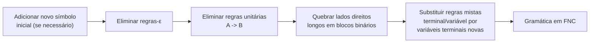

## Objetivos de Aprendizagem

- Enunciar os dois formatos permitidos de regra da Forma Normal de Chomsky (A → BC e A → a), além da regra de exceção para gerar ε.
- Explicar por que um formato padronizado de regra simplifica provas e algoritmos de parsing posteriores, em vez de tratar a FNC como uma formalidade arbitrária.
- Aplicar os três principais passos de conversão (eliminar regras-ε, eliminar regras unitárias, e quebrar lados direitos longos) em uma gramática específica e concreta.
- Verificar, para uma gramática convertida, que cada regra restante de fato corresponde a um dos dois formatos permitidos pela FNC.
- Reconhecer que a conversão para FNC preserva exatamente a linguagem gerada, mesmo que mude as regras da gramática e o formato das árvores de derivação.

## Contexto e Motivação

O conceito anterior mostrou que a mesma linguagem pode ser gerada por mais de uma gramática, e que algumas dessas gramáticas são melhores que outras: a gramática em camadas E/T/F gerava exatamente as mesmas strings que a gramática ambígua e plana só com E, mas com melhor comportamento estrutural. A Forma Normal de Chomsky leva essa mesma ideia ao seu extremo lógico: em vez de escolher uma gramática por uma propriedade específica (como remover ambiguidade), a FNC exige uma gramática em um formato completamente padronizado, onde cada regra se parece com um de apenas dois padrões possíveis. O fato notável, demonstrável e nada óbvio à primeira vista, é que *toda* gramática livre de contexto pode ser convertida em uma equivalente nesta forma restrita, sem perder ou ganhar uma única string da linguagem que ela gera.

A motivação para querer isso é inteiramente prática, e vale a pena deixá-la explícita em vez de tratar a FNC como trabalho burocrático. Dois grandes ganhos, ambos vindo mais adiante nesta disciplina e no campo mais amplo, dependem diretamente de as regras terem um formato fixo e previsível. Primeiro, o algoritmo de parsing CYK (Cocke-Younger-Kasami), uma forma geral e padrão de decidir se uma string pertence a uma linguagem livre de contexto em tempo polinomial, é definido inteiramente em termos de combinar duas substrings adjacentes por meio de uma regra A → BC; sem esse formato binário fixo, a estrutura limpa de programação dinâmica do algoritmo desmorona. Segundo, provas sobre linguagens livres de contexto, mais notavelmente o próximo lema do bombeamento para linguagens livres de contexto, dependem de limitar a altura que uma árvore de derivação deve ter em relação ao comprimento da string que ela produz: um limite fácil de enunciar e fácil de provar quando cada nó interno tem exatamente dois filhos (de regras A → BC) ou é o pai imediato de uma folha (de regras A → a), e consideravelmente mais confuso de estabelecer quando as regras podem ter lados direitos arbitrariamente longos e irregulares. A FNC é, em resumo, uma gramática normalizada da mesma forma que uma fração é normalizada aos seus termos mínimos: nada muda sobre a linguagem subjacente, mas tudo que é construído em cima dela se torna mais fácil de enunciar e provar.

## Teoria Central

### Os dois formatos permitidos

Uma gramática livre de contexto está em **Forma Normal de Chomsky** se cada regra tem um de exatamente dois formatos:

- **A → BC**, onde A, B, C são todas variáveis, e nem B nem C é o símbolo inicial, ou
- **A → a**, onde A é uma variável e a é um único terminal.

Além disso, a regra **S → ε** é permitida como uma única exceção explícita, mas apenas para o símbolo inicial S, e apenas se a linguagem de fato contém a string vazia: este é o único lugar em que a FNC permite um lado direito que não é nenhum dos dois formatos padrão. Nenhuma outra regra pode produzir ε, nenhuma regra pode ter uma única variável sozinha no lado direito (uma **regra unitária**, A → B), e nenhuma regra pode ter um lado direito mais longo que dois símbolos ou que misture terminais e variáveis juntos (como A → aB).

### Por que a restrição é útil, concretamente

Como toda regra não-ε produz ou exatamente duas variáveis ou exatamente um terminal, uma árvore de derivação em FNC tem um formato interno muito rígido e previsível: todo nó interno tem *exatamente* dois filhos (de uma regra A → BC), e o pai imediato de toda folha tem *exatamente* um filho, sendo esse filho o próprio terminal (de uma regra A → a). É precisamente esse formato que o parsing CYK explora: o algoritmo preenche uma tabela onde cada célula pergunta "esta substring pode ser derivada desta variável", e responder a essa pergunta para uma substring de comprimento n se reduz a checar todas as formas de dividi-la em duas substrings mais curtas, cada uma independentemente derivável de algum B e algum C tais que A → BC seja uma regra. Essa redução a "combinar duas respostas menores adjacentes" só é limpa porque a FNC garante que todo passo de derivação é de fato uma divisão em duas partes (ou um único terminal no fundo): nenhuma regra pode, digamos, pular direto de A para uma string de cinco símbolos, o que quebraria a recorrência da tabela.

### O pipeline de conversão

Converter um CFG arbitrário em FNC procede em uma ordem fixa de passagens sobre o conjunto de regras, cada uma eliminando exatamente um tipo de formato não permitido:



1. **Novo símbolo inicial.** Se S alguma vez aparece no lado direito de alguma regra, introduza um novo S₀ → S para que o símbolo inicial nunca precise ser recriado no meio de uma derivação (isso importa depois que as regras-ε são removidas, já que a exceção isolada S → ε deve se aplicar apenas no topo).
2. **Eliminar regras-ε.** Para cada regra A → ε (além da S → ε permitida), remova-a, e para cada regra que contém A em seu lado direito, adicione toda versão dessa regra com A removido (todas as combinações, se A aparece mais de uma vez).
3. **Eliminar regras unitárias.** Para cada regra A → B (B uma única variável), remova-a, e em vez disso dê a A diretamente cada regra que B tem.
4. **Quebrar lados direitos longos.** Qualquer regra A → X₁X₂...Xₖ com k > 2 é substituída por uma cadeia de novas regras, cada uma introduzindo uma variável nova para conter "tudo daqui até o final."
5. **Substituir regras mistas.** Qualquer regra restante com um terminal misturado com uma variável (como A → aB) tem o terminal substituído por uma variável nova dedicada a esse terminal (Uₐ → a), de modo que o terminal nunca fique ao lado de uma variável em um lado direito.

### Conversão resolvida, passo a passo

Considere a pequena gramática, deliberadamente fora da FNC:

```
S -> aSb | AB
A -> aA | ε
B -> b
```

Aqui V = {S, A, B}, Σ = {a, b}. Esta gramática tem uma regra-ε (A → ε), um lado direito mais longo que dois símbolos junto com terminais (aSb tem três símbolos misturados com terminais), e ainda nenhuma regra unitária: os três problemas que o pipeline acima visa.

**Passo 1: novo símbolo inicial.** S nunca aparece em um lado direito aqui, então este passo não muda nada; S₀ é desnecessário.

**Passo 2: eliminar regras-ε.** A → ε é removida. A aparece no lado direito de A → aA (removendo o A de `aA` dá `a`) e de S → AB (removendo A dá S → B). Então:

```
S -> aSb | AB | B
A -> aA | a
B -> b
```

(A → aA já cobre o caso de "A aparece uma vez": apagando esse A dá a nova regra A → a.)

**Passo 3: eliminar regras unitárias.** S → B é uma regra unitária. As próprias regras de B são apenas B → b, então substitua S → B diretamente por S → b:

```
S -> aSb | AB | b
A -> aA | a
B -> b
```

**Passo 4: quebrar o lado direito longo.** S → aSb tem três símbolos. Introduza uma variável nova, digamos X₁, para conter "S seguido de b", dando S → aX₁ e X₁ → Sb:

```
S -> aX1 | AB | b
X1 -> Sb
A -> aA | a
B -> b
```

**Passo 5: substituir regras mistas de terminal/variável.** S → aX₁ mistura o terminal a com a variável X₁; X₁ → Sb mistura a variável S com o terminal b; A → aA mistura a com A. Introduza Uₐ → a e U_b → b, e substitua:

```
S  -> Ua X1 | AB | b
X1 -> S Ub
A  -> Ua A | a
B  -> b
Ua -> a
Ub -> b
```

**Checagem final.** Toda regra agora tem o formato A → BC (S → UaX1, X1 → SUb, A → UaA, S → AB) ou A → a (S → b, A → a, B → b, Ua → a, Ub → b): exatamente os dois formatos permitidos pela FNC, sem nenhuma regra-ε em lugar nenhum (corretamente, já que esta linguagem não contém a string vazia: a string mais curta, com A e B ambos em sua forma mínima aⁿb com n=0, é `ab` a partir de S → AB → a·b, ou `ab` a partir de S → aSb exigindo ao menos mais uma camada; de qualquer forma ε nunca é alcançável). A conversão está completa, e esta gramática em FNC gera exatamente a mesma linguagem que a original.

## Exemplos Resolvidos

### Exemplo 1: rastreando qual regra original causou qual regra da FNC

**Problema:** Para a conversão acima, explique em uma linha cada por que S → aSb não poderia simplesmente permanecer como estava.

**Raciocínio.** A → BC exige *exatamente duas variáveis* no lado direito; `aSb` tem um terminal, uma variável, um terminal: três símbolos ao todo, e dois deles são terminais, não variáveis. Ela falha no formato A → BC pela contagem de símbolos (3 ≠ 2) e falha no formato A → a por não ser um único terminal. Ambos os defeitos são corrigidos juntos: o Passo 4 divide os três símbolos em uma estrutura de dois símbolos (a, X₁), e o Passo 5 substitui o terminal solto restante `a` por uma variável dedicada Ua, de modo que a regra final S → Ua X1 tenha exatamente duas variáveis, correspondendo exatamente a A → BC.

### Exemplo 2: derivando uma string em ambas as gramáticas e comparando os formatos das árvores

**Problema:** Derive `aabb` usando a gramática original e usando a gramática em FNC, e compare.

**Gramática original:** `S ⇒ aSb ⇒ a(AB)b ⇒ a(aA)Bb ⇒ aa(ε)Bb ⇒ aabb`, usando as regras S → aSb, depois S → AB (no S interno), depois A → aA, depois A → ε, depois B → b. Lendo as peças em ordem: a (do envoltório externo), a (de A), b (de B), b (do envoltório externo), formam `aabb`. ✓

**Gramática em FNC:** `S ⇒ Ua X1 ⇒ a X1 ⇒ a(S Ub) ⇒ aSb ⇒ a(AB)b ⇒ a(aB)b ⇒ aabb`, usando as regras S → Ua X1, Ua → a, X1 → S Ub, Ub → b, depois S → AB (no S interno), A → a, B → b. Ambas as gramáticas aceitam `aabb`, confirmando que as linguagens concordam nesta string; a derivação em FNC simplesmente dá mais passos, menores, cada um introduzindo exatamente uma unidade de estrutura de uma nova variável, consistente com toda regra da FNC sendo ou binária ou produtora de terminal.

### Exemplo 3: identificando uma regra fora da FNC em uma gramática desconhecida

**Problema:** Dado o conjunto de regras `T -> Fx | ε | UV | c`, identifique quais regras violam a FNC e por quê.

**Raciocínio.** `T -> Fx`: supondo que F é uma variável e x é um terminal, isso mistura uma variável e um terminal (não é A → BC, que precisa de duas variáveis, e não é A → a, que precisa ser um único terminal sozinho): viola a FNC, precisando de uma substituição por variável terminal dedicada. `T -> ε`: só é legal se T é o símbolo inicial da gramática; caso contrário deve ser eliminada pela passagem de eliminação de ε. `T -> UV`: com U e V ambas variáveis, isso já corresponde exatamente a A → BC, nenhuma mudança necessária. `T -> c`: um único terminal, já corresponde exatamente a A → a, nenhuma mudança necessária.

## Equívocos Comuns e Armadilhas

- **"Converter para FNC muda a linguagem que a gramática gera."** A conversão é cuidadosamente projetada para preservar L(G) exatamente: cada passo (remover uma regra-ε, remover uma regra unitária, dividir um lado direito longo) é uma reescrita que *preserva a linguagem*, provado como parte da construção. O que muda é o formato das regras e, em geral, o formato e o tamanho das árvores de derivação (árvores em FNC tendem a ser mais altas e mais binárias), nunca o conjunto de strings geradas.
- **"Qualquer gramática que já parece simples já está em FNC."** A gramática de exemplo original aqui (`S -> aSb | AB`, `A -> aA | ε`, `B -> b`) parece compacta e comum, mas viola a FNC de três formas distintas ao mesmo tempo (uma regra-ε, um lado direito longo demais, regras mistas de terminal/variável): a FNC é um alvo sintático específico e estreito, não uma noção vaga de "simples."
- **"A exceção S → ε significa que a FNC permite regras-ε em geral."** A exceção é deliberadamente única: só o símbolo inicial pode ter uma regra-ε, e apenas quando ε de fato está na linguagem; as regras-ε de qualquer outra variável devem ser eliminadas por substituição (Passo 2), nunca deixadas como estão.
- **"Como gramáticas em FNC parecem mais complicadas (mais variáveis, mais regras), elas são uma escolha pior para escrever gramáticas no dia a dia."** A FNC é um alvo normalizado usado para propósitos específicos mais adiante (parsing CYK e provas ao estilo do lema do bombeamento), não uma recomendação de como escrever à mão uma gramática para legibilidade. Quem escreve uma gramática ainda escreve a versão natural e compacta (como a gramática original de três linhas aqui) e converte para FNC apenas quando um algoritmo ou uma prova exige especificamente esse formato fixo.

## Resumo

A Forma Normal de Chomsky restringe cada regra de uma gramática livre de contexto a um de dois formatos, A → BC (duas variáveis) ou A → a (um terminal), com uma única exceção estreita permitindo S → ε quando a linguagem contém a string vazia. Toda gramática livre de contexto pode ser convertida em uma gramática equivalente em FNC gerando a linguagem idêntica, por meio de uma sequência fixa de passagens: eliminar regras-ε, eliminar regras unitárias, depois quebrar quaisquer lados direitos longos ou mistos restantes em blocos binários e variáveis dedicadas a produzir terminais. A conversão resolvida aqui pegou uma gramática compacta de três regras com os três tipos de formato não permitido e produziu uma gramática em FNC reconhecendo exatamente as mesmas strings, regra por regra. A razão pela qual essa padronização vale o trabalho mecânico é inteiramente o que vem depois: algoritmos como o parsing CYK e provas como o lema do bombeamento para linguagens livres de contexto dependem de todo passo de derivação ser uma divisão binária limpa ou uma produção de um único terminal, uma garantia que só uma gramática normalizada como a FNC fornece.

## Documentation Links

- [Sipser: Introduction to the Theory of Computation, 3rd ed.](https://cs.brown.edu/courses/csci1810/fall-2023/resources/ch2_readings/Sipser_Introduction.to.the.Theory.of.Computation.3E.pdf): doc
- [MIT 18.404J: OCW Calendar](https://ocw.mit.edu/courses/18-404j-theory-of-computation-fall-2020/pages/calendar/): doc
