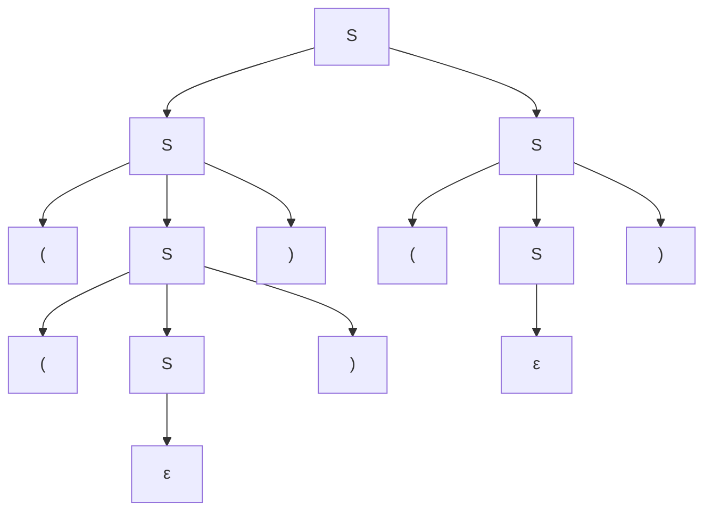
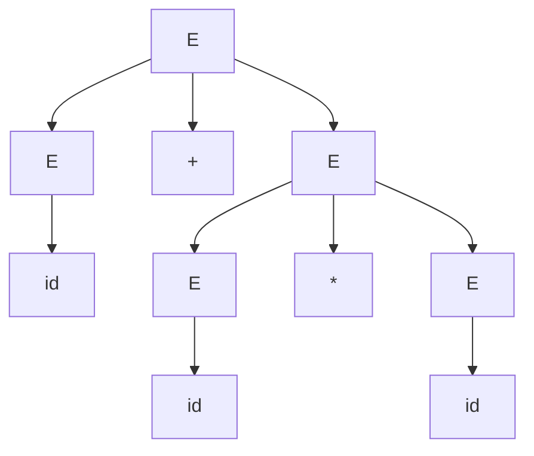

## Learning Objectives

- State the formal four-part definition of a context-free grammar (variables, terminals, production rules, start symbol) and identify each part in a concrete grammar.
- Perform a derivation of a specific string from a grammar's start symbol, showing each substitution step explicitly.
- Distinguish a leftmost derivation from an arbitrary derivation, and construct one of each for the same string.
- Draw the parse tree corresponding to a derivation, and explain why the tree — unlike the derivation sequence — is the same regardless of substitution order.
- Recognize a production rule that references its own left-hand nonterminal as a recursive definition, structurally identical to a recursive function's base case and recursive case.

## Context & Motivation

The previous concept in this discipline, the Chomsky hierarchy, named context-free grammars as the machinery behind Type 2 languages without developing what a grammar actually looks like or how it produces a string. This concept fills that gap directly: a context-free grammar is a small, precise set of rewriting rules, and "deriving" a string from a grammar means starting from a designated symbol and repeatedly applying those rules until nothing but plain text remains. This is the mechanism underneath every programming language's syntax, every well-formed JSON document, and every arithmetic expression a calculator accepts — in every one of these cases, "is this input valid?" reduces to "can this string be derived from the language's grammar?"

The deeper reason this concept belongs right after recursion on structural data, rather than being an isolated new idea, is that a context-free production rule *is* a recursive definition, in exactly the sense that concept developed. Recall the shape of structural recursion there: a function's base case handles the smallest instance of a structure directly, and its recursive case handles a larger instance by reducing it to a smaller instance of the *same* structure — `flatten([])` returns `[]` directly, while `flatten` on a longer list recurses on a shorter one. A grammar rule like `S -> ( S ) | ε` has precisely this shape, just written as a rewriting rule instead of a function body: `S -> ε` is the base case, generating the smallest instance of the structure (nothing at all) directly, with no further rule application needed, and `S -> ( S )` is the recursive case, generating a larger instance of the same nonterminal S by wrapping a strictly smaller instance of S. Deriving a string from this grammar and evaluating `flatten` on a nested list are the same computational act described from two different angles — one produces a string by repeated substitution, the other consumes a structure by repeated decomposition — and both terminate for the identical reason: each step strips off one layer and hands off to a strictly smaller instance of the same self-referential definition. Seeing a production rule as "a recursive function that generates instead of consumes" is the single most useful lens for this entire topic, and it is why grammars with self-referencing rules (rather than grammars that only chain non-recursively toward terminals) are the interesting, expressive case worth studying in depth.

MIT's 18.404J and Sipser's textbook both introduce context-free grammars exactly this way: define the four components precisely, then immediately practice deriving strings, because the definition alone does not build intuition — watching a derivation unfold, one substitution at a time, is what makes "a grammar generates a language" concrete rather than abstract.

## Core Theory

### The formal definition

A **context-free grammar (CFG)** is a 4-tuple G = (V, Σ, R, S), where:

- **V** is a finite set of **variables** (also called **nonterminals**) — placeholder symbols standing for a piece of structure still to be filled in. Conventionally written as uppercase letters (S, E, T, ...).
- **Σ** is a finite set of **terminals** — the actual symbols that appear in the strings the grammar generates. Terminals and variables are always disjoint (V ∩ Σ = ∅).
- **R** is a finite set of **production rules**, each of the form A → w, where A ∈ V is a single variable and w is any string of variables and terminals concatenated together (w ∈ (V ∪ Σ)*, including possibly the empty string ε). The "context-free" name comes from exactly this restriction: the left-hand side is always a single, bare variable, never a variable in some larger surrounding context — unlike the more general context-sensitive grammars one level up the Chomsky hierarchy.
- **S ∈ V** is the **start symbol**, the one designated variable every derivation begins from.

Multiple rules sharing the same left-hand side are conventionally written together with `|` separating the alternatives, e.g. `S -> ( S ) | SS | ε` is shorthand for three separate rules `S -> (S)`, `S -> SS`, and `S -> ε`.

### Derivations

A **derivation** is the process of generating a terminal string from the start symbol by repeatedly applying production rules. At each step, exactly one variable currently present in the working string is chosen, and one of its production rules is applied, replacing that variable with the rule's right-hand side. This repeats until the working string contains no variables at all — only terminals remain, and the derivation is complete. The notation α ⇒ β means "β is obtained from α by one rule application"; α ⇒* β means "β is obtained from α by zero or more rule applications." A string w is said to be **generated by** G, and w ∈ L(G) (the language of G), exactly when S ⇒* w.

A **leftmost derivation** is a derivation in which, at every step, the *leftmost* variable in the working string is the one expanded. A **rightmost derivation** expands the rightmost variable at every step instead. Both are valid derivations of the same string, and — this is worth being precise about, since the next concept in this discipline depends on it — different derivation orders (leftmost vs. rightmost vs. any other order) of the *same sequence of rule applications* always produce the *same parse tree*; only the order in which the substitutions are written down differs, not the structure being built.

### Parse trees

A **parse tree** (or derivation tree) is the visual record of a derivation: the root is labeled with the start symbol, each internal node is labeled with a variable and has one child for each symbol on the right-hand side of the rule used to expand it (in left-to-right order), and the leaves, read left to right, spell out the derived string. A parse tree captures *which rules were applied to which pieces of the string and how those pieces nest*, without recording the order in which the expansions happened — which is exactly why leftmost and rightmost derivations of the same string, using the same set of rule applications, collapse to the identical tree.

### Running example: balanced parentheses

Take the grammar for balanced parentheses, with a single variable, deliberately written in the same self-referential shape as a structurally recursive function:

```
S -> ( S ) | SS | ε
```

Here V = {S}, Σ = {(, )}, and the start symbol is S. Reading the three rules the way you would read a recursive function: `S -> ε` is the base case (the empty string is trivially balanced — nothing to check), `S -> ( S )` is one recursive case (wrap a smaller balanced string in one more matching pair), and `S -> SS` is the other recursive case (concatenate two smaller balanced strings). Every string this grammar generates is built by combining these two shrinking operations, bottoming out at ε, precisely mirroring how `flatten` bottoms out at `[]`.

**Deriving `(())()`.** A leftmost derivation:

```
S ⇒ SS                (rule: S -> SS, split into two balanced pieces)
  ⇒ (S)S              (rule: S -> (S), applied to the leftmost S)
  ⇒ ((S))S            (rule: S -> (S), applied to the leftmost S again)
  ⇒ (())S             (rule: S -> ε, applied to the innermost S)
  ⇒ (())(S)           (rule: S -> (S), applied to the remaining S)
  ⇒ (())()            (rule: S -> ε, applied to the last S)
```

Each line replaces exactly one variable using one production rule, and the final line contains only terminals — `(())()` ∈ L(G).



Reading the leaves left to right: `(`, `(`, `)`, `)`, `(`, `)` — exactly `(())()`, and the nesting of the tree visibly mirrors the nesting of the parentheses themselves, which is precisely why a parse tree, not just the flat derivation sequence, is the representation worth drawing.

### A second running example: arithmetic expressions

A tiny grammar for arithmetic expressions over a single terminal `id` (standing in for any number or identifier) shows the same recursive shape applied to a different structure:

```
E -> E + E | E * E | ( E ) | id
```

Here `E -> id` is the base case (a bare number is trivially a valid expression), and the other three rules are recursive cases building a larger expression out of one or two smaller ones — the same "base case plus recursive case(s) that combine smaller instances" schema as before, just with two nonterminal occurrences on some right-hand sides instead of one.

## Worked Examples

### Example 1 — full derivation and parse tree for `id + id * id`

**Problem:** Using E -> E + E | E * E | ( E ) | id, derive the string `id + id * id` and draw its parse tree, choosing the rule applications so that `+` is applied at the outermost level.

**Derivation (leftmost):**

```
E ⇒ E + E              (rule: E -> E + E)
  ⇒ id + E              (rule: E -> id, leftmost E)
  ⇒ id + E * E          (rule: E -> E * E, remaining E)
  ⇒ id + id * E          (rule: E -> id)
  ⇒ id + id * id          (rule: E -> id)
```

Five rule applications, ending with only terminals: `id + id * id` ∈ L(G).



The tree shows `+` at the root, meaning "the whole expression is a sum," with the second summand itself being a product — this particular tree structure is what will matter in the next concept, since a different choice of which rule to apply first produces a *different* tree for this same string.

### Example 2 — leftmost vs. rightmost derivation of the same tree

**Problem:** For the balanced-parentheses grammar and the string `()()`,  produce both a leftmost and a rightmost derivation, and confirm they yield the same parse tree.

**Leftmost:** `S ⇒ SS ⇒ (S)S ⇒ ()S ⇒ ()(S) ⇒ ()()`, expanding the leftmost S at each step (rules used, in order: SS, (S), ε, (S), ε).

**Rightmost:** `S ⇒ SS ⇒ S(S) ⇒ S() ⇒ (S)() ⇒ ()()`, expanding the rightmost S at each step (same rule set, applied to the opposite side first).

**Reconciling.** Both derivations use the identical multiset of rule applications — one `S -> SS`, two `S -> (S)`, two `S -> ε` — just written down in a different order. Building the parse tree from either sequence produces the same tree: a root S with two children, each an S expanded via `(S)` down to `()`. This is the precise distinction the Core Theory section flagged: two different derivation *orders* of the same rule applications are not two different structures, only two different narrations of building the identical one.

### Example 3 — checking a string is *not* generated

**Problem:** Using S -> ( S ) | SS | ε, show that `)(` cannot be derived.

**Reasoning.** Every rule either leaves the string empty (ε), wraps an existing balanced piece in a matching pair with the open paren strictly first (`(S)`), or concatenates two already-balanced pieces (`SS`). By induction on the number of rule applications, every string derivable from S has, at every prefix, a count of `(` at least equal to the count of `)` (a standard balanced-string invariant enforced by the shape of the only paren-introducing rule, `(S)`, which always places `(` before its matching `)`). The string `)(` violates this at its very first character (0 open parens seen, 1 close paren seen — the prefix `)` alone already has more closes than opens). No sequence of rule applications can produce it, so `)(` ∉ L(G).

## Common Misconceptions & Pitfalls

- **"A different derivation order means a different string, or a different grammar interpretation."** As Example 2 shows, leftmost and rightmost derivations of the same rule-application sequence produce the same string *and* the same parse tree — order of expansion is a bookkeeping choice, not a property of the language. What genuinely produces two different trees is applying a *different sequence of rules* to the same string, which is the actual concern developed in the next concept, ambiguity.
- **"The parse tree and the derivation are the same thing."** A derivation is a specific ordered sequence of substitution steps; a parse tree is the structure those substitutions build, with the ordering discarded. Many distinct derivations (leftmost, rightmost, and everything in between) collapse onto one tree — the tree is the more fundamental object, the derivation is one way of describing how to build it.
- **"A recursive-looking rule like `S -> ( S ) | ε` will loop forever, the way an unguarded recursive function would."** Just as a structurally recursive function terminates because every recursive call operates on a strictly smaller structure, a derivation using `S -> (S)` terminates on any specific target string because each application of the recursive rule is eventually matched with an application of the base rule `S -> ε` — the same finite string cannot be built by an infinite regress of expansions; only an actually infinite derivation would loop, and no finite target string requires one.
- **"Every context-free grammar generates every string over its terminal alphabet."** A grammar's rules impose real structure — the derivation for `)(` in Example 3 fails, deliberately, because the rule set enforces a genuine invariant (opens before matching closes). Not being derivable is not a defect; it is the grammar doing its job of excluding malformed strings.

## Summary

A context-free grammar is four ingredients — variables, terminals, production rules, and a start symbol — where every rule rewrites a single variable into any string of variables and terminals. A derivation applies these rules one at a time, starting from the start symbol, until only terminals remain; a parse tree records the same process as nested structure rather than an ordered sequence, and different derivation orders (leftmost, rightmost, or otherwise) of the same rule applications always collapse onto the identical tree. The recursive shape running through every example here — a base rule generating the smallest instance directly, and one or more recursive rules building larger instances out of strictly smaller ones of the same nonterminal — is not a coincidence or a teaching device: it is the same self-referential definition already met as structural recursion over strings and lists, just running in the generating direction rather than the consuming one.

## Documentation Links

- [MIT 18.404J — OCW Calendar](https://ocw.mit.edu/courses/18-404j-theory-of-computation-fall-2020/pages/calendar/) — doc
- [Sipser — Introduction to the Theory of Computation, 3rd ed.](https://cs.brown.edu/courses/csci1810/fall-2023/resources/ch2_readings/Sipser_Introduction.to.the.Theory.of.Computation.3E.pdf) — doc
