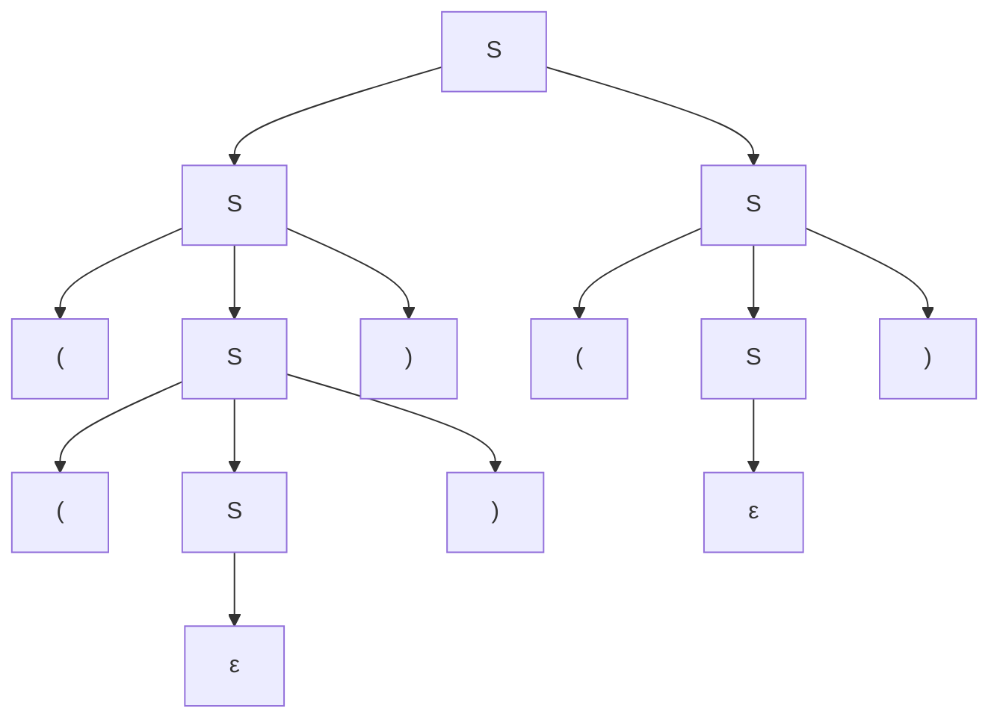
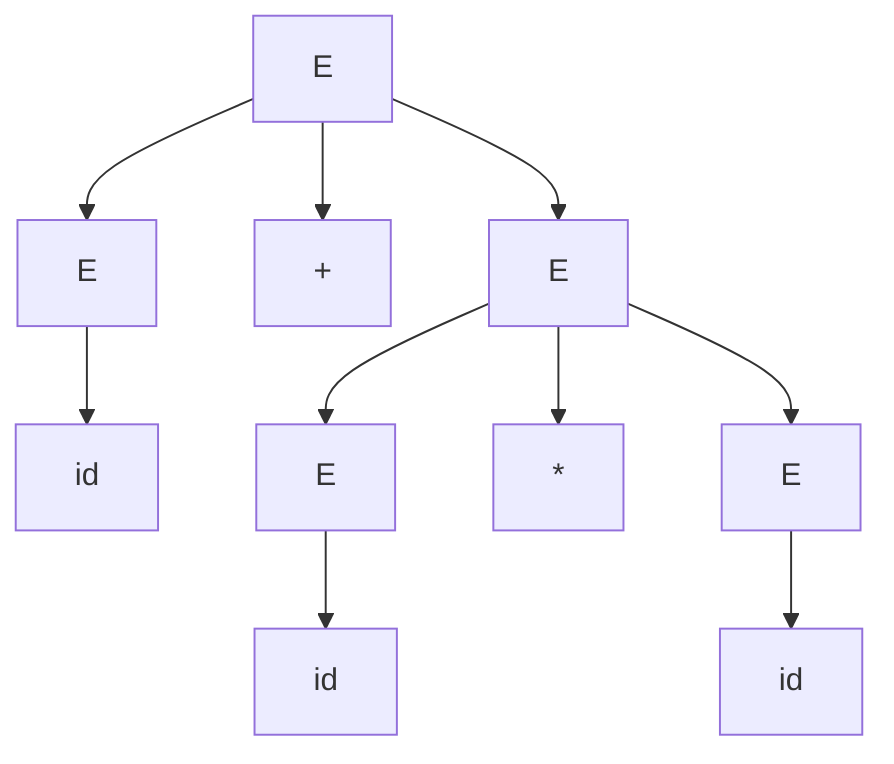

## Objetivos de Aprendizagem

- Enunciar a definição formal de quatro partes de uma gramática livre de contexto (variáveis, terminais, regras de produção, símbolo inicial) e identificar cada parte em uma gramática concreta.
- Realizar a derivação de uma string específica a partir do símbolo inicial de uma gramática, mostrando explicitamente cada passo de substituição.
- Distinguir uma derivação mais à esquerda de uma derivação arbitrária, e construir uma de cada tipo para a mesma string.
- Desenhar a árvore de derivação correspondente a uma derivação, e explicar por que a árvore, diferentemente da sequência de derivação, é a mesma independentemente da ordem de substituição.
- Reconhecer uma regra de produção que referencia seu próprio não-terminal do lado esquerdo como uma definição recursiva, estruturalmente idêntica ao caso base e ao caso recursivo de uma função recursiva.

## Contexto e Motivação

O conceito anterior nesta disciplina, a hierarquia de Chomsky, nomeou as gramáticas livres de contexto como o maquinário por trás das linguagens Tipo 2 sem desenvolver como uma gramática de fato se parece ou como ela produz uma string. Este conceito preenche essa lacuna diretamente: uma gramática livre de contexto é um conjunto pequeno e preciso de regras de reescrita, e "derivar" uma string a partir de uma gramática significa começar de um símbolo designado e aplicar repetidamente essas regras até que nada além de texto simples reste. Esse é o mecanismo por trás da sintaxe de toda linguagem de programação, de todo documento JSON bem formado, e de toda expressão aritmética que uma calculadora aceita: em cada um desses casos, "esta entrada é válida?" se reduz a "esta string pode ser derivada da gramática da linguagem?"

A razão mais profunda pela qual este conceito vem logo depois de recursão sobre dados estruturais, em vez de ser uma ideia nova isolada, é que uma regra de produção livre de contexto *é* uma definição recursiva, exatamente no sentido que aquele conceito desenvolveu. Relembre o formato de recursão estrutural lá: o caso base de uma função trata diretamente a menor instância de uma estrutura, e seu caso recursivo trata uma instância maior reduzindo-a a uma instância menor da *mesma* estrutura: `flatten([])` retorna `[]` diretamente, enquanto `flatten` em uma lista mais longa recorre em uma mais curta. Uma regra de gramática como `S -> ( S ) | ε` tem precisamente esse formato, só que escrita como uma regra de reescrita em vez de um corpo de função: `S -> ε` é o caso base, gerando diretamente a menor instância da estrutura (nada, literalmente), sem necessidade de mais nenhuma aplicação de regra, e `S -> ( S )` é o caso recursivo, gerando uma instância maior do mesmo não-terminal S envolvendo uma instância estritamente menor de S. Derivar uma string a partir desta gramática e avaliar `flatten` em uma lista aninhada são o mesmo ato computacional descrito de dois ângulos diferentes: um produz uma string por substituição repetida, o outro consome uma estrutura por decomposição repetida; e ambos terminam pela razão idêntica: cada passo retira uma camada e passa adiante para uma instância estritamente menor da mesma definição autorreferencial. Ver uma regra de produção como "uma função recursiva que gera em vez de consumir" é a lente mais útil para este tópico inteiro, e é por isso que gramáticas com regras autorreferenciais (em vez de gramáticas que só encadeiam de forma não recursiva até terminais) são o caso interessante e expressivo que vale a pena estudar em profundidade.

Tanto o 18.404J do MIT quanto o livro-texto de Sipser introduzem gramáticas livres de contexto exatamente dessa forma: definir os quatro componentes com precisão, depois imediatamente praticar a derivação de strings, porque a definição sozinha não constrói intuição; ver uma derivação se desenrolar, uma substituição de cada vez, é o que torna "uma gramática gera uma linguagem" concreto em vez de abstrato.

## Teoria Central

### A definição formal

Uma **gramática livre de contexto (CFG)** é uma 4-tupla G = (V, Σ, R, S), onde:

- **V** é um conjunto finito de **variáveis** (também chamadas de **não-terminais**): símbolos de espaço reservado representando um pedaço de estrutura ainda a ser preenchido. Convencionalmente escritas como letras maiúsculas (S, E, T, ...).
- **Σ** é um conjunto finito de **terminais**: os símbolos reais que aparecem nas strings que a gramática gera. Terminais e variáveis são sempre disjuntos (V ∩ Σ = ∅).
- **R** é um conjunto finito de **regras de produção**, cada uma da forma A → w, onde A ∈ V é uma única variável e w é qualquer string de variáveis e terminais concatenados (w ∈ (V ∪ Σ)*, incluindo possivelmente a string vazia ε). O nome "livre de contexto" vem exatamente dessa restrição: o lado esquerdo é sempre uma única variável isolada, nunca uma variável dentro de algum contexto maior ao redor, diferentemente das gramáticas sensíveis ao contexto mais gerais, um nível acima na hierarquia de Chomsky.
- **S ∈ V** é o **símbolo inicial**, a variável designada da qual toda derivação começa.

Múltiplas regras compartilhando o mesmo lado esquerdo são convencionalmente escritas juntas com `|` separando as alternativas; por exemplo, `S -> ( S ) | SS | ε` é uma abreviação para três regras separadas `S -> (S)`, `S -> SS`, e `S -> ε`.

### Derivações

Uma **derivação** é o processo de gerar uma string terminal a partir do símbolo inicial aplicando repetidamente regras de produção. A cada passo, exatamente uma variável atualmente presente na string de trabalho é escolhida, e uma de suas regras de produção é aplicada, substituindo essa variável pelo lado direito da regra. Isso se repete até que a string de trabalho não contenha nenhuma variável: só restam terminais, e a derivação está completa. A notação α ⇒ β significa "β é obtida de α por uma aplicação de regra"; α ⇒* β significa "β é obtida de α por zero ou mais aplicações de regra". Diz-se que uma string w é **gerada por** G, e w ∈ L(G) (a linguagem de G), exatamente quando S ⇒* w.

Uma **derivação mais à esquerda** é uma derivação em que, a cada passo, a variável *mais à esquerda* na string de trabalho é a expandida. Uma **derivação mais à direita** expande a variável mais à direita a cada passo, em vez disso. Ambas são derivações válidas da mesma string, e, vale a pena ser preciso quanto a isso já que o próximo conceito desta disciplina depende disso, ordens de derivação diferentes (mais à esquerda versus mais à direita versus qualquer outra ordem) da *mesma sequência de aplicações de regras* sempre produzem a *mesma árvore de derivação*; apenas a ordem em que as substituições são registradas difere, não a estrutura sendo construída.

### Árvores de derivação

Uma **árvore de derivação** (ou árvore de análise sintática) é o registro visual de uma derivação: a raiz é rotulada com o símbolo inicial, cada nó interno é rotulado com uma variável e tem um filho para cada símbolo no lado direito da regra usada para expandi-lo (na ordem da esquerda para a direita), e as folhas, lidas da esquerda para a direita, formam a string derivada. Uma árvore de derivação captura *quais regras foram aplicadas a quais pedaços da string e como esses pedaços se aninham*, sem registrar a ordem em que as expansões aconteceram, que é exatamente por que derivações mais à esquerda e mais à direita da mesma string, usando o mesmo conjunto de aplicações de regras, colapsam na árvore idêntica.

### Exemplo em curso: parênteses balanceados

Considere a gramática para parênteses balanceados, com uma única variável, deliberadamente escrita no mesmo formato autorreferencial de uma função estruturalmente recursiva:

```
S -> ( S ) | SS | ε
```

Aqui V = {S}, Σ = {(, )}, e o símbolo inicial é S. Lendo as três regras da mesma forma que se leria uma função recursiva: `S -> ε` é o caso base (a string vazia é trivialmente balanceada, nada a verificar), `S -> ( S )` é um caso recursivo (envolver uma string balanceada menor em mais um par correspondente), e `S -> SS` é o outro caso recursivo (concatenar duas strings balanceadas menores). Toda string que esta gramática gera é construída combinando essas duas operações de redução, terminando em ε, espelhando precisamente como `flatten` termina em `[]`.

**Derivando `(())()`.** Uma derivação mais à esquerda:

```
S ⇒ SS                (regra: S -> SS, divide em duas partes balanceadas)
  ⇒ (S)S              (regra: S -> (S), aplicada ao S mais à esquerda)
  ⇒ ((S))S            (regra: S -> (S), aplicada de novo ao S mais à esquerda)
  ⇒ (())S             (regra: S -> ε, aplicada ao S mais interno)
  ⇒ (())(S)           (regra: S -> (S), aplicada ao S restante)
  ⇒ (())()            (regra: S -> ε, aplicada ao último S)
```

Cada linha substitui exatamente uma variável usando uma regra de produção, e a última linha contém apenas terminais: `(())()` ∈ L(G).



Lendo as folhas da esquerda para a direita: `(`, `(`, `)`, `)`, `(`, `)`, exatamente `(())()`, e o aninhamento da árvore espelha visivelmente o aninhamento dos próprios parênteses, o que é precisamente por que uma árvore de derivação, não apenas a sequência plana de derivação, é a representação que vale a pena desenhar.

### Um segundo exemplo em curso: expressões aritméticas

Uma gramática minúscula para expressões aritméticas sobre um único terminal `id` (representando qualquer número ou identificador) mostra o mesmo formato recursivo aplicado a uma estrutura diferente:

```
E -> E + E | E * E | ( E ) | id
```

Aqui `E -> id` é o caso base (um número isolado é trivialmente uma expressão válida), e as outras três regras são casos recursivos construindo uma expressão maior a partir de uma ou duas menores: o mesmo esquema de "caso base mais caso(s) recursivo(s) que combinam instâncias menores" de antes, só que com duas ocorrências de não-terminal em alguns lados direitos em vez de uma.

## Exemplos Resolvidos

### Exemplo 1: derivação completa e árvore de derivação para `id + id * id`

**Problema:** Usando E -> E + E | E * E | ( E ) | id, derive a string `id + id * id` e desenhe sua árvore de derivação, escolhendo as aplicações de regra de forma que `+` seja aplicado no nível mais externo.

**Derivação (mais à esquerda):**

```
E ⇒ E + E              (regra: E -> E + E)
  ⇒ id + E              (regra: E -> id, E mais à esquerda)
  ⇒ id + E * E          (regra: E -> E * E, E restante)
  ⇒ id + id * E          (regra: E -> id)
  ⇒ id + id * id          (regra: E -> id)
```

Cinco aplicações de regra, terminando só com terminais: `id + id * id` ∈ L(G).



A árvore mostra `+` na raiz, significando "a expressão inteira é uma soma", com o segundo somando sendo ele próprio um produto; esta estrutura de árvore em particular é o que vai importar no próximo conceito, já que uma escolha diferente de qual regra aplicar primeiro produz uma árvore *diferente* para esta mesma string.

### Exemplo 2: derivação mais à esquerda versus mais à direita da mesma árvore

**Problema:** Para a gramática de parênteses balanceados e a string `()()`, produza tanto uma derivação mais à esquerda quanto uma mais à direita, e confirme que ambas produzem a mesma árvore de derivação.

**Mais à esquerda:** `S ⇒ SS ⇒ (S)S ⇒ ()S ⇒ ()(S) ⇒ ()()`, expandindo o S mais à esquerda a cada passo (regras usadas, em ordem: SS, (S), ε, (S), ε).

**Mais à direita:** `S ⇒ SS ⇒ S(S) ⇒ S() ⇒ (S)() ⇒ ()()`, expandindo o S mais à direita a cada passo (mesmo conjunto de regras, aplicado primeiro ao lado oposto).

**Reconciliando.** Ambas as derivações usam o multiconjunto idêntico de aplicações de regra (um `S -> SS`, dois `S -> (S)`, dois `S -> ε`), apenas registrado em ordem diferente. Construir a árvore de derivação a partir de qualquer uma das sequências produz a mesma árvore: uma raiz S com dois filhos, cada um um S expandido via `(S)` até `()`. Esta é exatamente a distinção que a seção Teoria Central sinalizou: duas *ordens* de derivação diferentes das mesmas aplicações de regras não são duas estruturas diferentes, apenas duas narrações diferentes da construção da mesma.

### Exemplo 3: verificando que uma string *não* é gerada

**Problema:** Usando S -> ( S ) | SS | ε, mostre que `)(` não pode ser derivada.

**Raciocínio.** Toda regra ou deixa a string vazia (ε), ou envolve um pedaço já balanceado em um par correspondente com o parêntese de abertura estritamente primeiro (`(S)`), ou concatena dois pedaços já balanceados (`SS`). Por indução no número de aplicações de regra, toda string derivável de S tem, em todo prefixo, uma contagem de `(` ao menos igual à contagem de `)` (um invariante padrão de string balanceada imposto pelo formato da única regra que introduz parênteses, `(S)`, que sempre coloca `(` antes de seu `)` correspondente). A string `)(` viola isso já no primeiro caractere (0 parênteses de abertura vistos, 1 de fechamento visto: o prefixo `)` sozinho já tem mais fechamentos que aberturas). Nenhuma sequência de aplicações de regra pode produzi-la, então `)(` ∉ L(G).

## Equívocos Comuns e Armadilhas

- **"Uma ordem de derivação diferente significa uma string diferente, ou uma interpretação diferente da gramática."** Como o Exemplo 2 mostra, derivações mais à esquerda e mais à direita da mesma sequência de aplicações de regras produzem a mesma string *e* a mesma árvore de derivação: a ordem de expansão é uma escolha de registro, não uma propriedade da linguagem. O que genuinamente produz duas árvores diferentes é aplicar uma *sequência de regras diferente* à mesma string, que é a preocupação real desenvolvida no próximo conceito, ambiguidade.
- **"A árvore de derivação e a derivação são a mesma coisa."** Uma derivação é uma sequência ordenada específica de passos de substituição; uma árvore de derivação é a estrutura que essas substituições constroem, com a ordem descartada. Muitas derivações distintas (mais à esquerda, mais à direita, e tudo entre elas) colapsam em uma árvore: a árvore é o objeto mais fundamental, a derivação é uma forma de descrever como construí-la.
- **"Uma regra de aparência recursiva como `S -> ( S ) | ε` vai entrar em loop para sempre, do jeito que uma função recursiva sem guarda entraria."** Assim como uma função estruturalmente recursiva termina porque toda chamada recursiva opera sobre uma estrutura estritamente menor, uma derivação usando `S -> (S)` termina para qualquer string-alvo específica porque toda aplicação da regra recursiva é eventualmente combinada com uma aplicação da regra base `S -> ε`: a mesma string finita não pode ser construída por uma regressão infinita de expansões; apenas uma derivação de fato infinita entraria em loop, e nenhuma string-alvo finita exige uma.
- **"Toda gramática livre de contexto gera toda string sobre seu alfabeto de terminais."** As regras de uma gramática impõem estrutura real: a derivação de `)(` no Exemplo 3 falha, deliberadamente, porque o conjunto de regras impõe um invariante genuíno (aberturas antes dos fechamentos correspondentes). Não ser derivável não é um defeito; é a gramática fazendo seu trabalho de excluir strings malformadas.

## Resumo

Uma gramática livre de contexto é quatro ingredientes (variáveis, terminais, regras de produção, e um símbolo inicial), onde cada regra reescreve uma única variável em qualquer string de variáveis e terminais. Uma derivação aplica essas regras uma de cada vez, começando do símbolo inicial, até que só restem terminais; uma árvore de derivação registra o mesmo processo como estrutura aninhada em vez de sequência ordenada, e diferentes ordens de derivação (mais à esquerda, mais à direita, ou outra) das mesmas aplicações de regras sempre colapsam na árvore idêntica. O formato recursivo que percorre todo exemplo aqui, uma regra base gerando diretamente a menor instância, e uma ou mais regras recursivas construindo instâncias maiores a partir de instâncias estritamente menores do mesmo não-terminal, não é uma coincidência nem um recurso didático: é a mesma definição autorreferencial já vista como recursão estrutural sobre strings e listas, só que rodando na direção de geração em vez da direção de consumo.

## Documentation Links

- [MIT 18.404J: OCW Calendar](https://ocw.mit.edu/courses/18-404j-theory-of-computation-fall-2020/pages/calendar/): doc
- [Sipser: Introduction to the Theory of Computation, 3rd ed.](https://cs.brown.edu/courses/csci1810/fall-2023/resources/ch2_readings/Sipser_Introduction.to.the.Theory.of.Computation.3E.pdf): doc
