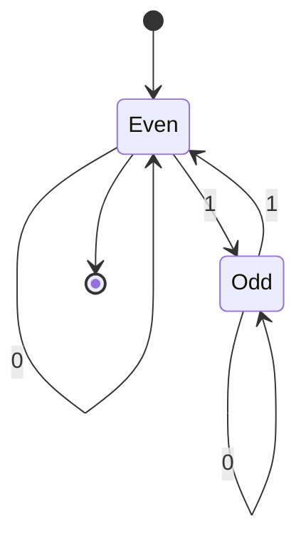
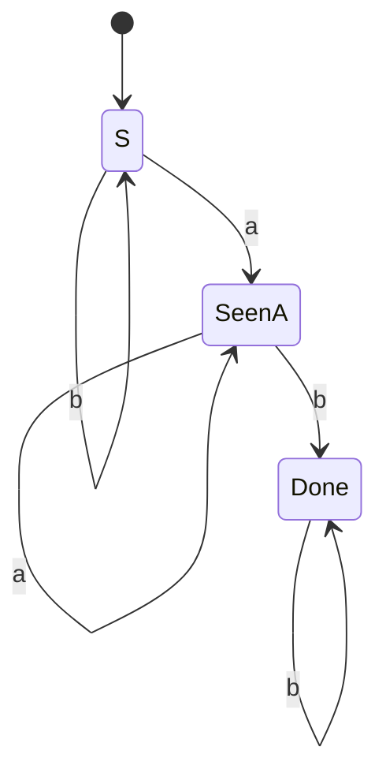

## Learning Objectives

- State the formal 5-tuple definition of a deterministic finite automaton (DFA) and explain the role of each component.
- Trace a DFA's execution on a concrete input string, one symbol at a time, and determine whether the DFA accepts or rejects it.
- Design a small DFA from an informal language description by identifying what finite amount of information about the string-so-far needs to be remembered.
- Explain precisely what it means for a DFA to "accept" a string, distinguishing it from merely passing through an accept state mid-string.
- Determine the language a given small DFA recognizes by reasoning about which states are reachable and which are accepting.

## Context & Motivation

A deterministic finite automaton is the simplest nontrivial model of computation studied in this discipline, and it earns that place by being almost aggressively minimal: it has no tape, no stack, no random-access memory of any kind — only a fixed, finite number of states, and a rule for moving between them one input symbol at a time. And yet, despite this extreme austerity, the DFA turns out to recognize exactly the class of languages the Chomsky hierarchy calls regular (Type 3) — the same class describable by regular expressions, and the same class implemented, quite literally, inside every regex engine, every lexer's tokenizer, and every simple protocol-validation routine running in production software today. Understanding the DFA in full formal precision is therefore not an academic warm-up exercise; it is understanding the actual mechanism that underlies an enormous amount of everyday computing infrastructure.

MIT's 18.404J and Stanford's CS154 both open their treatment of automata with the DFA for a specific pedagogical reason: it is the model in which every subsequent idea in this discipline — nondeterminism, the equivalence between machines and expressions, the limits of what a finite amount of memory can recognize — can be stated and proved with the least possible formal overhead. A DFA's behavior on any given input is completely determined at every step (hence "deterministic"): there is never a choice to make, never an ambiguity about what happens next, and the entire history of a computation collapses, at any instant, into a single piece of information — which state the machine is currently in. That collapsing of history into a fixed, finite summary is the single most important idea in the whole model, and it is worth sitting with before moving on to nondeterminism, where it gets deliberately relaxed.

The motivating question a DFA answers is always the same shape: given an alphabet of symbols and a string built from that alphabet, does the string belong to some specific language — some specific, well-defined set of strings? A DFA answers this by reading the string exactly once, left to right, never backtracking, using only its current state (never anything about which symbols came before, except insofar as that history was already folded into the current state) to decide what to do with the next symbol. Whether this finite amount of memory is *enough* to decide membership in a given language is precisely the boundary this discipline spends its early concepts mapping out.

## Core Theory

### The formal 5-tuple definition

A **deterministic finite automaton** is formally a 5-tuple M = (Q, Σ, δ, q₀, F), where:

- **Q** is a finite, nonempty set of **states**.
- **Σ** (sigma) is a finite **alphabet** — the set of symbols the machine reads, one at a time.
- **δ** (delta) is the **transition function**, δ: Q × Σ → Q, mapping a current state and an input symbol to exactly one next state. This "exactly one" is the defining feature of determinism: for every state and every symbol, δ specifies precisely one outcome, with no ambiguity and no gaps (every state has an outgoing transition defined for every symbol in Σ).
- **q₀** is the **start state**, an element of Q, where the machine begins before reading any input.
- **F** is the set of **accept states** (also called final states), a subset of Q (possibly empty, possibly all of Q).

Every one of these five components is required to pin down a DFA completely — omit the alphabet and δ has no defined domain; omit F and "accept" has no meaning; omit q₀ and there is no defined starting point for any computation.

### How a DFA processes a string

Given an input string w = w₁w₂⋯wₙ (a sequence of symbols, each from Σ), a DFA processes it by starting at q₀ and applying δ once per symbol, in order: it computes r₀ = q₀, then r₁ = δ(r₀, w₁), then r₂ = δ(r₁, w₂), and so on, until rₙ = δ(rₙ₋₁, wₙ) after all n symbols have been consumed. At every step there is exactly one applicable transition — δ being a total function on Q × Σ guarantees this — so the entire sequence of states r₀, r₁, …, rₙ visited while processing w is completely determined by w itself; running the same machine on the same string twice always visits the same states in the same order.

The machine **accepts** w if and only if the final state reached, rₙ, is a member of F — that is, after consuming *every* symbol of w, and not a moment before, the machine happens to be sitting in an accept state. If rₙ ∉ F, the machine **rejects** w. The **language recognized by M**, written L(M), is the set of all strings that M accepts: L(M) = { w ∈ Σ* : M accepts w }.

```mermaid
stateDiagram-v2
    [*] --> r0
    r0 --> r1 : w1
    r1 --> r2 : w2
    r2 --> "..." : w3
    "..." --> rn : wn
    rn --> Accept : rn in F
    rn --> Reject : rn not in F
```

### Accepting is about the END state, not any state visited along the way

A precise and easy-to-miss point: acceptance depends only on where the machine ends up after the *entire* string has been consumed. Passing through an accept state partway through processing w, then later leaving it and finishing in a non-accepting state, means the machine rejects w — the accept states are not "any state that's ever good enough," they mark states that are good enough only as a *final resting place* after all input is gone. Symmetrically, a DFA can pass through the same accept state multiple times, or never leave it once entered, and both are perfectly fine — what matters is exclusively the identity of rₙ, the state after the last symbol.

### Worked design walkthrough: binary strings with an even number of 1s

To design a DFA, the central question is always: *what is the smallest finite amount of information about the string read so far that I need to remember in order to correctly decide, for any possible continuation, whether to accept?* For the language L = { w ∈ {0,1}* : w has an even number of 1s (including zero) }, the only fact that ever matters about the prefix read so far is the *parity* of the number of 1s seen — even or odd — because that parity, combined with whatever symbols come next, is all that is needed to determine the parity of the whole string. This gives exactly two states.

Formally: M = (Q, Σ, δ, q₀, F) where
- Q = {Even, Odd}
- Σ = {0, 1}
- q₀ = Even (zero 1s seen so far — zero is even)
- F = {Even} (accept exactly when the total count of 1s is even)
- δ is given by: δ(Even, 0) = Even, δ(Even, 1) = Odd, δ(Odd, 0) = Odd, δ(Odd, 1) = Even



(The double-bordered convention for accept states is represented here by the outgoing transition to `[*]` from `Even` — `Even` is the sole accept state.)

Every transition reads a symbol and flips or preserves the parity state exactly as the arithmetic of parity requires: reading a 0 never changes the count of 1s, so parity stays the same (self-loop in both states); reading a 1 always changes the count of 1s by one, so parity always flips between the two states.

## Worked Examples

### Example 1 — tracing an accepted string

**Problem:** Using the even-number-of-1s DFA above, trace the machine on input `1011` and determine whether it is accepted.

**Trace.** Start: r₀ = Even. Read `1`: r₁ = δ(Even, 1) = Odd. Read `0`: r₂ = δ(Odd, 0) = Odd. Read `1`: r₃ = δ(Odd, 1) = Even. Read `1`: r₄ = δ(Even, 1) = Odd.

**Conclusion.** The final state r₄ = Odd is not in F = {Even}, so the machine **rejects** `1011`. Sanity check: `1011` contains three 1s, and three is odd — consistent with rejection, since the language requires an *even* count.

### Example 2 — tracing an accepted string, and one with a mid-string false alarm

**Problem:** Trace the same DFA on `110` and on `11`, and note how the accept state `Even` is visited partway through `1100` without causing early acceptance.

**Trace of `110`.** r₀ = Even. Read `1`: r₁ = Odd. Read `1`: r₂ = Even. Read `0`: r₃ = Even. Final state r₃ = Even ∈ F, so `110` is **accepted** (two 1s — even, correct).

**Trace of `1100`, illustrating the mid-string point.** r₀ = Even. Read `1`: r₁ = Odd. Read `1`: r₂ = Even — the machine is in the accept state after only two symbols, but the string is not finished. Read `0`: r₃ = Even. Read `0`: r₄ = Even. Final state r₄ = Even ∈ F, so `1100` is accepted — in this particular case the early visit to Even happened to coincide with the correct final answer, but that is a coincidence of this example, not a rule; had the string continued with one more `1` (e.g. `11001`), the machine would move to Odd and be correctly rejected despite having sat in Even moments earlier. Acceptance is decided once, at the very end, never partway through.

### Example 3 — designing a DFA for a language with three tracked cases

**Problem:** Design a DFA over Σ = {a, b} for L = { w : w contains the substring `ab` at least once }, then trace it on `bba` and `baab`.

**Design reasoning.** The finite fact that needs tracking is: have we seen an `a` that could still be immediately followed by `b`, and have we already seen the pattern `ab` (in which case remembering anything further about position no longer matters — once `ab` occurs, the string is in the language no matter what comes after)? Three states suffice: `S` (start / most recent symbol was not `a`, `ab` not yet seen), `SeenA` (most recent symbol was `a`, `ab` not yet seen), and `Done` (`ab` already occurred somewhere).

M = (Q, Σ, δ, q₀, F): Q = {S, SeenA, Done}, Σ = {a, b}, q₀ = S, F = {Done}, with:
δ(S, a) = SeenA, δ(S, b) = S, δ(SeenA, a) = SeenA, δ(SeenA, b) = Done, δ(Done, a) = Done, δ(Done, b) = Done.



**Trace of `bba`.** r₀ = S. Read `b`: S. Read `b`: S. Read `a`: SeenA. Final state SeenA ∉ F, so **rejected** — correctly, since `bba` never contains `ab` as a substring.

**Trace of `baab`.** r₀ = S. Read `b`: S. Read `a`: SeenA. Read `a`: SeenA (self-loop — a second `a` in a row doesn't lose the "just saw an a" fact). Read `b`: Done. Final state Done ∈ F, so **accepted** — correctly, since positions 3–4 (`ab`) form the required substring.

## Common Misconceptions & Pitfalls

- **"The machine accepts as soon as it hits an accept state."** As Example 2 demonstrates concretely, entering an accept state mid-string means nothing on its own — the DFA keeps consuming the rest of the input regardless, and acceptance is determined solely by which state it occupies after the *very last* symbol. A DFA that happens to pass through F several times before ending outside F still rejects.
- **"The transition function can be a partial function — some states just don't handle some symbols."** By definition δ: Q × Σ → Q is total: every state must have a defined transition for every symbol in the alphabet. A design that seems to have "no valid move" for some (state, symbol) pair is missing an explicit trap or dead state — a non-accepting state that swallows all further input once entered (as `Done` and, implicitly, any "invalid forever" case would need in a stricter language) — rather than being permitted to leave that transition undefined.
- **"More states always means a stronger or more capable machine."** A DFA with more states is not more powerful in what languages it can recognize — the set of regular languages is exactly the set recognizable by *some* DFA, with as few or as many states as needed; extra states beyond the minimum required are just redundancy, not extra recognizing power. (Minimizing the state count for a fixed language is a real, separate problem, not covered by this concept.)
- **"Since Odd and Even alternate based on 1s, the machine must also react to 0s in some way that changes state."** In the even-number-of-1s example, reading a `0` never changes the tracked parity, and the self-loops on both states are not an oversight or a simplification — they are the mathematically correct behavior, since a `0` genuinely carries no information relevant to counting 1s.

## Summary

A DFA is a 5-tuple (Q, Σ, δ, q₀, F): a finite set of states, an alphabet, a total transition function specifying exactly one next state per (state, symbol) pair, a single start state, and a set of accept states. Processing a string means starting at q₀ and applying δ once per symbol, in order, producing one fully determined sequence of states; the machine accepts the string exactly when the state reached after the *last* symbol lies in F — never based on any state visited earlier. Designing a DFA is fundamentally the exercise of identifying the smallest finite summary of "what's happened so far in the string" that is sufficient to correctly decide acceptance no matter how the string continues, then building states and transitions around that summary. This minimal, memoryless-beyond-current-state model turns out to recognize exactly the regular languages — the same class regular expressions describe, as the next concept develops.

## Documentation Links

- [MIT 18.404J — OCW Calendar](https://ocw.mit.edu/courses/18-404j-theory-of-computation-fall-2020/pages/calendar/) — doc
- [Sipser — Introduction to the Theory of Computation, 3rd ed.](https://cs.brown.edu/courses/csci1810/fall-2023/resources/ch2_readings/Sipser_Introduction.to.the.Theory.of.Computation.3E.pdf) — doc
