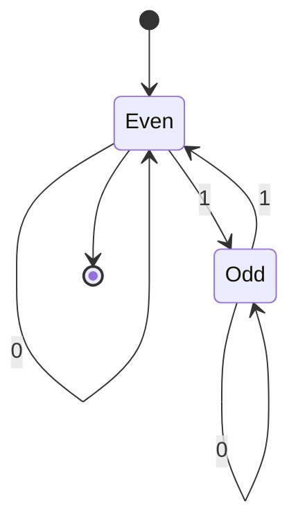
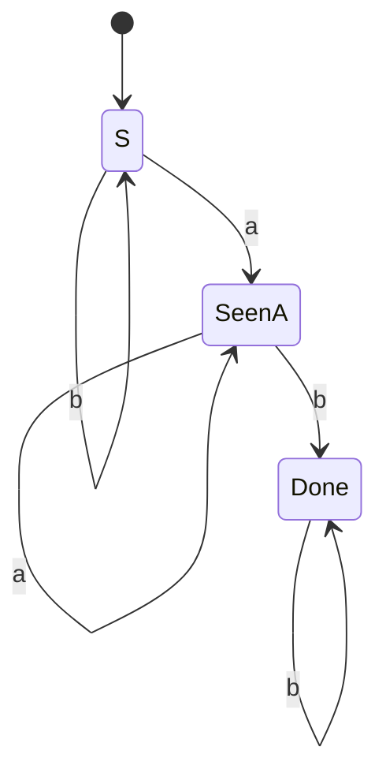

## Objetivos de Aprendizagem

- Enunciar a definição formal de 5-tupla de um autômato finito determinístico (DFA) e explicar o papel de cada componente.
- Rastrear a execução de um DFA em uma string de entrada concreta, um símbolo de cada vez, e determinar se o DFA aceita ou rejeita a string.
- Desenhar um pequeno DFA a partir de uma descrição informal de linguagem, identificando qual quantidade finita de informação sobre a string-até-agora precisa ser lembrada.
- Explicar precisamente o que significa um DFA "aceitar" uma string, distinguindo isso de simplesmente passar por um estado de aceitação no meio da string.
- Determinar a linguagem que um pequeno DFA dado reconhece, raciocinando sobre quais estados são alcançáveis e quais são de aceitação.

## Contexto e Motivação

Um autômato finito determinístico é o modelo não trivial mais simples de computação estudado nesta disciplina, e ele conquista esse lugar por ser quase agressivamente minimalista: não tem fita, não tem pilha, não tem memória de acesso aleatório de espécie alguma, apenas um número fixo e finito de estados, e uma regra para se mover entre eles um símbolo de entrada de cada vez. E ainda assim, apesar dessa austeridade extrema, o DFA acaba reconhecendo exatamente a classe de linguagens que a hierarquia de Chomsky chama de regulares (Tipo 3), a mesma classe descrita por expressões regulares, e a mesma classe implementada, literalmente, dentro de todo motor de regex, todo tokenizador de lexer, e toda rotina simples de validação de protocolo rodando em software de produção hoje. Entender o DFA em total precisão formal não é, portanto, um exercício acadêmico de aquecimento; é entender o mecanismo real que serve de base para uma quantidade enorme da infraestrutura computacional do dia a dia.

Tanto o 18.404J do MIT quanto o CS154 de Stanford abrem seu tratamento de autômatos com o DFA por uma razão pedagógica específica: é o modelo no qual toda ideia subsequente nesta disciplina, não-determinismo, a equivalência entre máquinas e expressões, os limites do que uma quantidade finita de memória consegue reconhecer, pode ser enunciada e demonstrada com a menor sobrecarga formal possível. O comportamento de um DFA em qualquer entrada dada é completamente determinado a cada passo (daí "determinístico"): nunca há uma escolha a fazer, nunca há ambiguidade sobre o que acontece em seguida, e toda a história de uma computação colapsa, a qualquer instante, em uma única informação: em qual estado a máquina está atualmente. Esse colapso da história em um resumo fixo e finito é a ideia mais importante de todo o modelo, e vale a pena se deter nela antes de avançar para o não-determinismo, onde ela é deliberadamente relaxada.

A pergunta motivadora que um DFA responde é sempre da mesma forma: dado um alfabeto de símbolos e uma string construída a partir desse alfabeto, a string pertence a alguma linguagem específica, algum conjunto específico e bem definido de strings? Um DFA responde a isso lendo a string exatamente uma vez, da esquerda para a direita, nunca retrocedendo, usando apenas seu estado atual (nunca nada sobre quais símbolos vieram antes, exceto na medida em que essa história já foi condensada no estado atual) para decidir o que fazer com o próximo símbolo. Se essa quantidade finita de memória é *suficiente* para decidir a pertinência em uma dada linguagem é precisamente a fronteira que esta disciplina passa seus primeiros conceitos mapeando.

## Teoria Central

### A definição formal de 5-tupla

Um **autômato finito determinístico** é formalmente uma 5-tupla M = (Q, Σ, δ, q₀, F), onde:

- **Q** é um conjunto finito e não vazio de **estados**.
- **Σ** (sigma) é um **alfabeto** finito, o conjunto de símbolos que a máquina lê, um de cada vez.
- **δ** (delta) é a **função de transição**, δ: Q × Σ → Q, mapeando um estado atual e um símbolo de entrada para exatamente um próximo estado. Esse "exatamente um" é a característica definidora do determinismo: para todo estado e todo símbolo, δ especifica precisamente um resultado, sem ambiguidade e sem lacunas (todo estado tem uma transição de saída definida para todo símbolo em Σ).
- **q₀** é o **estado inicial**, um elemento de Q, onde a máquina começa antes de ler qualquer entrada.
- **F** é o conjunto de **estados de aceitação** (também chamados de estados finais), um subconjunto de Q (possivelmente vazio, possivelmente todo o Q).

Cada um desses cinco componentes é necessário para fixar um DFA completamente: omita o alfabeto e δ não tem domínio definido; omita F e "aceitar" não tem significado; omita q₀ e não há ponto de partida definido para nenhuma computação.

### Como um DFA processa uma string

Dada uma string de entrada w = w₁w₂⋯wₙ (uma sequência de símbolos, cada um de Σ), um DFA a processa começando em q₀ e aplicando δ uma vez por símbolo, em ordem: calcula r₀ = q₀, depois r₁ = δ(r₀, w₁), depois r₂ = δ(r₁, w₂), e assim por diante, até rₙ = δ(rₙ₋₁, wₙ) depois que todos os n símbolos tiverem sido consumidos. A cada passo há exatamente uma transição aplicável, δ ser uma função total em Q × Σ garante isso, então a sequência inteira de estados r₀, r₁, …, rₙ visitados ao processar w é completamente determinada pela própria w; rodar a mesma máquina na mesma string duas vezes sempre visita os mesmos estados na mesma ordem.

A máquina **aceita** w se e somente se o estado final alcançado, rₙ, for um membro de F, ou seja, depois de consumir *todos* os símbolos de w, e não um momento antes, a máquina se encontra em um estado de aceitação. Se rₙ ∉ F, a máquina **rejeita** w. A **linguagem reconhecida por M**, escrita L(M), é o conjunto de todas as strings que M aceita: L(M) = { w ∈ Σ* : M aceita w }.

```mermaid
stateDiagram-v2
    [*] --> r0
    r0 --> r1 : w1
    r1 --> r2 : w2
    r2 --> "..." : w3
    "..." --> rn : wn
    rn --> Accept : rn em F
    rn --> Reject : rn não em F
```

### Aceitar depende do estado FINAL, não de qualquer estado visitado ao longo do caminho

Um ponto preciso e fácil de perder: a aceitação depende apenas de onde a máquina termina depois que a string *inteira* foi consumida. Passar por um estado de aceitação no meio do processamento de w, e depois sair dele e terminar em um estado não aceitador, significa que a máquina rejeita w, os estados de aceitação não são "qualquer estado que em algum momento é bom o suficiente", eles marcam estados que são bons o suficiente apenas como um *lugar de repouso final* depois que toda a entrada acabou. Simetricamente, um DFA pode passar pelo mesmo estado de aceitação múltiplas vezes, ou nunca sair dele uma vez que entrou, e ambos são perfeitamente aceitáveis, o que importa é exclusivamente a identidade de rₙ, o estado depois do último símbolo.

### Passo a passo de design resolvido: strings binárias com número par de 1s

Para desenhar um DFA, a pergunta central é sempre: *qual é a menor quantidade finita de informação sobre a string lida até agora que preciso lembrar para decidir corretamente, para qualquer continuação possível, se devo aceitar?* Para a linguagem L = { w ∈ {0,1}* : w tem um número par de 1s (incluindo zero) }, o único fato que jamais importa sobre o prefixo lido até agora é a *paridade* do número de 1s vistos, par ou ímpar, porque essa paridade, combinada com quaisquer símbolos que venham a seguir, é tudo que é necessário para determinar a paridade da string inteira. Isso dá exatamente dois estados.

Formalmente: M = (Q, Σ, δ, q₀, F) onde
- Q = {Even, Odd}
- Σ = {0, 1}
- q₀ = Even (zero 1s vistos até agora, zero é par)
- F = {Even} (aceita exatamente quando a contagem total de 1s é par)
- δ é dada por: δ(Even, 0) = Even, δ(Even, 1) = Odd, δ(Odd, 0) = Odd, δ(Odd, 1) = Even



(A convenção de borda dupla para estados de aceitação é representada aqui pela transição de saída para `[*]` a partir de `Even`, `Even` é o único estado de aceitação.)

Toda transição lê um símbolo e inverte ou preserva o estado de paridade exatamente como a aritmética da paridade exige: ler um 0 nunca muda a contagem de 1s, então a paridade permanece a mesma (auto-laço em ambos os estados); ler um 1 sempre muda a contagem de 1s em um, então a paridade sempre alterna entre os dois estados.

## Exemplos Resolvidos

### Exemplo 1: rastreando uma string aceita

**Problema:** Usando o DFA de número-par-de-1s acima, rastreie a máquina na entrada `1011` e determine se ela é aceita.

**Rastro.** Início: r₀ = Even. Lê `1`: r₁ = δ(Even, 1) = Odd. Lê `0`: r₂ = δ(Odd, 0) = Odd. Lê `1`: r₃ = δ(Odd, 1) = Even. Lê `1`: r₄ = δ(Even, 1) = Odd.

**Conclusão.** O estado final r₄ = Odd não está em F = {Even}, então a máquina **rejeita** `1011`. Verificação de sanidade: `1011` contém três 1s, e três é ímpar, consistente com a rejeição, já que a linguagem exige uma contagem *par*.

### Exemplo 2: rastreando uma string aceita, e um falso alarme no meio da string

**Problema:** Rastreie o mesmo DFA em `110` e em `11`, e note como o estado de aceitação `Even` é visitado no meio de `1100` sem causar aceitação antecipada.

**Rastro de `110`.** r₀ = Even. Lê `1`: r₁ = Odd. Lê `1`: r₂ = Even. Lê `0`: r₃ = Even. Estado final r₃ = Even ∈ F, então `110` é **aceita** (dois 1s, par, correto).

**Rastro de `1100`, ilustrando o ponto do meio da string.** r₀ = Even. Lê `1`: r₁ = Odd. Lê `1`: r₂ = Even, a máquina está no estado de aceitação depois de apenas dois símbolos, mas a string não terminou. Lê `0`: r₃ = Even. Lê `0`: r₄ = Even. Estado final r₄ = Even ∈ F, então `1100` é aceita, neste caso específico a visita antecipada a Even coincidiu com a resposta final correta, mas isso é uma coincidência deste exemplo, não uma regra; se a string continuasse com mais um `1` (por exemplo, `11001`), a máquina se moveria para Odd e seria corretamente rejeitada apesar de ter estado em Even momentos antes. A aceitação é decidida uma vez, bem no final, nunca no meio do caminho.

### Exemplo 3: desenhando um DFA para uma linguagem com três casos rastreados

**Problema:** Desenhe um DFA sobre Σ = {a, b} para L = { w : w contém a substring `ab` pelo menos uma vez }, depois rastreie-o em `bba` e `baab`.

**Raciocínio de design.** O fato finito que precisa ser rastreado é: já vimos um `a` que ainda poderia ser imediatamente seguido por `b`, e já vimos o padrão `ab` (caso em que lembrar qualquer coisa a mais sobre posição deixa de importar, uma vez que `ab` ocorre, a string está na linguagem não importa o que venha depois)? Três estados bastam: `S` (início / símbolo mais recente não foi `a`, `ab` ainda não visto), `SeenA` (símbolo mais recente foi `a`, `ab` ainda não visto), e `Done` (`ab` já ocorreu em algum lugar).

M = (Q, Σ, δ, q₀, F): Q = {S, SeenA, Done}, Σ = {a, b}, q₀ = S, F = {Done}, com:
δ(S, a) = SeenA, δ(S, b) = S, δ(SeenA, a) = SeenA, δ(SeenA, b) = Done, δ(Done, a) = Done, δ(Done, b) = Done.



**Rastro de `bba`.** r₀ = S. Lê `b`: S. Lê `b`: S. Lê `a`: SeenA. Estado final SeenA ∉ F, então **rejeitada**, corretamente, já que `bba` nunca contém `ab` como substring.

**Rastro de `baab`.** r₀ = S. Lê `b`: S. Lê `a`: SeenA. Lê `a`: SeenA (auto-laço, um segundo `a` seguido não perde o fato de "acabou de ver um a"). Lê `b`: Done. Estado final Done ∈ F, então **aceita**, corretamente, já que as posições 3-4 (`ab`) formam a substring exigida.

## Equívocos Comuns e Armadilhas

- **"A máquina aceita assim que chega a um estado de aceitação."** Como o Exemplo 2 demonstra concretamente, entrar em um estado de aceitação no meio da string não significa nada por si só, o DFA continua consumindo o resto da entrada independentemente disso, e a aceitação é determinada exclusivamente por qual estado ele ocupa depois do *último* símbolo. Um DFA que passa por F várias vezes antes de terminar fora de F ainda assim rejeita.
- **"A função de transição pode ser uma função parcial, alguns estados simplesmente não tratam alguns símbolos."** Por definição δ: Q × Σ → Q é total: todo estado deve ter uma transição definida para todo símbolo do alfabeto. Um design que parece "não ter movimento válido" para algum par (estado, símbolo) está faltando um estado de armadilha ou estado morto explícito, um estado não aceitador que engole toda entrada futura uma vez alcançado (como `Done` faria, e implicitamente qualquer caso de "inválido para sempre" precisaria em uma linguagem mais restrita), em vez de ter permissão para deixar essa transição indefinida.
- **"Mais estados sempre significa uma máquina mais forte ou mais capaz."** Um DFA com mais estados não é mais poderoso em quais linguagens consegue reconhecer, o conjunto de linguagens regulares é exatamente o conjunto reconhecível por *algum* DFA, com tantos estados quantos forem necessários, nem mais nem menos; estados extras além do mínimo exigido são apenas redundância, não poder de reconhecimento extra. (Minimizar a contagem de estados para uma linguagem fixa é um problema real e separado, não coberto por este conceito.)
- **"Já que Odd e Even alternam com base nos 1s, a máquina também deve reagir aos 0s de alguma forma que muda o estado."** No exemplo de número-par-de-1s, ler um `0` nunca muda a paridade rastreada, e os auto-laços em ambos os estados não são um descuido ou uma simplificação, são o comportamento matematicamente correto, já que um `0` genuinamente não carrega nenhuma informação relevante para contar 1s.

## Resumo

Um DFA é uma 5-tupla (Q, Σ, δ, q₀, F): um conjunto finito de estados, um alfabeto, uma função de transição total especificando exatamente um próximo estado por par (estado, símbolo), um único estado inicial, e um conjunto de estados de aceitação. Processar uma string significa começar em q₀ e aplicar δ uma vez por símbolo, em ordem, produzindo uma sequência de estados totalmente determinada; a máquina aceita a string exatamente quando o estado alcançado depois do *último* símbolo está em F, nunca com base em qualquer estado visitado antes. Desenhar um DFA é fundamentalmente o exercício de identificar o menor resumo finito de "o que aconteceu até agora na string" que é suficiente para decidir corretamente a aceitação não importa como a string continue, depois construir estados e transições em torno desse resumo. Esse modelo minimalista, sem memória além do estado atual, acaba reconhecendo exatamente as linguagens regulares, a mesma classe que expressões regulares descrevem, como o próximo conceito desenvolve.

## Documentation Links

- [MIT 18.404J: OCW Calendar](https://ocw.mit.edu/courses/18-404j-theory-of-computation-fall-2020/pages/calendar/) - doc
- [Sipser: Introduction to the Theory of Computation, 3rd ed.](https://cs.brown.edu/courses/csci1810/fall-2023/resources/ch2_readings/Sipser_Introduction.to.the.Theory.of.Computation.3E.pdf) - doc
