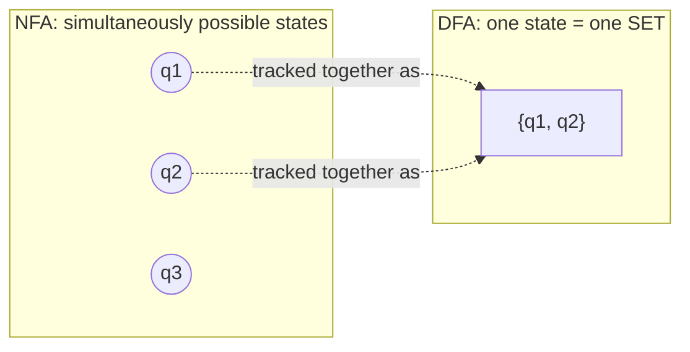
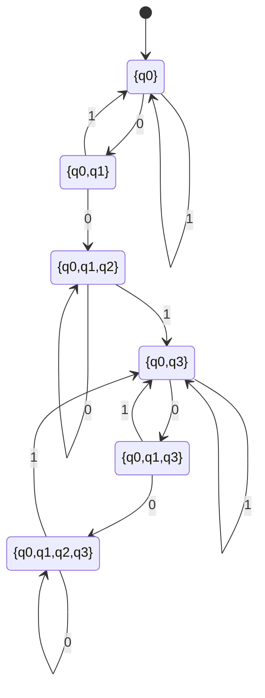

## Learning Objectives

- State the subset (powerset) construction: how to build a DFA whose states are sets of NFA states, from a given NFA.
- Apply the construction to a small, concrete NFA and produce the resulting DFA's states and transitions explicitly.
- Explain how ε-transitions are folded into the construction via the ε-closure of a set of states.
- State the correctness claim of the construction precisely, as an equivalence between the constructed DFA's state after reading w and the exact set of NFA states reachable by reading w.
- Prove that correctness claim by induction on the length of the input string, identifying the base case and inductive step explicitly.

## Context & Motivation

The previous concept ended on a claim stated but not yet proved: every NFA, however much branching and however many ε-transitions it uses, has an equivalent DFA — one that accepts exactly the same language, with no nondeterminism at all. This concept delivers that proof, via a construction elegant enough that it is often the single most memorable idea in an introductory automata course: the **subset construction** (also called the **powerset construction**), which builds the equivalent DFA by making each of its states correspond not to a single NFA state, but to an entire *set* of NFA states — precisely the set the NFA could simultaneously be occupying, given the input consumed so far.

This is worth sitting with for a moment, because it is a genuinely surprising move: an NFA with n states might be nondeterministically "in" any of up to 2ⁿ different combinations of states at once (one combination for every subset of its state set), and the construction's insight is to promote each of those *combinations* to the status of a single, ordinary, deterministic state in a new machine. A DFA built this way simulates the NFA exactly, at every step, by tracking not "one possible current state" but "the full set of states currently reachable" — collapsing the NFA's branching computation tree into one single, deterministic thread of bookkeeping. MIT's 18.404J and Stanford's CS154 both treat this construction as the central proof that regular languages have a machine-independent definition: it does not matter whether you build a DFA or an NFA to recognize a language, because the two notions of "recognizable by a finite automaton" turn out, via this explicit and fully constructive proof, to coincide exactly.

The importance of this result reaches beyond automata theory itself. This construction, or a close variant of it, is exactly how real regular-expression engines and lexical analyzers are compiled in practice: a regex is first turned into a small NFA (via the constructive half of Kleene's theorem, covered two concepts from now), and that NFA is then determinized using precisely this subset construction, because a DFA — with its single, fast, table-lookup transition per symbol — is far more efficient to actually execute than simulating an NFA's branching directly at runtime. Understanding this concept rigorously is understanding a piece of machinery genuinely running inside real compilers and text-processing tools today.

## Core Theory

### The construction, formally

Given an NFA N = (Q_N, Σ, δ_N, q₀, F_N), the subset construction builds a DFA D = (Q_D, Σ, δ_D, q₀_D, F_D) as follows:

- **Q_D = P(Q_N)**, the power set of Q_N — every possible *subset* of the NFA's states becomes a candidate DFA state. (In practice, only the subsets actually reachable from the start need to be built — see the worked example below — but formally, the full power set is the state set.)
- **q₀_D = E({q₀})**, where E(S) denotes the **ε-closure** of a set of NFA states S: the set of all states reachable from any state in S using zero or more ε-transitions alone (S itself is always included, since "zero" ε-transitions is allowed). The DFA's start state must account for any ε-moves the NFA could take for free before reading anything.
- **δ_D(T, a) = E( ⋃_{q ∈ T} δ_N(q, a) )** for each DFA state T ⊆ Q_N (a set of NFA states) and symbol a ∈ Σ: to find where the DFA goes on symbol a from state T, take *every* NFA state reachable from *any* state currently in T by reading a, union all of those together, and then take the ε-closure of that union (to also fold in any further free ε-moves available immediately afterward).
- **F_D = { T ⊆ Q_N : T ∩ F_N ≠ ∅ }**: a DFA state (itself a set of NFA states) is accepting exactly when it contains *at least one* NFA accept state — because the NFA accepts along some path, and this DFA state represents every path simultaneously, so if any one of the NFA states currently tracked is an accept state, that corresponds to at least one accepting NFA path having reached its goal.

### The intuition behind each piece

The definition of δ_D is doing exactly what a single step of correct NFA simulation requires: from the current *set* of possible NFA states T, reading symbol a, the NFA could move — via any one of its nondeterministic choices — to any state reachable from any state in T. Taking the union over all q ∈ T captures "every possibility currently live gets to make its move," and taking the ε-closure afterward captures "and then, before committing to processing the next symbol, follow along any free ε-moves those newly-reached states offer." The start state's ε-closure and the accept-state condition follow the exact same logic applied at the boundaries — before any input, and after all of it, respectively.

### Worked construction: determinizing the "001"-substring NFA

Recall the NFA from the previous concept for L = { w ∈ {0,1}* : w contains "001" as a substring }: N has states {q₀, q₁, q₂, q₃}, F_N = {q₃}, and transitions δ_N(q₀,0)={q₀,q₁}, δ_N(q₀,1)={q₀}, δ_N(q₁,0)={q₂}, δ_N(q₂,1)={q₃}, δ_N(q₃,0)={q₃}, δ_N(q₃,1)={q₃}, with every unlisted (state, symbol) pair mapping to ∅. This NFA has no ε-transitions, so every ε-closure E(S) is simply S itself, which simplifies bookkeeping considerably.

Building the DFA one reachable subset at a time, starting from q₀_D = {q₀}:

- **From {q₀}:** on `0`, union of δ_N(q₀,0) = {q₀,q₁} → new state {q₀,q₁}. On `1`, δ_N(q₀,1) = {q₀} → state {q₀} (self-loop).
- **From {q₀,q₁}:** on `0`, union of δ_N(q₀,0) ∪ δ_N(q₁,0) = {q₀,q₁} ∪ {q₂} = {q₀,q₁,q₂} → new state {q₀,q₁,q₂}. On `1`, union of δ_N(q₀,1) ∪ δ_N(q₁,1) = {q₀} ∪ ∅ = {q₀} → back to state {q₀}.
- **From {q₀,q₁,q₂}:** on `0`, union of δ_N(q₀,0) ∪ δ_N(q₁,0) ∪ δ_N(q₂,0) = {q₀,q₁} ∪ {q₂} ∪ ∅ = {q₀,q₁,q₂} → self-loop. On `1`, union of δ_N(q₀,1) ∪ δ_N(q₁,1) ∪ δ_N(q₂,1) = {q₀} ∪ ∅ ∪ {q₃} = {q₀,q₃} → new state {q₀,q₃}.
- **From {q₀,q₃}:** since q₃ absorbs everything, on `0`: δ_N(q₀,0) ∪ δ_N(q₃,0) = {q₀,q₁} ∪ {q₃} = {q₀,q₁,q₃} → new state. On `1`: δ_N(q₀,1) ∪ δ_N(q₃,1) = {q₀} ∪ {q₃} = {q₀,q₃} → self-loop.
- **From {q₀,q₁,q₃}:** on `0`: {q₀,q₁} ∪ {q₂} ∪ {q₃} = {q₀,q₁,q₂,q₃} → new state. On `1`: {q₀} ∪ ∅ ∪ {q₃} = {q₀,q₃} → back to {q₀,q₃}.
- **From {q₀,q₁,q₂,q₃}:** on `0`: {q₀,q₁} ∪ {q₂} ∪ ∅ ∪ {q₃} = {q₀,q₁,q₂,q₃} → self-loop. On `1`: {q₀} ∪ ∅ ∪ {q₃} ∪ {q₃} = {q₀,q₃} → back to {q₀,q₃}.

No further new subsets appear, so the reachable portion of Q_D has exactly six states: {q₀}, {q₀,q₁}, {q₀,q₁,q₂}, {q₀,q₃}, {q₀,q₁,q₃}, {q₀,q₁,q₂,q₃}. Applying F_D: a DFA state is accepting iff it contains q₃, so F_D (restricted to reachable states) = { {q₀,q₃}, {q₀,q₁,q₃}, {q₀,q₁,q₂,q₃} } — exactly the three subsets containing q₃.

Every state containing q3 (S3, S4, S5) is an accept state of this DFA — exactly six deterministic states, built entirely mechanically from the four-state NFA, with no nondeterminism anywhere in the result.

## Worked Examples

### Example 1 — tracing the constructed DFA and confirming it matches the NFA's verdict

**Problem:** Trace the six-state DFA built above on input `1001`, and confirm its verdict matches the NFA's verdict from the previous concept's Example 1 (which found an accepting path for `1001`).

**Trace.** Start: S0 = {q₀}. Read `1`: S0 →(1)→ S0 = {q₀}. Read `0`: S0 →(0)→ S1 = {q₀,q₁}. Read `0`: S1 →(0)→ S2 = {q₀,q₁,q₂}. Read `1`: S2 →(1)→ S3 = {q₀,q₃}. Final state S3 = {q₀,q₃}, which contains q₃, so S3 ∈ F_D — the DFA **accepts** `1001`, exactly matching the NFA's earlier accepting verdict. Note the DFA needed no guessing at all: its single state after each symbol *is* the complete, exact set of NFA states the NFA could be in at that point, with the "guess q₁" possibility from the NFA's Example 1 trace simply tracked automatically as one element of the set S1 = {q₀,q₁}, alongside the "didn't guess" possibility q₀, both carried forward together.

### Example 2 — a rejected string traced through the subset DFA

**Problem:** Trace the same DFA on `0101` (shown in the previous concept to be rejected by the NFA), and confirm the DFA agrees.

**Trace.** Start: S0 = {q₀}. Read `0`: S0 →(0)→ S1 = {q₀,q₁}. Read `1`: S1 →(1)→ S0 = {q₀} (since δ_N(q₀,1)∪δ_N(q₁,1) = {q₀}∪∅ = {q₀}). Read `0`: S0 →(0)→ S1 = {q₀,q₁}. Read `1`: S1 →(1)→ S0 = {q₀}. Final state S0 = {q₀}, which does not contain q₃, so S0 ∉ F_D — the DFA **rejects** `0101`, matching the NFA. The DFA's tracked set never grew to include q₂ or q₃, correctly reflecting that no prefix of `0101` ever completes the "001" pattern.

### Example 3 — proving correctness by induction on the length of the input string

**Problem:** State and prove the precise correctness claim connecting the constructed DFA D to the original NFA N.

**Claim.** For every string w ∈ Σ*, if D is run on w starting from q₀_D, the DFA state D reaches after consuming w is *exactly* the set of NFA states reachable from q₀ by reading w (accounting for all nondeterministic choices and ε-moves) — that is, δ_D*(q₀_D, w) = E({ q ∈ Q_N : q is reachable from q₀ in N by reading w }), where δ_D* denotes the DFA's extended transition function applied to the whole string w.

This is proved using **mathematical induction** on the length of w — the technique already established in full generality (base case plus inductive step, licensed by the well-ordering principle) in the Mathematical Induction concept; it is applied here exactly as there, with the inductive variable being the number of symbols of w consumed so far rather than an arbitrary integer n.

**Base case (|w| = 0, i.e., w = ε):** By construction, δ_D*(q₀_D, ε) = q₀_D = E({q₀}) — the DFA hasn't moved from its start state. The set of NFA states reachable from q₀ by reading zero symbols, accounting for free ε-moves, is by definition exactly E({q₀}) as well (reading nothing, the NFA can still wander along any ε-transitions available from q₀ before "stopping"). Both sides equal E({q₀}), so the claim holds for |w| = 0.

**Inductive step:** Assume the claim holds for all strings of length k (the inductive hypothesis) — that is, for any string x with |x| = k, δ_D*(q₀_D, x) equals the exact set of NFA states reachable from q₀ by reading x. Let w = xa be a string of length k+1, formed by appending one more symbol a to some string x of length k. We must show the claim holds for w.

By definition of the extended transition function, δ_D*(q₀_D, w) = δ_D*(q₀_D, xa) = δ_D( δ_D*(q₀_D, x), a ). By the inductive hypothesis, δ_D*(q₀_D, x) = T, the exact set of NFA states reachable from q₀ by reading x. So δ_D*(q₀_D, w) = δ_D(T, a) = E( ⋃_{q∈T} δ_N(q, a) ), by the construction's definition of δ_D given earlier in Core Theory.

Now, what NFA states are reachable from q₀ by reading w = xa? Exactly the states reachable by first reading x (landing, by the inductive hypothesis, in exactly the states of T — every state in T is reachable by some valid sequence of choices reading x, and no state outside T is reachable that way) and then, from any of those states in T, reading the one further symbol a and following any subsequent ε-moves. That is precisely ⋃_{q∈T} δ_N(q,a), ε-closed — which is exactly E( ⋃_{q∈T} δ_N(q,a) ), the same expression just derived for δ_D*(q₀_D, w). The two sides match, so the claim holds for w, completing the inductive step.

By the principle of mathematical induction, the claim holds for all w ∈ Σ*, of every length. ∎

**Finishing the correctness argument.** Since F_D is defined so that a DFA state T is accepting exactly when T ∩ F_N ≠ ∅, and the claim just proved shows D's state after reading w is exactly the set of NFA states reachable by reading w, it follows immediately that D accepts w (ends in a state in F_D) if and only if some NFA state reachable by reading w is in F_N — which is exactly the definition of the NFA N accepting w (some path reaches an accept state). Hence L(D) = L(N): the constructed DFA and the original NFA recognize exactly the same language.

## Common Misconceptions & Pitfalls

- **"The subset construction's DFA needs 2ⁿ states, always, for an n-state NFA."** The power set P(Q_N) has 2ⁿ elements, but only the subsets actually *reachable* from q₀_D need ever be built (as in the worked example above, where only 6 of the 2⁴ = 16 possible subsets of a 4-state NFA turned out reachable) — in practice the useful, working DFA is built lazily, state by state, starting from q₀_D, and unreachable subsets are simply never constructed at all. The 2ⁿ figure is a worst-case upper bound on the number of states, not a guarantee that all of them are needed.
- **"Each DFA state in the construction corresponds to one NFA state, just relabeled."** Each DFA state is an entire *set* of NFA states, tracking every possibility simultaneously — this is the whole idea of the construction, and it is why the resulting DFA has, in general, drastically more states than the original NFA. Treating a DFA state like {q₀,q₁,q₃} as if it were somehow "really" just q₀ or just q₃ misses the entire mechanism that makes the simulation correct.
- **"The ε-closure only needs to be taken once, at the very start."** The ε-closure must be reapplied after *every* symbol-consuming transition, not just at the start state — δ_D(T,a) itself is defined as E(⋃ δ_N(q,a)), with the ε-closure baked into every single step, precisely because the NFA could take free ε-moves immediately after any real transition, not only before the very first one.
- **"The inductive proof of correctness is just restating the construction, not actually proving anything."** The inductive step does real work: it shows that the specific algebraic definition chosen for δ_D (union over T, then ε-closure) produces exactly the right set of NFA states at every string length, by explicitly relating "reachable by reading xa" to "reachable by reading x, then one more step" — this is the substantive content of the proof, not a restatement, and it is exactly why the base case and inductive step (in the precise sense developed in the Mathematical Induction concept) are both required, not merely a single verification on a small example.

## Summary

The subset (powerset) construction builds a DFA from any NFA by making every DFA state a *set* of NFA states — the DFA is in state T exactly when the NFA, given the same input consumed so far, could simultaneously be in any of the states in T. The start state is the ε-closure of {q₀}; a transition from state T on symbol a unions together every NFA state reachable from any state in T on a, then ε-closes that union; and a DFA state is accepting exactly when it contains at least one NFA accept state. Applied to a small concrete NFA, the construction produces an explicit, purely deterministic machine — as shown for the "001"-substring NFA, whose four states expand to six reachable DFA states, each traced and confirmed to agree with the NFA's verdict on specific strings. The construction's correctness — that the DFA's state after reading any string w is exactly the set of NFA states reachable by reading w — is proved by mathematical induction on the length of w, using the same base-case-plus-inductive-step structure established generally in the Mathematical Induction concept, with the inductive step explicitly relating the claim at length k to the claim at length k+1 via one additional transition step. This proof, together with the earlier design-convenience argument for NFAs, completes the equivalence: NFAs and DFAs recognize exactly the same class of languages, the regular languages.

## Documentation Links

- [MIT 18.404J — OCW Calendar](https://ocw.mit.edu/courses/18-404j-theory-of-computation-fall-2020/pages/calendar/) — doc
- [Sipser — Introduction to the Theory of Computation, 3rd ed.](https://cs.brown.edu/courses/csci1810/fall-2023/resources/ch2_readings/Sipser_Introduction.to.the.Theory.of.Computation.3E.pdf) — doc
