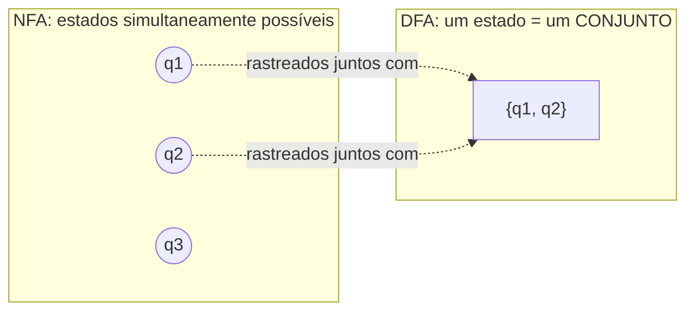
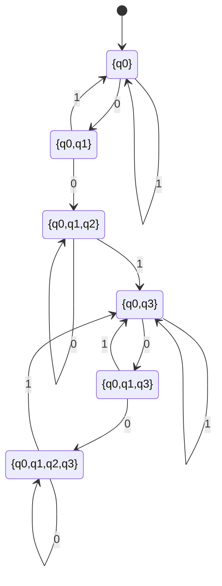

## Objetivos de Aprendizagem

- Enunciar a construção de subconjuntos (powerset): como construir um DFA cujos estados são conjuntos de estados do NFA, a partir de um NFA dado.
- Aplicar a construção a um NFA pequeno e concreto e produzir explicitamente os estados e transições do DFA resultante.
- Explicar como as ε-transições são incorporadas à construção via o ε-fecho de um conjunto de estados.
- Enunciar precisamente a alegação de corretude da construção, como uma equivalência entre o estado do DFA construído depois de ler w e o conjunto exato de estados do NFA alcançáveis lendo w.
- Demonstrar essa alegação de corretude por indução no comprimento da string de entrada, identificando explicitamente o caso base e o passo indutivo.

## Contexto e Motivação

O conceito anterior terminou com uma alegação enunciada mas ainda não demonstrada: todo NFA, por mais ramificações e ε-transições que use, tem um DFA equivalente, um que aceita exatamente a mesma linguagem, sem nenhum não-determinismo. Este conceito entrega essa demonstração, por meio de uma construção elegante o suficiente para ser frequentemente a ideia mais memorável de um curso introdutório de autômatos: a **construção de subconjuntos** (também chamada de **construção de powerset**), que constrói o DFA equivalente fazendo cada um de seus estados corresponder não a um único estado do NFA, mas a um *conjunto* inteiro de estados do NFA, precisamente o conjunto que o NFA poderia estar ocupando simultaneamente, dada a entrada consumida até ali.

Vale a pena se deter nisso por um momento, porque é um movimento genuinamente surpreendente: um NFA com n estados pode estar não-deterministicamente "em" até 2ⁿ combinações diferentes de estados ao mesmo tempo (uma combinação para cada subconjunto de seu conjunto de estados), e o insight da construção é promover cada uma dessas *combinações* ao status de um único estado determinístico e comum em uma nova máquina. Um DFA construído dessa forma simula o NFA exatamente, a cada passo, rastreando não "um possível estado atual", mas "o conjunto completo de estados atualmente alcançáveis", colapsando a árvore de computação ramificada do NFA em uma única linha determinística de contabilidade. Tanto o 18.404J do MIT quanto o CS154 de Stanford tratam essa construção como a demonstração central de que linguagens regulares têm uma definição independente de máquina: não importa se você constrói um DFA ou um NFA para reconhecer uma linguagem, porque as duas noções de "reconhecível por um autômato finito" acabam, por meio dessa demonstração explícita e totalmente construtiva, coincidindo exatamente.

A importância desse resultado vai além da própria teoria dos autômatos. Essa construção, ou uma variante próxima dela, é exatamente como motores de expressão regular e analisadores léxicos reais são compilados na prática: uma regex é primeiro transformada em um pequeno NFA (por meio da metade construtiva do teorema de Kleene, coberta daqui a dois conceitos), e esse NFA é então determinizado usando precisamente essa construção de subconjuntos, porque um DFA, com sua única e rápida transição por tabela de consulta por símbolo, é muito mais eficiente de executar de fato do que simular a ramificação de um NFA diretamente em tempo de execução. Entender este conceito com rigor é entender uma peça de maquinário que roda de fato dentro de compiladores e ferramentas de processamento de texto reais hoje.

## Teoria Central

### A construção, formalmente

Dado um NFA N = (Q_N, Σ, δ_N, q₀, F_N), a construção de subconjuntos constrói um DFA D = (Q_D, Σ, δ_D, q₀_D, F_D) da seguinte forma:

- **Q_D = P(Q_N)**, o conjunto das partes de Q_N, todo subconjunto possível dos estados do NFA se torna um estado candidato do DFA. (Na prática, só é necessário construir os subconjuntos de fato alcançáveis a partir do início, veja o exemplo resolvido abaixo, mas formalmente, o conjunto das partes completo é o conjunto de estados.)
- **q₀_D = E({q₀})**, onde E(S) denota o **ε-fecho** de um conjunto de estados do NFA S: o conjunto de todos os estados alcançáveis a partir de qualquer estado em S usando zero ou mais ε-transições apenas (S em si sempre está incluído, já que "zero" ε-transições é permitido). O estado inicial do DFA precisa dar conta de quaisquer movimentos-ε que o NFA poderia fazer de graça antes de ler qualquer coisa.
- **δ_D(T, a) = E( ⋃_{q ∈ T} δ_N(q, a) )** para cada estado T ⊆ Q_N do DFA (um conjunto de estados do NFA) e símbolo a ∈ Σ: para encontrar para onde o DFA vai no símbolo a a partir do estado T, pegue *todo* estado do NFA alcançável a partir de *qualquer* estado atualmente em T ao ler a, una tudo isso, e então tome o ε-fecho dessa união (para também incorporar quaisquer movimentos-ε livres adicionais disponíveis imediatamente depois).
- **F_D = { T ⊆ Q_N : T ∩ F_N ≠ ∅ }**: um estado do DFA (ele mesmo um conjunto de estados do NFA) é de aceitação exatamente quando contém *pelo menos um* estado de aceitação do NFA, porque o NFA aceita ao longo de algum caminho, e esse estado do DFA representa todos os caminhos simultaneamente, então se algum dos estados do NFA atualmente rastreados é um estado de aceitação, isso corresponde a pelo menos um caminho de aceitação do NFA ter alcançado seu objetivo.

### A intuição por trás de cada peça

A definição de δ_D está fazendo exatamente o que um único passo de simulação correta do NFA exige: a partir do *conjunto* atual de possíveis estados do NFA T, ao ler o símbolo a, o NFA poderia se mover, via qualquer uma de suas escolhas não-determinísticas, para qualquer estado alcançável a partir de qualquer estado em T. Tomar a união sobre todo q ∈ T captura "toda possibilidade atualmente viva tem permissão de fazer seu movimento", e tomar o ε-fecho depois captura "e então, antes de se comprometer a processar o próximo símbolo, siga quaisquer movimentos-ε livres que esses estados recém-alcançados ofereçam". O ε-fecho do estado inicial e a condição de estado de aceitação seguem exatamente a mesma lógica aplicada nas fronteiras, antes de qualquer entrada, e depois de toda ela, respectivamente.

### Construção resolvida: determinizando o NFA da substring "001"

Recorde o NFA do conceito anterior para L = { w ∈ {0,1}* : w contém "001" como substring }: N tem estados {q₀, q₁, q₂, q₃}, F_N = {q₃}, e transições δ_N(q₀,0)={q₀,q₁}, δ_N(q₀,1)={q₀}, δ_N(q₁,0)={q₂}, δ_N(q₂,1)={q₃}, δ_N(q₃,0)={q₃}, δ_N(q₃,1)={q₃}, com todo par (estado, símbolo) não listado mapeando para ∅. Este NFA não tem ε-transições, então todo ε-fecho E(S) é simplesmente S mesmo, o que simplifica bastante a contabilidade.

Construindo o DFA um subconjunto alcançável de cada vez, começando de q₀_D = {q₀}:

- **A partir de {q₀}:** em `0`, união de δ_N(q₀,0) = {q₀,q₁} → novo estado {q₀,q₁}. Em `1`, δ_N(q₀,1) = {q₀} → estado {q₀} (auto-laço).
- **A partir de {q₀,q₁}:** em `0`, união de δ_N(q₀,0) ∪ δ_N(q₁,0) = {q₀,q₁} ∪ {q₂} = {q₀,q₁,q₂} → novo estado {q₀,q₁,q₂}. Em `1`, união de δ_N(q₀,1) ∪ δ_N(q₁,1) = {q₀} ∪ ∅ = {q₀} → de volta ao estado {q₀}.
- **A partir de {q₀,q₁,q₂}:** em `0`, união de δ_N(q₀,0) ∪ δ_N(q₁,0) ∪ δ_N(q₂,0) = {q₀,q₁} ∪ {q₂} ∪ ∅ = {q₀,q₁,q₂} → auto-laço. Em `1`, união de δ_N(q₀,1) ∪ δ_N(q₁,1) ∪ δ_N(q₂,1) = {q₀} ∪ ∅ ∪ {q₃} = {q₀,q₃} → novo estado {q₀,q₃}.
- **A partir de {q₀,q₃}:** já que q₃ absorve tudo, em `0`: δ_N(q₀,0) ∪ δ_N(q₃,0) = {q₀,q₁} ∪ {q₃} = {q₀,q₁,q₃} → novo estado. Em `1`: δ_N(q₀,1) ∪ δ_N(q₃,1) = {q₀} ∪ {q₃} = {q₀,q₃} → auto-laço.
- **A partir de {q₀,q₁,q₃}:** em `0`: {q₀,q₁} ∪ {q₂} ∪ {q₃} = {q₀,q₁,q₂,q₃} → novo estado. Em `1`: {q₀} ∪ ∅ ∪ {q₃} = {q₀,q₃} → de volta a {q₀,q₃}.
- **A partir de {q₀,q₁,q₂,q₃}:** em `0`: {q₀,q₁} ∪ {q₂} ∪ ∅ ∪ {q₃} = {q₀,q₁,q₂,q₃} → auto-laço. Em `1`: {q₀} ∪ ∅ ∪ {q₃} ∪ {q₃} = {q₀,q₃} → de volta a {q₀,q₃}.

Nenhum subconjunto novo aparece a mais, então a porção alcançável de Q_D tem exatamente seis estados: {q₀}, {q₀,q₁}, {q₀,q₁,q₂}, {q₀,q₃}, {q₀,q₁,q₃}, {q₀,q₁,q₂,q₃}. Aplicando F_D: um estado do DFA é de aceitação sse contém q₃, então F_D (restrito aos estados alcançáveis) = { {q₀,q₃}, {q₀,q₁,q₃}, {q₀,q₁,q₂,q₃} }, exatamente os três subconjuntos que contêm q₃.

Todo estado que contém q3 (S3, S4, S5) é um estado de aceitação deste DFA, exatamente seis estados determinísticos, construídos inteiramente de forma mecânica a partir do NFA de quatro estados, sem nenhum não-determinismo em lugar nenhum no resultado.

## Exemplos Resolvidos

### Exemplo 1: rastreando o DFA construído e confirmando que corresponde ao veredito do NFA

**Problema:** Rastreie o DFA de seis estados construído acima na entrada `1001`, e confirme que seu veredito corresponde ao veredito do NFA do Exemplo 1 do conceito anterior (que encontrou um caminho de aceitação para `1001`).

**Rastro.** Início: S0 = {q₀}. Lê `1`: S0 →(1)→ S0 = {q₀}. Lê `0`: S0 →(0)→ S1 = {q₀,q₁}. Lê `0`: S1 →(0)→ S2 = {q₀,q₁,q₂}. Lê `1`: S2 →(1)→ S3 = {q₀,q₃}. Estado final S3 = {q₀,q₃}, que contém q₃, então S3 ∈ F_D, o DFA **aceita** `1001`, correspondendo exatamente ao veredito de aceitação anterior do NFA. Note que o DFA não precisou de nenhum palpite: seu único estado depois de cada símbolo *é* o conjunto completo e exato de estados em que o NFA poderia estar naquele ponto, com a possibilidade "palpitar q₁" do rastro do Exemplo 1 do NFA simplesmente rastreada automaticamente como um elemento do conjunto S1 = {q₀,q₁}, ao lado da possibilidade "não palpitou" q₀, ambas carregadas em conjunto.

### Exemplo 2: uma string rejeitada rastreada pelo DFA de subconjuntos

**Problema:** Rastreie o mesmo DFA em `0101` (mostrado no conceito anterior como rejeitado pelo NFA), e confirme que o DFA concorda.

**Rastro.** Início: S0 = {q₀}. Lê `0`: S0 →(0)→ S1 = {q₀,q₁}. Lê `1`: S1 →(1)→ S0 = {q₀} (já que δ_N(q₀,1)∪δ_N(q₁,1) = {q₀}∪∅ = {q₀}). Lê `0`: S0 →(0)→ S1 = {q₀,q₁}. Lê `1`: S1 →(1)→ S0 = {q₀}. Estado final S0 = {q₀}, que não contém q₃, então S0 ∉ F_D, o DFA **rejeita** `0101`, correspondendo ao NFA. O conjunto rastreado pelo DFA nunca cresceu para incluir q₂ ou q₃, refletindo corretamente que nenhum prefixo de `0101` jamais completa o padrão "001".

### Exemplo 3: demonstrando corretude por indução no comprimento da string de entrada

**Problema:** Enuncie e demonstre a alegação precisa de corretude conectando o DFA construído D ao NFA original N.

**Alegação.** Para toda string w ∈ Σ*, se D é executado em w começando de q₀_D, o estado do DFA D alcançado depois de consumir w é *exatamente* o conjunto de estados do NFA alcançáveis a partir de q₀ lendo w (levando em conta todas as escolhas não-determinísticas e movimentos-ε), ou seja, δ_D*(q₀_D, w) = E({ q ∈ Q_N : q é alcançável a partir de q₀ em N lendo w }), onde δ_D* denota a função de transição estendida do DFA aplicada à string w inteira.

Isso é demonstrado usando **indução matemática** no comprimento de w, a técnica já estabelecida em plena generalidade (caso base mais passo indutivo, licenciada pelo princípio da boa ordenação) no conceito de Indução Matemática; ela é aplicada aqui exatamente como lá, com a variável indutiva sendo o número de símbolos de w consumidos até agora em vez de um inteiro arbitrário n.

**Caso base (|w| = 0, ou seja, w = ε):** Por construção, δ_D*(q₀_D, ε) = q₀_D = E({q₀}), o DFA não se moveu de seu estado inicial. O conjunto de estados do NFA alcançáveis a partir de q₀ lendo zero símbolos, levando em conta movimentos-ε livres, é por definição exatamente E({q₀}) também (lendo nada, o NFA ainda pode vagar por quaisquer ε-transições disponíveis a partir de q₀ antes de "parar"). Ambos os lados são iguais a E({q₀}), então a alegação vale para |w| = 0.

**Passo indutivo:** Assuma que a alegação vale para todas as strings de comprimento k (a hipótese indutiva), ou seja, para qualquer string x com |x| = k, δ_D*(q₀_D, x) é igual ao conjunto exato de estados do NFA alcançáveis a partir de q₀ lendo x. Seja w = xa uma string de comprimento k+1, formada anexando mais um símbolo a a alguma string x de comprimento k. Precisamos mostrar que a alegação vale para w.

Pela definição da função de transição estendida, δ_D*(q₀_D, w) = δ_D*(q₀_D, xa) = δ_D( δ_D*(q₀_D, x), a ). Pela hipótese indutiva, δ_D*(q₀_D, x) = T, o conjunto exato de estados do NFA alcançáveis a partir de q₀ lendo x. Então δ_D*(q₀_D, w) = δ_D(T, a) = E( ⋃_{q∈T} δ_N(q, a) ), pela definição de δ_D dada anteriormente na Teoria Central.

Agora, quais estados do NFA são alcançáveis a partir de q₀ lendo w = xa? Exatamente os estados alcançáveis lendo primeiro x (chegando, pela hipótese indutiva, exatamente aos estados de T, todo estado em T é alcançável por alguma sequência válida de escolhas lendo x, e nenhum estado fora de T é alcançável dessa forma) e depois, a partir de qualquer um desses estados em T, lendo o único símbolo adicional a e seguindo quaisquer movimentos-ε subsequentes. Isso é precisamente ⋃_{q∈T} δ_N(q,a), com o ε-fecho aplicado, que é exatamente E( ⋃_{q∈T} δ_N(q,a) ), a mesma expressão recém derivada para δ_D*(q₀_D, w). Os dois lados coincidem, então a alegação vale para w, completando o passo indutivo.

Pelo princípio da indução matemática, a alegação vale para todo w ∈ Σ*, de qualquer comprimento. ∎

**Encerrando o argumento de corretude.** Como F_D é definido de forma que um estado T do DFA é de aceitação exatamente quando T ∩ F_N ≠ ∅, e a alegação recém demonstrada mostra que o estado de D depois de ler w é exatamente o conjunto de estados do NFA alcançáveis lendo w, segue imediatamente que D aceita w (termina em um estado em F_D) se e somente se algum estado do NFA alcançável lendo w está em F_N, o que é exatamente a definição do NFA N aceitar w (algum caminho alcança um estado de aceitação). Logo L(D) = L(N): o DFA construído e o NFA original reconhecem exatamente a mesma linguagem.

## Equívocos Comuns e Armadilhas

- **"O DFA da construção de subconjuntos precisa de 2ⁿ estados, sempre, para um NFA de n estados."** O conjunto das partes P(Q_N) tem 2ⁿ elementos, mas só os subconjuntos de fato *alcançáveis* a partir de q₀_D precisam ser construídos (como no exemplo resolvido acima, onde apenas 6 dos 2⁴ = 16 subconjuntos possíveis de um NFA de 4 estados acabaram sendo alcançáveis), na prática o DFA útil e funcional é construído de forma preguiçosa, estado por estado, começando de q₀_D, e subconjuntos inalcançáveis simplesmente nunca são construídos. O valor 2ⁿ é um limite superior de pior caso para o número de estados, não uma garantia de que todos eles sejam necessários.
- **"Cada estado do DFA na construção corresponde a um estado do NFA, só renomeado."** Cada estado do DFA é um *conjunto* inteiro de estados do NFA, rastreando toda possibilidade simultaneamente, essa é a ideia inteira da construção, e é por isso que o DFA resultante tem, em geral, drasticamente mais estados do que o NFA original. Tratar um estado do DFA como {q₀,q₁,q₃} como se fosse de alguma forma "na verdade" só q₀ ou só q₃ perde todo o mecanismo que torna a simulação correta.
- **"O ε-fecho só precisa ser tomado uma vez, bem no início."** O ε-fecho precisa ser reaplicado depois de *toda* transição que consome um símbolo, não só no estado inicial, δ_D(T,a) em si é definido como E(⋃ δ_N(q,a)), com o ε-fecho embutido em cada passo, precisamente porque o NFA poderia fazer movimentos-ε livres imediatamente depois de qualquer transição real, não só antes da primeiríssima.
- **"A demonstração indutiva de corretude é só reafirmar a construção, não demonstrando nada de fato."** O passo indutivo faz trabalho real: ele mostra que a definição algébrica específica escolhida para δ_D (união sobre T, depois ε-fecho) produz exatamente o conjunto certo de estados do NFA em todo comprimento de string, relacionando explicitamente "alcançável lendo xa" com "alcançável lendo x, depois mais um passo", esse é o conteúdo substantivo da demonstração, não uma reafirmação, e é exatamente por isso que o caso base e o passo indutivo (no sentido preciso desenvolvido no conceito de Indução Matemática) são ambos necessários, não apenas uma verificação em um exemplo pequeno.

## Resumo

A construção de subconjuntos (powerset) constrói um DFA a partir de qualquer NFA fazendo de todo estado do DFA um *conjunto* de estados do NFA, o DFA está no estado T exatamente quando o NFA, dada a mesma entrada consumida até então, poderia estar simultaneamente em qualquer um dos estados em T. O estado inicial é o ε-fecho de {q₀}; uma transição a partir do estado T no símbolo a une todo estado do NFA alcançável a partir de qualquer estado em T em a, depois toma o ε-fecho dessa união; e um estado do DFA é de aceitação exatamente quando contém pelo menos um estado de aceitação do NFA. Aplicada a um NFA pequeno e concreto, a construção produz uma máquina explícita e puramente determinística, como mostrado para o NFA da substring "001", cujos quatro estados se expandem para seis estados alcançáveis no DFA, cada um rastreado e confirmado como concordando com o veredito do NFA em strings específicas. A corretude da construção, de que o estado do DFA depois de ler qualquer string w é exatamente o conjunto de estados do NFA alcançáveis lendo w, é demonstrada por indução matemática no comprimento de w, usando a mesma estrutura de caso-base-mais-passo-indutivo estabelecida de forma geral no conceito de Indução Matemática, com o passo indutivo relacionando explicitamente a alegação no comprimento k com a alegação no comprimento k+1 por meio de um passo adicional de transição. Esta demonstração, junto com o argumento anterior de conveniência de design para NFAs, completa a equivalência: NFAs e DFAs reconhecem exatamente a mesma classe de linguagens, as linguagens regulares.

## Documentation Links

- [MIT 18.404J: OCW Calendar](https://ocw.mit.edu/courses/18-404j-theory-of-computation-fall-2020/pages/calendar/) - doc
- [Sipser: Introduction to the Theory of Computation, 3rd ed.](https://cs.brown.edu/courses/csci1810/fall-2023/resources/ch2_readings/Sipser_Introduction.to.the.Theory.of.Computation.3E.pdf) - doc
