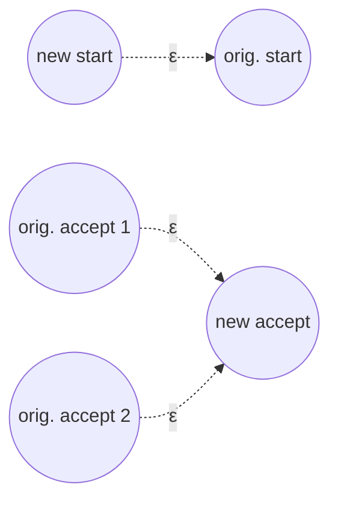
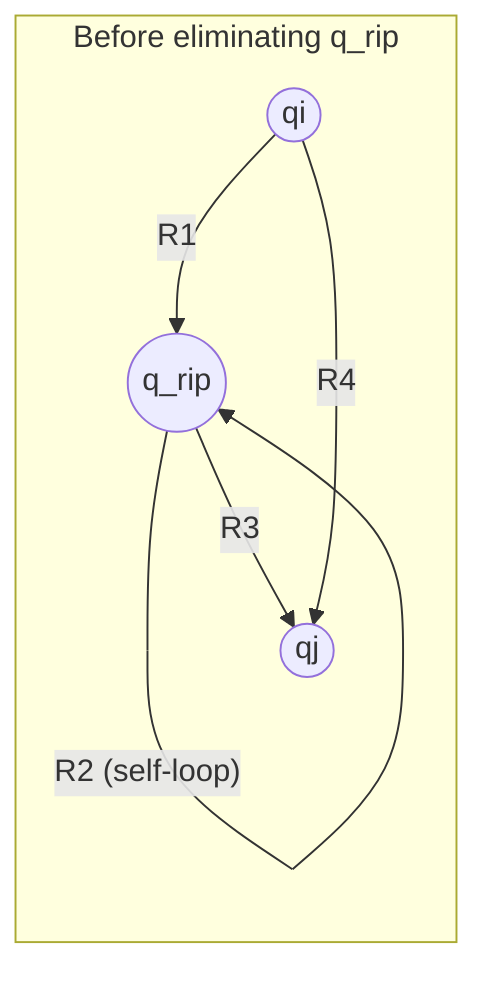
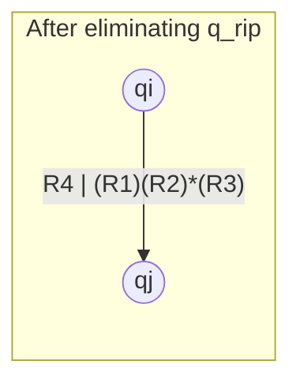

## Learning Objectives

- Define a generalized NFA (GNFA) and explain how its transitions differ from an ordinary NFA's.
- Explain the state-elimination algorithm: converting a DFA to a GNFA, then removing states one at a time until only start and accept states remain.
- Derive the regex-combination formula used when eliminating a single state, and explain what each of its four pieces represents.
- Carry out state elimination in full on a small (2-3 state) automaton, producing a single correct regular expression.
- Explain why this direction of Kleene's theorem is considered harder than building an automaton from a regex.

## Context & Motivation

The companion entry on building an NFA from a regular expression proved one direction of Kleene's theorem: every regex has an equivalent automaton, by a clean structural induction that mirrors the regex's own syntax. This entry proves the other direction — every DFA (and hence every regular language recognized by some automaton) has an equivalent regular expression — and it is a genuinely harder construction, because an automaton has no built-in "structure" to induct on the way a regex's syntax tree does. A DFA is just a set of states and transitions; there is no obvious smaller sub-automaton to recurse into the way a regex naturally decomposes into sub-expressions.

The standard solution, **state elimination**, sidesteps this by changing what's being built up rather than looking for structure to recurse on: instead of directly extracting a regex from a DFA, first generalize the automaton to allow transitions labeled by whole regular expressions instead of single symbols (a **generalized NFA**, or GNFA), and then repeatedly simplify the *machine itself* by removing one state at a time, each time replacing everything that state used to do with a single, more complicated regex label on the transitions that remain. After enough removals, only two states are left — start and accept — connected by exactly one transition, and the label on that transition is the answer: a regular expression for the whole original language.

This construction matters for the same reason as the reverse direction: together, the two directions complete Kleene's theorem, establishing once and for all that regular expressions and finite automata are exactly, provably, interchangeable descriptions of the same class of languages — not just similar in spirit, but formally equal in expressive power, with a mechanical procedure to go either way. MIT 18.404J and Sipser both present state elimination as the standard proof of this direction, and it is also, practically, close to what tools that need to extract a pattern description from an existing automaton-shaped specification actually do internally.

## Core Theory

### Generalized NFAs (GNFAs)

A **generalized NFA** is like an NFA, except each transition is labeled with an arbitrary regular expression (over the original alphabet Σ) rather than a single symbol or ε — a transition labeled by regex R means "consume any string matching R while taking this transition." To make state elimination clean, a GNFA is additionally required to have this specific shape: exactly one start state, with transitions going *out* to every other state but none coming *in* to it; exactly one accept state, with transitions coming *in* from every other state but none going *out* of it; and every other pair of states connected by exactly one transition in each direction (labeled ∅ if no such transition existed in the original machine — ∅ is a valid "regex," matching nothing, so this is just a bookkeeping convention, not a new machine feature).

Any DFA (or NFA) can be converted into a GNFA of this shape by adding a fresh start state with an ε-transition to the original start state, a fresh accept state with ε-transitions in from all the original accept states, and — for any pair of states with multiple transitions between them (or none) — combining multiple symbol-labels into a single union regex, or inserting an explicit ∅ label where no transition existed.

### The state-elimination step

The heart of the construction is a single move: **eliminate one state** q_rip (any state other than the designated start and accept states) from a GNFA, replacing it with new, more complicated transition labels between every remaining pair of states that used to route through q_rip.

For every pair of states q_i (a predecessor of q_rip) and q_j (a successor of q_rip), with q_i, q_j ≠ q_rip, let:

- R₁ = the label on the transition from q_i to q_rip,
- R₂ = the label on the self-loop at q_rip (∅ if none existed),
- R₃ = the label on the transition from q_rip to q_j,
- R₄ = the label already on the direct transition from q_i to q_j (before elimination).

After eliminating q_rip, replace the transition from q_i to q_j with the new label:

**R₄ | (R₁)(R₂)*(R₃)**

**Why this formula is correct.** Before elimination, a string could get from q_i to q_j either directly (matching R₄), or by first taking the q_i→q_rip transition (matching R₁), looping at q_rip any number of times including zero (matching R₂*), then taking the q_rip→q_j transition (matching R₃) — that whole "via q_rip" route is captured by (R₁)(R₂)*(R₃). Once q_rip and all its transitions are deleted, the only way to preserve every string that used to be acceptable is to fold both routes into a single new label: the old direct route, unioned with the entire "via q_rip" route now expressed purely as a regex with no reference to q_rip at all. This step is repeated for every pair (q_i, q_j) with q_i, q_j ≠ q_rip, and then q_rip and all its incident transitions are deleted entirely.

### The full algorithm

Convert the DFA to a GNFA (add fresh start/accept states as described above). Then, while the GNFA has more than two states, pick any state other than the start and accept states and eliminate it using the formula above, updating every remaining pair's transition label. Once exactly two states remain — necessarily the start and accept states, since those are never eliminated — a single transition connects them, and its label is a regular expression for the language of the original DFA. Every step preserves the language recognized (the elimination formula is built precisely to keep every accepting path intact), so the final label is exactly correct, not merely approximately equivalent.

## Worked Examples

### Example 1 — state elimination on a 3-state DFA in full

**Problem:** Let M be a DFA over Σ = {a, b} with states {q1 (start), q2, q3 (accept)}, and transitions: q1 →a→ q2, q1 →b→ q1, q2 →a→ q3, q2 →b→ q1, q3 →a→ q3, q3 →b→ q3. Find a regular expression for L(M) by state elimination.

**Step 1 — convert to a GNFA.** Add new start s with s →ε→ q1, and new accept f with q3 →ε→ f. Fill in every missing pair with ∅: q1→q3 has no direct transition, so label ∅; q2→q2 has no self-loop, label ∅; q3→q1 and q3→q2 have none, label ∅ each; q2→q3 is a→ (from the original); q1→q2 is a; q1→q1 is b (self-loop); q2→q1 is b; q3→q3 is a|b (combining the two self-loop symbols into one union regex).

Full transition table after conversion (only nonempty/relevant labels shown): s→q1: ε. q1→q1: b. q1→q2: a. q1→q3: ∅. q2→q1: b. q2→q2: ∅. q2→q3: a. q3→q3: a|b. q3→f: ε.

**Step 2 — eliminate q2** (an interior state, not start or accept). q2's self-loop R₂ = ∅, so (R₂)* = ∅* = ε (the star of the empty language matches only the empty string — zero repetitions of nothing). For each predecessor/successor pair through q2:

- q1 (predecessor, via q1→q2 = a) to q3 (successor, via q2→q3 = a): new label on q1→q3 = old label ∅, unioned with (a)(ε)(a) = aa. So q1→q3 becomes ∅|aa = aa.
- q1 (predecessor) to q1 (successor, via q2→q1 = b): new label on q1→q1 = old label b, unioned with (a)(ε)(b) = ab. So q1→q1 becomes b|ab.

q2 has no other predecessors or successors to consider (only q1 flows into q2, and q2 flows into q1 and q3). Delete q2 and all its transitions.

**Remaining GNFA after eliminating q2.** States: {s, q1, q3, f}. Transitions: s→q1: ε. q1→q1: b|ab. q1→q3: aa. q3→q3: a|b. q3→f: ε.

**Step 3 — eliminate q1** (the only interior state left). q1's self-loop R₂ = b|ab, so (R₂)* = (b|ab)*. The only predecessor of q1 is s (via s→q1 = ε), and the only successor of q1 is q3 (via q1→q3 = aa) — there is no existing direct s→q3 transition, so R₄ = ∅.

New label on s→q3 = ∅ | (ε)(b|ab)*(aa) = (b|ab)*aa (ε as a prefix contributes nothing to the concatenation, so it simplifies away). Delete q1.

**Remaining GNFA.** States: {s, q3, f}. Transitions: s→q3: (b|ab)*aa. q3→q3: a|b. q3→f: ε.

**Step 4 — eliminate q3.** q3's self-loop R₂ = a|b, so (R₂)* = (a|b)*. The only predecessor of q3 is s (via s→q3 = (b|ab)*aa), and the only successor is f (via q3→f = ε). No existing direct s→f transition, so R₄ = ∅.

New label on s→f = ∅ | ((b|ab)*aa)(a|b)*(ε) = (b|ab)*aa(a|b)*.

**Result.** Only s and f remain, connected by a single transition labeled (b|ab)*aa(a|b)*. This is the regular expression for L(M).

**Sanity check.** L(M) should be "strings containing at least two consecutive a's" (informally: M stays at q1 while reading b's or a single stray a followed by a b, jumps to q2 after an a, and only reaches the accepting q3 — which then accepts everything — after a *second* consecutive a). The derived regex (b|ab)*aa(a|b)* reads as "any mixture of b's and (a followed by b) pairs, then aa, then anything" — which does indeed force two a's in a row to appear (the "aa" in the middle) after only ever seeing isolated a's (each immediately followed by b) before that point, matching M's behavior.

### Example 2 — a smaller 2-state elimination

**Problem:** Let M have states {q1 (start, accept), q2}, with q1 →a→ q2, q2 →a→ q1, q1 →b→ q1, q2 →b→ q2. Find a regex for L(M) via state elimination.

**Convert to GNFA.** New start s: s→q1 = ε. New accept f: since q1 is the only accept state, q1→f = ε. Fill remaining pairs: q1→q1 = b (self-loop), q1→q2 = a, q2→q1 = a, q2→q2 = b (self-loop).

**Eliminate q2.** R₂ (q2's self-loop) = b, so (R₂)* = b*. Predecessor of q2: q1 (via q1→q2 = a). Successor of q2: q1 (via q2→q1 = a). Existing direct q1→q1 label: b.

New label on q1→q1 = b | (a)(b*)(a) = b|ab*a. Delete q2.

**Remaining GNFA.** States {s, q1, f}. s→q1: ε. q1→q1: b|ab*a. q1→f: ε.

**Eliminate q1.** R₂ = b|ab*a, so (R₂)* = (b|ab*a)*. Predecessor of q1: s (ε). Successor of q1: f (ε). No existing direct s→f label, so R₄ = ∅.

New label on s→f = ∅ | (ε)(b|ab*a)*(ε) = (b|ab*a)*.

**Result.** L(M) = (b|ab*a)*. This matches the informal reading of M: q1 is "seen an even number of a's so far," q2 is "seen an odd number," and the machine accepts exactly when back at q1 — i.e., strings with an even total count of a's — and b|ab*a is exactly "either a lone b, or an a, any run of b's, then another a" (a block that always contributes an even number of a's: zero for the b-alone case, exactly two for the a...a case), starred to allow any number of such even-contributing blocks in sequence.

## Common Misconceptions & Pitfalls

- **"State elimination should give the same final regex no matter which state gets eliminated first, in exactly the same syntactic form."** The final regex is guaranteed to describe the same *language*, but different elimination orders generally produce syntactically different (though equivalent) expressions — there is no canonical order, and no guarantee of a canonical resulting string, only a guarantee of correctness for whatever order is chosen.
- **"A self-loop that doesn't exist can just be left blank instead of explicitly written as ∅."** In the GNFA formalism, every pair of states must have exactly one transition label between them, so a "missing" transition (self-loop or otherwise) must be written explicitly as ∅ — leaving it blank breaks the requirement that the elimination formula has well-defined R₁ through R₄ to work with at every step, and forgetting the ∅ leads directly to a malformed or wrong final expression (e.g., treating a nonexistent path as if it contributed ε rather than nothing).
- **"(R₂)* can be dropped from the formula when R₂ = ∅, since there's nothing to loop on."** (∅)* = ε (the empty language starred still matches the empty string, representing "zero repetitions of nothing"), not ∅ itself — dropping it entirely rather than replacing it with ε is a common arithmetic-style error that silently drops a valid ε factor from the concatenation, as handled correctly in Example 1's elimination of q2.
- **"Only the start and accept states can never be eliminated, but any elimination order among the rest is fine, including saving 'connected' states for last."** True that the order doesn't affect correctness, but that doesn't mean order is irrelevant to how *messy* the intermediate expressions get — eliminating a highly-connected state early can make later self-loop labels balloon quickly; the algorithm is correct regardless of order, but not equally pleasant to carry out by hand.

## Summary

Going from a finite automaton back to a regular expression — the harder direction of Kleene's theorem — is proved via state elimination: convert the DFA into a generalized NFA (a GNFA) whose transitions can carry whole regular expressions as labels, then repeatedly remove one non-start, non-accept state at a time, folding whatever paths ran through it into a single combined label R₄ | (R₁)(R₂)*(R₃) on every remaining pair of states it used to connect. Repeating this until only the start and accept states remain leaves a single transition between them, labeled by a regular expression for the entire original language — correctness is preserved at every elimination step, since the formula is built specifically to capture every path that used to exist through the removed state. Both worked examples carried this out to completion on small automata, confirming the final regex against the automaton's informal behavior. Together with the regex-to-NFA construction covered separately, this completes Kleene's theorem in both directions: regular expressions and finite automata are provably, mechanically interchangeable descriptions of exactly the same class of languages.

## Documentation Links

- [MIT 18.404J — OCW Calendar](https://ocw.mit.edu/courses/18-404j-theory-of-computation-fall-2020/pages/calendar/) - doc
- [Sipser — Introduction to the Theory of Computation, 3rd ed.](https://cs.brown.edu/courses/csci1810/fall-2023/resources/ch2_readings/Sipser_Introduction.to.the.Theory.of.Computation.3E.pdf) - doc
