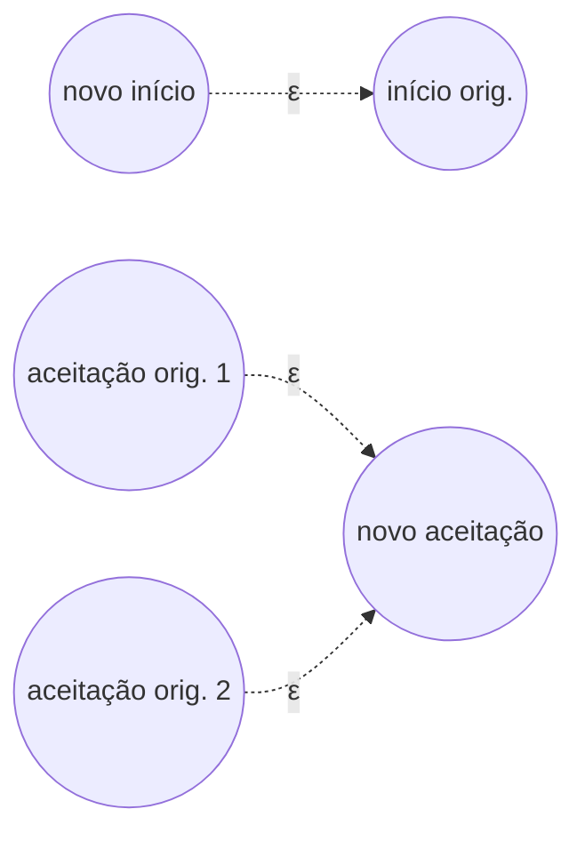
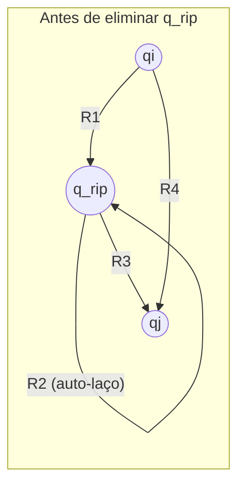
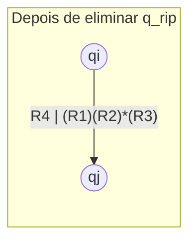

## Objetivos de Aprendizagem

- Definir um NFA generalizado (GNFA) e explicar como suas transições diferem das de um NFA comum.
- Explicar o algoritmo de eliminação de estados: converter um DFA em um GNFA, depois remover estados um de cada vez até que restem apenas o estado inicial e o de aceitação.
- Derivar a fórmula de combinação de regex usada ao eliminar um único estado, e explicar o que cada uma de suas quatro peças representa.
- Realizar a eliminação de estados por completo em um autômato pequeno (2-3 estados), produzindo uma única expressão regular correta.
- Explicar por que essa direção do teorema de Kleene é considerada mais difícil do que construir um autômato a partir de uma regex.

## Contexto e Motivação

O conceito irmão sobre construir um NFA a partir de uma expressão regular demonstrou uma direção do teorema de Kleene: toda regex tem um autômato equivalente, por meio de uma indução estrutural limpa que espelha a própria sintaxe da regex. Este conceito demonstra a outra direção, todo DFA (e portanto toda linguagem regular reconhecida por algum autômato) tem uma expressão regular equivalente, e é uma construção genuinamente mais difícil, porque um autômato não tem "estrutura" embutida sobre a qual fazer indução da forma como a árvore sintática de uma regex tem. Um DFA é apenas um conjunto de estados e transições; não há um sub-autômato menor óbvio para recursionar da forma como uma regex naturalmente se decompõe em sub-expressões.

A solução padrão, **eliminação de estados**, contorna isso mudando o que está sendo construído em vez de procurar estrutura sobre a qual recursionar: em vez de extrair diretamente uma regex de um DFA, primeiro generaliza-se o autômato para permitir transições rotuladas por expressões regulares inteiras em vez de símbolos únicos (um **NFA generalizado**, ou GNFA), e então simplifica-se repetidamente a *própria máquina* removendo um estado de cada vez, substituindo a cada vez tudo que aquele estado costumava fazer por um único rótulo de regex mais complicado nas transições que restam. Depois de remoções suficientes, restam apenas dois estados, inicial e de aceitação, conectados por exatamente uma transição, e o rótulo dessa transição é a resposta: uma expressão regular para a linguagem original inteira.

Essa construção importa pela mesma razão que a direção inversa: juntas, as duas direções completam o teorema de Kleene, estabelecendo de uma vez por todas que expressões regulares e autômatos finitos são descrições exata e comprovadamente intercambiáveis da mesma classe de linguagens, não apenas parecidas em espírito, mas formalmente iguais em poder expressivo, com um procedimento mecânico para ir em qualquer uma das direções. Tanto o 18.404J do MIT quanto Sipser apresentam a eliminação de estados como a demonstração padrão dessa direção, e é também, na prática, próximo do que ferramentas que precisam extrair uma descrição de padrão a partir de uma especificação existente no formato de autômato de fato fazem internamente.

## Teoria Central

### NFAs generalizados (GNFAs)

Um **NFA generalizado** é como um NFA, exceto que cada transição é rotulada com uma expressão regular arbitrária (sobre o alfabeto original Σ) em vez de um único símbolo ou ε, uma transição rotulada pela regex R significa "consuma qualquer string que corresponda a R ao fazer essa transição". Para deixar a eliminação de estados limpa, um GNFA é adicionalmente exigido a ter esta forma específica: exatamente um estado inicial, com transições saindo para todo outro estado mas nenhuma entrando nele; exatamente um estado de aceitação, com transições entrando de todo outro estado mas nenhuma saindo dele; e todo outro par de estados conectado por exatamente uma transição em cada direção (rotulada ∅ se não existisse tal transição na máquina original, ∅ é uma "regex" válida, que não corresponde a nada, então isso é apenas uma convenção de contabilidade, não um novo recurso de máquina).

Qualquer DFA (ou NFA) pode ser convertido em um GNFA dessa forma adicionando um novo estado inicial com uma ε-transição para o estado inicial original, um novo estado de aceitação com ε-transições vindas de todos os estados de aceitação originais, e, para qualquer par de estados com múltiplas transições entre eles (ou nenhuma), combinando múltiplos rótulos de símbolo em uma única regex de união, ou inserindo um rótulo ∅ explícito onde não existia transição.

### O passo de eliminação de estado

O cerne da construção é um único movimento: **eliminar um estado** q_rip (qualquer estado que não seja o inicial nem o de aceitação designados) de um GNFA, substituindo-o por novos rótulos de transição, mais complicados, entre todo par de estados restantes que costumava passar por q_rip.

Para todo par de estados q_i (um predecessor de q_rip) e q_j (um sucessor de q_rip), com q_i, q_j ≠ q_rip, seja:

- R₁ = o rótulo na transição de q_i para q_rip,
- R₂ = o rótulo no auto-laço em q_rip (∅ se não existir nenhum),
- R₃ = o rótulo na transição de q_rip para q_j,
- R₄ = o rótulo já existente na transição direta de q_i para q_j (antes da eliminação).

Depois de eliminar q_rip, substitua a transição de q_i para q_j pelo novo rótulo:

**R₄ | (R₁)(R₂)*(R₃)**

**Por que esta fórmula é correta.** Antes da eliminação, uma string poderia ir de q_i para q_j ou diretamente (correspondendo a R₄), ou tomando primeiro a transição q_i→q_rip (correspondendo a R₁), fazendo o auto-laço em q_rip qualquer número de vezes incluindo zero (correspondendo a R₂*), depois tomando a transição q_rip→q_j (correspondendo a R₃), essa rota inteira "via q_rip" é capturada por (R₁)(R₂)*(R₃). Uma vez que q_rip e todas as suas transições são apagados, a única forma de preservar toda string que costumava ser aceitável é dobrar as duas rotas em um único novo rótulo: a antiga rota direta, unida à rota "via q_rip" inteira agora expressa puramente como uma regex sem nenhuma referência a q_rip. Este passo é repetido para todo par (q_i, q_j) com q_i, q_j ≠ q_rip, e então q_rip e todas as suas transições incidentes são apagados por completo.

### O algoritmo completo

Converta o DFA em um GNFA (adicionando novos estados inicial/de aceitação conforme descrito acima). Então, enquanto o GNFA tiver mais de dois estados, escolha qualquer estado que não seja o inicial nem o de aceitação e elimine-o usando a fórmula acima, atualizando o rótulo de transição de todo par restante. Uma vez que exatamente dois estados restarem, necessariamente o inicial e o de aceitação, já que esses nunca são eliminados, uma única transição os conecta, e seu rótulo é uma expressão regular para a linguagem do DFA original. Todo passo preserva a linguagem reconhecida (a fórmula de eliminação é construída precisamente para manter intacto todo caminho de aceitação), então o rótulo final é exatamente correto, não apenas aproximadamente equivalente.

## Exemplos Resolvidos

### Exemplo 1: eliminação de estados em um DFA de 3 estados por completo

**Problema:** Seja M um DFA sobre Σ = {a, b} com estados {q1 (inicial), q2, q3 (aceitação)}, e transições: q1 →a→ q2, q1 →b→ q1, q2 →a→ q3, q2 →b→ q1, q3 →a→ q3, q3 →b→ q3. Encontre uma expressão regular para L(M) por eliminação de estados.

**Passo 1: converter para um GNFA.** Adicione novo início s com s →ε→ q1, e novo aceitação f com q3 →ε→ f. Preencha todo par faltante com ∅: q1→q3 não tem transição direta, então rótulo ∅; q2→q2 não tem auto-laço, rótulo ∅; q3→q1 e q3→q2 não têm nenhuma, rótulo ∅ cada; q2→q3 é a→ (do original); q1→q2 é a; q1→q1 é b (auto-laço); q2→q1 é b; q3→q3 é a|b (combinando os dois símbolos de auto-laço em uma regex de união).

Tabela de transição completa depois da conversão (só rótulos não vazios/relevantes mostrados): s→q1: ε. q1→q1: b. q1→q2: a. q1→q3: ∅. q2→q1: b. q2→q2: ∅. q2→q3: a. q3→q3: a|b. q3→f: ε.

**Passo 2: eliminar q2** (um estado interior, nem inicial nem de aceitação). O auto-laço R₂ de q2 = ∅, então (R₂)* = ∅* = ε (o fecho de Kleene da linguagem vazia corresponde só à string vazia, zero repetições de nada). Para cada par predecessor/sucessor via q2:

- q1 (predecessor, via q1→q2 = a) para q3 (sucessor, via q2→q3 = a): novo rótulo em q1→q3 = rótulo antigo ∅, unido a (a)(ε)(a) = aa. Então q1→q3 vira ∅|aa = aa.
- q1 (predecessor) para q1 (sucessor, via q2→q1 = b): novo rótulo em q1→q1 = rótulo antigo b, unido a (a)(ε)(b) = ab. Então q1→q1 vira b|ab.

q2 não tem outros predecessores ou sucessores a considerar (só q1 flui para q2, e q2 flui para q1 e q3). Apague q2 e todas as suas transições.

**GNFA restante depois de eliminar q2.** Estados: {s, q1, q3, f}. Transições: s→q1: ε. q1→q1: b|ab. q1→q3: aa. q3→q3: a|b. q3→f: ε.

**Passo 3: eliminar q1** (o único estado interior restante). O auto-laço R₂ de q1 = b|ab, então (R₂)* = (b|ab)*. O único predecessor de q1 é s (via s→q1 = ε), e o único sucessor de q1 é q3 (via q1→q3 = aa), não existe transição direta s→q3, então R₄ = ∅.

Novo rótulo em s→q3 = ∅ | (ε)(b|ab)*(aa) = (b|ab)*aa (ε como prefixo não contribui em nada para a concatenação, então simplifica). Apague q1.

**GNFA restante.** Estados: {s, q3, f}. Transições: s→q3: (b|ab)*aa. q3→q3: a|b. q3→f: ε.

**Passo 4: eliminar q3.** O auto-laço R₂ de q3 = a|b, então (R₂)* = (a|b)*. O único predecessor de q3 é s (via s→q3 = (b|ab)*aa), e o único sucessor é f (via q3→f = ε). Não existe transição direta s→f, então R₄ = ∅.

Novo rótulo em s→f = ∅ | ((b|ab)*aa)(a|b)*(ε) = (b|ab)*aa(a|b)*.

**Resultado.** Só s e f restam, conectados por uma única transição rotulada (b|ab)*aa(a|b)*. Esta é a expressão regular para L(M).

**Verificação de sanidade.** L(M) deveria ser "strings contendo pelo menos dois a's consecutivos" (informalmente: M permanece em q1 lendo b's ou um único a solto seguido de b, salta para q2 depois de um a, e só alcança o q3 de aceitação, que então aceita tudo, depois de um *segundo* a consecutivo). A regex derivada (b|ab)*aa(a|b)* se lê como "qualquer mistura de b's e pares (a seguido de b), depois aa, depois qualquer coisa", o que de fato força que dois a's em sequência apareçam (o "aa" no meio) depois de só ter visto a's isolados (cada um imediatamente seguido de b) antes disso, correspondendo ao comportamento de M.

### Exemplo 2: uma eliminação menor, de 2 estados

**Problema:** Seja M com estados {q1 (inicial, aceitação), q2}, com q1 →a→ q2, q2 →a→ q1, q1 →b→ q1, q2 →b→ q2. Encontre uma regex para L(M) via eliminação de estados.

**Converter para GNFA.** Novo início s: s→q1 = ε. Novo aceitação f: já que q1 é o único estado de aceitação, q1→f = ε. Preencha os pares restantes: q1→q1 = b (auto-laço), q1→q2 = a, q2→q1 = a, q2→q2 = b (auto-laço).

**Eliminar q2.** R₂ (auto-laço de q2) = b, então (R₂)* = b*. Predecessor de q2: q1 (via q1→q2 = a). Sucessor de q2: q1 (via q2→q1 = a). Rótulo direto existente q1→q1: b.

Novo rótulo em q1→q1 = b | (a)(b*)(a) = b|ab*a. Apague q2.

**GNFA restante.** Estados {s, q1, f}. s→q1: ε. q1→q1: b|ab*a. q1→f: ε.

**Eliminar q1.** R₂ = b|ab*a, então (R₂)* = (b|ab*a)*. Predecessor de q1: s (ε). Sucessor de q1: f (ε). Não existe rótulo direto s→f, então R₄ = ∅.

Novo rótulo em s→f = ∅ | (ε)(b|ab*a)*(ε) = (b|ab*a)*.

**Resultado.** L(M) = (b|ab*a)*. Isso corresponde à leitura informal de M: q1 é "número par de a's visto até agora", q2 é "número ímpar visto", e a máquina aceita exatamente quando está de volta em q1, ou seja, strings com uma contagem total par de a's, e b|ab*a é exatamente "ou um único b, ou um a, qualquer sequência de b's, depois outro a" (um bloco que sempre contribui com um número par de a's: zero para o caso de b sozinho, exatamente dois para o caso a...a), com fecho de Kleene para permitir qualquer número desses blocos de contribuição par em sequência.

## Equívocos Comuns e Armadilhas

- **"A eliminação de estados deveria dar a mesma regex final não importa qual estado seja eliminado primeiro, exatamente na mesma forma sintática."** A regex final é garantida a descrever a mesma *linguagem*, mas ordens de eliminação diferentes geralmente produzem expressões sintaticamente diferentes (embora equivalentes), não há ordem canônica, e nenhuma garantia de uma string resultante canônica, só uma garantia de corretude para qualquer ordem escolhida.
- **"Um auto-laço que não existe pode simplesmente ser deixado em branco em vez de escrito explicitamente como ∅."** No formalismo GNFA, todo par de estados deve ter exatamente um rótulo de transição entre eles, então uma transição "faltante" (auto-laço ou outra) deve ser escrita explicitamente como ∅, deixá-la em branco quebra o requisito de que a fórmula de eliminação tenha R₁ até R₄ bem definidos com que trabalhar em cada passo, e esquecer o ∅ leva diretamente a uma expressão final malformada ou errada (por exemplo, tratando um caminho inexistente como se contribuísse com ε em vez de nada).
- **"(R₂)* pode ser descartado da fórmula quando R₂ = ∅, já que não há nada sobre o que fazer laço."** (∅)* = ε (a linguagem vazia com fecho de Kleene ainda corresponde à string vazia, representando "zero repetições de nada"), não ∅ em si, descartá-lo por completo em vez de substituí-lo por ε é um erro comum de estilo aritmético que silenciosamente elimina um fator ε válido da concatenação, como tratado corretamente na eliminação de q2 no Exemplo 1.
- **"Só o inicial e o de aceitação nunca podem ser eliminados, mas qualquer ordem de eliminação entre o resto está bem, incluindo guardar estados 'conectados' para o final."** É verdade que a ordem não afeta a corretude, mas isso não significa que a ordem seja irrelevante para o quão *confusas* as expressões intermediárias ficam, eliminar um estado altamente conectado cedo pode fazer os rótulos de auto-laço posteriores crescerem rapidamente; o algoritmo é correto independentemente da ordem, mas não igualmente agradável de realizar à mão.

## Resumo

Ir de um autômato finito de volta para uma expressão regular, a direção mais difícil do teorema de Kleene, é demonstrado por eliminação de estados: converta o DFA em um NFA generalizado (um GNFA) cujas transições podem carregar expressões regulares inteiras como rótulos, depois remova repetidamente um estado de cada vez que não seja inicial nem de aceitação, dobrando quaisquer caminhos que passavam por ele em um único rótulo combinado R₄ | (R₁)(R₂)*(R₃) em todo par de estados restante que ele costumava conectar. Repetir isso até que só o inicial e o de aceitação restem deixa uma única transição entre eles, rotulada por uma expressão regular para a linguagem original inteira, a corretude é preservada em todo passo de eliminação, já que a fórmula é construída especificamente para capturar todo caminho que costumava existir por meio do estado removido. Ambos os exemplos resolvidos realizaram isso até o fim em autômatos pequenos, confirmando a regex final contra o comportamento informal do autômato. Junto com a construção de regex para NFA coberta separadamente, isso completa o teorema de Kleene em ambas as direções: expressões regulares e autômatos finitos são descrições comprovada e mecanicamente intercambiáveis da mesma classe de linguagens.

## Documentation Links

- [MIT 18.404J: OCW Calendar](https://ocw.mit.edu/courses/18-404j-theory-of-computation-fall-2020/pages/calendar/) - doc
- [Sipser: Introduction to the Theory of Computation, 3rd ed.](https://cs.brown.edu/courses/csci1810/fall-2023/resources/ch2_readings/Sipser_Introduction.to.the.Theory.of.Computation.3E.pdf) - doc
