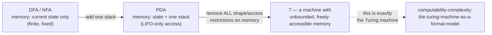

## Learning Objectives

- Restate the specific memory limitation of each machine model covered in this discipline (DFA/NFA, PDA), and connect each one to the specific language it provably cannot recognize.
- Explain precisely why a single stack, despite being unbounded, is still not "unbounded memory" in the fully general sense.
- State the natural next question this discipline's limitations raise, and explain why "a machine with genuinely unbounded, freely-accessible memory" is the right next model to ask about.
- Describe, at a first-contact level, what a Turing machine's infinite tape is and how it removes the limitation shared by every model in this discipline.
- Explain how the Church-Turing thesis's claim relates to this discipline's closing question — what "computable" means once the memory ceiling is fully removed.

## Context & Motivation

This entire discipline has been a study in exactly one recurring pattern: define a machine model, discover the exact class of languages it can recognize, and then prove — rigorously, via a pumping lemma each time — precisely where that model's power runs out. A DFA or NFA has no memory beyond its current state, one of a fixed, finite number fixed in advance; this is exactly why {0ⁿ1ⁿ} defeats it, since recognizing that language requires counting arbitrarily high, and a finite state set has nowhere to put an arbitrarily large count. A pushdown automaton fixes exactly that gap by adding one stack — unbounded in principle, and exactly the right shape for nested, nesting nested structure — which is why {0ⁿ1ⁿ} becomes trivial for a PDA. But a single stack is still a very specific, very constrained kind of memory: Last-In-First-Out access only, one unbounded count at a time, no way to independently compare two counts once one of them has already been consumed by popping. This is exactly why {0ⁿ1ⁿ2ⁿ} defeats a PDA the same way {0ⁿ1ⁿ} defeated a DFA — and the pumping lemma for context-free languages, covered in the previous concept, proves this rigorously the same way its predecessor did one level down.

So the pattern has now repeated twice, at two different levels of the Chomsky hierarchy, with the identical shape both times: a fixed kind of memory, and a language just past what that specific kind of memory can manage. This is not a coincidence to be noted and set aside — it is the single most important observation this discipline has to offer on its way out the door, because it raises an unavoidable next question: every model covered here has had memory shaped in some *specific, constrained* way — none at all, or exactly one stack — so what happens to a machine whose memory is not constrained to any particular shape at all, but is simply, freely, unboundedly available? That is precisely where this discipline ends and where the sibling discipline on computability and complexity picks up, with a machine model built to answer exactly this question.

## Core Theory

### The shared limitation, restated precisely

Every automaton covered in this discipline recognizes languages using memory of a specific, bounded shape:

- **DFA/NFA:** memory is exactly "which one of Q states am I in right now" — a single value drawn from a fixed, finite set, decided before any input is read. There is no way to store an unbounded count, an unbounded stack, or any structure that grows with the input. This is why {0ⁿ1ⁿ : n ≥ 0} is not regular: recognizing it requires distinguishing arbitrarily many different counts of 0s seen so far, and a finite state set runs out of distinct states to assign to distinct counts once the count exceeds the number of states — exactly the pigeonhole argument at the heart of the regular pumping lemma.
- **PDA:** memory is state (still finite) *plus* a single stack, unbounded in size but constrained to Last-In-First-Out access — push and pop the top only, no reading or modifying anything buried deeper without first popping everything above it. This is exactly the right shape to track *one* unbounded, nested count (which is why {0ⁿ1ⁿ} is easy for a PDA), but it is the wrong shape to track *two* independent unbounded counts that must both be compared against a third — once the 0-count has been consumed popping against the 1-count, that information is gone, with no way to also check it against a separate 2-count. This is why {0ⁿ1ⁿ2ⁿ} is not context-free, proved rigorously by the context-free pumping lemma in the immediately preceding concept.

### The natural next question

Both limitations trace back to the same root cause: memory that is either absent (DFA/NFA) or present but shaped into one specific, restrictive access pattern (PDA's single stack). The question this raises is not "can we add a second stack" (which, as it happens, turns out to already be enough to reach full general computation — two stacks together can simulate a tape, a fact worth knowing exists even though it is not developed further here) but the more fundamental one: **what happens with a machine whose memory is not shaped like anything in particular — no stack discipline, no access restriction, just an unbounded amount of space the machine can read from and write to freely, at any position, in any order?**

### The answer: an infinite tape, freely accessible

The machine that removes this limitation entirely is the **Turing machine** — the very next concept, in the sibling discipline this one hands off to, developed formally there. Rather than a stack with LIFO-only access, a Turing machine has an infinite tape divided into cells, with a read/write head that can move left or right one cell at a time, reading whatever symbol is currently at the head's position and optionally overwriting it, then moving. Crucially, nothing restricts *where* on the tape the head can go, or in what order — unlike a stack, where only the top is ever reachable, a Turing machine can move its head back to any previously visited cell, re-read it, overwrite it, move past it, and return again, as many times as needed. This is precisely "memory not shaped like anything in particular" — no push/pop discipline, no fixed access pattern, just an unbounded space the machine can use however the situation demands, which is exactly enough, as the sibling discipline develops in full, to solve {0ⁿ1ⁿ2ⁿ} directly (make repeated left-to-right sweeps, crossing off one 0, one 1, and one 2 per sweep, until either all three blocks run out evenly or a mismatch is detected — something a single stack's one-directional, LIFO-only access could never carry out).

### Where this hands off

This discipline's closing move is not a new theorem but a deliberate motivational bridge: having now proven, twice, that a specific kind of restricted memory has an exact, provable ceiling, the natural and complete resolution is a model with no such restriction at all. That model — the Turing machine — is exactly where the sibling `computability-complexity` discipline's own foundational concept, *the-church-turing-thesis*, begins its story: it opens by recalling that before 1936, "algorithm" had no mathematical meaning at all, and that Alan Turing's proposed resolution was "an idealized machine with an infinite tape, a movable head, and a finite table of rules" — arguing, by directly analyzing how a human computer carries out a calculation step by step, that this specific machine captures the full intuitive notion of "mechanical procedure." The very next concept after that one in that discipline, *the-turing-machine-as-a-formal-model*, develops this machine's formal definition in full. And the Church-Turing thesis itself makes the sweeping claim this discipline's whole trajectory has been building toward: that this unbounded, freely-accessible tape is not just *more* powerful than a DFA or a PDA — it is, as far as anyone has ever been able to establish or even seriously challenge, as powerful as *any* mechanical procedure can possibly be, full stop. Every independently proposed alternative model of computation since — lambda calculus, general recursive functions, register machines, every real programming language — has been proven exactly equivalent to it, never more powerful. The ceiling this discipline found twice, at two different levels, simply does not exist once memory stops being shaped like a state or a stack.

## Worked Examples

### Example 1 — locating exactly which memory feature each impossibility proof exploited

**Problem:** For each of {0ⁿ1ⁿ} and {0ⁿ1ⁿ2ⁿ}, state in one sentence exactly which memory limitation the corresponding pumping lemma exploits, and why one extra stack fixes the first but not the second.

**Reasoning:** For {0ⁿ1ⁿ}, the regular pumping lemma exploits that a DFA/NFA has only finitely many states to distinguish different counts of 0s seen so far — a single stack fixes this completely, since pushing one stack symbol per 0 makes the stack height itself an exact, unbounded record of the count, with no pigeonhole collision possible (this is precisely why the PDA built in this discipline's opening PDA concept handles {0ⁿ1ⁿ} correctly). For {0ⁿ1ⁿ2ⁿ}, the context-free pumping lemma exploits that after a PDA finishes comparing its stack-encoded 0-count against the 1-count (necessarily by popping the stack down, in the natural design, as each 1 is read), the stack no longer holds any record of that count to also compare against the following 2-count — one stack can support one comparison, not two simultaneous, independent ones, and no way of using the single stack differently escapes this, which is exactly what the case-by-case pumping proof in the previous concept establishes rigorously rather than just informally.

### Example 2 — why "just add a second stack" is worth naming, without being developed here

**Problem:** A student suggests: "If one stack isn't enough for {0ⁿ1ⁿ2ⁿ}, why not just design a machine with two stacks, one for the 0-1 comparison and one for the 1-2 comparison?" Evaluate this idea and explain why it is mentioned here only in passing.

**Reasoning:** the idea has real merit and, in fact, a machine with two independent stacks turns out to be exactly as powerful as a full Turing machine — two stacks can simulate an entire tape (informally: the tape to the left of the head lives on one stack, the tape to the right lives on the other, and moving the head left or right is popping from one stack and pushing onto the other). This is a genuinely important fact in the theory of computation, but it is intentionally not developed further in this discipline, whose scope stops at exactly one stack (the PDA model) and its provable limits — the two-stack observation is exactly the kind of forward pointer that belongs at a discipline's closing concept: naming the right next question precisely, without attempting to answer it here, since answering it properly requires the formal machinery (the Turing machine, and the equivalence proofs around it) that the next discipline exists specifically to build.

### Example 3 — restating the capstone claim in the vocabulary of the whole discipline

**Problem:** In one paragraph, using only vocabulary already established across this discipline (states, stacks, pumping lemmas, PDAs, CFGs), state precisely what "removing the limitation entirely" means for the machine this discipline hands off to.

**Reasoning:** every machine in this discipline paired a fixed shape of memory with a matching pumping lemma proving an exact ceiling on that shape's power — a DFA/NFA's finite-state-only memory capped at the regular languages, proven by the regular pumping lemma; a PDA's state-plus-one-LIFO-stack memory capped at the context-free languages, proven by the context-free pumping lemma just covered. "Removing the limitation entirely" means moving to a machine whose memory is neither finite nor shaped into any particular access discipline at all — an unbounded tape, freely readable and writable at any position, in any order, as many times as needed — a machine for which no analogous pumping lemma of this kind exists, because there is no fixed structural bottleneck left for such an argument to exploit; this is exactly the claim, developed formally in the sibling discipline's Turing machine and Church-Turing thesis concepts, that such a machine's power is not just "more than a PDA" but, as far as anyone has ever established, the full and final extent of what "computable" can mean at all.

## Common Misconceptions & Pitfalls

- **"A Turing machine is just a PDA with a bigger stack."** A Turing machine's tape is not stack-shaped at all — the defining restriction of a stack (only the top is ever accessible) is exactly what a Turing machine's tape drops entirely; the head can move to any previously written cell and read or overwrite it directly, which is a fundamentally different, strictly more permissive access pattern, not merely a larger version of the same one.
- **"Since {0ⁿ1ⁿ2ⁿ} needs two comparisons and a PDA has one stack, two stacks must be needed for anything beyond context-free."** Two stacks happen to already be enough to reach full Turing-machine power (as Example 2 notes), so "two stacks" is not a modest half-step between PDA and Turing machine — it is already the full jump. There is no meaningful, strictly-in-between "two-and-a-half stack" hierarchy level between context-free languages and full computability.
- **"This discipline's pumping lemmas mean there's always some fixed ceiling to any model, no matter how much memory it has."** The entire point of this capstone is that this pattern stops the moment memory is no longer shaped into a specific restricted-access structure — an unbounded, freely-accessible tape has no analogous pumping-lemma-style ceiling, which is precisely why the Church-Turing thesis is stated as a claim about the outer limit of computability itself, not as one more entry in a hierarchy with further ceilings still to be found above it.
- **"The next discipline is unrelated background reading, not a continuation of this one."** The handoff is direct and specific: the sibling discipline's very first concept, the-church-turing-thesis, opens by explaining exactly why "algorithm" had no formal meaning before 1936 and exactly how Turing's infinite-tape machine resolved that — which is precisely the resolution to the open question this discipline's own closing argument raises about memory with no fixed shape.

## Summary

Every model in this discipline paired a specific, restricted shape of memory with a provable ceiling on its power: a DFA/NFA has no memory beyond its current state, capping it at the regular languages ({0ⁿ1ⁿ} lies just past that ceiling, proven by the regular pumping lemma); a PDA adds exactly one stack, LIFO-only, capping it at the context-free languages ({0ⁿ1ⁿ2ⁿ} lies just past that ceiling, proven by the context-free pumping lemma). Both ceilings trace to the same root cause — memory shaped into a specific, restrictive access pattern rather than freely available — which raises the natural closing question of this discipline: what happens with a machine whose memory has no such shape at all? That machine is the Turing machine, with its infinite, freely-accessible tape, developed formally as the opening concept of the sibling `computability-complexity` discipline (`the-church-turing-thesis`), whose own claim — that this tape-based model captures the full and final extent of what "computable" can mean, evidenced by every independently proposed alternative model converging on exactly the same power — is the direct, specific resolution to the open question this discipline leaves behind.

## Documentation Links

- [MIT 18.404J — OCW Calendar](https://ocw.mit.edu/courses/18-404j-theory-of-computation-fall-2020/pages/calendar/) — doc
- [Sipser — Introduction to the Theory of Computation, 3rd ed.](https://cs.brown.edu/courses/csci1810/fall-2023/resources/ch2_readings/Sipser_Introduction.to.the.Theory.of.Computation.3E.pdf) — doc
