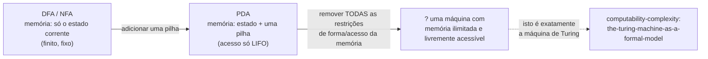

## Objetivos de Aprendizagem

- Reafirmar a limitação específica de memória de cada modelo de máquina coberto nesta disciplina (DFA/NFA, PDA), e conectar cada um à linguagem específica que ele comprovadamente não consegue reconhecer.
- Explicar precisamente por que uma única pilha, apesar de ilimitada, ainda não é "memória ilimitada" no sentido totalmente geral.
- Enunciar a pergunta natural seguinte que as limitações desta disciplina levantam, e explicar por que "uma máquina com memória genuinamente ilimitada e livremente acessível" é o próximo modelo certo a se perguntar.
- Descrever, em nível de primeiro contato, o que é a fita infinita de uma máquina de Turing e como ela remove a limitação compartilhada por todo modelo nesta disciplina.
- Explicar como a afirmação da tese de Church-Turing se relaciona com a pergunta de encerramento desta disciplina: o que "computável" significa uma vez que o teto de memória é totalmente removido.

## Contexto e Motivação

Esta disciplina inteira tem sido um estudo em exatamente um padrão recorrente: definir um modelo de máquina, descobrir a classe exata de linguagens que ele consegue reconhecer, e então provar, rigorosamente, por meio de um lema do bombeamento a cada vez, precisamente onde o poder daquele modelo se esgota. Um DFA ou NFA não tem memória além do seu estado corrente, um dentre um número fixo e finito determinado com antecedência; é exatamente por isso que {0ⁿ1ⁿ} o derrota, já que reconhecer aquela linguagem exige contar até um valor arbitrariamente alto, e um conjunto finito de estados não tem onde colocar uma contagem arbitrariamente grande. Um autômato de pilha corrige exatamente essa lacuna adicionando uma pilha (ilimitada em princípio, e exatamente na forma certa para estrutura aninhada, aninhando estrutura aninhada), o que é por isso que {0ⁿ1ⁿ} se torna trivial para um PDA. Mas uma única pilha ainda é um tipo de memória muito específico, muito restrito: acesso só Last-In-First-Out, uma contagem ilimitada de cada vez, sem forma de comparar independentemente duas contagens uma vez que uma delas já foi consumida ao desempilhar. É exatamente por isso que {0ⁿ1ⁿ2ⁿ} derrota um PDA da mesma forma que {0ⁿ1ⁿ} derrotou um DFA, e o lema do bombeamento para linguagens livres de contexto, coberto no conceito anterior, prova isso rigorosamente da mesma forma que seu predecessor fez um nível abaixo.

Então o padrão já se repetiu duas vezes, em dois níveis diferentes da hierarquia de Chomsky, com a forma idêntica nas duas vezes: um tipo fixo de memória, e uma linguagem logo além do que aquele tipo específico de memória consegue administrar. Isso não é uma coincidência a ser anotada e deixada de lado: é a observação mais importante que esta disciplina tem a oferecer em sua saída, porque ela levanta uma próxima pergunta inevitável: todo modelo coberto aqui teve memória moldada de alguma forma *específica e restrita* (nenhuma memória, ou exatamente uma pilha), então o que acontece com uma máquina cuja memória não é restrita a nenhuma forma particular, mas está simplesmente, livremente, disponível de modo ilimitado? É precisamente aí que esta disciplina termina e onde a disciplina irmã sobre computabilidade e complexidade assume, com um modelo de máquina construído para responder exatamente essa pergunta.

## Teoria Central

### A limitação compartilhada, reafirmada com precisão

Todo autômato coberto nesta disciplina reconhece linguagens usando memória de uma forma específica e limitada:

- **DFA/NFA:** a memória é exatamente "em qual dos estados de Q estou agora", um único valor tirado de um conjunto fixo e finito, decidido antes de qualquer entrada ser lida. Não há como armazenar uma contagem ilimitada, uma pilha ilimitada, ou qualquer estrutura que cresça com a entrada. É por isso que {0ⁿ1ⁿ : n ≥ 0} não é regular: reconhecê-la exige distinguir arbitrariamente muitas contagens diferentes de 0's vistos até agora, e um conjunto finito de estados fica sem estados distintos para atribuir a contagens distintas assim que a contagem excede o número de estados, exatamente o argumento da casa dos pombos no coração do lema do bombeamento regular.
- **PDA:** a memória é estado (ainda finito) *mais* uma única pilha, ilimitada em tamanho mas restrita a acesso Last-In-First-Out (empilhar e desempilhar só o topo, sem ler ou modificar nada enterrado mais fundo sem antes desempilhar tudo acima disso). Essa é exatamente a forma certa para rastrear *uma* contagem ilimitada e aninhada (por isso {0ⁿ1ⁿ} é fácil para um PDA), mas é a forma errada para rastrear *duas* contagens ilimitadas independentes que precisam ambas ser comparadas contra uma terceira: uma vez que a contagem de 0's foi consumida ao desempilhar contra a contagem de 1's, aquela informação se foi, sem forma de também verificá-la contra uma contagem de 2's separada. É por isso que {0ⁿ1ⁿ2ⁿ} não é livre de contexto, provado rigorosamente pelo lema do bombeamento livre de contexto no conceito imediatamente anterior.

### A próxima pergunta natural

Ambas as limitações remontam à mesma causa raiz: memória que ou está ausente (DFA/NFA) ou está presente mas moldada em um padrão de acesso específico e restritivo (a única pilha do PDA). A pergunta que isso levanta não é "podemos adicionar uma segunda pilha" (que, aliás, acaba sendo suficiente para alcançar computação geral completa: duas pilhas juntas conseguem simular uma fita, um fato que vale a pena saber que existe mesmo que não seja desenvolvido mais aqui), mas a mais fundamental: **o que acontece com uma máquina cuja memória não tem forma particular nenhuma, sem disciplina de pilha, sem restrição de acesso, apenas uma quantidade ilimitada de espaço que a máquina pode ler e escrever livremente, em qualquer posição, em qualquer ordem?**

### A resposta: uma fita infinita, livremente acessível

A máquina que remove essa limitação por completo é a **máquina de Turing**, o próximo conceito, na disciplina irmã para a qual esta faz a transição, desenvolvida formalmente lá. Em vez de uma pilha com acesso só LIFO, uma máquina de Turing tem uma fita infinita dividida em células, com uma cabeça de leitura/escrita que pode se mover uma célula para a esquerda ou direita por vez, lendo qualquer símbolo que esteja atualmente na posição da cabeça e opcionalmente sobrescrevendo-o, depois se movendo. Crucialmente, nada restringe *para onde* na fita a cabeça pode ir, ou em que ordem: diferente de uma pilha, onde só o topo é sempre alcançável, uma máquina de Turing pode mover sua cabeça de volta a qualquer célula visitada anteriormente, relê-la, sobrescrevê-la, passar por ela, e voltar de novo, quantas vezes forem necessárias. Isso é precisamente "memória sem forma particular nenhuma": sem disciplina de empilhar/desempilhar, sem padrão de acesso fixo, apenas um espaço ilimitado que a máquina pode usar da forma que a situação exigir, o que é exatamente suficiente, como a disciplina irmã desenvolve por completo, para resolver {0ⁿ1ⁿ2ⁿ} diretamente (fazer varreduras repetidas da esquerda para a direita, riscando um 0, um 1, e um 2 por varredura, até que ou os três blocos se esgotem igualmente ou uma incompatibilidade seja detectada, algo que o acesso unidirecional e só LIFO de uma única pilha nunca conseguiria realizar).

### Para onde isso faz a transição

O movimento de encerramento desta disciplina não é um novo teorema, mas uma ponte motivacional deliberada: tendo agora provado, duas vezes, que um tipo específico de memória restrita tem um teto exato e demonstrável, a resolução natural e completa é um modelo sem restrição alguma desse tipo. Esse modelo, a máquina de Turing, é exatamente onde o próprio conceito fundacional da disciplina irmã `computability-complexity`, *the-church-turing-thesis*, começa sua história: ele abre relembrando que antes de 1936, "algoritmo" não tinha significado matemático algum, e que a resolução proposta por Alan Turing foi "uma máquina idealizada com uma fita infinita, uma cabeça móvel, e uma tabela finita de regras", argumentando, ao analisar diretamente como um computador humano realiza um cálculo passo a passo, que essa máquina específica captura a noção intuitiva completa de "procedimento mecânico". O conceito logo após aquele naquela disciplina, *the-turing-machine-as-a-formal-model*, desenvolve a definição formal completa dessa máquina. E a própria tese de Church-Turing faz a afirmação abrangente para a qual toda a trajetória desta disciplina vem se construindo: que essa fita ilimitada e livremente acessível não é apenas *mais* poderosa que um DFA ou um PDA, ela é, até onde qualquer pessoa jamais conseguiu estabelecer ou mesmo seriamente contestar, tão poderosa quanto *qualquer* procedimento mecânico pode possivelmente ser, ponto final. Todo modelo alternativo de computação proposto independentemente desde então (cálculo lambda, funções recursivas gerais, máquinas de registrador, toda linguagem de programação real) foi comprovadamente equivalente a ela, nunca mais poderoso. O teto que esta disciplina encontrou duas vezes, em dois níveis diferentes, simplesmente não existe uma vez que a memória deixa de ter a forma de um estado ou de uma pilha.

## Exemplos Resolvidos

### Exemplo 1: localizando exatamente qual característica de memória cada prova de impossibilidade explora

**Problema:** Para cada uma de {0ⁿ1ⁿ} e {0ⁿ1ⁿ2ⁿ}, enuncie em uma frase exatamente qual limitação de memória o lema do bombeamento correspondente explora, e por que uma pilha extra corrige a primeira mas não a segunda.

**Raciocínio:** Para {0ⁿ1ⁿ}, o lema do bombeamento regular explora o fato de que um DFA/NFA tem apenas finitos estados para distinguir contagens diferentes de 0's vistos até agora: uma única pilha corrige isso completamente, já que empilhar um símbolo de pilha por 0 faz da própria altura da pilha um registro exato e ilimitado da contagem, sem colisão de casa dos pombos possível (é exatamente por isso que o PDA construído no conceito inicial de PDA desta disciplina trata {0ⁿ1ⁿ} corretamente). Para {0ⁿ1ⁿ2ⁿ}, o lema do bombeamento livre de contexto explora o fato de que depois que um PDA termina de comparar sua contagem de 0's codificada na pilha contra a contagem de 1's (necessariamente desempilhando conforme cada 1 é lido, no design natural), a pilha não guarda mais registro daquela contagem para também compará-la contra a contagem de 2's seguinte: uma pilha consegue sustentar uma comparação, não duas simultâneas e independentes, e nenhuma forma de usar a única pilha de outro jeito escapa disso, que é exatamente o que a prova de bombeamento caso a caso do conceito anterior estabelece rigorosamente, e não apenas informalmente.

### Exemplo 2: por que "só adicione uma segunda pilha" vale a pena nomear, sem ser desenvolvido aqui

**Problema:** Um estudante sugere: "Se uma pilha não é suficiente para {0ⁿ1ⁿ2ⁿ}, por que não simplesmente projetar uma máquina com duas pilhas, uma para a comparação 0-1 e uma para a comparação 1-2?" Avalie essa ideia e explique por que ela é mencionada aqui só de passagem.

**Raciocínio:** a ideia tem mérito real e, de fato, uma máquina com duas pilhas independentes acaba sendo exatamente tão poderosa quanto uma máquina de Turing completa: duas pilhas conseguem simular uma fita inteira (informalmente: a fita à esquerda da cabeça vive em uma pilha, a fita à direita vive na outra, e mover a cabeça para a esquerda ou direita é desempilhar de uma pilha e empilhar na outra). Esse é um fato genuinamente importante na teoria da computação, mas é intencionalmente não desenvolvido mais nesta disciplina, cujo escopo para exatamente em uma pilha (o modelo PDA) e seus limites demonstráveis: a observação das duas pilhas é exatamente o tipo de ponteiro para frente que pertence ao conceito de encerramento de uma disciplina, nomeando com precisão a pergunta certa seguinte, sem tentar respondê-la aqui, já que respondê-la propriamente exige a maquinaria formal (a máquina de Turing, e as provas de equivalência ao redor dela) que a próxima disciplina existe especificamente para construir.

### Exemplo 3: reafirmando a alegação de encerramento no vocabulário de toda a disciplina

**Problema:** Em um parágrafo, usando apenas vocabulário já estabelecido ao longo desta disciplina (estados, pilhas, lemas do bombeamento, PDAs, CFGs), enuncie precisamente o que "remover a limitação por completo" significa para a máquina para a qual esta disciplina faz a transição.

**Raciocínio:** toda máquina nesta disciplina emparelhou uma forma fixa de memória com um lema do bombeamento correspondente provando um teto exato sobre o poder daquela forma: a memória só-de-estado-finito de um DFA/NFA limitada às linguagens regulares, provado pelo lema do bombeamento regular; a memória estado-mais-uma-pilha-LIFO de um PDA limitada às linguagens livres de contexto, provado pelo lema do bombeamento livre de contexto recém-coberto. "Remover a limitação por completo" significa passar para uma máquina cuja memória não é nem finita nem moldada em nenhuma disciplina de acesso particular: uma fita ilimitada, livremente legível e gravável em qualquer posição, em qualquer ordem, quantas vezes forem necessárias, uma máquina para a qual nenhum lema do bombeamento análogo desse tipo existe, porque não sobra nenhum gargalo estrutural fixo para tal argumento explorar; isso é exatamente a afirmação, desenvolvida formalmente nos conceitos de máquina de Turing e tese de Church-Turing da disciplina irmã, de que o poder de tal máquina não é apenas "mais do que um PDA", mas, até onde qualquer pessoa jamais estabeleceu, a extensão completa e final do que "computável" pode significar.

## Equívocos Comuns e Armadilhas

- **"Uma máquina de Turing é só um PDA com uma pilha maior."** A fita de uma máquina de Turing não tem forma de pilha alguma: a restrição definidora de uma pilha (só o topo é sempre acessível) é exatamente o que a fita de uma máquina de Turing abandona por completo; a cabeça pode se mover para qualquer célula escrita anteriormente e ler ou sobrescrevê-la diretamente, o que é um padrão de acesso fundamentalmente diferente e estritamente mais permissivo, não meramente uma versão maior do mesmo.
- **"Já que {0ⁿ1ⁿ2ⁿ} precisa de duas comparações e um PDA tem uma pilha, duas pilhas devem ser necessárias para qualquer coisa além de livre de contexto."** Duas pilhas já acontecem de ser suficientes para alcançar o poder completo de uma máquina de Turing (como o Exemplo 2 observa), então "duas pilhas" não é um meio-passo modesto entre PDA e máquina de Turing: já é o salto completo. Não existe um nível de hierarquia significativo e estritamente intermediário de "duas-pilhas-e-meia" entre linguagens livres de contexto e computabilidade completa.
- **"Os lemas do bombeamento desta disciplina significam que sempre existe algum teto fixo para qualquer modelo, não importa quanta memória ele tenha."** O ponto inteiro deste capítulo de encerramento é que esse padrão para no momento em que a memória deixa de ter a forma de uma estrutura de acesso específica e restrita: uma fita ilimitada e livremente acessível não tem um teto análogo ao estilo lema do bombeamento, que é precisamente por que a tese de Church-Turing é enunciada como uma afirmação sobre o limite externo da própria computabilidade, não como mais uma entrada em uma hierarquia com tetos adicionais ainda por serem encontrados acima dela.
- **"A próxima disciplina é leitura de fundo não relacionada, não uma continuação desta."** A transição é direta e específica: o primeiríssimo conceito da disciplina irmã, the-church-turing-thesis, abre explicando exatamente por que "algoritmo" não tinha significado formal antes de 1936 e exatamente como a máquina de fita infinita de Turing resolveu isso, que é precisamente a resolução para a pergunta em aberto que o próprio argumento de encerramento desta disciplina levanta sobre memória sem forma fixa.

## Resumo

Toda máquina nesta disciplina emparelhou uma forma específica e restrita de memória com um teto demonstrável sobre seu poder: um DFA/NFA não tem memória além do seu estado corrente, limitando-o às linguagens regulares ({0ⁿ1ⁿ} fica logo além desse teto, provado pelo lema do bombeamento regular); um PDA adiciona exatamente uma pilha, só LIFO, limitando-o às linguagens livres de contexto ({0ⁿ1ⁿ2ⁿ} fica logo além desse teto, provado pelo lema do bombeamento livre de contexto). Ambos os tetos remontam à mesma causa raiz (memória moldada em um padrão de acesso específico e restritivo, em vez de livremente disponível), o que levanta a pergunta natural de encerramento desta disciplina: o que acontece com uma máquina cuja memória não tem forma alguma desse tipo? Essa máquina é a máquina de Turing, com sua fita infinita e livremente acessível, desenvolvida formalmente como o conceito inicial da disciplina irmã `computability-complexity` (`the-church-turing-thesis`), cuja própria afirmação (de que esse modelo baseado em fita captura a extensão completa e final do que "computável" pode significar, evidenciado por todo modelo alternativo proposto independentemente convergindo para exatamente o mesmo poder) é a resolução direta e específica para a pergunta em aberto que esta disciplina deixa para trás.

## Documentation Links

- [MIT 18.404J: OCW Calendar](https://ocw.mit.edu/courses/18-404j-theory-of-computation-fall-2020/pages/calendar/): doc
- [Sipser: Introduction to the Theory of Computation, 3ª ed.](https://cs.brown.edu/courses/csci1810/fall-2023/resources/ch2_readings/Sipser_Introduction.to.the.Theory.of.Computation.3E.pdf): doc
