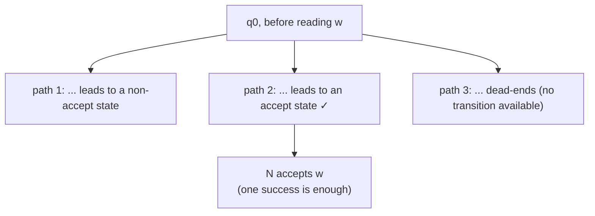
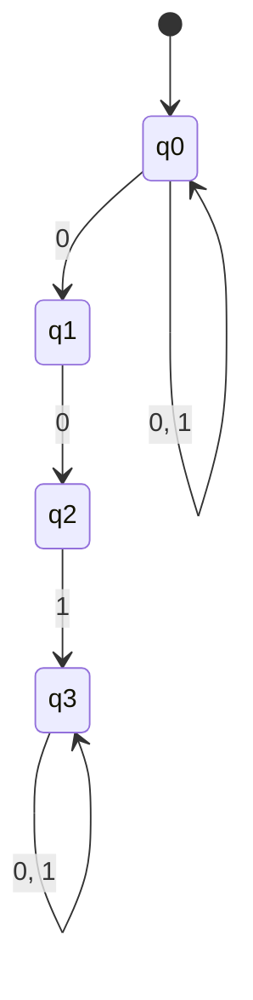
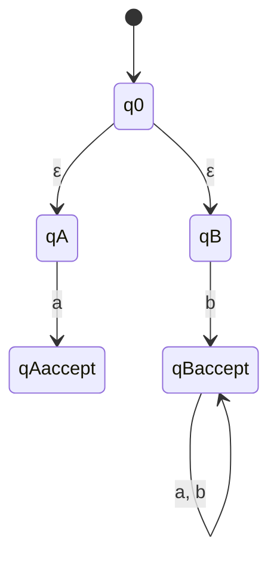

## Learning Objectives

- State the formal 5-tuple definition of a nondeterministic finite automaton (NFA), and explain precisely how it differs from a DFA's transition function.
- Explain what an ε-transition is and how it lets an NFA change state without consuming any input symbol.
- State the acceptance condition for an NFA in terms of the existence of some accepting path, and contrast it with a DFA's single deterministic path.
- Design an NFA for a language that is noticeably easier to express with nondeterministic choice than with a single deterministic path.
- Explain why nondeterminism, despite looking like extra power, is a design convenience rather than an increase in what languages can be recognized.

## Context & Motivation

A DFA, at every step of processing a string, has exactly one possible next move — that is the entire content of "deterministic." A **nondeterministic finite automaton** relaxes this in two specific ways: from a given state, reading a given symbol, the machine may have *several* possible next states available (or none at all), and it may additionally be allowed to move to a new state without reading any input symbol whatsoever, via what's called an ε-transition. An NFA accepts a string if *some* sequence of choices — some way of resolving all that nondeterminism — leads to an accept state after all input is consumed; it is enough for one path through the branching possibilities to work out, even if many others don't.

This relaxation might sound at first like it should make NFAs strictly more powerful than DFAs, since they're allowed to do things (branch, skip symbols) a DFA fundamentally cannot. The genuinely surprising fact — proved rigorously in the very next concept, via the subset construction — is that this is not the case: NFAs recognize exactly the same class of languages DFAs do, the regular languages, no more and no less. Given that equivalence, why bother with NFAs at all? Because, as both MIT's 18.404J and Stanford's CS154 emphasize when introducing them, NFAs are frequently dramatically *easier to design* for a given language, even though they add no extra recognizing power — nondeterminism is best understood as a convenience for the machine's *designer*, letting them express "try this, or try that, and succeed if either one works" directly, rather than a genuine expansion of what's computable with finite memory.

This concept is also the direct bridge to the constructive half of Kleene's theorem (regular expressions correspond exactly to finite automata): the standard way of building an automaton for a regular expression's union or concatenation is to build small NFAs for the pieces and wire them together with exactly the branching and ε-transition machinery introduced here. Understanding NFAs precisely is therefore not a detour before getting to the "real" equivalence result — it is a prerequisite for stating that result at all.

## Core Theory

### The formal 5-tuple definition, and how it differs from a DFA's

An **NFA** is formally a 5-tuple N = (Q, Σ, δ, q₀, F), with the same roles as a DFA for Q (states), Σ (alphabet), q₀ (start state), and F (accept states) — but a different shape for the transition function:

δ: Q × Σ_ε → P(Q)

where Σ_ε = Σ ∪ {ε} (the alphabet, plus the special symbol ε representing "no input consumed"), and P(Q) is the **power set** of Q — the set of all subsets of Q. This is the essential structural difference from a DFA: instead of mapping a (state, symbol) pair to exactly one next state, δ maps it to a *set* of possible next states, which can contain zero elements (no valid move for that symbol from that state — an implicit dead end along that particular choice), one element (behaving just like a DFA transition at that point), or several elements (a genuine branch point, where the machine can nondeterministically go to any of several states).

### ε-transitions: moving without consuming input

Because Σ_ε includes ε alongside the real alphabet symbols, δ(q, ε) is also defined and gives a set of states the machine may move to *without reading any symbol of the input at all*. An ε-transition is a "free" move — it changes the machine's state but leaves the remaining unread portion of the input string completely untouched. This is commonly used to let an NFA optionally "decide," at no cost, to jump into a different part of the machine before continuing to read — for instance, to nondeterministically commit to one of several alternative sub-patterns (mirroring exactly a regular expression's union operator) before consuming the first symbol of whichever alternative it picked.

### Acceptance: SOME path must succeed

Because at any point there can be multiple applicable transitions (or an ε-move available alongside a symbol-consuming one), processing a string does not produce one single, fully determined sequence of states the way it does for a DFA — it produces a *branching tree* of possible computations, one branch for every choice available at every step. The NFA **accepts** an input string w if *at least one* path through this tree — one particular sequence of choices, consuming exactly the symbols of w in order (with any number of ε-moves interleaved) — ends in a state belonging to F after all of w's symbols have been consumed. It does not matter how many other paths exist that fail to reach an accept state, or that dead-end early with no further transition available; a single successful path is sufficient for acceptance.

### Why nondeterminism doesn't add real power (preview)

It is worth stating plainly, ahead of the proof: every NFA can be simulated by some DFA, so nondeterminism never lets an NFA recognize a language that no DFA could recognize. The intuition — developed fully as the subset construction in the next concept — is that a DFA can simulate an NFA by tracking, as its single state, the *entire set* of states the NFA could simultaneously be in, given the input read so far; since there are only finitely many subsets of a finite set Q, this gives a (potentially larger, but still finite) DFA. Nondeterminism therefore buys convenience of expression, at the cost of a potential blow-up in the *number* of states needed to simulate it deterministically — but never buys a language that couldn't be recognized deterministically in principle.

### Worked design walkthrough: strings containing "001" as a substring

Consider L = { w ∈ {0,1}* : w contains 001 as a substring somewhere }. Designing a DFA directly for this requires tracking, at every point, "how much of a `001` match could be currently in progress, accounting for overlaps" — a several-case analysis (e.g., what happens after "00" if the next symbol is `0` again, versus `1`). An NFA sidesteps this cleverly: it can simply *guess*, nondeterministically, when the "001" substring is about to start, and only commit to matching it at that guessed point — if the guess is wrong, that particular path just fails, but as long as *some* guess (namely, the correct one, at the actual position where "001" occurs) succeeds, the string is accepted.

Formally: N = (Q, Σ, δ, q₀, F) with Q = {q₀, q₁, q₂, q₃}, Σ = {0, 1}, F = {q₃}, and:
- δ(q₀, 0) = {q₀, q₁} — at every point, nondeterministically either stay in the "still scanning, haven't committed" state, *or* guess that this `0` is the first symbol of "001" and move to q₁.
- δ(q₀, 1) = {q₀} — a `1` while not committed doesn't start a "001" match; stay scanning.
- δ(q₁, 0) = {q₂} — having guessed the first `0`, a second `0` matches the next required symbol.
- δ(q₂, 1) = {q₃} — having matched "00", a `1` completes the "001" pattern.
- δ(q₃, 0) = {q₃}, δ(q₃, 1) = {q₃} — once "001" has occurred anywhere, the rest of the string is irrelevant; q₃ absorbs anything further and stays accepting.
- Every other (state, symbol) pair not listed maps to ∅ (no transition — that branch simply dies).

Notice q₀ has *two* outgoing arrows on symbol `0` — to itself and to q₁ — which is exactly the nondeterministic branching that makes this design so much simpler than the deterministic alternative: the NFA never has to decide in advance which `0` starts the eventual match; it tries every possibility in parallel (conceptually) and accepts if any one of them pans out.

## Worked Examples

### Example 1 — tracing an accepting path by hand

**Problem:** Using the "001"-substring NFA above, show that it accepts `1001` by exhibiting one successful path.

**Successful path.** Start at q₀. Read `1`: take the transition δ(q₀,1) = {q₀}, stay at q₀ (the leading 1 isn't part of any "001"). Read `0`: choose the branch δ(q₀,0) ∋ q₁ — guess that this is the first `0` of "001" — move to q₁. Read `0`: δ(q₁,0) = {q₂}, move to q₂. Read `1`: δ(q₂,1) = {q₃}, move to q₃. All of `1001` has been consumed, and the machine is in q₃ ∈ F. This one path succeeds, so the NFA **accepts** `1001` — regardless of the fact that the *other* available branch at the first `0` (staying at q₀ instead of guessing q₁) would have led to a dead end (q₀ reading the second `0` could again choose q₀ or q₁; from q₀ after both 0s, reading the final `1` just stays at q₀, not an accept state) — only one success is needed.

### Example 2 — a string with no accepting path

**Problem:** Show that the same NFA rejects `0101`.

**Reasoning.** Every possible path must be checked (informally) to confirm none reaches q₃. Read `0`: could go to q₀ or q₁. Branch A (stay q₀): read `1`, δ(q₀,1)={q₀}, still q₀; read `0`, could branch to q₀ or q₁; read `1` at the end — from q₀ this gives q₀ (not accepting), and from q₁ there is no transition defined on `1` (δ(q₁,1) = ∅, since q₁ only has a defined move on `0`) — that branch dies with input remaining unconsumed on that path, which is also not an accepting outcome. Branch B (guess q₁ at the first 0): read `1` next, but δ(q₁,1) = ∅ — no transition — this path dies immediately. Systematically, no path through `0101` ever reaches q₃, because `0101` genuinely does not contain "001" as a substring (the only zeros are at positions 1 and 3, not adjacent). The NFA correctly **rejects** `0101` — every branch either lands somewhere other than q₃ or dies with no available transition, and neither counts as acceptance.

### Example 3 — designing an NFA with an ε-transition for a union-shaped language

**Problem:** Design an NFA for L = { w ∈ {a,b}* : w = "a" or w starts with "b" }, i.e., L(N) = {"a"} ∪ { w : w begins with "b" }, using an ε-transition to express the choice between the two alternatives directly.

**Design.** Use a start state q₀ with two ε-transitions, one into a small machine that matches exactly "a", and one into a small machine that accepts anything starting with "b". Q = {q₀, qA, qA-accept, qB, qB-accept}, Σ = {a, b}, F = {qA-accept, qB-accept}, with:
- δ(q₀, ε) = {qA, qB} — nondeterministically commit, with no input consumed, to either the "exactly a" branch or the "starts with b" branch.
- δ(qA, a) = {qA-accept} — the "exactly a" branch matches a single `a` and stops.
- δ(qB, b) = {qB-accept} — the "starts with b" branch matches a leading `b`...
- δ(qB-accept, a) = {qB-accept}, δ(qB-accept, b) = {qB-accept} — ...then accepts anything at all afterward, since only the *first* symbol being `b` matters.

Tracing `"a"`: q₀ →(ε) qA →(a) qA-accept ∈ F — accepted via the left branch. Tracing `"baa"`: q₀ →(ε) qB →(b) qB-accept →(a) qB-accept →(a) qB-accept ∈ F — accepted via the right branch. Tracing `"b"` alone also works (q₀→qB→qB-accept, done). Tracing `"aa"`: the qA branch matches only a single `a` and has no transition for a second `a` (δ(qA-accept, a) is undefined, i.e. ∅), so that branch dies; the qB branch requires starting with `b`, which `"aa"` does not, so it never even applies; no path succeeds, and `"aa"` is correctly rejected, since it is neither exactly "a" nor does it start with "b".

## Common Misconceptions & Pitfalls

- **"An NFA is nondeterministic in the sense of being random or unpredictable."** Nondeterminism here is not randomness — it means the machine's definition permits multiple simultaneous possible computations from the same configuration, and acceptance asks whether *any* of them succeeds, a purely mathematical existential condition, not a probabilistic or unpredictable one. There is nothing random about which paths exist; the NFA's transition function is a fixed, fully specified object.
- **"If some path through an NFA fails or dies with input left over, the whole string is rejected."** Acceptance only requires *one* successful path; every other path — including ones that dead-end early, run out of applicable transitions, or finish in a non-accepting state — is simply irrelevant to the outcome, as Example 1 shows explicitly (the "wrong guess" branch failing does not stop the "right guess" branch from succeeding).
- **"An ε-transition consumes the empty string as if it were a real input symbol."** An ε-transition consumes *nothing at all* — the position in the input string does not advance. This is different from consuming an actual symbol that happens to be defined as "empty" (there is no such symbol in Σ); ε is a special marker outside the alphabet, reserved exactly for this "move without reading" behavior.
- **"NFAs can recognize languages DFAs cannot, since they're strictly more expressive as machines."** As stated in Core Theory and proved fully in the next concept, NFAs and DFAs recognize exactly the same class of languages (the regular languages) — the "more expressive" feeling comes only from ease of *design*, not from any actual gain in recognizing power. Every NFA has an equivalent DFA, always, even though that DFA may need many more states.
- **"Undefined transitions in an NFA are an error in the design, the way an incomplete DFA would be."** For a DFA, δ must be total (every state needs a transition for every symbol) — but for an NFA, δ(q, a) is allowed to be the empty set ∅, meaning simply "no move available here along this branch," which is a normal, well-formed part of NFA design (as seen with q₁'s missing transition on `1` in the "001" example), not an omission to be fixed.

## Summary

An NFA is a 5-tuple like a DFA's, but with a transition function δ: Q × Σ_ε → P(Q) that may map a state and symbol (or ε, meaning no symbol consumed) to a *set* of possible next states rather than exactly one. Processing a string produces a branching tree of possible computations rather than one fixed sequence, and the NFA accepts exactly when *some* path through that tree consumes the entire string and ends in an accept state — every other path, however it turns out, is irrelevant to the verdict. NFAs are frequently far easier to design than an equivalent DFA for the same language, because they let a designer express "guess, and only commit once the guess is confirmed" or "choose freely between alternatives" directly, using branching and ε-transitions, instead of pre-computing all the bookkeeping a single deterministic path would require. Despite this design convenience, NFAs add no real recognizing power over DFAs — every NFA has an equivalent DFA — a fact this concept states and motivates, and the next concept, the subset construction, proves constructively in full.

## Documentation Links

- [MIT 18.404J — OCW Calendar](https://ocw.mit.edu/courses/18-404j-theory-of-computation-fall-2020/pages/calendar/) — doc
- [Sipser — Introduction to the Theory of Computation, 3rd ed.](https://cs.brown.edu/courses/csci1810/fall-2023/resources/ch2_readings/Sipser_Introduction.to.the.Theory.of.Computation.3E.pdf) — doc
