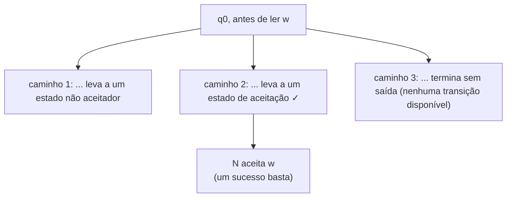
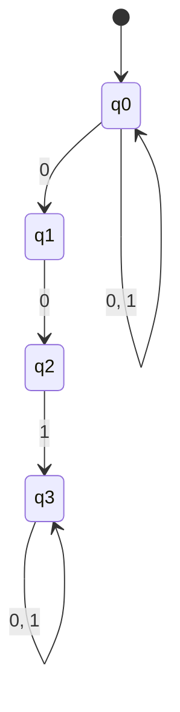
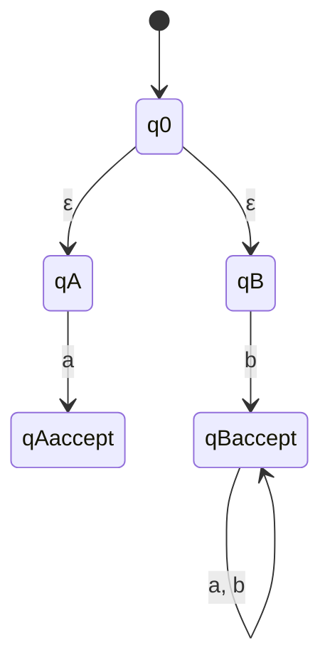

## Objetivos de Aprendizagem

- Enunciar a definição formal de 5-tupla de um autômato finito não-determinístico (NFA), e explicar precisamente como ela difere da função de transição de um DFA.
- Explicar o que é uma transição-ε e como ela permite que um NFA mude de estado sem consumir nenhum símbolo de entrada.
- Enunciar a condição de aceitação de um NFA em termos da existência de algum caminho de aceitação, e contrastá-la com o único caminho determinístico de um DFA.
- Desenhar um NFA para uma linguagem que é perceptivelmente mais fácil de expressar com escolha não-determinística do que com um único caminho determinístico.
- Explicar por que o não-determinismo, apesar de parecer poder extra, é uma conveniência de design em vez de um aumento no que pode ser reconhecido.

## Contexto e Motivação

Um DFA, a cada passo de processamento de uma string, tem exatamente um próximo movimento possível, esse é o conteúdo inteiro de "determinístico." Um **autômato finito não-determinístico** relaxa isso de duas formas específicas: a partir de um dado estado, lendo um dado símbolo, a máquina pode ter *vários* próximos estados possíveis disponíveis (ou nenhum), e pode adicionalmente ter permissão de mover para um novo estado sem ler símbolo algum de entrada, através do que se chama uma transição-ε. Um NFA aceita uma string se *alguma* sequência de escolhas, alguma forma de resolver todo esse não-determinismo, leva a um estado de aceitação depois que toda a entrada é consumida; basta que um caminho entre as possibilidades ramificadas funcione, mesmo que muitos outros não funcionem.

Esse relaxamento pode parecer, à primeira vista, que deveria tornar AFNs estritamente mais poderosos que AFDs, já que eles têm permissão de fazer coisas (ramificar, pular símbolos) que um DFA fundamentalmente não pode. O fato genuinamente surpreendente, provado rigorosamente no próximo conceito, via a construção de subconjuntos, é que não é o caso: AFNs reconhecem exatamente a mesma classe de linguagens que AFDs reconhecem, as linguagens regulares, nem mais nem menos. Dada essa equivalência, por que se preocupar com AFNs? Porque, como tanto o 18.404J do MIT quanto o CS154 de Stanford enfatizam ao introduzi-los, AFNs são frequentemente dramaticamente *mais fáceis de desenhar* para uma dada linguagem, mesmo não acrescentando poder de reconhecimento extra, o não-determinismo é mais bem entendido como uma conveniência para quem *desenha* a máquina, permitindo expressar "tente isto, ou tente aquilo, e tenha sucesso se qualquer um funcionar" diretamente, em vez de ser uma expansão genuína do que é computável com memória finita.

Este conceito também é a ponte direta para a metade construtiva do teorema de Kleene (expressões regulares correspondem exatamente a autômatos finitos): a forma padrão de construir um autômato para a união ou concatenação de uma expressão regular é construir pequenos AFNs para as partes e ligá-los usando exatamente a maquinaria de ramificação e transição-ε introduzida aqui. Entender AFNs com precisão, portanto, não é um desvio antes de chegar ao "verdadeiro" resultado de equivalência, é um pré-requisito para sequer enunciar esse resultado.

## Teoria Central

### A definição formal de 5-tupla, e como ela difere da de um DFA

Um **NFA** é formalmente uma 5-tupla N = (Q, Σ, δ, q₀, F), com os mesmos papéis de um DFA para Q (estados), Σ (alfabeto), q₀ (estado inicial), e F (estados de aceitação), mas uma forma diferente para a função de transição:

δ: Q × Σ_ε → P(Q)

onde Σ_ε = Σ ∪ {ε} (o alfabeto, mais o símbolo especial ε representando "nenhuma entrada consumida"), e P(Q) é o **conjunto das partes** de Q, o conjunto de todos os subconjuntos de Q. Essa é a diferença estrutural essencial em relação a um DFA: em vez de mapear um par (estado, símbolo) para exatamente um próximo estado, δ o mapeia para um *conjunto* de próximos estados possíveis, que pode conter zero elementos (nenhum movimento válido para aquele símbolo a partir daquele estado, um beco sem saída implícito ao longo daquela escolha em particular), um elemento (comportando-se exatamente como uma transição de DFA naquele ponto), ou vários elementos (um ponto de ramificação genuíno, onde a máquina pode ir não-deterministicamente para qualquer um de vários estados).

### Transições-ε: mover sem consumir entrada

Como Σ_ε inclui ε ao lado dos símbolos reais do alfabeto, δ(q, ε) também é definida e dá um conjunto de estados para os quais a máquina pode se mover *sem ler símbolo algum da entrada*. Uma transição-ε é um movimento "grátis", ela muda o estado da máquina mas deixa a porção não lida restante da string de entrada completamente intocada. Isso é comumente usado para permitir que um NFA opcionalmente "decida", sem custo, saltar para uma parte diferente da máquina antes de continuar a ler, por exemplo, para se comprometer não-deterministicamente com um de vários sub-padrões alternativos (espelhando exatamente o operador de união de uma expressão regular) antes de consumir o primeiro símbolo de qualquer alternativa que tenha escolhido.

### Aceitação: ALGUM caminho deve ter sucesso

Como em qualquer ponto pode haver várias transições aplicáveis (ou um movimento-ε disponível ao lado de um que consome símbolo), processar uma string não produz uma única sequência de estados totalmente determinada da forma que acontece para um DFA, produz uma *árvore ramificada* de computações possíveis, um ramo para cada escolha disponível a cada passo. O NFA **aceita** uma string de entrada w se *pelo menos um* caminho por essa árvore, uma sequência particular de escolhas, consumindo exatamente os símbolos de w em ordem (com qualquer número de movimentos-ε intercalados), termina em um estado pertencente a F depois que todos os símbolos de w foram consumidos. Não importa quantos outros caminhos existam que falham em alcançar um estado de aceitação, ou que terminam cedo sem transição adicional disponível; um único caminho bem-sucedido é suficiente para aceitação.

### Por que o não-determinismo não acrescenta poder real (prévia)

Vale a pena afirmar isso claramente, antes da prova: todo NFA pode ser simulado por algum DFA, então o não-determinismo nunca permite que um NFA reconheça uma linguagem que nenhum DFA conseguiria reconhecer. A intuição, desenvolvida por completo como a construção de subconjuntos no próximo conceito, é que um DFA pode simular um NFA rastreando, como seu único estado, o *conjunto inteiro* de estados em que o NFA poderia estar simultaneamente, dada a entrada lida até então; já que existem apenas finitos subconjuntos de um conjunto finito Q, isso dá um DFA (potencialmente maior, mas ainda finito). O não-determinismo, portanto, compra conveniência de expressão, ao custo de uma potencial explosão no *número* de estados necessários para simulá-lo deterministicamente, mas nunca compra uma linguagem que não pudesse ser reconhecida deterministicamente em princípio.

### Passo a passo de design resolvido: strings contendo "001" como substring

Considere L = { w ∈ {0,1}* : w contém 001 como substring em algum lugar }. Desenhar um DFA diretamente para isso exige rastrear, em todo ponto, "quanto de uma correspondência de `001` poderia estar atualmente em progresso, considerando sobreposições", uma análise de vários casos (por exemplo, o que acontece depois de "00" se o próximo símbolo é `0` de novo, versus `1`). Um NFA contorna isso de forma engenhosa: ele pode simplesmente *adivinhar*, não-deterministicamente, quando a substring "001" está prestes a começar, e só se comprometer a casá-la naquele ponto adivinhado; se o palpite estiver errado, aquele caminho específico simplesmente falha, mas contanto que *algum* palpite (a saber, o correto, na posição real onde "001" ocorre) tenha sucesso, a string é aceita.

Formalmente: N = (Q, Σ, δ, q₀, F) com Q = {q₀, q₁, q₂, q₃}, Σ = {0, 1}, F = {q₃}, e:
- δ(q₀, 0) = {q₀, q₁}, em todo ponto, não-deterministicamente ou permaneça no estado "ainda varrendo, sem se comprometer", *ou* adivinhe que esse `0` é o primeiro símbolo de "001" e mova para q₁.
- δ(q₀, 1) = {q₀}, um `1` sem compromisso não inicia uma correspondência de "001"; permaneça varrendo.
- δ(q₁, 0) = {q₂}, tendo adivinhado o primeiro `0`, um segundo `0` casa com o próximo símbolo exigido.
- δ(q₂, 1) = {q₃}, tendo casado "00", um `1` completa o padrão "001".
- δ(q₃, 0) = {q₃}, δ(q₃, 1) = {q₃}, uma vez que "001" tenha ocorrido em algum lugar, o resto da string é irrelevante; q₃ absorve qualquer coisa adicional e permanece aceitando.
- Todo outro par (estado, símbolo) não listado mapeia para ∅ (nenhuma transição, aquele ramo simplesmente morre).

Note que q₀ tem *duas* setas de saída no símbolo `0`, para si mesmo e para q₁, que é exatamente a ramificação não-determinística que torna esse design muito mais simples do que a alternativa determinística: o NFA nunca precisa decidir de antemão qual `0` inicia a eventual correspondência; ele tenta toda possibilidade em paralelo (conceitualmente) e aceita se alguma delas der certo.

## Exemplos Resolvidos

### Exemplo 1: rastreando um caminho de aceitação manualmente

**Problema:** Usando o NFA de substring "001" acima, mostre que ele aceita `1001` exibindo um caminho bem-sucedido.

**Caminho bem-sucedido.** Comece em q₀. Leia `1`: tome a transição δ(q₀,1) = {q₀}, permaneça em q₀ (o 1 inicial não faz parte de nenhum "001"). Leia `0`: escolha o ramo δ(q₀,0) ∋ q₁, adivinhe que esse é o primeiro `0` de "001", mova para q₁. Leia `0`: δ(q₁,0) = {q₂}, mova para q₂. Leia `1`: δ(q₂,1) = {q₃}, mova para q₃. Todo `1001` foi consumido, e a máquina está em q₃ ∈ F. Esse único caminho tem sucesso, então o NFA **aceita** `1001`, independentemente do fato de que o *outro* ramo disponível no primeiro `0` (permanecer em q₀ em vez de adivinhar q₁) teria levado a um beco sem saída (q₀ lendo o segundo `0` poderia de novo escolher q₀ ou q₁; a partir de q₀ depois de ambos os 0s, ler o `1` final apenas permanece em q₀, não um estado de aceitação), apenas um sucesso é necessário.

### Exemplo 2: uma string sem caminho de aceitação

**Problema:** Mostre que o mesmo NFA rejeita `0101`.

**Raciocínio.** Todo caminho possível deve ser verificado (informalmente) para confirmar que nenhum alcança q₃. Leia `0`: pode ir para q₀ ou q₁. Ramo A (permanece q₀): leia `1`, δ(q₀,1)={q₀}, ainda q₀; leia `0`, pode ramificar para q₀ ou q₁; leia `1` no final, a partir de q₀ isso dá q₀ (não aceitador), e a partir de q₁ não há transição definida em `1` (δ(q₁,1) = ∅, já que q₁ só tem um movimento definido em `0`), esse ramo morre com entrada restante não consumida naquele caminho, o que também não é um resultado de aceitação. Ramo B (adivinha q₁ no primeiro 0): leia `1` em seguida, mas δ(q₁,1) = ∅, nenhuma transição, esse caminho morre imediatamente. Sistematicamente, nenhum caminho por `0101` jamais alcança q₃, porque `0101` genuinamente não contém "001" como substring (os únicos zeros estão nas posições 1 e 3, não adjacentes). O NFA corretamente **rejeita** `0101`, todo ramo ou termina em algum lugar diferente de q₃ ou morre sem transição disponível, e nenhum dos dois conta como aceitação.

### Exemplo 3: desenhando um NFA com uma transição-ε para uma linguagem em forma de união

**Problema:** Desenhe um NFA para L = { w ∈ {a,b}* : w = "a" ou w começa com "b" }, ou seja, L(N) = {"a"} ∪ { w : w começa com "b" }, usando uma transição-ε para expressar a escolha entre as duas alternativas diretamente.

**Design.** Use um estado inicial q₀ com duas transições-ε, uma para uma pequena máquina que casa exatamente "a", e uma para uma pequena máquina que aceita qualquer coisa que comece com "b". Q = {q₀, qA, qA-accept, qB, qB-accept}, Σ = {a, b}, F = {qA-accept, qB-accept}, com:
- δ(q₀, ε) = {qA, qB}, comprometa-se não-deterministicamente, sem consumir entrada, com o ramo "exatamente a" ou com o ramo "começa com b".
- δ(qA, a) = {qA-accept}, o ramo "exatamente a" casa um único `a` e para.
- δ(qB, b) = {qB-accept}, o ramo "começa com b" casa um `b` inicial...
- δ(qB-accept, a) = {qB-accept}, δ(qB-accept, b) = {qB-accept}, ...e então aceita qualquer coisa depois disso, já que só o *primeiro* símbolo ser `b` importa.

Rastreando `"a"`: q₀ →(ε) qA →(a) qA-accept ∈ F, aceito via o ramo esquerdo. Rastreando `"baa"`: q₀ →(ε) qB →(b) qB-accept →(a) qB-accept →(a) qB-accept ∈ F, aceito via o ramo direito. Rastreando `"b"` sozinho também funciona (q₀→qB→qB-accept, pronto). Rastreando `"aa"`: o ramo qA casa apenas um único `a` e não tem transição para um segundo `a` (δ(qA-accept, a) é indefinida, ou seja, ∅), então esse ramo morre; o ramo qB exige começar com `b`, o que `"aa"` não faz, então nem sequer se aplica; nenhum caminho tem sucesso, e `"aa"` é corretamente rejeitada, já que não é nem exatamente "a" nem começa com "b".

## Equívocos Comuns e Armadilhas

- **"Um NFA é não-determinístico no sentido de ser aleatório ou imprevisível."** O não-determinismo aqui não é aleatoriedade, significa que a definição da máquina permite várias computações simultâneas possíveis a partir da mesma configuração, e a aceitação pergunta se *alguma* delas tem sucesso, uma condição puramente existencial e matemática, não probabilística ou imprevisível. Não há nada de aleatório sobre quais caminhos existem; a função de transição do NFA é um objeto fixo e totalmente especificado.
- **"Se algum caminho por um NFA falha ou morre com entrada restante, a string inteira é rejeitada."** A aceitação exige apenas *um* caminho bem-sucedido; todo outro caminho, incluindo os que terminam cedo, ficam sem transições aplicáveis, ou terminam em um estado não aceitador, é simplesmente irrelevante para o resultado, como o Exemplo 1 mostra explicitamente (o ramo do "palpite errado" falhar não impede o ramo do "palpite certo" de ter sucesso).
- **"Uma transição-ε consome a string vazia como se fosse um símbolo de entrada real."** Uma transição-ε não consome nada de forma alguma, a posição na string de entrada não avança. Isso é diferente de consumir um símbolo real que por acaso é definido como "vazio" (não existe tal símbolo em Σ); ε é um marcador especial fora do alfabeto, reservado exatamente para esse comportamento de "mover sem ler".
- **"AFNs podem reconhecer linguagens que AFDs não conseguem, já que são estritamente mais expressivos como máquinas."** Como afirmado na Teoria Central e provado por completo no próximo conceito, AFNs e AFDs reconhecem exatamente a mesma classe de linguagens (as linguagens regulares), a sensação de "mais expressivo" vem apenas da facilidade de *design*, não de qualquer ganho real em poder de reconhecimento. Todo NFA tem um DFA equivalente, sempre, mesmo que esse DFA possa precisar de muito mais estados.
- **"Transições indefinidas em um NFA são um erro de design, da mesma forma que um DFA incompleto seria."** Para um DFA, δ deve ser total (todo estado precisa de uma transição para todo símbolo), mas para um NFA, δ(q, a) pode ser o conjunto vazio ∅, significando simplesmente "nenhum movimento disponível aqui ao longo deste ramo", o que é uma parte normal e bem formada do design de NFA (como visto na transição ausente de q₁ em `1` no exemplo "001"), não uma omissão a ser corrigida.

## Resumo

Um NFA é uma 5-tupla como a de um DFA, mas com uma função de transição δ: Q × Σ_ε → P(Q) que pode mapear um estado e um símbolo (ou ε, significando nenhum símbolo consumido) para um *conjunto* de possíveis próximos estados em vez de exatamente um. Processar uma string produz uma árvore ramificada de computações possíveis em vez de uma sequência fixa única, e o NFA aceita exatamente quando *algum* caminho por essa árvore consome a string inteira e termina em um estado de aceitação, todo outro caminho, seja qual for seu resultado, é irrelevante para o veredito. AFNs são frequentemente muito mais fáceis de desenhar do que um DFA equivalente para a mesma linguagem, porque permitem que quem desenha expresse "adivinhe, e só se comprometa depois que o palpite for confirmado" ou "escolha livremente entre alternativas" diretamente, usando ramificação e transições-ε, em vez de pré-calcular toda a contabilidade que um único caminho determinístico exigiria. Apesar dessa conveniência de design, AFNs não acrescentam poder de reconhecimento real sobre AFDs, todo NFA tem um DFA equivalente, um fato que este conceito enuncia e motiva, e que o próximo conceito, a construção de subconjuntos, prova construtivamente por completo.

## Documentation Links

- [MIT 18.404J: OCW Calendar](https://ocw.mit.edu/courses/18-404j-theory-of-computation-fall-2020/pages/calendar/): doc
- [Sipser: Introduction to the Theory of Computation, 3rd ed.](https://cs.brown.edu/courses/csci1810/fall-2023/resources/ch2_readings/Sipser_Introduction.to.the.Theory.of.Computation.3E.pdf): doc
