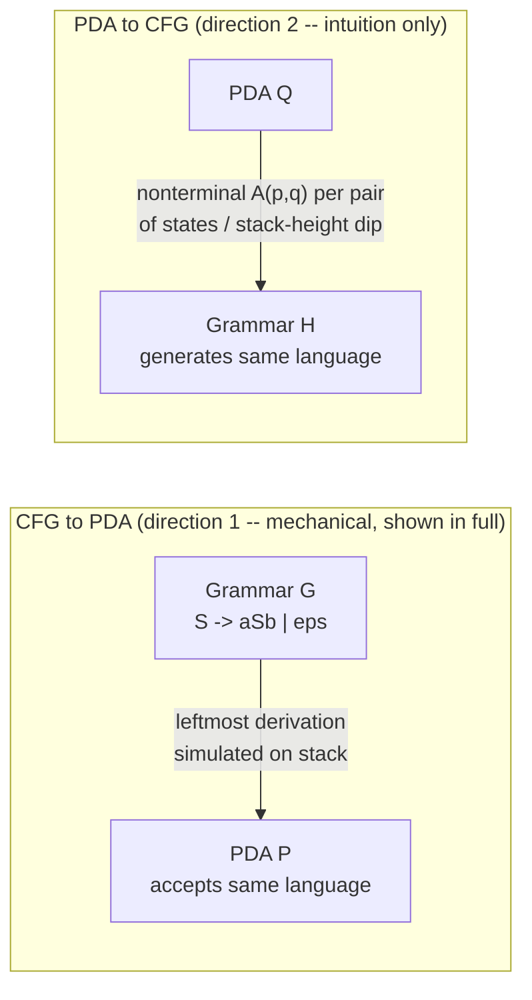

## Learning Objectives

- State the PDA-CFG equivalence theorem precisely, in both directions.
- Explain, with a concrete worked example, how a CFG's leftmost derivations can be simulated step by step by a PDA using its stack to hold the not-yet-expanded part of the sentential form.
- Explain, at the level of genuine intuition rather than a full construction, how a PDA's stack-based computation can in principle be converted into an equivalent CFG.
- Recognize why this equivalence mirrors, structurally, the earlier DFA-NFA-regex equivalence already covered, while being a materially harder theorem to prove exhaustively.
- Identify which of the two directions (CFG → PDA or PDA → CFG) is more mechanical to carry out by hand, and why.

## Context & Motivation

This discipline has already established one clean equivalence: every regular expression corresponds to some finite automaton, and every finite automaton corresponds to some regular expression — two utterly different-looking descriptions (one generative, built from pattern-matching operators; one procedural, a machine that consumes input symbol by symbol) that turn out to define exactly the same class of languages. Context-free grammars and pushdown automata sit in precisely the same relationship, one level up the Chomsky hierarchy: a CFG is a generative description (start with S, repeatedly rewrite nonterminals using production rules, and read off whatever terminal string results), while a PDA is a procedural description (start in q₀, consume input while pushing and popping a stack, and accept if the process ends correctly). The theorem this concept covers — a language is context-free if and only if some PDA recognizes it — is the direct context-free analogue of the regular-language equivalence, and it is exactly why the previous concept described the PDA's stack as "the natural extra memory" for context-free structure: this theorem is the formal statement making that intuition precise.

It is worth being honest about the depth at which this particular equivalence is typically taught, and at which it is treated here. The DFA-NFA equivalence has a genuinely clean, fully general, easy-to-execute-by-hand algorithm behind it (the subset construction, already covered). The PDA-CFG equivalence is real and just as true, but the general bidirectional construction — especially converting an arbitrary PDA into an equivalent CFG — is considerably more mechanical and notationally heavy to carry out in full generality, involving grammar variables indexed by pairs of PDA states and stack symbols. Rather than working through that full general construction symbol by symbol, the right level here is what a working understanding of the theorem actually requires: a real, concrete, fully worked example in the CFG → PDA direction (which genuinely is straightforward to execute by hand), and a real, honest account of the *idea* behind the PDA → CFG direction, without claiming to carry out the general algorithm exhaustively. Both directions are true theorems with published, complete proofs (see Sipser, cited below) — what follows builds the intuition that makes those proofs believable, not a substitute for reading them in full.

## Core Theory

### The theorem

> **Theorem.** A language L is context-free if and only if some pushdown automaton recognizes L.

This has two directions, proved separately:

1. **(⇒) If L is context-free, then some PDA recognizes L.** Given any CFG G generating L, a PDA can be built that simulates leftmost derivations in G, and this PDA accepts exactly the strings G generates.
2. **(⇐) If some PDA recognizes L, then L is context-free.** Given any PDA P recognizing L, a CFG can be built whose derivations correspond exactly to accepting computations of P, and this CFG generates exactly the strings P accepts.

### Direction 1, the idea: a PDA simulates a leftmost derivation

The key idea is that the PDA's stack holds exactly the part of the current sentential form that has not yet been expanded down to terminal symbols — the "pending" suffix of a leftmost derivation. The construction, in outline: push the start symbol S onto the stack; then repeat — if the top of the stack is a nonterminal A, nondeterministically replace it (pop A, push the right-hand side of one of A's production rules, in reverse order so the leftmost symbol of that rule ends up on top); if the top of the stack is a terminal, it must match the next input symbol exactly (pop it and consume that input symbol); accept once the input is fully consumed and the stack is empty. Because the PDA is nondeterministic, it can "guess" which production rule to apply at each step, and it accepts exactly when some sequence of guesses successfully derives the input string — matching the CFG's own nondeterminism in choosing which rule to apply during a derivation.

### Direction 1, worked concretely

**Grammar G:** S → aSb | ε (this generates {aⁿbⁿ : n ≥ 0}, the same language the previous concept's example PDA was hand-designed for directly — this construction instead derives an equivalent PDA mechanically from the grammar).

**Resulting PDA (by the construction above):** stack alphabet {S, a, b, $}; start by pushing $ then S.
- If top of stack is S: nondeterministically either (pop S, push b then S then a — so that a ends up on top, matching the rule S → aSb read left to right) or (pop S, push nothing — matching the rule S → ε).
- If top of stack is a terminal (a or b): it must match and consume the corresponding input symbol; pop it.
- If top of stack is $ and input is exhausted: accept.

**Trace on `aabb`:** stack starts $S. Apply S → aSb: pop S, push b, S, a (top to bottom: a, S, b, $ — read top-down as a then S then b then $). Top is `a`, matches input's first `a`, consume it, pop: stack is now S, b, $. Apply S → aSb again: pop S, push b, S, a: stack is a, S, b, b, $. Top `a` matches input's second `a`, consume, pop: stack S, b, b, $. Now apply S → ε: pop S, push nothing: stack b, b, $. Top `b` matches input's third symbol `b`, consume, pop: stack b, $. Top `b` matches input's fourth symbol `b`, consume, pop: stack $, input exhausted — accept. This trace mirrors, symbol for symbol, the leftmost derivation S ⇒ aSb ⇒ aaSbb ⇒ aabb — which is exactly the sense in which the PDA "simulates" the derivation: the stack at each point holds precisely the not-yet-expanded suffix (S, then Sb, then just the terminals waiting to be matched).

### Direction 2, the idea: from a PDA's computation to grammar rules

The reverse direction is real and true but genuinely more involved, and the honest account here is of the intuition, not a full general construction. The core idea: define a nonterminal A_{p,q} for every pair of PDA states p and q, meant to generate exactly the set of input strings that can take the PDA from state p with a *single* particular stack symbol on top down to state q with that same symbol popped off and nothing else changed below it — informally, "every string the PDA could consume while the stack height net-returns to where it started, going from p to q." The production rules for A_{p,q} are built by considering every possible way the PDA's stack height could dip and return between p and q: either the PDA pushes a symbol at p, does some sub-computation returning the stack to that same height at some intermediate state r, pops that symbol going to some state s, and then does another sub-computation from s to q (giving a rule A_{p,q} → a A_{r,s} A_{s,q}-shaped rule, for the appropriate input symbols and intermediate states), or p and q are connected by a single ε-only move with no net stack change at all. The full construction indexes a nonterminal by every pair of states (and every stack symbol implicitly involved), which is why it is heavier than the forward direction — but the underlying idea is simple to say plainly: *a nonterminal for each way the PDA could get from one stack-height configuration to another*, and the start symbol of the resulting grammar is A_{q₀,f} for each accept state f, unioned appropriately, since accepting the whole string means going from the start configuration to some accepting configuration with the stack back to empty.

## Worked Examples

### Example 1 — CFG → PDA on a second small grammar

**Problem:** Apply the same construction to G: S → 0S1 | 1 (this grammar generates {0ⁿ1ⁿ⁺¹ : n ≥ 0} — n zeros followed by n+1 ones), and trace acceptance of the string `00111` (n = 2).

**Construction:** stack starts $S. Rule S → 0S1: pop S, push 1, S, 0 (so 0 ends up on top, matching the rule read left to right). Rule S → 1 (the terminal base case): pop S, push 1.

**Trace on `00111`:** stack $S → apply S→0S1 → stack (top to bottom) 0,S,1,$. Top `0` matches input's first symbol, consume, pop: S,1,$. Apply S→0S1 again → stack 0,S,1,1,$. Top `0` matches input's second symbol, consume, pop: S,1,1,$. Now apply the base rule S→1: pop S, push 1: stack 1,1,1,$. Top `1` matches input's third symbol, consume, pop: 1,1,$. Top `1` matches the fourth symbol, consume, pop: 1,$. Top `1` matches the fifth and final symbol, consume, pop: stack is just $, input fully consumed — accept. This trace mirrors the derivation S ⇒ 0S1 ⇒ 00S11 ⇒ 00111 exactly, confirming the PDA accepts precisely when a matching leftmost derivation exists.

**Contrast with a string not in the language:** tracing `0011` (two 0s, two 1s) instead runs out of input one symbol early — after both S→0S1 applications and the base rule S→1, the stack still holds two more terminal 1s to match, but only two input 1s were ever available and both are already consumed by that point in the trace, leaving one `1` stuck on the stack with no input left to match it against. The PDA has no accepting path for `0011`, correctly reflecting that G generates 0ⁿ1ⁿ⁺¹ (always one more 1 than 0), not 0ⁿ1ⁿ.

### Example 2 — reading a stack trace back as a derivation

**Problem:** Given the PDA from Direction 1 (for S → aSb | ε), suppose a trace pushes $S, then applies S→ε immediately, then accepts. What string was accepted, and what derivation does this correspond to?

**Reasoning:** pushing S then immediately popping it via S→ε (pushing nothing) leaves the stack at just $, with zero input symbols consumed anywhere in this trace. This corresponds to accepting the empty string ε, matching the derivation S ⇒ ε directly — the base case of the grammar, with the PDA's stack activity here reduced to the minimum possible: one push, one immediate pop, no terminals matched at all.

### Example 3 — why direction 2's nonterminal-per-state-pair idea is necessary, not decorative

**Problem:** Explain concretely why a single "generic" nonterminal per PDA state would not suffice for the PDA → CFG direction, motivating why the construction needs a nonterminal per *pair* of states.

**Reasoning:** a single nonterminal per state would only capture "what happens starting from this state," with no way to specify *where the computation must end up* — but what actually matters for building correct grammar rules is a self-contained unit: "the set of strings that take the PDA from state p back to state q while the stack net-returns to the same height," which is inherently about a pair of endpoints, not one state in isolation. Consider two different sub-computations that both start at state p with a symbol X on top: one that ends at q₁ and one that ends at q₂ — these generate genuinely different sets of strings in general (different available transitions could be enabled depending on which state is reached), so collapsing them into one nonterminal indexed only by p would conflate two different languages into one. Indexing by the pair (p, q) keeps them separate, which is exactly what makes the construction produce a grammar whose derivations correspond faithfully to the PDA's actual accepting computations.

## Common Misconceptions & Pitfalls

- **"Since DFA-NFA-regex has one clean, symmetric, fully mechanical equivalence, PDA-CFG must too."** Both directions of PDA-CFG are true theorems with full formal proofs, but they are not symmetric in difficulty — CFG → PDA is genuinely simple to execute by hand (shown fully above), while PDA → CFG requires a nonterminal for every pair of states and careful bookkeeping across every possible stack-height dip, which is considerably heavier. Treating them as equally mechanical leads to underestimating how much machinery the reverse direction actually needs.
- **"The PDA built from a grammar by this construction is deterministic."** It is not, in general — the PDA construction directly inherits the grammar's own nondeterminism (a nonterminal with multiple production rules becomes a state with multiple possible transitions), and just as some CFGs are inherently ambiguous, some context-free languages have no *deterministic* PDA recognizing them at all (a genuinely separate and stronger notion than just "some PDA recognizes it," not covered by this equivalence).
- **"A derivation attempt that runs out of stack symbols before input ends, or vice versa, means the grammar is wrong."** As Example 1 shows, this mismatch instead usually just means the specific string being traced is not in the language generated by that grammar — the PDA is behaving correctly by failing to reach an accepting configuration for a string that was never supposed to be accepted in the first place.
- **"The PDA → CFG nonterminal A_{p,q} generates all strings the PDA could ever produce starting from p."** It specifically generates only strings that leave the stack at the *same height it started at* by the time state q is reached (a "balanced" sub-computation) — not just any string reachable from p in any amount of stack growth, since only stack-height-neutral segments can be composed into the recursive A_{r,s}-inside-A_{p,q} structure that makes the construction well-defined.

## Summary

A language is context-free exactly when some PDA recognizes it — the context-free analogue of the regular-language equivalence between finite automata and regular expressions, but a theorem whose two directions differ noticeably in how mechanical they are to carry out by hand. The CFG → PDA direction is genuinely straightforward: build a PDA whose stack holds the not-yet-expanded suffix of a leftmost derivation, replacing a nonterminal on top of the stack with the right-hand side of one of its production rules, and matching terminals directly against input — worked fully above on S → aSb | ε and S → 0S1 | 1. The PDA → CFG direction is real but heavier, built on a nonterminal A_{p,q} for every pair of PDA states, each one capturing "the strings that move the PDA from p to q while the stack net-returns to its starting height" — a genuine and correct idea, presented here at the level of intuition rather than as a fully worked general construction, consistent with how this equivalence is typically taught at this depth.

## Documentation Links

- [MIT 18.404J — OCW Calendar](https://ocw.mit.edu/courses/18-404j-theory-of-computation-fall-2020/pages/calendar/) — doc
- [Sipser — Introduction to the Theory of Computation, 3rd ed.](https://cs.brown.edu/courses/csci1810/fall-2023/resources/ch2_readings/Sipser_Introduction.to.the.Theory.of.Computation.3E.pdf) — doc
