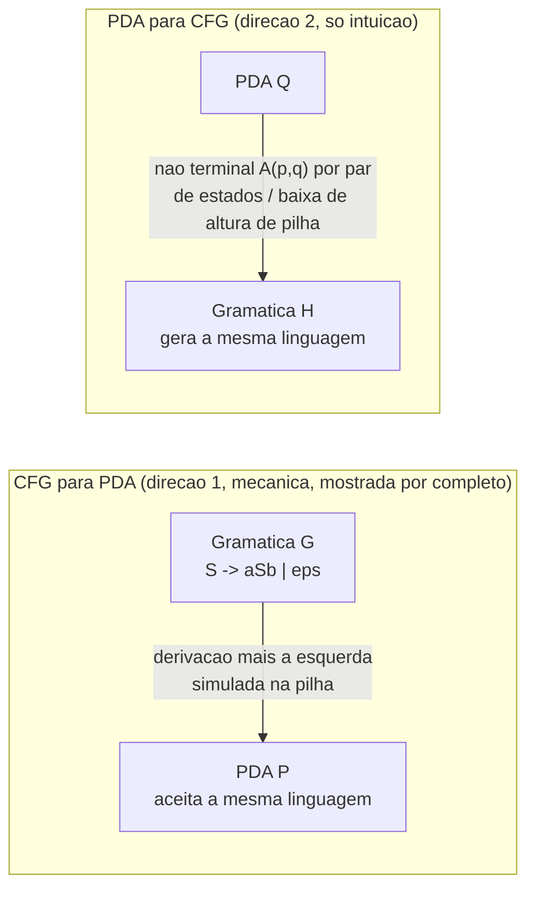

## Objetivos de Aprendizagem

- Enunciar precisamente o teorema de equivalência PDA-CFG, nas duas direções.
- Explicar, com um exemplo concreto e resolvido, como as derivações mais à esquerda de uma CFG podem ser simuladas passo a passo por um PDA usando sua pilha para conter a parte ainda não expandida da forma sentencial.
- Explicar, no nível de intuição genuína em vez de uma construção completa, como a computação baseada em pilha de um PDA pode em princípio ser convertida em uma CFG equivalente.
- Reconhecer por que essa equivalência espelha, estruturalmente, a equivalência anterior DFA-NFA-regex já coberta, mesmo sendo um teorema materialmente mais difícil de provar de forma exaustiva.
- Identificar qual das duas direções (CFG → PDA ou PDA → CFG) é mais mecânica de realizar à mão, e por quê.

## Contexto e Motivação

Esta disciplina já estabeleceu uma equivalência limpa: toda expressão regular corresponde a algum autômato finito, e todo autômato finito corresponde a alguma expressão regular, duas descrições de aparência completamente diferente (uma generativa, construída a partir de operadores de casamento de padrão; uma procedural, uma máquina que consome a entrada símbolo por símbolo) que acabam definindo exatamente a mesma classe de linguagens. Gramáticas livres de contexto e autômatos de pilha estão precisamente na mesma relação, um nível acima na hierarquia de Chomsky: uma CFG é uma descrição generativa (comece com S, reescreva repetidamente não terminais usando regras de produção, e leia a string terminal resultante), enquanto um PDA é uma descrição procedural (comece em q₀, consuma a entrada enquanto empilha e desempilha uma pilha, e aceite se o processo terminar corretamente). O teorema que este conceito cobre, uma linguagem é livre de contexto se e somente se algum PDA a reconhece, é o análogo direto livre de contexto da equivalência de linguagem regular, e é exatamente por isso que o conceito anterior descreveu a pilha do PDA como "a memória extra natural" para estrutura livre de contexto: este teorema é a afirmação formal que torna essa intuição precisa.

Vale a pena ser honesto sobre a profundidade em que essa equivalência específica é tipicamente ensinada, e em que ela é tratada aqui. A equivalência DFA-NFA tem um algoritmo genuinamente limpo, totalmente geral, e fácil de executar à mão por trás dela (a construção de subconjuntos, já coberta). A equivalência PDA-CFG é real e igualmente verdadeira, mas a construção bidirecional geral, especialmente converter um PDA arbitrário em uma CFG equivalente, é consideravelmente mais mecânica e pesada em notação para realizar em plena generalidade, envolvendo variáveis de gramática indexadas por pares de estados de PDA e símbolos de pilha. Em vez de percorrer essa construção geral completa símbolo por símbolo, o nível certo aqui é o que uma compreensão funcional do teorema de fato exige: um exemplo real, concreto, e totalmente resolvido na direção CFG → PDA (que genuinamente é direta de executar à mão), e um relato real e honesto da *ideia* por trás da direção PDA → CFG, sem alegar realizar o algoritmo geral de forma exaustiva. Ambas as direções são teoremas verdadeiros com provas completas publicadas (ver Sipser, citado abaixo); o que segue constrói a intuição que torna essas provas plausíveis, não um substituto para lê-las por completo.

## Teoria Central

### O teorema

> **Teorema.** Uma linguagem L é livre de contexto se e somente se algum autômato de pilha reconhece L.

Isso tem duas direções, provadas separadamente:

1. **(⇒) Se L é livre de contexto, então algum PDA reconhece L.** Dada qualquer CFG G gerando L, um PDA pode ser construído que simula derivações mais à esquerda em G, e esse PDA aceita exatamente as strings que G gera.
2. **(⇐) Se algum PDA reconhece L, então L é livre de contexto.** Dado qualquer PDA P reconhecendo L, uma CFG pode ser construída cujas derivações correspondem exatamente a computações de aceitação de P, e essa CFG gera exatamente as strings que P aceita.

### Direção 1, a ideia: um PDA simula uma derivação mais à esquerda

A ideia chave é que a pilha do PDA guarda exatamente a parte da forma sentencial corrente que ainda não foi expandida até símbolos terminais, o sufixo "pendente" de uma derivação mais à esquerda. A construção, em resumo: empilhe o símbolo inicial S na pilha; então repita, se o topo da pilha é um não terminal A, substitua-o não deterministicamente (desempilhe A, empilhe o lado direito de uma das regras de produção de A, em ordem reversa de modo que o símbolo mais à esquerda daquela regra fique no topo); se o topo da pilha é um terminal, ele precisa casar exatamente com o próximo símbolo de entrada (desempilhe-o e consuma aquele símbolo de entrada); aceite quando a entrada é totalmente consumida e a pilha está vazia. Porque o PDA é não determinístico, ele pode "adivinhar" qual regra de produção aplicar em cada passo, e aceita exatamente quando alguma sequência de adivinhações deriva com sucesso a string de entrada, casando com o próprio não determinismo da CFG ao escolher qual regra aplicar durante uma derivação.

### Direção 1, resolvida concretamente

**Gramática G:** S → aSb | ε (isso gera {aⁿbⁿ : n ≥ 0}, a mesma linguagem para a qual o PDA de exemplo do conceito anterior foi projetado à mão diretamente, esta construção em vez disso deriva um PDA equivalente mecanicamente a partir da gramática).

**PDA resultante (pela construção acima):** alfabeto de pilha {S, a, b, $}; comece empilhando $ e depois S.
- Se o topo da pilha é S: não deterministicamente ou (desempilhe S, empilhe b, depois S, depois a, de modo que a fique no topo, casando com a regra S → aSb lida da esquerda para a direita) ou (desempilhe S, empilhe nada, casando com a regra S → ε).
- Se o topo da pilha é um terminal (a ou b): ele precisa casar e consumir o símbolo de entrada correspondente; desempilhe-o.
- Se o topo da pilha é $ e a entrada está esgotada: aceite.

**Rastro em `aabb`:** a pilha começa $S. Aplique S → aSb: desempilhe S, empilhe b, S, a (do topo para baixo: a, S, b, $, lido de cima para baixo como a depois S depois b depois $). O topo é `a`, casa com o primeiro `a` da entrada, consuma-o, desempilhe: a pilha agora é S, b, $. Aplique S → aSb de novo: desempilhe S, empilhe b, S, a: a pilha é a, S, b, b, $. O topo `a` casa com o segundo `a` da entrada, consuma, desempilhe: pilha S, b, b, $. Agora aplique S → ε: desempilhe S, empilhe nada: pilha b, b, $. O topo `b` casa com o terceiro símbolo da entrada `b`, consuma, desempilhe: pilha b, $. O topo `b` casa com o quarto símbolo da entrada `b`, consuma, desempilhe: pilha $, entrada esgotada, aceite. Esse rastro espelha, símbolo por símbolo, a derivação mais à esquerda S ⇒ aSb ⇒ aaSbb ⇒ aabb, que é exatamente o sentido em que o PDA "simula" a derivação: a pilha em cada ponto guarda precisamente o sufixo ainda não expandido (S, depois Sb, depois só os terminais esperando para serem casados).

### Direção 2, a ideia: da computação de um PDA para regras de gramática

A direção reversa é real e verdadeira mas genuinamente mais envolvida, e o relato honesto aqui é da intuição, não de uma construção geral completa. A ideia central: definir um não terminal A_{p,q} para cada par de estados de PDA p e q, com a intenção de gerar exatamente o conjunto de strings de entrada que conseguem levar o PDA do estado p com um *único* símbolo de pilha específico no topo até o estado q com aquele mesmo símbolo desempilhado e nada mais alterado abaixo dele, informalmente, "toda string que o PDA poderia consumir enquanto a altura da pilha retorna líquida ao ponto de onde começou, indo de p para q." As regras de produção para A_{p,q} são construídas considerando toda forma possível pela qual a altura da pilha do PDA poderia baixar e retornar entre p e q: ou o PDA empilha um símbolo em p, faz alguma subcomputação retornando a pilha à mesma altura em algum estado intermediário r, desempilha aquele símbolo indo para algum estado s, e então faz outra subcomputação de s até q (dando uma regra da forma A_{p,q} → a A_{r,s} A_{s,q}, para os símbolos de entrada e estados intermediários apropriados), ou p e q estão conectados por um único movimento só-ε sem alteração líquida de pilha nenhuma. A construção completa indexa um não terminal por cada par de estados (e cada símbolo de pilha implicitamente envolvido), que é por isso que é mais pesada do que a direção direta, mas a ideia subjacente é simples de dizer claramente: *um não terminal para cada forma pela qual o PDA poderia ir de uma configuração de altura de pilha para outra*, e o símbolo inicial da gramática resultante é A_{q₀,f} para cada estado de aceitação f, unido apropriadamente, já que aceitar a string inteira significa ir da configuração inicial até alguma configuração de aceitação com a pilha de volta a vazia.

## Exemplos Resolvidos

### Exemplo 1: CFG → PDA em uma segunda gramática pequena

**Problema:** Aplique a mesma construção a G: S → 0S1 | 1 (essa gramática gera {0ⁿ1ⁿ⁺¹ : n ≥ 0}, n zeros seguidos por n+1 uns), e rastreie a aceitação da string `00111` (n = 2).

**Construção:** a pilha começa $S. Regra S → 0S1: desempilhe S, empilhe 1, S, 0 (de modo que 0 fique no topo, casando com a regra lida da esquerda para a direita). Regra S → 1 (o caso base terminal): desempilhe S, empilhe 1.

**Rastro em `00111`:** pilha $S → aplique S→0S1 → pilha (topo para baixo) 0,S,1,$. O topo `0` casa com o primeiro símbolo da entrada, consuma, desempilhe: S,1,$. Aplique S→0S1 de novo → pilha 0,S,1,1,$. O topo `0` casa com o segundo símbolo da entrada, consuma, desempilhe: S,1,1,$. Agora aplique a regra base S→1: desempilhe S, empilhe 1: pilha 1,1,1,$. O topo `1` casa com o terceiro símbolo da entrada, consuma, desempilhe: 1,1,$. O topo `1` casa com o quarto símbolo, consuma, desempilhe: 1,$. O topo `1` casa com o quinto e último símbolo, consuma, desempilhe: a pilha é só $, entrada totalmente consumida, aceite. Esse rastro espelha exatamente a derivação S ⇒ 0S1 ⇒ 00S11 ⇒ 00111, confirmando que o PDA aceita precisamente quando existe uma derivação mais à esquerda correspondente.

**Contraste com uma string fora da linguagem:** rastrear `0011` (dois 0s, dois 1s) em vez disso esgota a entrada um símbolo cedo demais, depois de ambas as aplicações de S→0S1 e da regra base S→1, a pilha ainda guarda mais dois terminais 1 para casar, mas só dois 1s de entrada estiveram disponíveis e ambos já foram consumidos até aquele ponto do rastro, deixando um `1` preso na pilha sem entrada restante para casar com ele. O PDA não tem caminho de aceitação para `0011`, refletindo corretamente que G gera 0ⁿ1ⁿ⁺¹ (sempre um 1 a mais do que 0s), não 0ⁿ1ⁿ.

### Exemplo 2: lendo um rastro de pilha de volta como uma derivação

**Problema:** Dado o PDA da Direção 1 (para S → aSb | ε), suponha que um rastro empilha $S, depois aplica S→ε imediatamente, depois aceita. Que string foi aceita, e a que derivação isso corresponde?

**Raciocínio:** empilhar S e então imediatamente desempilhá-lo via S→ε (empilhando nada) deixa a pilha em apenas $, com zero símbolos de entrada consumidos em qualquer ponto desse rastro. Isso corresponde a aceitar a string vazia ε, casando diretamente com a derivação S ⇒ ε, o caso base da gramática, com a atividade de pilha do PDA aqui reduzida ao mínimo possível: uma empilhada, uma desempilhada imediata, nenhum terminal casado.

### Exemplo 3: por que a ideia de não terminal-por-par-de-estados da direção 2 é necessária, não decorativa

**Problema:** Explique concretamente por que um único não terminal "genérico" por estado de PDA não seria suficiente para a direção PDA → CFG, motivando por que a construção precisa de um não terminal por *par* de estados.

**Raciocínio:** um único não terminal por estado só capturaria "o que acontece a partir deste estado," sem forma de especificar *onde a computação precisa terminar*, mas o que de fato importa para construir regras de gramática corretas é uma unidade autocontida: "o conjunto de strings que levam o PDA do estado p de volta ao estado q enquanto a pilha retorna líquida à mesma altura," o que é inerentemente sobre um par de pontos finais, não um estado isolado. Considere duas subcomputações diferentes que ambas começam no estado p com um símbolo X no topo: uma que termina em q₁ e uma que termina em q₂, essas geram conjuntos de strings genuinamente diferentes em geral (transições disponíveis diferentes poderiam ficar habilitadas dependendo de qual estado é alcançado), então colapsá-las em um único não terminal indexado apenas por p misturaria duas linguagens diferentes em uma só. Indexar pelo par (p, q) as mantém separadas, que é exatamente o que faz a construção produzir uma gramática cujas derivações correspondem fielmente às computações de aceitação reais do PDA.

## Equívocos Comuns e Armadilhas

- **"Já que DFA-NFA-regex tem uma equivalência limpa, simétrica, e totalmente mecânica, PDA-CFG também deve ter."** Ambas as direções de PDA-CFG são teoremas verdadeiros com provas formais completas, mas não são simétricas em dificuldade: CFG → PDA é genuinamente simples de executar à mão (mostrado por completo acima), enquanto PDA → CFG exige um não terminal para cada par de estados e contabilidade cuidadosa em cada possível baixa de altura de pilha, o que é consideravelmente mais pesado. Tratá-las como igualmente mecânicas leva a subestimar quanta maquinaria a direção reversa de fato exige.
- **"O PDA construído a partir de uma gramática por essa construção é determinístico."** Não é, em geral, a construção do PDA herda diretamente o próprio não determinismo da gramática (um não terminal com múltiplas regras de produção se torna um estado com múltiplas transições possíveis), e assim como algumas CFGs são inerentemente ambíguas, algumas linguagens livres de contexto não têm nenhum PDA *determinístico* as reconhecendo (uma noção genuinamente separada e mais forte do que apenas "algum PDA a reconhece," não coberta por essa equivalência).
- **"Uma tentativa de derivação que fica sem símbolos de pilha antes que a entrada termine, ou vice-versa, significa que a gramática está errada."** Como o Exemplo 1 mostra, essa incompatibilidade em vez disso geralmente só significa que a string específica sendo rastreada não está na linguagem gerada por aquela gramática, o PDA está se comportando corretamente ao falhar em alcançar uma configuração de aceitação para uma string que nunca deveria ter sido aceita em primeiro lugar.
- **"O não terminal A_{p,q} da direção PDA → CFG gera todas as strings que o PDA poderia produzir a partir de p."** Ele especificamente gera apenas strings que deixam a pilha na *mesma altura em que começou* até que o estado q seja alcançado (uma subcomputação "balanceada"), não apenas qualquer string alcançável a partir de p em qualquer quantidade de crescimento de pilha, já que só segmentos neutros em altura de pilha podem ser compostos na estrutura recursiva A_{r,s}-dentro-de-A_{p,q} que torna a construção bem definida.

## Resumo

Uma linguagem é livre de contexto exatamente quando algum PDA a reconhece, o análogo livre de contexto da equivalência de linguagem regular entre autômatos finitos e expressões regulares, mas um teorema cujas duas direções diferem notavelmente em quão mecânicas são de realizar à mão. A direção CFG → PDA é genuinamente direta: construa um PDA cuja pilha guarda o sufixo ainda não expandido de uma derivação mais à esquerda, substituindo um não terminal no topo da pilha pelo lado direito de uma de suas regras de produção, e casando terminais diretamente contra a entrada, resolvido por completo acima sobre S → aSb | ε e S → 0S1 | 1. A direção PDA → CFG é real mas mais pesada, construída sobre um não terminal A_{p,q} para cada par de estados de PDA, cada um capturando "as strings que movem o PDA de p a q enquanto a pilha retorna líquida à sua altura inicial," uma ideia genuína e correta, apresentada aqui no nível de intuição em vez de como uma construção geral totalmente resolvida, consistente com como essa equivalência é tipicamente ensinada nessa profundidade.

## Documentation Links

- [MIT 18.404J: OCW Calendar](https://ocw.mit.edu/courses/18-404j-theory-of-computation-fall-2020/pages/calendar/): doc
- [Sipser: Introduction to the Theory of Computation, 3ª ed.](https://cs.brown.edu/courses/csci1810/fall-2023/resources/ch2_readings/Sipser_Introduction.to.the.Theory.of.Computation.3E.pdf): doc
