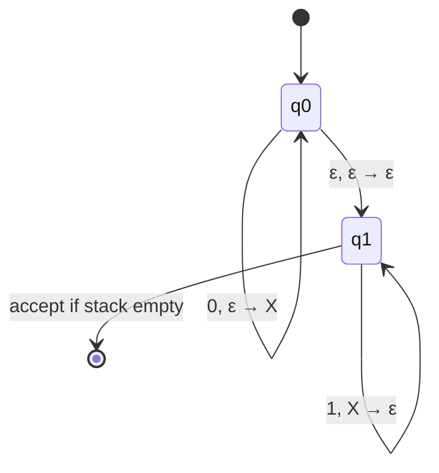

## Learning Objectives

- Define a pushdown automaton (PDA) formally, as a 6-tuple, and explain how each component extends the NFA definition already covered.
- Explain precisely why adding a single stack (rather than, say, a queue) is the exact extra resource needed to recognize context-free languages and not more.
- Design a PDA for a concrete non-regular, context-free language by using the stack to track an unbounded count.
- Trace a PDA's execution on a specific input string, tracking both the current state and the full stack contents at every step.
- Distinguish acceptance by final state from acceptance by empty stack, and state which convention a given PDA design uses.

## Context & Motivation

Every automaton covered so far in this discipline — DFA, NFA — shares one hard ceiling: its only memory is which state it is currently in, and the number of states is fixed in advance, finite, and known before a single symbol of input is read. That ceiling is exactly what the pumping lemma for regular languages exploits to prove {0ⁿ1ⁿ : n ≥ 0} is not regular — no finite automaton can "remember" how many 0s it has seen once that count exceeds its number of states, because a state is the only thing it has to remember with. Yet {0ⁿ1ⁿ} is a perfectly natural language to want to recognize: it is the abstract shape of balanced parentheses, matching open and close tags, or any nested structure where every opening construct demands exactly one matching closing construct. Context-free grammars, covered earlier in this discipline, can already generate this language with a rule as simple as S → 0S1 | ε — so there ought to be some machine-based, procedural counterpart to that generative description, the same way DFAs and NFAs are the procedural counterpart to regular expressions.

The pushdown automaton is that counterpart. It is deliberately the smallest possible upgrade to the NFA model: keep everything about states, an input alphabet, and nondeterministic transitions exactly as before, and bolt on exactly one additional resource — a single stack, with its own (possibly different) alphabet, that the automaton can push onto, pop from, and read the top of as part of each transition. This is not an arbitrary design choice. A stack is a Last-In-First-Out structure, and "last opened, first closed" is precisely the discipline that nested and balanced structures obey — the most recently opened parenthesis must be the next one closed, the innermost tag must be the first one to close, the most recent 0 pushed must be the one popped by the next 1. Sipser's *Introduction to the Theory of Computation* and the MIT 18.404J course this discipline traces build the entire theory of context-free languages around this one insight: a stack is not just *a* way to add memory, it is *the* natural extra memory for exactly the kind of unbounded-but-nested structure that CFGs describe, which is why — as the next concept in this track proves — PDAs and CFGs turn out to recognize exactly the same class of languages.

## Core Theory

### Formal definition

A **pushdown automaton** is a 6-tuple (Q, Σ, Γ, δ, q₀, F) where:

- **Q** is a finite set of states, exactly as in an NFA.
- **Σ** is the finite input alphabet.
- **Γ** is a separate finite **stack alphabet** — the symbols that may be pushed onto or popped off the stack; Γ need not equal Σ, and typically contains at least one extra symbol used to mark the bottom of the stack.
- **δ: Q × Σ_ε × Γ_ε → P(Q × Γ_ε)** is the transition function, where Σ_ε = Σ ∪ {ε} and Γ_ε = Γ ∪ {ε}. Reading this signature carefully: each transition consults the current state, *optionally* reads one input symbol (or none, an ε-transition on the input), and *optionally* reads (and pops) the top-of-stack symbol (or reads none, leaving the stack untouched) — and, in response, moves to some new state and *optionally* pushes one new stack symbol (or pushes nothing). The transition function returns a *set* of such (state, stack-push) outcomes, since PDAs, like NFAs, are nondeterministic by default.
- **q₀ ∈ Q** is the start state.
- **F ⊆ Q** is the set of accept states.

The stack itself starts empty (or, in some presentations, with a designated bottom-marker symbol already on it) and grows and shrinks purely as a side effect of transitions — it is not part of Q, and its contents at any moment can be arbitrarily long, which is exactly the unbounded memory a finite automaton lacks.

### Why a stack, specifically

The reason a stack — and not, say, a queue (First-In-First-Out) — is the right extra structure comes directly from how nested matching works. Consider balanced parentheses: `(()())`. Reading left to right, the demand at every point is "the next `)` must close the *most recently* opened, still-unclosed `(`." A stack captures this exactly: push a marker for every `(`, and pop one for every `)`; because pop always removes the most recently pushed item, the marker removed by any given `)` is guaranteed to correspond to the most recent unmatched `(`, which is precisely the nesting rule. A queue would instead retrieve the *oldest* unmatched `(` first — matching the first-opened parenthesis with the first-closed one — which is exactly backwards for nested structure (it would be the right structure for a different, non-nesting kind of pairing, but not for this one). This is why the class of languages a "queue automaton" would recognize is not the context-free languages at all — it turns out to be a strictly larger class, in fact equivalent to Turing machines — while a stack lands exactly on context-free.

### Acceptance: final state vs. empty stack

A PDA can be defined to accept by two different (and provably equivalent) conventions:

1. **Accept by final state:** the input is accepted if, after consuming the entire input string, the PDA is in some state q ∈ F — regardless of what remains on the stack.
2. **Accept by empty stack:** the input is accepted if, after consuming the entire input string, the stack is completely empty — regardless of which state the PDA is in (F is irrelevant, or omitted).

Both conventions define exactly the same class of languages (any PDA using one convention can be mechanically converted into an equivalent PDA using the other), but a given worked design commits to one convention at a time, and it matters which one is stated, since a specific transition table only "works" under the convention it was designed for.

### State-transition-plus-stack diagrams

PDA transitions are conventionally labeled `a, b → c`, meaning: on reading input symbol `a` (or ε), pop stack symbol `b` (or ε) off the top, and push stack symbol `c` (or ε) on. The diagram below sketches the shape of a PDA recognizing {0ⁿ1ⁿ : n ≥ 0} (worked in full below): push a marker for each `0` while in a "pushing" state, then switch to a "popping" state once `1`s begin, popping one marker per `1`, and accept only if the stack empties exactly when input ends.

## Worked Examples

### Example 1 — a PDA for {0ⁿ1ⁿ : n ≥ 0}

**Problem:** Design a PDA that accepts exactly the strings with some number of 0s followed by exactly the same number of 1s (including the empty string, n = 0), the same language this discipline's pumping lemma proves is not regular.

**Design.** Use stack alphabet Γ = {X, $}, where $ marks the bottom of the stack (pushed once at the start, so we can later detect "the stack has nothing but the marker left," i.e., effectively empty) and X marks one unmatched 0. States: q_start (push $, then move to q_push), q_push (push an X for every 0 read), q_pop (pop an X for every 1 read), q_accept (reached when a pop leaves only $ on top, or when the input was empty and only $ is on the stack).

Transitions:
- q_start: ε, ε → $, then move to q_push.
- q_push: on reading 0, ε → X (push X), stay in q_push.
- q_push: ε, ε → ε (no input consumed), move to q_pop — this ε-transition is how the PDA nondeterministically "guesses" that the 0s have ended, without needing to look ahead.
- q_pop: on reading 1, X → ε (pop X), stay in q_pop.
- q_pop: ε, $ → $ (top of stack is just the bottom marker, meaning all 0s were matched), move to q_accept.
- q_accept ∈ F.

**Trace on the accepted string `0011`:**

| Step | Remaining input | State | Stack (top on left) | Action |
|---|---|---|---|---|
| 0 | 0011 | q_start | (empty) | push $ → move to q_push |
| 1 | 0011 | q_push | $ | read 0, push X |
| 2 | 011 | q_push | X$ | read 0, push X |
| 3 | 11 | q_push | XX$ | ε-move to q_pop (guess: 0s are done) |
| 4 | 11 | q_pop | XX$ | read 1, pop X |
| 5 | 1 | q_pop | X$ | read 1, pop X |
| 6 | (empty) | q_pop | $ | ε-move, top is $ → move to q_accept |
| 7 | (empty) | q_accept | $ | accept — input consumed, in F |

Two 0s were pushed and exactly two 1s popped them off, leaving just the bottom marker — accepted.

**Trace on the rejected string `011`** (one 0, two 1s — unequal counts): push $, push one X for the single 0 (stack: X$), ε-move to q_pop, read the first 1 and pop the X (stack: $), then attempt to read the second 1 — but q_pop's only transition on input 1 requires popping an X, and the top of the stack is now $, not X, so no transition applies. The PDA has no way to consume the second 1 in this branch, and (since nondeterminism explores every branch, and no branch here leads to acceptance) the string is correctly rejected. This is exactly the point of the stack: it makes the mismatch between the 0-count and the 1-count structurally detectable, something no finite-state memory alone could do for arbitrarily large n.

### Example 2 — a PDA for balanced parentheses

**Problem:** Sketch a PDA for the language of balanced parenthesis strings over {(, )} (e.g., `(())`, `()()`, but not `)(` or `(()`).

**Design.** Stack alphabet Γ = {(, }; a single state q (looping) suffices, with q ∈ F, using empty-stack acceptance instead of final-state acceptance for simplicity. Transitions: on reading `(`, push `(` (regardless of what's on top); on reading `)`, pop the top symbol only if it is `(` — i.e., the transition `), ( → ε` is defined, but there is no transition for reading `)` when the top of the stack is anything else (or the stack is empty). Accept if, after the entire input is consumed, the stack is empty.

**Reasoning:** every `(` unconditionally adds one unmatched-open marker; every `)` demands that the most recently added marker be removable, which is exactly the requirement that closing brackets nest correctly with the most recent still-open bracket. A string like `(()` pushes three markers total net of one pop, leaving one marker on the stack at the end — stack nonempty, rejected, correctly reflecting that this string has an unmatched `(`. A string like `)(` cannot even complete: reading the first `)` finds an empty stack, so no transition applies at all — the computation simply gets stuck, which also counts as rejection (no accepting path exists).

### Example 3 — why the stack, and not the count alone, matters

**Problem:** Explain concretely why a PDA (with its stack) succeeds where a DFA fails on {0ⁿ1ⁿ}, tying it back to the pumping lemma argument for regular languages already covered.

**Reasoning:** the regular pumping lemma argument shows that any DFA claiming to recognize {0ⁿ1ⁿ} must, by the pigeonhole principle, revisit some state after reading two different numbers of 0s (say, after i and after j 0s, i ≠ j, within the first p symbols) — and because the DFA's future behavior depends *only* on its current state, it cannot subsequently distinguish "I've seen i 0s so far" from "I've seen j 0s so far," so pumping the 0-block breaks acceptance. A PDA's stack sidesteps this completely: rather than compressing "how many 0s so far" into one of finitely many states, it pushes one physical stack symbol per 0, so the stack height itself *is* an exact, unbounded count — no pigeonhole collision is possible, since the stack is not drawn from a fixed finite set of configurations the way a DFA's state is. This is the concrete mechanism behind the informal claim that "a PDA has exactly the extra memory a DFA/NFA lacks, and it is exactly enough for context-free languages."

## Common Misconceptions & Pitfalls

- **"A PDA is just an NFA with an extra output tape for bookkeeping."** The stack is not passive bookkeeping — it directly *gates* which transitions are even available, since a transition can require a specific symbol to be on top of the stack. Only-write-never-read stack usage would make the stack pointless; the power of a PDA comes specifically from transitions being conditioned on what is popped.
- **"A PDA can check that two counts are equal only if it pushes and pops in the exact same pass."** As Example 1 shows, the PDA legitimately uses an ε-transition to nondeterministically switch from a pushing phase to a popping phase without consuming input — the phases don't need to alternate per-symbol, they just need to be sequenced correctly, and nondeterminism is exactly what allows the machine to "decide" where phase one ends without lookahead.
- **"If the input runs out with symbols still on the stack, that's fine as long as the PDA is in an accept state."** This depends entirely on which acceptance convention is declared. Under final-state acceptance it genuinely is fine (leftover stack contents are ignored); under empty-stack acceptance it is not — the two conventions are equivalent as a *class* of languages, but a specific transition table built for one convention will misbehave if graded against the other's rule.
- **"A stack can track two independent counts at once, so a PDA should be able to recognize {0ⁿ1ⁿ2ⁿ}."** A single stack can track one running count cleanly (push, then pop) but cannot easily compare a stack-encoded count against a *second* independent count after the first has already been popped away — this exact limitation is what the context-free pumping lemma (the next-but-one concept in this track) uses to prove {0ⁿ1ⁿ2ⁿ} is not context-free at all, despite {0ⁿ1ⁿ} being easily context-free.

## Summary

A pushdown automaton is an NFA (states, input alphabet, nondeterministic transition function, start state, accept states) augmented with exactly one additional resource: a single stack, with its own alphabet, that transitions can read from (by popping) and write to (by pushing) as part of firing. This one addition is not arbitrary — a stack's Last-In-First-Out discipline is precisely the rule nested and balanced structures obey (the most recently opened construct must be the next one closed), which is why PDAs handle languages like {0ⁿ1ⁿ} and balanced parentheses that DFAs and NFAs provably cannot. Acceptance can be defined by final state or by empty stack, two conventions that are equivalent in what they can express but not interchangeable for a specific transition table. The stack succeeds where finite-state memory fails because it turns an unbounded count into an unbounded stack height rather than trying to compress it into one of finitely many states — exactly the resource the regular pumping lemma shows a DFA/NFA cannot have.

## Documentation Links

- [MIT 18.404J — OCW Calendar](https://ocw.mit.edu/courses/18-404j-theory-of-computation-fall-2020/pages/calendar/) — doc
- [Sipser — Introduction to the Theory of Computation, 3rd ed.](https://cs.brown.edu/courses/csci1810/fall-2023/resources/ch2_readings/Sipser_Introduction.to.the.Theory.of.Computation.3E.pdf) — doc
