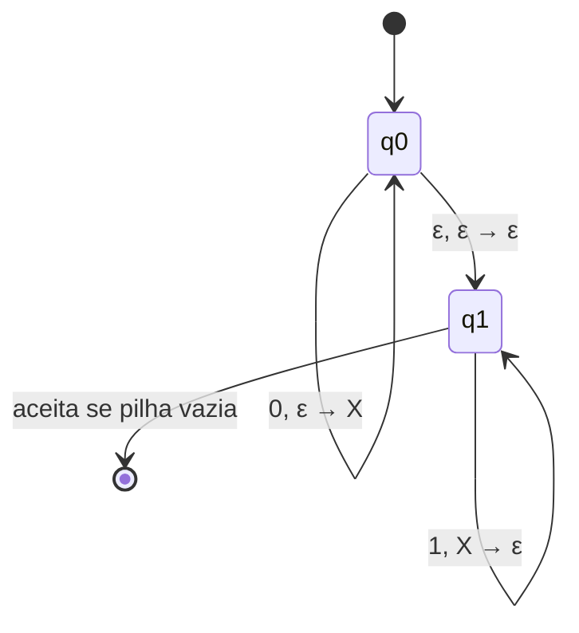

## Objetivos de Aprendizagem

- Definir formalmente um autômato de pilha (PDA) como uma 6-tupla, e explicar como cada componente estende a definição de NFA já coberta.
- Explicar precisamente por que adicionar uma única pilha (em vez de, digamos, uma fila) é exatamente o recurso extra necessário para reconhecer linguagens livres de contexto e não mais que isso.
- Desenhar um PDA para uma linguagem concreta, não regular, livre de contexto, usando a pilha para rastrear uma contagem ilimitada.
- Rastrear a execução de um PDA em uma string de entrada específica, rastreando tanto o estado corrente quanto o conteúdo completo da pilha a cada passo.
- Distinguir aceitação por estado final de aceitação por pilha vazia, e afirmar qual convenção um dado desenho de PDA usa.

## Contexto e Motivação

Todo autômato coberto até agora nesta disciplina, DFA, NFA, compartilha um teto rígido: sua única memória é em qual estado está atualmente, e o número de estados é fixado com antecedência, finito, e conhecido antes que um único símbolo de entrada seja lido. Esse teto é exatamente o que o lema do bombeamento para linguagens regulares explora para provar que {0ⁿ1ⁿ : n ≥ 0} não é regular: nenhum autômato finito pode "lembrar" quantos 0s viu depois que essa contagem excede seu número de estados, porque um estado é a única coisa que ele tem para lembrar. No entanto {0ⁿ1ⁿ} é uma linguagem perfeitamente natural de se querer reconhecer: é a forma abstrata de parênteses balanceados, tags de abertura e fechamento correspondentes, ou qualquer estrutura aninhada onde toda construção de abertura exige exatamente uma construção de fechamento correspondente. Gramáticas livres de contexto, cobertas anteriormente nesta disciplina, já conseguem gerar essa linguagem com uma regra tão simples quanto S → 0S1 | ε, então deveria existir alguma contraparte procedural, baseada em máquina, para essa descrição generativa, da mesma forma que AFDs e AFNs são a contraparte procedural das expressões regulares.

O autômato de pilha é essa contraparte. Ele é deliberadamente o menor upgrade possível ao modelo de NFA: mantenha tudo sobre estados, um alfabeto de entrada, e transições não-determinísticas exatamente como antes, e acrescente exatamente um recurso adicional, uma única pilha, com seu próprio alfabeto (possivelmente diferente), que o autômato pode empilhar, desempilhar e ler o topo como parte de cada transição. Essa não é uma escolha de design arbitrária. Uma pilha é uma estrutura Último a Entrar, Primeiro a Sair (LIFO), e "o último aberto, o primeiro fechado" é precisamente a disciplina que estruturas aninhadas e balanceadas obedecem: o parêntese aberto mais recentemente deve ser o próximo a ser fechado, a tag mais interna deve ser a primeira a fechar, o 0 mais recente empilhado deve ser aquele desempilhado pelo próximo 1. *Introduction to the Theory of Computation*, de Sipser, e o curso 18.404J do MIT que esta disciplina segue de perto constroem a teoria inteira das linguagens livres de contexto ao redor dessa única percepção: uma pilha não é apenas *uma* forma de adicionar memória, é *a* memória extra natural para exatamente o tipo de estrutura ilimitada mas aninhada que as GLCs descrevem, motivo pelo qual, como o próximo conceito nesta trilha prova, APs e GLCs acabam reconhecendo exatamente a mesma classe de linguagens.

## Teoria Central

### Definição formal

Um **autômato de pilha** é uma 6-tupla (Q, Σ, Γ, δ, q₀, F) onde:

- **Q** é um conjunto finito de estados, exatamente como em um NFA.
- **Σ** é o alfabeto de entrada finito.
- **Γ** é um **alfabeto de pilha** finito separado, os símbolos que podem ser empilhados ou desempilhados; Γ não precisa ser igual a Σ, e tipicamente contém pelo menos um símbolo extra usado para marcar o fundo da pilha.
- **δ: Q × Σ_ε × Γ_ε → P(Q × Γ_ε)** é a função de transição, onde Σ_ε = Σ ∪ {ε} e Γ_ε = Γ ∪ {ε}. Lendo essa assinatura com cuidado: cada transição consulta o estado corrente, *opcionalmente* lê um símbolo de entrada (ou nenhum, uma transição-ε na entrada), e *opcionalmente* lê (e desempilha) o símbolo do topo da pilha (ou lê nenhum, deixando a pilha intocada), e, em resposta, move para um novo estado e *opcionalmente* empilha um novo símbolo de pilha (ou não empilha nada). A função de transição retorna um *conjunto* desses resultados (estado, empilhamento), já que APs, como AFNs, são não-determinísticos por padrão.
- **q₀ ∈ Q** é o estado inicial.
- **F ⊆ Q** é o conjunto de estados de aceitação.

A própria pilha começa vazia (ou, em algumas apresentações, com um símbolo marcador de fundo já designado nela) e cresce e diminui puramente como efeito colateral de transições, ela não faz parte de Q, e seu conteúdo em qualquer momento pode ser arbitrariamente longo, o que é exatamente a memória ilimitada que falta a um autômato finito.

### Por que uma pilha, especificamente

O motivo de uma pilha, e não, digamos, uma fila (Primeiro a Entrar, Primeiro a Sair), ser a estrutura extra correta vem diretamente de como o casamento aninhado funciona. Considere parênteses balanceados: `(()())`. Lendo da esquerda para a direita, a exigência em todo ponto é "o próximo `)` deve fechar o `(` ainda não fechado aberto *mais recentemente*." Uma pilha captura isso exatamente: empilhe um marcador para cada `(`, e desempilhe um para cada `)`; como desempilhar sempre remove o item empilhado mais recentemente, o marcador removido por qualquer `)` dado tem garantia de corresponder ao `(` não casado mais recente, que é precisamente a regra de aninhamento. Uma fila, em vez disso, recuperaria primeiro o `(` não casado *mais antigo*, casando o primeiro parêntese aberto com o primeiro fechado, o que é exatamente o inverso para estrutura aninhada (seria a estrutura certa para um tipo diferente de pareamento, sem aninhamento, mas não para este). É por isso que a classe de linguagens que um "autômato de fila" reconheceria não é a das linguagens livres de contexto de forma alguma, na verdade acaba sendo uma classe estritamente maior, de fato equivalente a máquinas de Turing, enquanto uma pilha recai exatamente sobre livre de contexto.

### Aceitação: estado final versus pilha vazia

Um PDA pode ser definido para aceitar por duas convenções diferentes (e comprovadamente equivalentes):

1. **Aceitar por estado final:** a entrada é aceita se, depois de consumir a string de entrada inteira, o PDA está em algum estado q ∈ F, independentemente do que reste na pilha.
2. **Aceitar por pilha vazia:** a entrada é aceita se, depois de consumir a string de entrada inteira, a pilha está completamente vazia, independentemente de em qual estado o PDA está (F é irrelevante, ou omitido).

Ambas as convenções definem exatamente a mesma classe de linguagens (qualquer PDA usando uma convenção pode ser convertido mecanicamente em um PDA equivalente usando a outra), mas um dado desenho resolvido se compromete com uma convenção de cada vez, e importa qual delas é declarada, já que uma tabela de transições específica só "funciona" sob a convenção para a qual foi desenhada.

### Diagramas de transição de estado mais pilha

Transições de PDA são convencionalmente rotuladas `a, b → c`, significando: ao ler o símbolo de entrada `a` (ou ε), desempilhe o símbolo de pilha `b` (ou ε) do topo, e empilhe o símbolo de pilha `c` (ou ε). O diagrama abaixo esboça a forma de um PDA reconhecendo {0ⁿ1ⁿ : n ≥ 0} (resolvido por completo abaixo): empilhe um marcador para cada `0` enquanto em um estado de "empilhamento", depois mude para um estado de "desempilhamento" assim que `1`s começarem, desempilhando um marcador por `1`, e aceite somente se a pilha esvaziar exatamente quando a entrada terminar.

## Exemplos Resolvidos

### Exemplo 1: um PDA para {0ⁿ1ⁿ : n ≥ 0}

**Problema:** Desenhe um PDA que aceita exatamente as strings com algum número de 0s seguido por exatamente o mesmo número de 1s (incluindo a string vazia, n = 0), a mesma linguagem que o lema do bombeamento desta disciplina prova não ser regular.

**Design.** Use o alfabeto de pilha Γ = {X, $}, onde $ marca o fundo da pilha (empilhado uma vez no início, para que depois possamos detectar "a pilha só tem o marcador restante", ou seja, efetivamente vazia) e X marca um 0 não casado. Estados: q_start (empilha $, depois move para q_push), q_push (empilha um X para cada 0 lido), q_pop (desempilha um X para cada 1 lido), q_accept (alcançado quando um desempilhamento deixa apenas $ no topo, ou quando a entrada era vazia e só $ está na pilha).

Transições:
- q_start: ε, ε → $, depois move para q_push.
- q_push: ao ler 0, ε → X (empilha X), permanece em q_push.
- q_push: ε, ε → ε (nenhuma entrada consumida), move para q_pop, essa transição-ε é como o PDA "adivinha" não-deterministicamente que os 0s terminaram, sem precisar olhar adiante.
- q_pop: ao ler 1, X → ε (desempilha X), permanece em q_pop.
- q_pop: ε, $ → $ (o topo da pilha é apenas o marcador de fundo, significando que todos os 0s foram casados), move para q_accept.
- q_accept ∈ F.

**Rastro na string aceita `0011`:**

| Passo | Entrada restante | Estado | Pilha (topo à esquerda) | Ação |
|---|---|---|---|---|
| 0 | 0011 | q_start | (vazia) | empilha $ → move para q_push |
| 1 | 0011 | q_push | $ | lê 0, empilha X |
| 2 | 011 | q_push | X$ | lê 0, empilha X |
| 3 | 11 | q_push | XX$ | move-ε para q_pop (adivinha: 0s terminaram) |
| 4 | 11 | q_pop | XX$ | lê 1, desempilha X |
| 5 | 1 | q_pop | X$ | lê 1, desempilha X |
| 6 | (vazia) | q_pop | $ | move-ε, topo é $ → move para q_accept |
| 7 | (vazia) | q_accept | $ | aceita: entrada consumida, em F |

Dois 0s foram empilhados e exatamente dois 1s os desempilharam, deixando apenas o marcador de fundo: aceita.

**Rastro na string rejeitada `011`** (um 0, dois 1s: contagens desiguais): empilha $, empilha um X para o único 0 (pilha: X$), move-ε para q_pop, lê o primeiro 1 e desempilha o X (pilha: $), depois tenta ler o segundo 1, mas a única transição de q_pop na entrada 1 exige desempilhar um X, e o topo da pilha agora é $, não X, então nenhuma transição se aplica. O PDA não tem como consumir o segundo 1 nesse ramo, e (já que o não-determinismo explora todo ramo, e nenhum ramo aqui leva à aceitação) a string é corretamente rejeitada. Esse é exatamente o ponto da pilha: ela torna o descompasso entre a contagem de 0s e a contagem de 1s estruturalmente detectável, algo que nenhuma memória de estado finito sozinha conseguiria fazer para n arbitrariamente grande.

### Exemplo 2: um PDA para parênteses balanceados

**Problema:** Esboce um PDA para a linguagem de strings de parênteses balanceados sobre {(, )} (por exemplo, `(())`, `()()`, mas não `)(` ou `(()`).

**Design.** Alfabeto de pilha Γ = {(, }; um único estado q (em loop) basta, com q ∈ F, usando aceitação por pilha vazia em vez de aceitação por estado final por simplicidade. Transições: ao ler `(`, empilha `(` (independentemente do que está no topo); ao ler `)`, desempilha o símbolo do topo somente se ele for `(`, ou seja, a transição `), ( → ε` é definida, mas não há transição para ler `)` quando o topo da pilha é qualquer outra coisa (ou a pilha está vazia). Aceita se, depois que a entrada inteira for consumida, a pilha estiver vazia.

**Raciocínio:** todo `(` incondicionalmente adiciona um marcador de abertura não casada; todo `)` exige que o marcador adicionado mais recentemente seja removível, que é exatamente a exigência de que parênteses de fechamento se aninhem corretamente com o parêntese aberto ainda não fechado mais recente. Uma string como `(()` empilha três marcadores no total, líquido de um desempilhamento, deixando um marcador na pilha ao final: pilha não vazia, rejeitada, refletindo corretamente que essa string tem um `(` não casado. Uma string como `)(` nem consegue completar: ler o primeiro `)` encontra uma pilha vazia, então nenhuma transição se aplica de forma alguma, a computação simplesmente trava, o que também conta como rejeição (nenhum caminho de aceitação existe).

### Exemplo 3: por que a pilha, e não a contagem sozinha, importa

**Problema:** Explicar concretamente por que um PDA (com sua pilha) tem sucesso onde um DFA falha em {0ⁿ1ⁿ}, ligando isso ao argumento do lema do bombeamento para linguagens regulares já coberto.

**Raciocínio:** o argumento do lema do bombeamento regular mostra que qualquer DFA que afirme reconhecer {0ⁿ1ⁿ} deve, pelo princípio da casa dos pombos, revisitar algum estado depois de ler dois números diferentes de 0s (digamos, depois de i e depois de j 0s, i ≠ j, dentro dos primeiros p símbolos), e como o comportamento futuro do DFA depende *apenas* de seu estado corrente, ele não consegue subsequentemente distinguir "vi i 0s até agora" de "vi j 0s até agora", então bombear o bloco de 0s quebra a aceitação. A pilha de um PDA contorna isso completamente: em vez de comprimir "quantos 0s até agora" em um dentre finitos estados, ele empilha um símbolo físico de pilha por 0, então a própria altura da pilha *é* uma contagem exata e ilimitada, nenhuma colisão de casa dos pombos é possível, já que a pilha não é retirada de um conjunto fixo e finito de configurações da forma que o estado de um DFA é. Esse é o mecanismo concreto por trás da afirmação informal de que "um PDA tem exatamente a memória extra que falta a um DFA/NFA, e ela é exatamente suficiente para linguagens livres de contexto."

## Equívocos Comuns e Armadilhas

- **"Um PDA é apenas um NFA com uma fita de saída extra para contabilidade."** A pilha não é contabilidade passiva, ela diretamente *controla* quais transições estão sequer disponíveis, já que uma transição pode exigir um símbolo específico no topo da pilha. Um uso da pilha só de escrita, nunca de leitura, tornaria a pilha inútil; o poder de um PDA vem especificamente de transições condicionadas ao que é desempilhado.
- **"Um PDA só pode verificar que duas contagens são iguais se empilha e desempilha na mesma passagem exata."** Como o Exemplo 1 mostra, o PDA legitimamente usa uma transição-ε para mudar não-deterministicamente de uma fase de empilhamento para uma fase de desempilhamento sem consumir entrada, as fases não precisam alternar por símbolo, elas só precisam ser sequenciadas corretamente, e o não-determinismo é exatamente o que permite à máquina "decidir" onde a fase um termina sem olhar adiante.
- **"Se a entrada acabar com símbolos ainda na pilha, tudo bem contanto que o PDA esteja em um estado de aceitação."** Isso depende inteiramente de qual convenção de aceitação é declarada. Sob aceitação por estado final, isso genuinamente é aceitável (o conteúdo restante da pilha é ignorado); sob aceitação por pilha vazia, não é, as duas convenções são equivalentes como uma *classe* de linguagens, mas uma tabela de transições específica construída para uma convenção vai se comportar mal se avaliada contra a regra da outra.
- **"Uma pilha pode rastrear duas contagens independentes ao mesmo tempo, então um PDA deveria conseguir reconhecer {0ⁿ1ⁿ2ⁿ}."** Uma única pilha consegue rastrear uma contagem corrente de forma limpa (empilha, depois desempilha) mas não consegue facilmente comparar uma contagem codificada na pilha contra uma *segunda* contagem independente depois que a primeira já foi desempilhada, essa limitação exata é o que o lema do bombeamento livre de contexto (o conceito seguinte-mas-um nesta trilha) usa para provar que {0ⁿ1ⁿ2ⁿ} não é livre de contexto de forma alguma, apesar de {0ⁿ1ⁿ} ser facilmente livre de contexto.

## Resumo

Um autômato de pilha é um NFA (estados, alfabeto de entrada, função de transição não-determinística, estado inicial, estados de aceitação) aumentado com exatamente um recurso adicional: uma única pilha, com seu próprio alfabeto, da qual transições podem ler (desempilhando) e na qual podem escrever (empilhando) como parte de disparar. Essa adição única não é arbitrária, a disciplina Último a Entrar, Primeiro a Sair de uma pilha é precisamente a regra que estruturas aninhadas e balanceadas obedecem (a construção aberta mais recentemente deve ser a próxima a ser fechada), motivo pelo qual APs lidam com linguagens como {0ⁿ1ⁿ} e parênteses balanceados que AFDs e AFNs comprovadamente não conseguem. A aceitação pode ser definida por estado final ou por pilha vazia, duas convenções equivalentes no que conseguem expressar mas não intercambiáveis para uma tabela de transições específica. A pilha tem sucesso onde a memória de estado finito falha porque transforma uma contagem ilimitada em uma altura de pilha ilimitada em vez de tentar comprimi-la em um dentre finitos estados, exatamente o recurso que o lema do bombeamento regular mostra que um DFA/NFA não pode ter.

## Documentation Links

- [MIT 18.404J: OCW Calendar](https://ocw.mit.edu/courses/18-404j-theory-of-computation-fall-2020/pages/calendar/): doc
- [Sipser: Introduction to the Theory of Computation, 3rd ed.](https://cs.brown.edu/courses/csci1810/fall-2023/resources/ch2_readings/Sipser_Introduction.to.the.Theory.of.Computation.3E.pdf): doc
