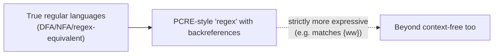

## Learning Objectives

- Identify at least three real, everyday tools built directly on regular-expression matching, and explain what "compiling" a regex into an automaton means in practice.
- Explain, with a concrete example, how features like backreferences push real-world regex engines (e.g., PCRE) beyond what a true finite automaton can recognize.
- Explain how a real programming language's reference grammar is written in a CFG-like notation (BNF or EBNF) and how a parser is built from it.
- Connect the theoretical PDA-CFG equivalence to the practical fact that a real parser is, at its core, a procedural implementation of a context-free grammar's structure.
- Articulate why the regular-vs-context-free distinction covered throughout this discipline is not merely academic, by pointing to a concrete task each level is (and is not) suited for.

## Context & Motivation

Everything covered in this discipline so far — DFAs, NFAs, regular expressions, their mutual equivalence, context-free grammars, pushdown automata, and the pumping lemmas marking the boundary of each class — is not an abstract exercise confined to a theory course. Two of the most heavily used categories of software tooling in existence are, quite directly, implementations of exactly these formalisms: regular-expression engines, running underneath everything from `grep` to a text editor's find-and-replace to a web form's input-validation rule, and parsers, the component inside every compiler and interpreter that takes source code text and recovers its grammatical structure, running underneath a context-free grammar the same way a regex engine runs on top of a finite automaton. Seeing these two payoffs concretely is the point of this closing concept before the discipline hands off to what comes next: the theory built up here is not a detour before "real" software engineering, it *is* the software engineering, one abstraction layer down.

It is also worth being honest about where the theory and the practice diverge slightly, because that divergence is itself informative. Real-world regex engines, in the interest of expressiveness, commonly include features that go strictly beyond what any finite automaton can recognize — a fact worth knowing precisely, not glossing over, since it clarifies exactly where the clean DFA-NFA-regex equivalence proven earlier in this discipline stops applying to the tools people use day to day. Real parsers, similarly, are usually built from something *equivalent to* a CFG rather than a hand-drawn PDA transition table — but the equivalence proven in the previous concept is exactly what licenses treating "write a CFG" and "build a working parser" as two views of the same task, which is why language specifications are written the way they are.

## Core Theory

### Regular expressions in real text-processing tools

The regular expressions covered earlier in this discipline (concatenation, union, Kleene star) are, by the finite-automata-to-regex equivalence already proven, exactly as powerful as DFAs and NFAs — no more, no less. Real tools built on this theory include:

- **`grep`** (and its relatives `egrep`, `ripgrep`): searches text for lines matching a pattern, where the pattern is compiled into an automaton-like matching engine before scanning begins — "compiling" here means literally constructing something equivalent to an NFA (or a more optimized representation) from the regex syntax, exactly the direction of the regex-to-automaton construction covered earlier, so that matching a line against the pattern becomes a single automaton run over that line's characters.
- **Text editors' find-and-replace**: nearly every modern code editor and IDE offers a "regex mode" for search-and-replace, letting a user describe a pattern like `\d{3}-\d{4}` (a phone-number shape) once and apply it across an entire file or codebase, rather than hand-writing a bespoke string-scanning routine for each such shape.
- **Input validation**: web forms and backend APIs very commonly validate fields (email addresses, postal codes, usernames) against a regex pattern before accepting them — a direct, practical use of "does this string belong to a specified regular language," the exact question a DFA answers.

### Where real regex engines exceed true regular expressions

Here is the honest nuance: many production regex engines — **PCRE** (Perl-Compatible Regular Expressions), and by extension most regex support in Python, JavaScript, Java, and similar languages — support a feature called **backreferences**, written like `\1`, which matches "whatever text was captured by an earlier group in this same match," not a fixed pattern. For example, the PCRE pattern `(\w+)\s\1` matches any repeated word separated by a space — `"the the"` or `"hello hello"` — because `\1` refers back to whatever the first group actually captured on this attempt, not to a symbol or fixed string known in advance.

This is formally significant: a true finite automaton has no mechanism to "remember an arbitrary previously-matched substring and demand it recur exactly" — its only memory is which of finitely many states it is in, fixed before any input is seen, exactly the same limitation this discipline's pumping lemma for regular languages exploits against {0ⁿ1ⁿ}. Matching repeated substrings of unbounded length via backreferences requires, in the worst case, more computational power than any finite automaton (or, correspondingly, any true regular expression) can provide — the language {ww : w ∈ {0,1}*} (a string that is some block repeated exactly twice) is provably not even context-free, let alone regular, yet a one-line backreference pattern expresses it directly. So when a tool markets "regular expression support" and includes backreferences, lookahead assertions, or similar extensions, it is, strictly and provably, offering something more expressive than the formal regular expressions covered in this discipline — a genuinely useful engineering feature, but not something with a corresponding finite automaton, and worth flagging precisely because the terminology ("regex") is shared while the formal power is not.



### Context-free grammars defining real programming language syntax

A CFG's role in a real toolchain shows up most directly in how programming languages are specified in the first place. Language specifications — the official reference documents for languages like Java, Python, or SQL — typically define the language's syntax using a CFG-like notation, most commonly **BNF** (Backus-Naur Form) or its extension **EBNF** (Extended BNF, adding convenience operators like `{...}` for repetition and `[...]` for optional parts, both of which are just syntactic sugar over the same CFG substance covered in this discipline). A rule like

```
<if-statement> ::= "if" "(" <expression> ")" <statement> [ "else" <statement> ]
```

is, notation aside, exactly a CFG production — `<if-statement>` is a nonterminal, the quoted tokens are terminals, and the `[...]` optional-else is shorthand for two alternative productions (one with the else-clause, one without), collapsible into the plain CFG form covered earlier in this discipline.

### Compilers build parsers directly from (something equivalent to) a CFG

A compiler's **parser** is the component that takes a stream of tokens (already broken into words by an earlier lexical-analysis stage) and recovers the grammatical structure — effectively, builds something equivalent to a parse tree, the exact object this discipline has been building by hand throughout its CFG concepts. The PDA-CFG equivalence proven in the previous concept is exactly what licenses this: since every context-free language is recognized by some pushdown automaton, and a language's grammar can be mechanically turned into a working recognizer, a real parser is, at its structural core, a procedural implementation of the language's CFG — commonly a variant that restricts the grammar to a form allowing deterministic, one-token-lookahead parsing (an LL or LR parser, in the standard terminology), for the practical reason that a real compiler needs a single deterministic pass, not the full nondeterministic search a generic PDA construction would explore. The underlying theoretical connection, though, is the direct payoff of everything built up across this discipline: a grammar written down on paper in BNF and a working parser generating real error messages for real broken source code are, formally, two views of the same context-free structure.

## Worked Examples

### Example 1 — tracing a regex through compilation to matching

**Problem:** Trace conceptually what happens when `grep -E "colou?r"` is run against a text file, connecting each step to a concept already covered.

**Reasoning:** the pattern `colou?r` describes the regular language {"color", "colour"} (the `?` makes the preceding `u` optional — equivalent, in the notation already covered, to `colo(u|ε)r`). `grep` compiles this pattern into an automaton equivalent to a small NFA (or DFA, depending on implementation) recognizing exactly this two-string language, using precisely the regex-to-automaton construction covered earlier in this discipline. It then runs that automaton against each line of the file, symbol by symbol, reporting a match wherever some substring of the line is accepted — an NFA execution, run once per candidate starting position in the line, exactly the automaton-execution mechanics covered from the very first DFA/NFA concepts in this discipline, now doing real, useful work at genuine scale.

### Example 2 — why `(\w+)\s\1` cannot be a true regular expression

**Problem:** Confirm concretely that no finite automaton can recognize the language matched by the backreference pattern `(\w+)\s\1` (a word, a space, then the identical word repeated).

**Reasoning:** this pattern matches strings of the form w·" "·w for an arbitrary word w — structurally the same shape as {ww} discussed in Core Theory. Suppose, for contradiction, some DFA with k states recognized this language. Consider the string aᵏ·" "·aᵏ (k copies of the letter `a`, a space, then k more copies of `a`) — this string matches the pattern (w = "aᵏ"). By an argument directly parallel to the regular pumping lemma (reading the first k+1 characters of the aᵏ block forces a repeated state, by pigeonhole, among only k available states), the DFA cannot correctly distinguish enough different lengths of the first block to guarantee the second block matches it exactly — pumping the first block without correspondingly pumping the second produces a string like aᵏ⁺¹·" "·aᵏ, which does not match the pattern, yet the DFA (having no way to detect the mismatch, per the pumping argument) would still accept it. This contradiction confirms: matching an *unbounded, previously-seen, exactly-repeated* substring is beyond any finite automaton's power, which is exactly why backreference-capable engines like PCRE are, formally, more powerful than regular expressions proper — not by accident of implementation, but as a genuine, provable expressiveness gap.

### Example 3 — from a BNF grammar rule to a parser's job

**Problem:** Given the BNF rule `<expr> ::= <expr> "+" <term> | <term>` (left-recursive addition), describe what a parser built from this rule must do when given the token stream `3 + 4 + 5`, and connect it to context-free derivations.

**Reasoning:** this rule is exactly a CFG production (using `<expr>` and `<term>` as nonterminals), and parsing `3 + 4 + 5` means finding a derivation of this token stream from `<expr>` — concretely: `<expr>` ⇒ `<expr> + <term>` ⇒ `<expr> + <term> + <term>` ⇒ `<term> + <term> + <term>` ⇒ `3 + 4 + 5` (using the left-recursive rule twice, then bottoming out with the base case `<expr> ::= <term>`). A real parser doesn't search this space blindly the way a generic PDA construction might — it uses a fixed algorithm exploiting the rule's specific shape (here, left-recursion signaling left-to-right, left-associative grouping: `3 + 4` grouped first, then `+ 5`) to build the parse tree deterministically in one pass, but the *result* it produces — a parse tree rooted at `<expr>`, exactly matching this derivation — is the same object this discipline's CFG concepts already defined, now serving as the compiler's internal representation of the arithmetic to be evaluated or compiled further.

## Common Misconceptions & Pitfalls

- **"If a tool calls it a 'regular expression,' it must be a true regular expression in the formal sense."** As shown above, this is false for any engine supporting backreferences (PCRE and its many derivatives) — the name is inherited from the formal theory but the feature set has grown beyond it; whether a *specific* pattern is truly regular depends on whether it avoids backreference-style features, not on what the tool calls itself.
- **"A parser just directly executes the CFG's productions nondeterministically, like the PDA construction from the previous concept."** Real parsers almost universally restrict to a grammar form (or transform an arbitrary CFG into one) that supports deterministic, efficient parsing with limited lookahead — the theoretical PDA-CFG equivalence guarantees *some* recognizer exists, but real compilers care about a fast, deterministic one, which is a stronger practical requirement layered on top of the equivalence, not automatically delivered by it.
- **"BNF and EBNF are a different, competing formalism from CFGs, not the same thing."** They are notational conveniences over exactly the same context-free grammar substance covered throughout this discipline — EBNF's `{...}` and `[...]` operators are shorthand that expands mechanically into ordinary CFG productions using recursion and alternation, not a fundamentally different kind of grammar.
- **"Since regex is 'weaker' than CFGs, real tools should always prefer full grammars/parsers over regex."** Many real, well-defined tasks — validating a fixed-shape input, finding lines matching a simple pattern — genuinely are regular-language problems, and a regex-based tool is the right, efficient choice for them; reaching for a full CFG-based parser for a task that is truly regular is unnecessary machinery, not a mark of rigor. Matching the tool to the actual class the problem belongs to (a running theme of this entire discipline) is the correct engineering instinct in both directions.

## Summary

Two of the most common categories of software tooling are direct, everyday implementations of this discipline's theory: regex engines (`grep`, editor find-and-replace, input validation) compile a regular expression into something equivalent to a finite automaton before matching, exactly the construction covered earlier in this discipline — with the honest caveat that widely used engines like PCRE add features such as backreferences that provably exceed what any true finite automaton (or true regular expression) can recognize, since matching an unbounded, exactly-repeated substring is beyond finite-state memory. Context-free grammars, meanwhile, are how real programming-language specifications define syntax, written in BNF or EBNF notation that is directly equivalent to the CFG productions covered throughout this discipline, and a real compiler's parser is, at its structural core, a procedural implementation of that grammar — licensed formally by the PDA-CFG equivalence proven in the previous concept, even though real parsers typically restrict to deterministic, lookahead-limited grammar forms for practical efficiency rather than a generic nondeterministic PDA search.

## Documentation Links

- [Sipser — Introduction to the Theory of Computation, 3rd ed.](https://cs.brown.edu/courses/csci1810/fall-2023/resources/ch2_readings/Sipser_Introduction.to.the.Theory.of.Computation.3E.pdf) — doc
- [ACM/IEEE CS2013 — Full Curriculum Site](https://csed.acm.org/cs2013-version/) — doc
