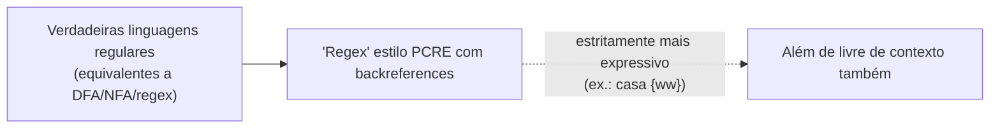

## Objetivos de Aprendizagem

- Identificar pelo menos três ferramentas reais e cotidianas construídas diretamente sobre casamento de expressões regulares, e explicar o que significa, na prática, "compilar" uma regex em um autômato.
- Explicar, com um exemplo concreto, como recursos como backreferences levam mecanismos reais de regex (por exemplo, PCRE) além do que um verdadeiro autômato finito consegue reconhecer.
- Explicar como a gramática de referência de uma linguagem de programação real é escrita em uma notação estilo CFG (BNF ou EBNF) e como um parser é construído a partir dela.
- Conectar a equivalência teórica PDA-CFG ao fato prático de que um parser real é, em seu núcleo, uma implementação procedural da estrutura de uma gramática livre de contexto.
- Articular por que a distinção entre regular e livre de contexto, coberta ao longo desta disciplina, não é meramente acadêmica, apontando para uma tarefa concreta para a qual cada nível é (e não é) adequado.

## Contexto e Motivação

Tudo o que foi coberto nesta disciplina até agora (DFAs, NFAs, expressões regulares, sua equivalência mútua, gramáticas livres de contexto, autômatos de pilha, e os lemas do bombeamento marcando a fronteira de cada classe) não é um exercício abstrato confinado a um curso teórico. Duas das categorias de ferramentas de software mais usadas em existência são, bem diretamente, implementações exatamente desses formalismos: mecanismos de expressão regular, rodando por baixo de tudo, do `grep` a um buscar-e-substituir de editor de texto a uma regra de validação de entrada de formulário web, e parsers, o componente dentro de todo compilador e interpretador que pega o texto do código-fonte e recupera sua estrutura gramatical, rodando sobre uma gramática livre de contexto da mesma forma que um mecanismo de regex roda sobre um autômato finito. Ver esses dois retornos concretamente é o objetivo deste conceito de encerramento antes que a disciplina faça a transição para o que vem a seguir: a teoria construída aqui não é um desvio antes da engenharia de software "de verdade", ela *é* a engenharia de software, uma camada de abstração abaixo.

Também vale a pena ser honesto sobre onde a teoria e a prática divergem um pouco, porque essa divergência é em si informativa. Mecanismos de regex do mundo real, no interesse de expressividade, comumente incluem recursos que vão estritamente além do que qualquer autômato finito consegue reconhecer, um fato que vale a pena saber com precisão, não para ser encoberto, já que esclarece exatamente onde a equivalência limpa DFA-NFA-regex provada anteriormente nesta disciplina para de se aplicar às ferramentas usadas no dia a dia. Parsers reais, de forma similar, geralmente são construídos a partir de algo *equivalente a* uma CFG, em vez de uma tabela de transição de PDA desenhada à mão, mas a equivalência provada no conceito anterior é exatamente o que licencia tratar "escrever uma CFG" e "construir um parser funcional" como duas visões da mesma tarefa, que é por isso que as especificações de linguagem são escritas da forma como são.

## Teoria Central

### Expressões regulares em ferramentas reais de processamento de texto

As expressões regulares cobertas anteriormente nesta disciplina (concatenação, união, estrela de Kleene) são, pela equivalência autômatos-finitos-para-regex já provada, exatamente tão poderosas quanto DFAs e NFAs: nem mais, nem menos. Ferramentas reais construídas sobre essa teoria incluem:

- **`grep`** (e seus parentes `egrep`, `ripgrep`): busca em texto por linhas que casam com um padrão, onde o padrão é compilado em um mecanismo de casamento parecido com autômato antes que a varredura comece ("compilar" aqui significa literalmente construir algo equivalente a um NFA, ou uma representação mais otimizada, a partir da sintaxe da regex, exatamente a direção da construção regex-para-autômato coberta anteriormente), de modo que casar uma linha contra o padrão se torna uma única execução de autômato sobre os caracteres daquela linha.
- **Buscar-e-substituir de editores de texto**: quase todo editor de código e IDE moderno oferece um "modo regex" para busca e substituição, deixando um usuário descrever um padrão como `\d{3}-\d{4}` (a forma de um número de telefone) uma vez e aplicá-lo a um arquivo inteiro ou a uma base de código inteira, em vez de escrever à mão uma rotina de varredura de string sob medida para cada forma dessas.
- **Validação de entrada**: formulários web e APIs de backend muito comumente validam campos (endereços de e-mail, códigos postais, nomes de usuário) contra um padrão de regex antes de aceitá-los, um uso direto e prático de "essa string pertence a uma linguagem regular especificada," a exata pergunta que um DFA responde.

### Onde mecanismos de regex reais excedem verdadeiras expressões regulares

Aqui está a nuance honesta: muitos mecanismos de regex de produção, **PCRE** (Perl-Compatible Regular Expressions), e por extensão a maior parte do suporte a regex em Python, JavaScript, Java, e linguagens similares, suportam um recurso chamado **backreferences**, escrito como `\1`, que casa com "qualquer texto que tenha sido capturado por um grupo anterior neste mesmo casamento," não um padrão fixo. Por exemplo, o padrão PCRE `(\w+)\s\1` casa com qualquer palavra repetida separada por um espaço, `"the the"` ou `"hello hello"`, porque `\1` se refere de volta a qualquer coisa que o primeiro grupo tenha de fato capturado nesta tentativa, não a um símbolo ou string fixa conhecida com antecedência.

Isso é formalmente significativo: um verdadeiro autômato finito não tem mecanismo para "lembrar uma substring arbitrária casada anteriormente e exigir que ela recorra exatamente," sua única memória é em qual dentre finitos estados ele está, fixado antes de qualquer entrada ser vista, exatamente a mesma limitação que o lema do bombeamento desta disciplina para linguagens regulares explora contra {0ⁿ1ⁿ}. Casar substrings repetidas de comprimento ilimitado via backreferences exige, no pior caso, mais poder computacional do que qualquer autômato finito (ou, correspondentemente, qualquer verdadeira expressão regular) consegue fornecer: a linguagem {ww : w ∈ {0,1}*} (uma string que é algum bloco repetido exatamente duas vezes) é comprovadamente nem sequer livre de contexto, quanto mais regular, ainda assim um padrão de backreference de uma linha a expressa diretamente. Então quando uma ferramenta anuncia "suporte a expressão regular" e inclui backreferences, asserções de lookahead, ou extensões similares, ela está, estrita e demonstravelmente, oferecendo algo mais expressivo do que as expressões regulares formais cobertas nesta disciplina, um recurso de engenharia genuinamente útil, mas sem um autômato finito correspondente, e vale a pena sinalizar isso precisamente porque a terminologia ("regex") é compartilhada enquanto o poder formal não é.



### Gramáticas livres de contexto definindo a sintaxe de linguagens de programação reais

O papel de uma CFG em um toolchain real aparece mais diretamente em como as linguagens de programação são especificadas em primeiro lugar. Especificações de linguagem (os documentos de referência oficiais para linguagens como Java, Python, ou SQL) tipicamente definem a sintaxe da linguagem usando uma notação estilo CFG, mais comumente **BNF** (Backus-Naur Form) ou sua extensão **EBNF** (Extended BNF, adicionando operadores de conveniência como `{...}` para repetição e `[...]` para partes opcionais, ambos apenas açúcar sintático sobre a mesma substância de CFG coberta nesta disciplina). Uma regra como

```
<if-statement> ::= "if" "(" <expression> ")" <statement> [ "else" <statement> ]
```

é, notação à parte, exatamente uma produção de CFG: `<if-statement>` é um não terminal, os tokens entre aspas são terminais, e o `[...]` opcional do else é abreviação para duas produções alternativas (uma com a cláusula else, uma sem), colapsáveis na forma de CFG comum coberta anteriormente nesta disciplina.

### Compiladores constroem parsers diretamente a partir de (algo equivalente a) uma CFG

O **parser** de um compilador é o componente que pega um fluxo de tokens (já quebrados em palavras por um estágio anterior de análise léxica) e recupera a estrutura gramatical, efetivamente, constrói algo equivalente a uma árvore de análise, o exato objeto que esta disciplina vem construindo à mão ao longo de seus conceitos de CFG. A equivalência PDA-CFG provada no conceito anterior é exatamente o que licencia isso: já que toda linguagem livre de contexto é reconhecida por algum autômato de pilha, e a gramática de uma linguagem pode ser mecanicamente transformada em um reconhecedor funcional, um parser real é, em seu núcleo estrutural, uma implementação procedural da CFG da linguagem, comumente uma variante que restringe a gramática a uma forma que permite análise determinística com um token de lookahead (um parser LL ou LR, na terminologia padrão), pela razão prática de que um compilador real precisa de uma única passagem determinística, não a busca não determinística completa que uma construção de PDA genérica exploraria. A conexão teórica subjacente, no entanto, é o retorno direto de tudo o que foi construído ao longo desta disciplina: uma gramática escrita no papel em BNF e um parser funcional gerando mensagens de erro reais para código-fonte real quebrado são, formalmente, duas visões da mesma estrutura livre de contexto.

## Exemplos Resolvidos

### Exemplo 1: rastreando uma regex através da compilação até o casamento

**Problema:** Rastreie conceitualmente o que acontece quando `grep -E "colou?r"` é executado contra um arquivo de texto, conectando cada passo a um conceito já coberto.

**Raciocínio:** o padrão `colou?r` descreve a linguagem regular {"color", "colour"} (o `?` torna o `u` precedente opcional, equivalente, na notação já coberta, a `colo(u|ε)r`). O `grep` compila esse padrão em um autômato equivalente a um pequeno NFA (ou DFA, dependendo da implementação) reconhecendo exatamente essa linguagem de duas strings, usando precisamente a construção regex-para-autômato coberta anteriormente nesta disciplina. Ele então roda aquele autômato contra cada linha do arquivo, símbolo por símbolo, reportando um casamento onde quer que alguma substring da linha seja aceita, uma execução de NFA, rodada uma vez por posição inicial candidata na linha, exatamente a mecânica de execução de autômato coberta desde os primeiríssimos conceitos de DFA/NFA nesta disciplina, agora fazendo trabalho real e útil em escala genuína.

### Exemplo 2: por que `(\w+)\s\1` não pode ser uma verdadeira expressão regular

**Problema:** Confirme concretamente que nenhum autômato finito consegue reconhecer a linguagem casada pelo padrão de backreference `(\w+)\s\1` (uma palavra, um espaço, e então a palavra idêntica repetida).

**Raciocínio:** esse padrão casa com strings da forma w·" "·w para uma palavra arbitrária w, estruturalmente a mesma forma de {ww} discutida na Teoria Central. Suponha, por contradição, que algum DFA com k estados reconheça essa linguagem. Considere a string aᵏ·" "·aᵏ (k cópias da letra `a`, um espaço, e então mais k cópias de `a`), essa string casa com o padrão (w = "aᵏ"). Por um argumento diretamente paralelo ao lema do bombeamento regular (ler os primeiros k+1 caracteres do bloco aᵏ força um estado repetido, pela casa dos pombos, entre apenas k estados disponíveis), o DFA não consegue distinguir corretamente comprimentos suficientemente diferentes do primeiro bloco para garantir que o segundo bloco o case exatamente, bombear o primeiro bloco sem correspondentemente bombear o segundo produz uma string como aᵏ⁺¹·" "·aᵏ, que não casa com o padrão, ainda assim o DFA (não tendo forma de detectar a incompatibilidade, pelo argumento de bombeamento) ainda a aceitaria. Essa contradição confirma: casar uma substring *ilimitada, vista anteriormente, e exatamente repetida* está além do poder de qualquer autômato finito, que é exatamente por que mecanismos capazes de backreference como o PCRE são, formalmente, mais poderosos do que expressões regulares propriamente ditas, não por acidente de implementação, mas como uma lacuna de expressividade genuína e demonstrável.

### Exemplo 3: de uma regra de gramática BNF ao trabalho de um parser

**Problema:** Dada a regra BNF `<expr> ::= <expr> "+" <term> | <term>` (adição recursiva à esquerda), descreva o que um parser construído a partir dessa regra precisa fazer quando recebe o fluxo de tokens `3 + 4 + 5`, e conecte isso a derivações livres de contexto.

**Raciocínio:** essa regra é exatamente uma produção de CFG (usando `<expr>` e `<term>` como não terminais), e analisar `3 + 4 + 5` significa encontrar uma derivação desse fluxo de tokens a partir de `<expr>`, concretamente: `<expr>` ⇒ `<expr> + <term>` ⇒ `<expr> + <term> + <term>` ⇒ `<term> + <term> + <term>` ⇒ `3 + 4 + 5` (usando a regra recursiva à esquerda duas vezes, depois chegando ao caso base `<expr> ::= <term>`). Um parser real não busca esse espaço às cegas da forma que uma construção de PDA genérica poderia: ele usa um algoritmo fixo explorando a forma específica da regra (aqui, a recursão à esquerda sinalizando agrupamento da esquerda para a direita, associativo à esquerda: `3 + 4` agrupado primeiro, depois `+ 5`) para construir a árvore de análise deterministicamente em uma passagem, mas o *resultado* que produz (uma árvore de análise com raiz em `<expr>`, casando exatamente com essa derivação) é o mesmo objeto que os conceitos de CFG desta disciplina já definiram, agora servindo como a representação interna do compilador para a aritmética a ser avaliada ou compilada adiante.

## Equívocos Comuns e Armadilhas

- **"Se uma ferramenta chama de 'expressão regular,' deve ser uma verdadeira expressão regular no sentido formal."** Como mostrado acima, isso é falso para qualquer mecanismo que suporte backreferences (PCRE e seus muitos derivados), o nome é herdado da teoria formal mas o conjunto de recursos cresceu além dela; se um padrão *específico* é verdadeiramente regular depende de ele evitar recursos estilo backreference, não do que a ferramenta se autodenomina.
- **"Um parser simplesmente executa as produções da CFG de forma não determinística, como a construção de PDA do conceito anterior."** Parsers reais quase universalmente se restringem a uma forma de gramática (ou transformam uma CFG arbitrária em uma) que suporta análise determinística e eficiente com lookahead limitado, a equivalência teórica PDA-CFG garante que *algum* reconhecedor existe, mas compiladores reais se importam com um rápido e determinístico, o que é um requisito prático mais forte sobreposto à equivalência, não entregue automaticamente por ela.
- **"BNF e EBNF são um formalismo diferente, concorrente, das CFGs, não a mesma coisa."** São conveniências notacionais sobre exatamente a mesma substância de gramática livre de contexto coberta ao longo desta disciplina, os operadores `{...}` e `[...]` da EBNF são abreviações que se expandem mecanicamente em produções comuns de CFG usando recursão e alternância, não um tipo fundamentalmente diferente de gramática.
- **"Já que regex é 'mais fraca' do que CFGs, ferramentas reais deveriam sempre preferir gramáticas/parsers completos em vez de regex."** Muitas tarefas reais e bem definidas (validar uma entrada de forma fixa, encontrar linhas que casam com um padrão simples) genuinamente são problemas de linguagem regular, e uma ferramenta baseada em regex é a escolha certa e eficiente para elas; recorrer a um parser completo baseado em CFG para uma tarefa que é verdadeiramente regular é maquinaria desnecessária, não uma marca de rigor. Combinar a ferramenta com a classe real à qual o problema pertence (um tema recorrente em toda esta disciplina) é o instinto de engenharia correto nas duas direções.

## Resumo

Duas das categorias mais comuns de ferramentas de software são implementações diretas e cotidianas da teoria desta disciplina: mecanismos de regex (`grep`, buscar-e-substituir de editor, validação de entrada) compilam uma expressão regular em algo equivalente a um autômato finito antes de casar, exatamente a construção coberta anteriormente nesta disciplina, com a ressalva honesta de que mecanismos amplamente usados como o PCRE adicionam recursos como backreferences que demonstravelmente excedem o que qualquer verdadeiro autômato finito (ou verdadeira expressão regular) consegue reconhecer, já que casar uma substring ilimitada e exatamente repetida está além da memória de estado finito. Gramáticas livres de contexto, enquanto isso, são como especificações reais de linguagem de programação definem sintaxe, escritas em notação BNF ou EBNF diretamente equivalente às produções de CFG cobertas ao longo desta disciplina, e o parser de um compilador real é, em seu núcleo estrutural, uma implementação procedural daquela gramática, licenciado formalmente pela equivalência PDA-CFG provada no conceito anterior, mesmo que parsers reais tipicamente se restrinjam a formas de gramática determinísticas e de lookahead limitado por eficiência prática em vez de uma busca de PDA não determinística genérica.

## Documentation Links

- [Sipser: Introduction to the Theory of Computation, 3ª ed.](https://cs.brown.edu/courses/csci1810/fall-2023/resources/ch2_readings/Sipser_Introduction.to.the.Theory.of.Computation.3E.pdf): doc
- [ACM/IEEE CS2013: Full Curriculum Site](https://csed.acm.org/cs2013-version/): doc
