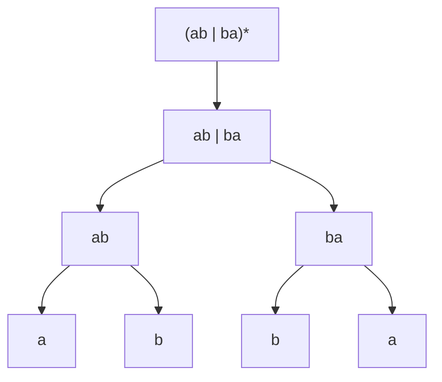

## Learning Objectives

- State the syntax of the core regular expression operators (single symbols, concatenation, union, Kleene star) and the precedence order in which they combine.
- Give the precise language (set of strings) that any regular expression built from these operators describes, symbol by symbol.
- Build up a moderately complex regular expression from these primitives and describe exactly which strings it matches and which it does not.
- Distinguish a regular expression's formal semantics (an exact set of strings) from the "matches somewhere in a larger string" behavior of practical regex tools.
- State, without proof, the relationship between regular expressions and DFAs as two descriptions of the same class of languages.

## Context & Motivation

A DFA describes a language operationally — as a machine, with states and transitions, that you have to run to find out whether a string belongs. A regular expression describes exactly the same kind of language *declaratively* — as a compact pattern built from a handful of algebraic operators, with no notion of "running" anything at all. This shift in perspective, from procedure to expression, is one of the most useful ideas this discipline covers, because a huge amount of real software — every regex engine embedded in every mainstream programming language, `grep`, lexical analyzers in every compiler front end — exists specifically to let programmers state *what* strings they want to match, in this compact notation, rather than hand-building the *machine* that recognizes them.

Both MIT's 18.404J and Stanford's CS154 introduce regular expressions immediately after the DFA for a specific reason: the two notations turn out to be exactly equally expressive (a fact stated here and proved rigorously two concepts later, in `regular-expressions-to-finite-automata` and `finite-automata-to-regular-expressions`), so studying them back to back lets a student see the same set of languages from two genuinely different angles. Learning to read a regular expression precisely — not "kind of matching things that look like this," but describing one exact, well-defined set of strings — is the actual skill this concept builds. It is also a skill with an immediate practical payoff: understanding the formal core operators (concatenation, union, star) makes it far easier to reason correctly about the extended syntax (`+`, `?`, character classes, anchors) that real-world regex engines layer on top, because all of that extended syntax is just convenient shorthand definable in terms of these three primitives.

The formal treatment here matters because informal, "vibes-based" reading of a regular expression is a common and genuinely costly source of bugs in real software — a regex that a developer believes matches one set of strings but that, read with exact precedence and exact semantics, actually matches a subtly different set, is a recurring category of real production defect (unintentionally over-permissive input validation is the most common flavor). Precision here is not pedantry; it is the actual point.

## Core Theory

### The alphabet of a regular expression: symbols and the base cases

A regular expression (regex) is built recursively over some fixed alphabet Σ. The base cases are:

- **A single symbol** a ∈ Σ, as a regular expression, describes the language { "a" } — the set containing exactly the one-character string "a", nothing else.
- **The empty string**, written ε, as a regular expression, describes the language { "" } — the set containing exactly the empty string.
- **The empty language**, written ∅, as a regular expression, describes the language { } — the set containing *no* strings at all (not even the empty string). This is distinct from ε: ∅ matches nothing whatsoever, while ε matches exactly one thing, the empty string.

These three base cases are the atoms; every more complex regular expression is built by combining smaller regular expressions using the operators below.

### Concatenation

If R and S are regular expressions describing languages L(R) and L(S), then their **concatenation**, written RS (juxtaposition, no explicit operator symbol), describes the language L(R)L(S) = { xy : x ∈ L(R) and y ∈ L(S) } — every string formed by gluing together one string from L(R) followed immediately by one string from L(S). For example, if R = "a" (language {"a"}) and S = "b" (language {"b"}), then RS = "ab" describes the language {"ab"} — the single string formed by concatenating "a" and "b". Concatenation of longer expressions works the same way: `abc` describes {"abc"}, the concatenation of three single-symbol expressions.

### Union

If R and S are regular expressions, their **union**, written R | S (the vertical bar), describes the language L(R) ∪ L(S) — every string that belongs to L(R), or to L(S), or to both. For example, `a | b` describes the language {"a", "b"} — exactly the two one-character strings "a" and "b", and nothing else. Union is how a regular expression expresses a *choice* between alternatives.

### Kleene star

If R is a regular expression, its **Kleene star**, written R*, describes the language L(R)* = the set of all strings formed by concatenating *zero or more* strings from L(R), in any number and any order (repeats allowed). Formally, L(R)* = { x₁x₂⋯xₖ : k ≥ 0, each xᵢ ∈ L(R) }. The k = 0 case is what guarantees ε ∈ L(R)* always, regardless of what R is — the star always makes the empty string a match, because concatenating together zero copies of anything yields the empty string. For example, if R = "a" (language {"a"}), then R* = "a*" describes the language {"", "a", "aa", "aaa", …} — every string of zero or more a's.

### Precedence and grouping

When these operators are combined without explicit parentheses, they are applied in a fixed precedence order, from tightest-binding to loosest: **star binds tightest**, then **concatenation**, then **union binds loosest**. So `ab*` means `a(b*)`, not `(ab)*` — a single `a` followed by zero or more `b`s, not zero or more repetitions of `ab`. Similarly, `a | bc` means `a | (bc)`, not `(a|b)c`. Parentheses override this default grouping exactly as in ordinary arithmetic, and are used freely whenever the default reading isn't the intended one.

### Building up a more complex expression

Consider R = `(ab | ba)*`. Reading it from the inside out: `ab` describes {"ab"}; `ba` describes {"ba"}; their union `ab | ba` describes {"ab", "ba"} — either the two-character string "ab" or the two-character string "ba"; applying star to the whole parenthesized union gives (`ab | ba`)* = the language of all strings formed by concatenating zero or more copies of "ab" or "ba", in any order and any mixture. This includes ε (zero copies), "ab", "ba" (one copy of either), "abab", "abba", "baab", "baba" (two copies in any combination), and so on — but crucially does **not** include a string like "aab", because "aab" cannot be split into a sequence of whole copies of "ab" and "ba" (splitting it as "a"+"ab" leaves a leftover "a" that matches neither "ab" nor "ba", and no other split works either).

This tree mirrors exactly the recursive definition: the language of the whole expression is built up mechanically from the languages of its parts, at every level, using exactly the three combining rules (concatenation, union, star) already given.

### Regular expressions and DFAs describe the same class of languages

A central fact, stated here without proof (the proof is the subject of two later concepts, `regular-expressions-to-finite-automata` and `finite-automata-to-regular-expressions`, together forming *Kleene's theorem*): **a language is describable by some regular expression if and only if it is recognized by some DFA.** The two notations — one algebraic and declarative, one operational and machine-based — turn out to have exactly the same expressive power, describing exactly the class of regular languages named in the Chomsky hierarchy. This is not obvious from the definitions alone (a regex has no states or transitions in its definition at all), which is exactly what makes it worth proving carefully once the machinery (particularly nondeterministic finite automata, covered next) is in place.

## Worked Examples

### Example 1 — precisely characterizing a simple expression's language

**Problem:** What language does the regular expression `a*b` describe? Test whether "b", "ab", "aab", and "ba" belong to it.

**Reasoning.** `a*` describes {"", "a", "aa", "aaa", …} — any number (including zero) of a's. Concatenating with `b` (language {"b"}) gives every string formed by some number of a's followed by exactly one b: L(a*b) = {"b", "ab", "aab", "aaab", …} — precisely the strings of the form aⁿb for n ≥ 0.

**Testing.** "b" ✓ (n = 0 a's, then b). "ab" ✓ (n = 1). "aab" ✓ (n = 2). "ba" ✗ — the b must come last, and "ba" has the b first with an a after it, which is not of the form aⁿb for any n; ba does not decompose as (some a's)(exactly one b).

### Example 2 — a union of two concatenations, applied to specific strings

**Problem:** What language does `(0|1)(0|1)*0` describe? Determine whether "10", "0", "111", and "1010" match.

**Reasoning.** `(0|1)` describes {"0", "1"} — a single binary digit. `(0|1)*` describes any string of zero or more binary digits (all of Σ* for Σ = {0,1}). Concatenating `(0|1)` then `(0|1)*` then the literal `0` gives: one binary digit, followed by any number (including zero) of further binary digits, followed by a mandatory final `0`. Overall, this describes every binary string of length ≥ 2 that ends in `0`. (The leading `(0|1)` forces length at least 1 before the mandatory trailing 0, so length at least 2 overall.)

**Testing.** "10" ✓ — length 2, ends in 0 (`(0|1)`="1", `(0|1)*`="", trailing "0"). "0" ✗ — length 1; the expression requires at least one digit *before* the mandatory trailing 0, and "0" alone has nothing left over to serve as that first digit and the trailing 0 both (there is no way to split "0" into a nonempty digit, zero-or-more digits, and then a final "0" — that needs at least two characters). "111" ✗ — doesn't end in 0. "1010" ✓ — ends in 0, length ≥ 2 (`(0|1)`="1", `(0|1)*`="01", trailing "0").

### Example 3 — a nested star expression and what it excludes

**Problem:** What language does `a(a|b)*a` describe? Is "aa" in it? Is "aba" in it? Is "a" in it? Is "abba" in it?

**Reasoning.** `a` (first) forces the string to start with an `a`. `(a|b)*` matches any string over {a, b} of any length, including the empty string, in the middle. The final `a` forces the string to end with an `a`. Combined: every string over {a, b} that starts with `a` *and* ends with `a`, with anything at all from {a,b}* in between — including strings where the "start" and "end" a's overlap into the same single character only when the string has length exactly 1, but here the two a's are both mandatory literal positions, so the minimum possible length is 2 (first `a`, empty middle, then... but wait, the final `a` is a separate mandatory character, so minimum total length is 2: first `a` + empty `(a|b)*` + final `a` = "aa").

**Testing.** "aa" ✓ — first `a` = "a", middle `(a|b)*` = "" (zero repetitions), final `a` = "a"; total "aa". "aba" ✓ — first `a`, middle "b", final `a"; total "aba". "a" ✗ — length 1 cannot supply both a mandatory leading `a` and a mandatory, separate trailing `a`; there's only one character to spend on two mandatory positions. "abba" ✓ — first `a`, middle "bb", final `a`; total "abba", and indeed it starts and ends with `a`.

## Common Misconceptions & Pitfalls

- **"Star means 'one or more,' the way `+` does in extended regex syntax."** In the formal core syntax covered here, `*` means *zero or more* — the empty string is always in L(R*) for any R. "One or more" is the separate `+` operator found in extended/practical regex dialects, which is itself just shorthand for `RR*` (one mandatory copy of R, followed by zero or more further copies) — definable from the core operators, not a fourth primitive.
- **"`ab*` and `(ab)*` describe the same language."** Star binds to the single immediately preceding unit, not to an entire preceding concatenation, unless parentheses say otherwise. `ab*` = `a(b*)` = "a" followed by any number of b's (e.g. "a", "ab", "abbb"); `(ab)*` = zero or more full repetitions of the two-character block "ab" (e.g. "", "ab", "abab", "ababab"). These are different languages — "abbb" is in the first but not the second, and "abab" is in the second but not the first.
- **"A regex 'matching' a string in a real programming language's regex engine is the same as the formal semantics here."** Most practical regex engines default to *searching* for a match anywhere within a larger string (or provide separate `match`/`search`/`fullmatch` operations), and add many convenience features (anchors, character classes, backreferences — some of which exceed regular-language expressive power entirely). The formal semantics in this concept always describe the *entire* string matching the expression from start to end, corresponding to what a practical engine would call a full/exact match, not a substring search.
- **"Since ε and ∅ both seem to mean 'nothing,' they're interchangeable."** They describe two very different languages: L(ε) = {""} — a language with exactly one member, the empty string — while L(∅) = {} — a language with *no* members at all, not even the empty string. Concatenating anything with ∅ gives ∅ (there's no string in the empty language to glue onto), while concatenating anything with ε leaves it unchanged (gluing on the empty string changes nothing) — the two act as very different algebraic identities, roughly analogous to the difference between 0 and the empty set in ordinary set algebra.

## Summary

A regular expression describes a language recursively, built from three atoms (a single symbol, ε, and ∅) combined with three operators: concatenation (RS, gluing strings from L(R) and L(S) together), union (R|S, either language), and Kleene star (R*, zero or more concatenated copies from L(R), which always includes ε). Star binds tightest, then concatenation, then union, with parentheses overriding the default grouping wherever needed. Each construct's meaning is a precise set of strings, not an approximate pattern, and complex expressions are read by mechanically applying these three rules from the inside out. Regular expressions and DFAs, despite looking nothing alike, describe exactly the same class of languages — the regular languages — a fact this concept states without proof and the next several concepts (via nondeterministic finite automata and the subset construction) build the machinery to prove rigorously.

## Documentation Links

- [MIT 18.404J — OCW Calendar](https://ocw.mit.edu/courses/18-404j-theory-of-computation-fall-2020/pages/calendar/) — doc
- [Sipser — Introduction to the Theory of Computation, 3rd ed.](https://cs.brown.edu/courses/csci1810/fall-2023/resources/ch2_readings/Sipser_Introduction.to.the.Theory.of.Computation.3E.pdf) — doc
