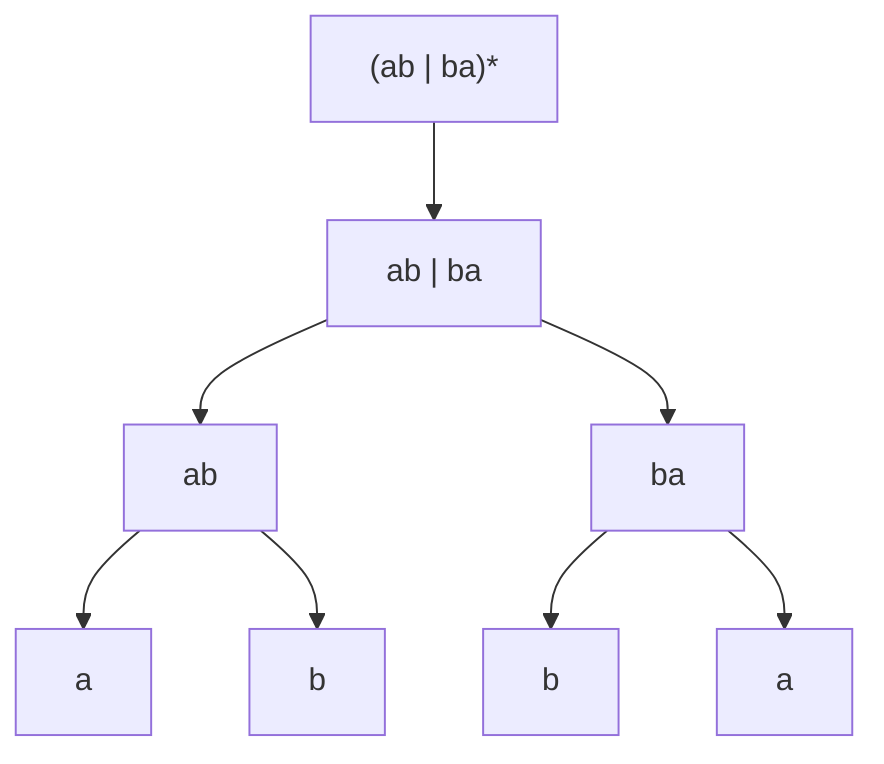

## Objetivos de Aprendizagem

- Enunciar a sintaxe dos operadores centrais de expressão regular (símbolos únicos, concatenação, união, estrela de Kleene) e a ordem de precedência em que eles se combinam.
- Dar a linguagem precisa (conjunto de strings) que qualquer expressão regular construída a partir desses operadores descreve, símbolo por símbolo.
- Construir uma expressão regular moderadamente complexa a partir desses primitivos e descrever exatamente quais strings ela casa e quais não.
- Distinguir a semântica formal de uma expressão regular (um conjunto exato de strings) do comportamento de "casar em algum lugar dentro de uma string maior" de ferramentas práticas de regex.
- Enunciar, sem prova, a relação entre expressões regulares e DFAs como duas descrições da mesma classe de linguagens.

## Contexto e Motivação

Um DFA descreve uma linguagem operacionalmente, como uma máquina, com estados e transições, que você precisa executar para descobrir se uma string pertence a ela. Uma expressão regular descreve exatamente o mesmo tipo de linguagem *declarativamente*, como um padrão compacto construído a partir de um punhado de operadores algébricos, sem noção alguma de "executar" nada. Essa mudança de perspectiva, de procedimento para expressão, é uma das ideias mais úteis que esta disciplina cobre, porque uma quantidade enorme de software real (todo mecanismo de regex embutido em toda linguagem de programação predominante, `grep`, analisadores léxicos em todo front-end de compilador) existe especificamente para deixar programadores enunciarem *quais* strings eles querem casar, nessa notação compacta, em vez de construir à mão a *máquina* que as reconhece.

Tanto o 18.404J do MIT quanto o CS154 de Stanford introduzem expressões regulares imediatamente após o DFA por uma razão específica: as duas notações acabam sendo exatamente igualmente expressivas (um fato enunciado aqui e provado rigorosamente dois conceitos depois, em `regular-expressions-to-finite-automata` e `finite-automata-to-regular-expressions`), então estudá-las lado a lado deixa um estudante ver o mesmo conjunto de linguagens a partir de dois ângulos genuinamente diferentes. Aprender a ler uma expressão regular com precisão, não "meio que casando coisas parecidas com isso," mas descrevendo um conjunto exato e bem definido de strings, é a habilidade real que este conceito constrói. É também uma habilidade com retorno prático imediato: entender os operadores centrais formais (concatenação, união, estrela) torna muito mais fácil raciocinar corretamente sobre a sintaxe estendida (`+`, `?`, classes de caracteres, âncoras) que mecanismos de regex do mundo real sobrepõem, porque toda essa sintaxe estendida é apenas abreviação conveniente definível em termos desses três primitivos.

O tratamento formal aqui importa porque a leitura informal, "por vibração," de uma expressão regular é uma fonte comum e genuinamente custosa de bugs em software real, uma regex que um desenvolvedor acredita casar com um conjunto de strings mas que, lida com precedência e semântica exatas, na verdade casa com um conjunto sutilmente diferente, é uma categoria recorrente de defeito real de produção (validação de entrada não intencionalmente permissiva demais é a variante mais comum). Precisão aqui não é pedantismo; é o ponto real.

## Teoria Central

### O alfabeto de uma expressão regular: símbolos e os casos base

Uma expressão regular (regex) é construída recursivamente sobre algum alfabeto fixo Σ. Os casos base são:

- **Um único símbolo** a ∈ Σ, como expressão regular, descreve a linguagem { "a" }, o conjunto contendo exatamente a string de um caractere "a", nada mais.
- **A string vazia**, escrita ε, como expressão regular, descreve a linguagem { "" }, o conjunto contendo exatamente a string vazia.
- **A linguagem vazia**, escrita ∅, como expressão regular, descreve a linguagem { }, o conjunto contendo *nenhuma* string sequer (nem mesmo a string vazia). Isso é distinto de ε: ∅ não casa com absolutamente nada, enquanto ε casa com exatamente uma coisa, a string vazia.

Esses três casos base são os átomos; toda expressão regular mais complexa é construída combinando expressões regulares menores usando os operadores abaixo.

### Concatenação

Se R e S são expressões regulares descrevendo linguagens L(R) e L(S), então sua **concatenação**, escrita RS (justaposição, sem símbolo de operador explícito), descreve a linguagem L(R)L(S) = { xy : x ∈ L(R) e y ∈ L(S) }, toda string formada colando uma string de L(R) seguida imediatamente por uma string de L(S). Por exemplo, se R = "a" (linguagem {"a"}) e S = "b" (linguagem {"b"}), então RS = "ab" descreve a linguagem {"ab"}, a única string formada concatenando "a" e "b". A concatenação de expressões mais longas funciona da mesma forma: `abc` descreve {"abc"}, a concatenação de três expressões de símbolo único.

### União

Se R e S são expressões regulares, sua **união**, escrita R | S (a barra vertical), descreve a linguagem L(R) ∪ L(S), toda string que pertence a L(R), ou a L(S), ou a ambas. Por exemplo, `a | b` descreve a linguagem {"a", "b"}, exatamente as duas strings de um caractere "a" e "b", e nada mais. União é como uma expressão regular expressa uma *escolha* entre alternativas.

### Estrela de Kleene

Se R é uma expressão regular, sua **estrela de Kleene**, escrita R*, descreve a linguagem L(R)* = o conjunto de todas as strings formadas concatenando *zero ou mais* strings de L(R), em qualquer número e qualquer ordem (repetições permitidas). Formalmente, L(R)* = { x₁x₂⋯xₖ : k ≥ 0, cada xᵢ ∈ L(R) }. O caso k = 0 é o que garante que ε ∈ L(R)* sempre, independentemente do que R seja, porque a estrela sempre faz da string vazia um casamento: concatenar zero cópias de qualquer coisa produz a string vazia. Por exemplo, se R = "a" (linguagem {"a"}), então R* = "a*" descreve a linguagem {"", "a", "aa", "aaa", …}, toda string de zero ou mais a's.

### Precedência e agrupamento

Quando esses operadores são combinados sem parênteses explícitos, eles são aplicados em uma ordem de precedência fixa, do que se liga mais forte ao que se liga mais fraco: **estrela se liga mais forte**, depois **concatenação**, depois **união se liga mais fraco**. Então `ab*` significa `a(b*)`, não `(ab)*`, um único `a` seguido por zero ou mais `b`s, não zero ou mais repetições de `ab`. Da mesma forma, `a | bc` significa `a | (bc)`, não `(a|b)c`. Parênteses sobrepõem esse agrupamento padrão exatamente como na aritmética comum, e são usados livremente sempre que a leitura padrão não é a pretendida.

### Construindo uma expressão mais complexa

Considere R = `(ab | ba)*`. Lendo de dentro para fora: `ab` descreve {"ab"}; `ba` descreve {"ba"}; a união delas `ab | ba` descreve {"ab", "ba"}, ou a string de dois caracteres "ab" ou a string de dois caracteres "ba"; aplicar estrela à união inteira entre parênteses dá (`ab | ba`)* = a linguagem de todas as strings formadas concatenando zero ou mais cópias de "ab" ou "ba", em qualquer ordem e qualquer mistura. Isso inclui ε (zero cópias), "ab", "ba" (uma cópia de qualquer uma), "abab", "abba", "baab", "baba" (duas cópias em qualquer combinação), e assim por diante, mas crucialmente **não** inclui uma string como "aab", porque "aab" não pode ser dividida em uma sequência de cópias inteiras de "ab" e "ba" (dividi-la como "a"+"ab" deixa um resto "a" que não casa com "ab" nem com "ba", e nenhuma outra divisão funciona também).

Essa árvore espelha exatamente a definição recursiva: a linguagem da expressão inteira é construída mecanicamente a partir das linguagens de suas partes, em todo nível, usando exatamente as três regras de combinação (concatenação, união, estrela) já dadas.

### Expressões regulares e DFAs descrevem a mesma classe de linguagens

Um fato central, enunciado aqui sem prova (a prova é o assunto de dois conceitos posteriores, `regular-expressions-to-finite-automata` e `finite-automata-to-regular-expressions`, juntos formando o *teorema de Kleene*): **uma linguagem é descritível por alguma expressão regular se e somente se é reconhecida por algum DFA.** As duas notações, uma algébrica e declarativa, uma operacional e baseada em máquina, acabam tendo exatamente o mesmo poder expressivo, descrevendo exatamente a classe de linguagens regulares nomeada na hierarquia de Chomsky. Isso não é óbvio a partir das definições sozinhas (uma regex não tem estados ou transições em sua definição de forma alguma), o que é exatamente o que torna válido prová-lo com cuidado uma vez que a maquinaria (particularmente autômatos finitos não determinísticos, cobertos a seguir) esteja em vigor.

## Exemplos Resolvidos

### Exemplo 1: caracterizando precisamente a linguagem de uma expressão simples

**Problema:** Que linguagem a expressão regular `a*b` descreve? Teste se "b", "ab", "aab", e "ba" pertencem a ela.

**Raciocínio.** `a*` descreve {"", "a", "aa", "aaa", …}, qualquer número (incluindo zero) de a's. Concatenar com `b` (linguagem {"b"}) dá toda string formada por algum número de a's seguido por exatamente um b: L(a*b) = {"b", "ab", "aab", "aaab", …}, precisamente as strings da forma aⁿb para n ≥ 0.

**Testando.** "b" ✓ (n = 0 a's, depois b). "ab" ✓ (n = 1). "aab" ✓ (n = 2). "ba" ✗, o b precisa vir por último, e "ba" tem o b primeiro com um a depois, o que não está na forma aⁿb para nenhum n; ba não se decompõe como (alguns a's)(exatamente um b).

### Exemplo 2: uma união de duas concatenações, aplicada a strings específicas

**Problema:** Que linguagem `(0|1)(0|1)*0` descreve? Determine se "10", "0", "111", e "1010" casam.

**Raciocínio.** `(0|1)` descreve {"0", "1"}, um único dígito binário. `(0|1)*` descreve qualquer string de zero ou mais dígitos binários (todo Σ* para Σ = {0,1}). Concatenar `(0|1)` depois `(0|1)*` depois o `0` literal dá: um dígito binário, seguido por qualquer número (incluindo zero) de dígitos binários adicionais, seguido por um `0` final obrigatório. No geral, isso descreve toda string binária de comprimento ≥ 2 que termina em `0`. (O `(0|1)` inicial força comprimento pelo menos 1 antes do 0 final obrigatório, então comprimento pelo menos 2 no total.)

**Testando.** "10" ✓, comprimento 2, termina em 0 (`(0|1)`="1", `(0|1)*`="", 0 final). "0" ✗, comprimento 1; a expressão exige pelo menos um dígito *antes* do 0 final obrigatório, e "0" sozinho não tem nada sobrando para servir como esse primeiro dígito e o 0 final ao mesmo tempo (não há forma de dividir "0" em um dígito não vazio, zero ou mais dígitos, e depois um 0 final, isso precisa de pelo menos dois caracteres). "111" ✗, não termina em 0. "1010" ✓, termina em 0, comprimento ≥ 2 (`(0|1)`="1", `(0|1)*`="01", 0 final).

### Exemplo 3: uma expressão de estrela aninhada e o que ela exclui

**Problema:** Que linguagem `a(a|b)*a` descreve? "aa" está nela? "aba" está nela? "a" está nela? "abba" está nela?

**Raciocínio.** `a` (primeiro) força a string a começar com um `a`. `(a|b)*` casa com qualquer string sobre {a, b} de qualquer comprimento, incluindo a string vazia, no meio. O `a` final força a string a terminar com um `a`. Combinado: toda string sobre {a, b} que começa com `a` *e* termina com `a`, com qualquer coisa de {a,b}* no meio, incluindo strings onde os a's de "início" e "fim" se sobrepõem no mesmo caractere único só quando a string tem comprimento exatamente 1, mas aqui os dois a's são ambos posições literais obrigatórias, então o comprimento mínimo possível é 2 (primeiro `a`, meio vazio, depois... mas espere, o `a` final é um caractere obrigatório separado, então o comprimento total mínimo é 2: primeiro `a` + `(a|b)*` vazio + `a` final = "aa").

**Testando.** "aa" ✓, primeiro `a` = "a", meio `(a|b)*` = "" (zero repetições), `a` final = "a"; total "aa". "aba" ✓, primeiro `a`, meio "b", final `a`; total "aba". "a" ✗, comprimento 1 não consegue fornecer tanto um `a` inicial obrigatório quanto um `a` final obrigatório e separado; há só um caractere para gastar em duas posições obrigatórias. "abba" ✓, primeiro `a`, meio "bb", final `a`; total "abba", e de fato começa e termina com `a`.

## Equívocos Comuns e Armadilhas

- **"Estrela significa 'um ou mais,' do jeito que `+` significa em sintaxe de regex estendida."** Na sintaxe formal central coberta aqui, `*` significa *zero ou mais*, a string vazia está sempre em L(R*) para qualquer R. "Um ou mais" é o operador `+` separado encontrado em dialetos de regex estendidos/práticos, que é ele mesmo apenas abreviação para `RR*` (uma cópia obrigatória de R, seguida por zero ou mais cópias adicionais), definível a partir dos operadores centrais, não um quarto primitivo.
- **"`ab*` e `(ab)*` descrevem a mesma linguagem."** Estrela se liga à unidade única imediatamente precedente, não a uma concatenação precedente inteira, a menos que parênteses digam o contrário. `ab*` = `a(b*)` = "a" seguido por qualquer número de b's (por exemplo "a", "ab", "abbb"); `(ab)*` = zero ou mais repetições completas do bloco de dois caracteres "ab" (por exemplo "", "ab", "abab", "ababab"). Essas são linguagens diferentes, "abbb" está na primeira mas não na segunda, e "abab" está na segunda mas não na primeira.
- **"Uma regex 'casando' com uma string no mecanismo de regex de uma linguagem de programação real é a mesma coisa que a semântica formal aqui."** A maioria dos mecanismos de regex práticos por padrão *busca* um casamento em qualquer lugar dentro de uma string maior (ou fornece operações separadas `match`/`search`/`fullmatch`), e adicionam muitos recursos de conveniência (âncoras, classes de caracteres, backreferences, alguns dos quais excedem o poder expressivo de linguagem regular inteiramente). A semântica formal neste conceito sempre descreve a string *inteira* casando com a expressão do início ao fim, correspondendo ao que um mecanismo prático chamaria de casamento completo/exato, não uma busca de substring.
- **"Já que ε e ∅ parecem ambos significar 'nada,' eles são intercambiáveis."** Eles descrevem duas linguagens bem diferentes: L(ε) = {""}, uma linguagem com exatamente um membro, a string vazia, enquanto L(∅) = {}, uma linguagem sem membro algum, nem mesmo a string vazia. Concatenar qualquer coisa com ∅ dá ∅ (não há string na linguagem vazia para colar), enquanto concatenar qualquer coisa com ε a deixa inalterada (colar a string vazia não muda nada), os dois agem como identidades algébricas bem diferentes, aproximadamente análogas à diferença entre 0 e o conjunto vazio na álgebra de conjuntos comum.

## Resumo

Uma expressão regular descreve uma linguagem recursivamente, construída a partir de três átomos (um único símbolo, ε, e ∅) combinados com três operadores: concatenação (RS, colando strings de L(R) e L(S) juntas), união (R|S, qualquer uma das linguagens), e estrela de Kleene (R*, zero ou mais cópias concatenadas de L(R), que sempre inclui ε). Estrela se liga mais forte, depois concatenação, depois união, com parênteses sobrepondo o agrupamento padrão onde quer que seja necessário. O significado de cada construção é um conjunto preciso de strings, não um padrão aproximado, e expressões complexas são lidas aplicando mecanicamente essas três regras de dentro para fora. Expressões regulares e DFAs, apesar de parecerem nada semelhantes, descrevem exatamente a mesma classe de linguagens, as linguagens regulares, um fato que este conceito enuncia sem prova e que os próximos vários conceitos (via autômatos finitos não determinísticos e a construção de subconjuntos) constroem a maquinaria para provar rigorosamente.

## Documentation Links

- [MIT 18.404J: OCW Calendar](https://ocw.mit.edu/courses/18-404j-theory-of-computation-fall-2020/pages/calendar/): doc
- [Sipser: Introduction to the Theory of Computation, 3ª ed.](https://cs.brown.edu/courses/csci1810/fall-2023/resources/ch2_readings/Sipser_Introduction.to.the.Theory.of.Computation.3E.pdf): doc
