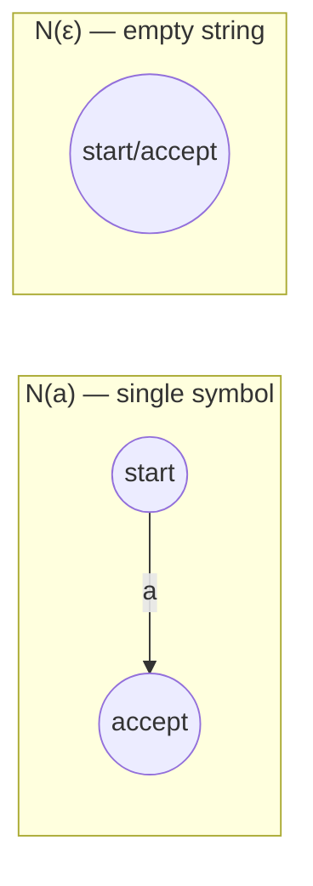
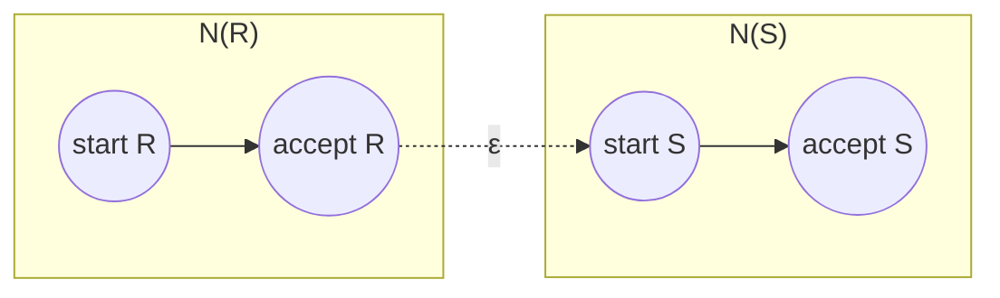
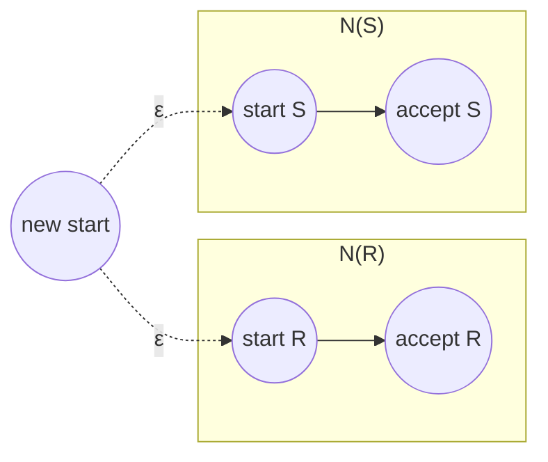
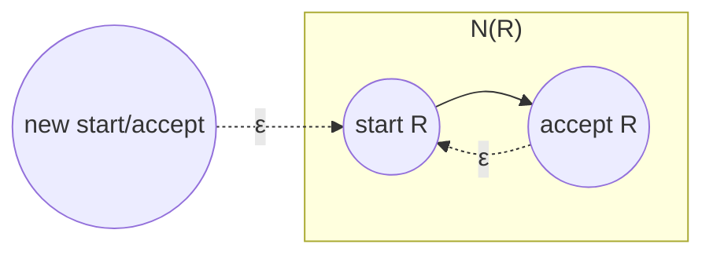
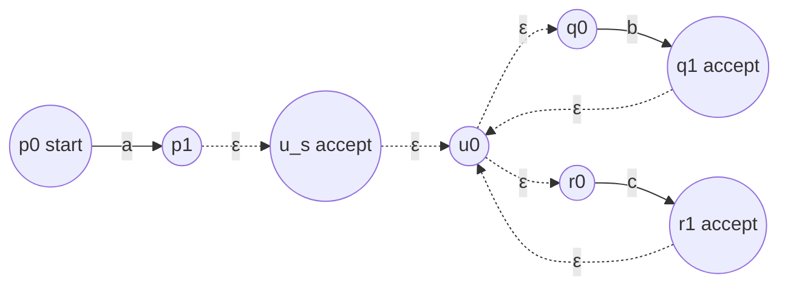

## Learning Objectives

- State the four base cases and structural-induction cases used to convert a regular expression into an equivalent NFA.
- Build, from scratch, the tiny NFA fragments for a single symbol, the empty string, and the empty language.
- Combine NFA fragments using ε-transitions to realize concatenation, union, and Kleene star, matching each regex operator to its own construction.
- Carry out the full construction on a moderately complex regular expression, building the final NFA piece by piece in the order the expression's structure dictates.
- Explain why this direction of Kleene's theorem is considered the "easy" direction, in contrast to going from an automaton back to a regular expression.

## Context & Motivation

Regular expressions and finite automata were introduced as two different ways of describing the exact same class of languages, but the syntax course to this point has only asserted their equivalence, occasionally illustrating it informally. This entry proves half of that equivalence rigorously and constructively: **Kleene's theorem**, in the direction "every regular expression has an equivalent NFA." The proof works by **structural induction on the regular expression** — matching the way a regex is built up from smaller pieces (single symbols glued together with concatenation, union, and star) with a matching way of building up an NFA from smaller NFA fragments, one operator at a time.

This direction of the equivalence is exactly what a regex engine does internally, even if a production engine (PCRE, RE2, `java.util.regex`) uses far more sophisticated data structures than the textbook NFA fragments built here. When a regex like `a(b|c)*d` is compiled, the compiler doesn't design one hand-crafted automaton from scratch; it walks the expression's structure — first `a`, then the union `b|c`, then the star, then the concatenation of everything — and mechanically assembles a matching automaton fragment for each piece, then wires the fragments together following the exact rules developed below. Seeing this construction in full removes the mystery of "how does a regex actually turn into something a machine can run," which is otherwise easy to leave as an unexamined black box.

MIT 18.404J presents this construction immediately after the syntax and semantics of regular expressions are established, precisely because the base cases and inductive cases mirror the regex grammar exactly — this is the point where regular expressions stop being just a compact notation and become provably equivalent to the machine model already built in earlier entries. Sipser's presentation (the textbook this course follows for this material) calls the result "every language described by a regular expression is regular" and treats it as one of the two halves of the paper equivalence pursued across the whole first chapter, with the other half, going from automaton to expression, treated separately in a later entry.

## Core Theory

### The base cases: NFAs for the atomic pieces of a regex

Every regular expression is built, ultimately, out of three kinds of atoms: a single symbol a ∈ Σ, the empty string ε, and the empty language ∅. Each gets a trivial two-state (or one-state) NFA:

- **N(a)**, for a single symbol a: two states, a start state and an accept state, with a single transition from start to accept labeled a, and no other transitions. This machine accepts exactly the one-string language {a}.
- **N(ε)**: a single state that is both start and accept, with no transitions. This machine accepts exactly {ε}, the language containing only the empty string.
- **N(∅)**: a single start state (not accepting), with no transitions anywhere, including no path to any accept state at all (there may be no accept state, or an unreachable one). This machine accepts nothing — the empty language.

These base cases are the leaves of the structural induction: every larger regex eventually bottoms out at symbols, ε, or ∅, so as long as each of these three has a correct NFA, and each way of combining regexes has a construction that preserves correctness, every regex — by induction on how it's built — has a correct NFA.

### Inductive case: concatenation

**Claim.** If R and S are regular expressions with NFAs N(R) and N(S), then the regex RS (concatenation) has an NFA built as follows: take N(R) and N(S) as two separate fragments, add an ε-transition from every accept state of N(R) to the start state of N(S), and demote N(R)'s accept states to ordinary (non-accepting) states — the new machine's start state is N(R)'s original start state, and its accept states are exactly N(S)'s original accept states.

**Why this is correct.** A string w is accepted by the new machine exactly when there is some way to split w = xy such that reading x drives N(R) from its start to one of its (former) accept states, the machine silently ε-jumps into N(S), and reading y drives N(S) from its start to one of its accept states. That is exactly "x ∈ L(R) and y ∈ L(S) for some split of w into xy," which is the definition of w ∈ L(R)L(S) = L(RS).

### Inductive case: union

**Claim.** If R and S are regular expressions with NFAs N(R) and N(S), then the regex R|S (union) has an NFA built by introducing a brand-new start state, with an ε-transition from this new start state to N(R)'s original start state and another ε-transition to N(S)'s original start state — the accept states of the new machine are the union of N(R)'s and N(S)'s original accept states (both fragments keep their own accept states as-is).

**Why this is correct.** From the new start state, the machine nondeterministically ε-jumps into *either* N(R) or N(S) — since NFA acceptance means "some path accepts," the new machine accepts w exactly when w drives N(R) to acceptance *or* w drives N(S) to acceptance, i.e., exactly when w ∈ L(R) or w ∈ L(S), i.e., w ∈ L(R|S).

### Inductive case: Kleene star

**Claim.** If R is a regular expression with NFA N(R), then the regex R* has an NFA built by introducing a brand-new start state that is also an accept state, with an ε-transition from this new state to N(R)'s original start state, and an ε-transition from every one of N(R)'s original accept states back to N(R)'s original start state — N(R)'s original accept states remain accepting.

**Why this is correct.** The new start state, being itself accepting, immediately accepts ε, matching the fact that R* always contains the empty string by definition (zero repetitions), even when ε ∉ L(R). The loop-back ε-transitions from N(R)'s accept states to its own start state let the machine repeat a full pass through N(R) any number of times, so the new machine accepts exactly strings of the form x₁x₂...xₖ (k ≥ 0), each xᵢ ∈ L(R) — precisely L(R*).

### The induction as a whole

Putting the base cases and the three inductive cases (concatenation, union, star) together gives a complete recursive procedure: to build an NFA for any regular expression R, look at R's outermost operator. If R is an atom (a symbol, ε, or ∅), use the matching base-case NFA directly. Otherwise, R is RS, R|S, or R* for smaller regexes; recursively build NFAs for those smaller pieces first, then apply the matching combination rule above. Because every regex has a finite, well-founded structure (each recursive call operates on a strictly smaller sub-expression), this process always terminates, and because every base case and every combination rule preserves correctness, the resulting NFA is guaranteed to accept exactly L(R). This is Kleene's theorem, constructive direction: **every regular expression has an equivalent NFA** (and, by the DFA-NFA equivalence already established, an equivalent DFA too).

## Worked Examples

### Example 1 — building the NFA for `ab`

**Problem:** Construct the NFA for the regex `ab` (concatenation of the symbols a and b) by structural induction.

**Step 1 — base cases.** N(a): states {p0, p1}, transition p0 →a→ p1, start p0, accept {p1}. N(b): states {q0, q1}, transition q0 →b→ q1, start q0, accept {q1}.

**Step 2 — apply the concatenation rule.** Add ε-transition p1 →ε→ q0. Demote p1 from accepting. New start: p0. New accept: {q1}.

**Result.** States {p0, p1, q0, q1}; transitions p0 →a→ p1, p1 →ε→ q0, q0 →b→ q1; start p0; accept {q1}. Tracing "ab": p0 →a→ p1 →ε→ q0 →b→ q1, ending in the accept state — correctly accepted. Tracing "a" alone: p0 →a→ p1, then stuck (no further input, and p1 is not accepting) — correctly rejected, since "a" ∉ L(ab).

### Example 2 — the full construction for `a(b|c)*`

**Problem:** Build the complete NFA for the regex `a(b|c)*`, applying the base cases and inductive rules in the order dictated by the expression's structure: first the atoms, then the union `b|c`, then the star `(b|c)*`, then finally the concatenation with `a`.

**Step 1 — atoms.** N(a): p0 →a→ p1, start p0, accept {p1}. N(b): q0 →b→ q1, start q0, accept {q1}. N(c): r0 →c→ r1, start r0, accept {r1}.

**Step 2 — union, b|c.** New start u0, with u0 →ε→ q0 and u0 →ε→ r0. Accept states of the union: {q1, r1} (both kept as-is). Call this fragment N(b|c), with start u0.

**Step 3 — Kleene star, (b|c)*.** New start/accept state u_s. Add u_s →ε→ u0 (into the union fragment's start). Add ε-transitions looping back from each of the union's accept states to u0: q1 →ε→ u0 and r1 →ε→ u0. Accept states of this fragment: {u_s, q1, r1} (u_s newly added as accepting, q1 and r1 remain accepting). Call this fragment N((b|c)*), with start u_s.

**Step 4 — concatenation with a.** Add ε-transition from N(a)'s accept state to N((b|c)*)'s start: p1 →ε→ u_s. Demote p1 from accepting. Final start: p0. Final accept: {u_s, q1, r1} (carried over unchanged from the star fragment, since concatenation only changes the *left* fragment's accept states).

**Full machine.** States: {p0, p1, u_s, u0, q0, q1, r0, r1}. Transitions: p0 →a→ p1; p1 →ε→ u_s; u_s →ε→ u0; u0 →ε→ q0; u0 →ε→ r0; q0 →b→ q1; r0 →c→ r1; q1 →ε→ u0; r1 →ε→ u0. Start: p0. Accept: {u_s, q1, r1}.

**Tracing "acb".** p0 →a→ p1 →ε→ u_s →ε→ u0 →ε→ r0 →c→ r1 →ε→ u0 →ε→ q0 →b→ q1. Ends at q1, an accept state — correctly accepted, since "acb" = "a" followed by "c" then "b", both in {b,c}, matching a(b|c)*. Tracing "a" alone: p0 →a→ p1 →ε→ u_s, which is itself accepting (zero repetitions of (b|c)) — correctly accepted, since a(b|c)* includes "a" with the star matching zero times.

### Example 3 — a quick sanity check with the empty-language atom

**Problem:** What NFA does the construction produce for `a|∅`, and does it match the expected language {a}?

**Reasoning.** N(a) is the usual two-state fragment. N(∅) is a single unreachable-to-accept start state with no transitions. Applying the union rule: new start u0, with ε-transitions to N(a)'s start and to N(∅)'s start. Accept states: N(a)'s {p1} union N(∅)'s accept states (none) = {p1}. Since the N(∅) branch can never reach any accepting state (it has no transitions at all), it contributes nothing reachable to an accept state — the only way to accept is through the N(a) branch. This matches L(a|∅) = L(a) ∪ L(∅) = {a} ∪ {} = {a} exactly, confirming the construction handles the ∅ atom correctly even though it looks like a degenerate case.

## Common Misconceptions & Pitfalls

- **"The union construction should just merge R and S's start states into one, instead of adding a new one."** Merging start states directly can accidentally merge unrelated transition behavior if the original start states had any incoming transitions or coincided with an accept state in one fragment but not the other. Adding a brand-new start state with ε-transitions to both original starts avoids this entirely and is the construction actually used in the proof — always introduce a new state, never reuse one of the fragments' own states as the shared start.
- **"Kleene star just needs a self-loop back from an accept state to itself, not to the fragment's start."** A self-loop on the accept state alone doesn't correctly restart a fresh pass through N(R) if N(R) has more than one state; the loop-back must go to N(R)'s *start* state so that repeating actually replays the whole fragment, not just linger at the accept state.
- **"R* always requires reading at least one iteration of R, so the empty string isn't automatically included."** By definition, R* includes zero repetitions, i.e., ε, regardless of whether ε ∈ L(R). The construction reflects this directly by making the *new* start state itself an accept state, not by requiring a pass through N(R) first.
- **"This construction is just a theoretical curiosity; real regex engines don't work this way."** The specific data structures differ (production engines like PCRE use backtracking rather than a compiled NFA/DFA in general, and RE2/`java.util.regex`'s NFA-based paths use more optimized representations), but the structural decomposition — atoms, then concatenation, union, and repetition combined recursively by the expression's own shape — is exactly the compilation strategy used by NFA-based regex engines and lexer generators (e.g., the classical `lex`/`flex` family), making this construction a direct, not merely theoretical, description of real compiled behavior in that family of tools.

## Summary

Kleene's theorem's constructive direction builds an NFA for any regular expression by structural induction, mirroring the way the expression itself is built. Three base cases handle the atoms — a single symbol gets a two-state fragment, ε gets a single accepting state with no transitions, and ∅ gets a start state with no path to acceptance. Three inductive rules handle the operators: concatenation chains two fragments with an ε-transition from the first's (former) accept states to the second's start; union introduces a new start state with ε-transitions branching into both fragments, keeping both sets of accept states; Kleene star wraps a fragment with a new accepting start state (to capture zero repetitions) and loop-back ε-transitions from its accept states to its own start (to capture repetition). Because every regex has finite structure and every base case and combination rule preserves correctness, this recursive procedure always terminates and always produces a correct NFA — proving every regular expression describes a regular language, the same compilation strategy real NFA-based regex engines and lexer generators use internally.

## Documentation Links

- [MIT 18.404J — OCW Calendar](https://ocw.mit.edu/courses/18-404j-theory-of-computation-fall-2020/pages/calendar/) - doc
- [Sipser — Introduction to the Theory of Computation, 3rd ed.](https://cs.brown.edu/courses/csci1810/fall-2023/resources/ch2_readings/Sipser_Introduction.to.the.Theory.of.Computation.3E.pdf) - doc
