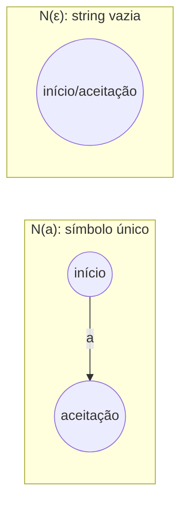
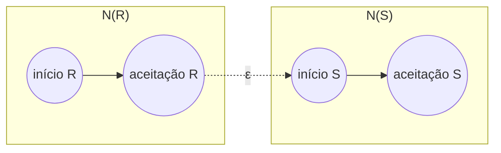
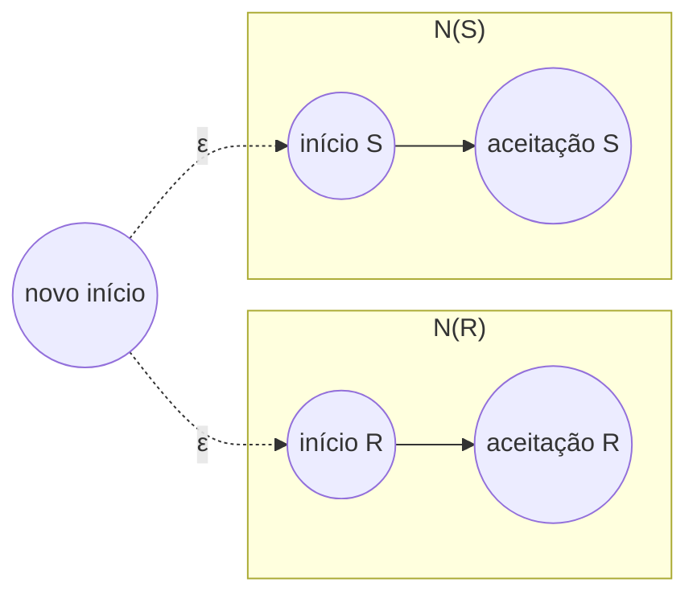
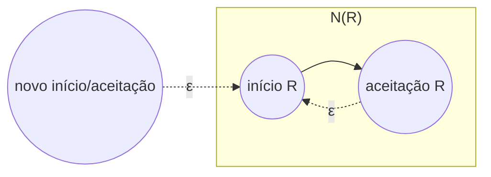
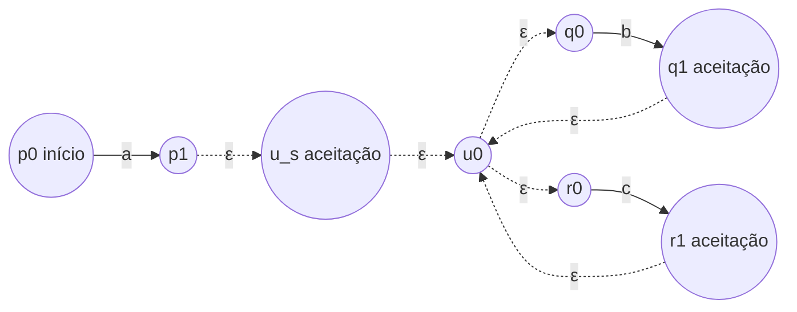

## Objetivos de Aprendizagem

- Enunciar os quatro casos base e os casos de indução estrutural usados para converter uma expressão regular em um NFA equivalente.
- Construir, do zero, os pequenos fragmentos de NFA para um único símbolo, a string vazia, e a linguagem vazia.
- Combinar fragmentos de NFA usando transições-ε para realizar concatenação, união, e estrela de Kleene, associando cada operador de regex à sua própria construção.
- Realizar a construção completa em uma expressão regular moderadamente complexa, construindo o NFA final peça por peça na ordem ditada pela estrutura da expressão.
- Explicar por que esta direção do teorema de Kleene é considerada a direção "fácil", em contraste com ir de um autômato de volta a uma expressão regular.

## Contexto e Motivação

Expressões regulares e autômatos finitos foram introduzidos como duas formas diferentes de descrever exatamente a mesma classe de linguagens, mas o curso até este ponto apenas afirmou sua equivalência, ocasionalmente ilustrando-a de forma informal. Este conceito prova metade dessa equivalência de forma rigorosa e construtiva: o **teorema de Kleene**, na direção "toda expressão regular tem um NFA equivalente". A prova funciona por **indução estrutural sobre a expressão regular**: casando a forma como uma regex é construída a partir de peças menores (símbolos únicos colados por concatenação, união, e estrela) com uma forma correspondente de construir um NFA a partir de fragmentos de NFA menores, um operador de cada vez.

Essa direção da equivalência é exatamente o que um motor de regex faz internamente, mesmo que um motor de produção (PCRE, RE2, `java.util.regex`) use estruturas de dados muito mais sofisticadas que os fragmentos de NFA de livro-texto construídos aqui. Quando uma regex como `a(b|c)*d` é compilada, o compilador não projeta um autômato feito à mão do zero; ele percorre a estrutura da expressão (primeiro `a`, depois a união `b|c`, depois a estrela, depois a concatenação de tudo) e monta mecanicamente um fragmento de autômato correspondente para cada peça, depois conecta os fragmentos seguindo exatamente as regras desenvolvidas a seguir. Ver essa construção por completo remove o mistério de "como uma regex de fato se transforma em algo que uma máquina pode rodar", o que de outra forma é fácil de deixar como uma caixa-preta nunca examinada.

O 18.404J do MIT apresenta essa construção imediatamente depois de a sintaxe e a semântica das expressões regulares serem estabelecidas, precisamente porque os casos base e os casos indutivos espelham exatamente a gramática da regex: este é o ponto em que expressões regulares deixam de ser apenas uma notação compacta e passam a ser demonstravelmente equivalentes ao modelo de máquina já construído em conceitos anteriores. A apresentação de Sipser (o livro-texto que este curso segue para este material) chama o resultado de "toda linguagem descrita por uma expressão regular é regular" e a trata como uma das duas metades da equivalência buscada ao longo de todo o primeiro capítulo, com a outra metade, ir de autômato para expressão, tratada separadamente em um conceito posterior.

## Teoria Central

### Os casos base: NFAs para as peças atômicas de uma regex

Toda expressão regular é construída, em última instância, a partir de três tipos de átomos: um único símbolo a ∈ Σ, a string vazia ε, e a linguagem vazia ∅. Cada um recebe um NFA trivial de dois estados (ou um estado):

- **N(a)**, para um único símbolo a: dois estados, um estado inicial e um estado de aceitação, com uma única transição do inicial ao de aceitação rotulada a, e nenhuma outra transição. Esta máquina aceita exatamente a linguagem de uma string {a}.
- **N(ε)**: um único estado que é ao mesmo tempo inicial e de aceitação, sem transições. Esta máquina aceita exatamente {ε}, a linguagem contendo apenas a string vazia.
- **N(∅)**: um único estado inicial (não aceitador), sem nenhuma transição em lugar nenhum, incluindo nenhum caminho até qualquer estado de aceitação (pode não haver estado de aceitação, ou pode haver um inalcançável). Esta máquina não aceita nada: a linguagem vazia.

Esses casos base são as folhas da indução estrutural: toda regex maior eventualmente termina em símbolos, ε, ou ∅, então, desde que cada um desses três tenha um NFA correto, e cada forma de combinar regexes tenha uma construção que preserve a correção, toda regex, por indução em como é construída, tem um NFA correto.

### Caso indutivo: concatenação

**Afirmação.** Se R e S são expressões regulares com NFAs N(R) e N(S), então a regex RS (concatenação) tem um NFA construído da seguinte forma: tome N(R) e N(S) como dois fragmentos separados, adicione uma transição-ε de todo estado de aceitação de N(R) para o estado inicial de N(S), e rebaixe os estados de aceitação de N(R) a estados comuns (não aceitadores): o estado inicial da nova máquina é o estado inicial original de N(R), e seus estados de aceitação são exatamente os estados de aceitação originais de N(S).

**Por que isso está correto.** Uma string w é aceita pela nova máquina exatamente quando existe alguma forma de dividir w = xy tal que ler x leva N(R) de seu início a um de seus (antigos) estados de aceitação, a máquina salta silenciosamente por ε para dentro de N(S), e ler y leva N(S) de seu início a um de seus estados de aceitação. Isso é exatamente "x ∈ L(R) e y ∈ L(S) para alguma divisão de w em xy", que é a definição de w ∈ L(R)L(S) = L(RS).

### Caso indutivo: união

**Afirmação.** Se R e S são expressões regulares com NFAs N(R) e N(S), então a regex R|S (união) tem um NFA construído introduzindo um estado inicial totalmente novo, com uma transição-ε desse novo estado inicial para o estado inicial original de N(R) e outra transição-ε para o estado inicial original de N(S): os estados de aceitação da nova máquina são a união dos estados de aceitação originais de N(R) e de N(S) (ambos os fragmentos mantêm seus próprios estados de aceitação como estão).

**Por que isso está correto.** A partir do novo estado inicial, a máquina salta por ε, de forma não determinística, para *ou* N(R) *ou* N(S); como a aceitação de um NFA significa "algum caminho aceita", a nova máquina aceita w exatamente quando w leva N(R) à aceitação *ou* w leva N(S) à aceitação, ou seja, exatamente quando w ∈ L(R) ou w ∈ L(S), ou seja, w ∈ L(R|S).

### Caso indutivo: estrela de Kleene

**Afirmação.** Se R é uma expressão regular com NFA N(R), então a regex R* tem um NFA construído introduzindo um estado inicial totalmente novo que também é um estado de aceitação, com uma transição-ε desse novo estado para o estado inicial original de N(R), e uma transição-ε de cada um dos estados de aceitação originais de N(R) de volta para o estado inicial original de N(R): os estados de aceitação originais de N(R) permanecem aceitadores.

**Por que isso está correto.** O novo estado inicial, sendo ele próprio aceitador, aceita imediatamente ε, condizendo com o fato de que R* sempre contém a string vazia por definição (zero repetições), mesmo quando ε ∉ L(R). As transições-ε de retorno dos estados de aceitação de N(R) para seu próprio estado inicial permitem que a máquina repita uma passagem completa por N(R) qualquer número de vezes, então a nova máquina aceita exatamente strings da forma x₁x₂...xₖ (k ≥ 0), cada xᵢ ∈ L(R): precisamente L(R*).

### A indução como um todo

Juntando os casos base e os três casos indutivos (concatenação, união, estrela), obtém-se um procedimento recursivo completo: para construir um NFA para qualquer expressão regular R, observe o operador mais externo de R. Se R é um átomo (um símbolo, ε, ou ∅), use diretamente o NFA de caso base correspondente. Caso contrário, R é RS, R|S, ou R* para regexes menores; construa recursivamente os NFAs para essas peças menores primeiro, depois aplique a regra de combinação correspondente acima. Como toda regex tem uma estrutura finita e bem-fundada (cada chamada recursiva opera sobre uma subexpressão estritamente menor), esse processo sempre termina, e como todo caso base e toda regra de combinação preserva a correção, o NFA resultante é garantido a aceitar exatamente L(R). Este é o teorema de Kleene, direção construtiva: **toda expressão regular tem um NFA equivalente** (e, pela equivalência DFA-NFA já estabelecida, também um DFA equivalente).

## Exemplos Resolvidos

### Exemplo 1: construindo o NFA para `ab`

**Problema:** Construa o NFA para a regex `ab` (concatenação dos símbolos a e b) por indução estrutural.

**Passo 1: casos base.** N(a): estados {p0, p1}, transição p0 →a→ p1, início p0, aceitação {p1}. N(b): estados {q0, q1}, transição q0 →b→ q1, início q0, aceitação {q1}.

**Passo 2: aplicar a regra de concatenação.** Adicione a transição-ε p1 →ε→ q0. Rebaixe p1 de aceitador. Novo início: p0. Nova aceitação: {q1}.

**Resultado.** Estados {p0, p1, q0, q1}; transições p0 →a→ p1, p1 →ε→ q0, q0 →b→ q1; início p0; aceitação {q1}. Rastreando "ab": p0 →a→ p1 →ε→ q0 →b→ q1, terminando no estado de aceitação: corretamente aceita. Rastreando "a" sozinho: p0 →a→ p1, depois travado (sem mais entrada, e p1 não é aceitador): corretamente rejeitada, já que "a" ∉ L(ab).

### Exemplo 2: a construção completa para `a(b|c)*`

**Problema:** Construa o NFA completo para a regex `a(b|c)*`, aplicando os casos base e as regras indutivas na ordem ditada pela estrutura da expressão: primeiro os átomos, depois a união `b|c`, depois a estrela `(b|c)*`, depois finalmente a concatenação com `a`.

**Passo 1: átomos.** N(a): p0 →a→ p1, início p0, aceitação {p1}. N(b): q0 →b→ q1, início q0, aceitação {q1}. N(c): r0 →c→ r1, início r0, aceitação {r1}.

**Passo 2: união, b|c.** Novo início u0, com u0 →ε→ q0 e u0 →ε→ r0. Estados de aceitação da união: {q1, r1} (ambos mantidos como estão). Chame este fragmento de N(b|c), com início u0.

**Passo 3: estrela de Kleene, (b|c)*.** Novo estado inicial/de aceitação u_s. Adicione u_s →ε→ u0 (para dentro do início do fragmento de união). Adicione transições-ε de retorno de cada um dos estados de aceitação da união para u0: q1 →ε→ u0 e r1 →ε→ u0. Estados de aceitação deste fragmento: {u_s, q1, r1} (u_s recém-adicionado como aceitador, q1 e r1 permanecem aceitadores). Chame este fragmento de N((b|c)*), com início u_s.

**Passo 4: concatenação com a.** Adicione a transição-ε do estado de aceitação de N(a) para o início de N((b|c)*): p1 →ε→ u_s. Rebaixe p1 de aceitador. Início final: p0. Aceitação final: {u_s, q1, r1} (transportada sem mudança do fragmento da estrela, já que a concatenação só muda os estados de aceitação do fragmento *esquerdo*).

**Máquina completa.** Estados: {p0, p1, u_s, u0, q0, q1, r0, r1}. Transições: p0 →a→ p1; p1 →ε→ u_s; u_s →ε→ u0; u0 →ε→ q0; u0 →ε→ r0; q0 →b→ q1; r0 →c→ r1; q1 →ε→ u0; r1 →ε→ u0. Início: p0. Aceitação: {u_s, q1, r1}.

**Rastreando "acb".** p0 →a→ p1 →ε→ u_s →ε→ u0 →ε→ r0 →c→ r1 →ε→ u0 →ε→ q0 →b→ q1. Termina em q1, um estado de aceitação: corretamente aceita, já que "acb" = "a" seguido de "c" depois "b", ambos em {b,c}, correspondendo a a(b|c)*. Rastreando "a" sozinho: p0 →a→ p1 →ε→ u_s, que é ele próprio aceitador (zero repetições de (b|c)): corretamente aceita, já que a(b|c)* inclui "a" com a estrela correspondendo a zero vezes.

### Exemplo 3: uma checagem rápida de sanidade com o átomo da linguagem vazia

**Problema:** Qual NFA a construção produz para `a|∅`, e ele corresponde à linguagem esperada {a}?

**Raciocínio.** N(a) é o fragmento usual de dois estados. N(∅) é um único estado inicial inalcançável até a aceitação, sem transições. Aplicando a regra de união: novo início u0, com transições-ε para o início de N(a) e para o início de N(∅). Estados de aceitação: {p1} de N(a) unido aos estados de aceitação de N(∅) (nenhum) = {p1}. Como o ramo de N(∅) nunca pode alcançar nenhum estado de aceitação (ele não tem transição alguma), ele não contribui com nada alcançável a um estado de aceitação: a única forma de aceitar é pelo ramo de N(a). Isso corresponde exatamente a L(a|∅) = L(a) ∪ L(∅) = {a} ∪ {} = {a}, confirmando que a construção trata corretamente o átomo ∅ mesmo que ele pareça um caso degenerado.

## Equívocos Comuns e Armadilhas

- **"A construção de união deveria simplesmente fundir os estados iniciais de R e S em um só, em vez de adicionar um novo."** Fundir estados iniciais diretamente pode acidentalmente fundir comportamentos de transição não relacionados, caso os estados iniciais originais tivessem alguma transição de entrada ou coincidissem com um estado de aceitação em um fragmento mas não no outro. Adicionar um estado inicial totalmente novo com transições-ε para ambos os inícios originais evita isso inteiramente e é a construção de fato usada na prova: sempre introduza um estado novo, nunca reaproveite um dos próprios estados dos fragmentos como o início compartilhado.
- **"A estrela de Kleene só precisa de um autolaço de volta de um estado de aceitação para si mesmo, não para o início do fragmento."** Um autolaço apenas no estado de aceitação não reinicia corretamente uma nova passagem por N(R) se N(R) tem mais de um estado; o laço de retorno precisa ir ao estado *inicial* de N(R) para que repetir de fato reproduza o fragmento inteiro, não apenas permaneça no estado de aceitação.
- **"R* sempre exige ler ao menos uma iteração de R, então a string vazia não é incluída automaticamente."** Por definição, R* inclui zero repetições, ou seja, ε, independentemente de ε ∈ L(R) ou não. A construção reflete isso diretamente tornando o *novo* estado inicial ele próprio um estado de aceitação, em vez de exigir uma passagem por N(R) antes.
- **"Esta construção é apenas uma curiosidade teórica; motores de regex reais não funcionam assim."** As estruturas de dados específicas diferem (motores de produção como o PCRE usam retrocesso em vez de um NFA/DFA compilado em geral, e os caminhos baseados em NFA de RE2/`java.util.regex` usam representações mais otimizadas), mas a decomposição estrutural (átomos, depois concatenação, união, e repetição combinados recursivamente pelo próprio formato da expressão) é exatamente a estratégia de compilação usada por motores de regex baseados em NFA e por geradores de analisadores léxicos (como a clássica família `lex`/`flex`), o que torna esta construção uma descrição direta, não meramente teórica, do comportamento compilado real nessa família de ferramentas.

## Resumo

A direção construtiva do teorema de Kleene constrói um NFA para qualquer expressão regular por indução estrutural, espelhando a forma como a própria expressão é construída. Três casos base tratam os átomos: um único símbolo recebe um fragmento de dois estados, ε recebe um único estado aceitador sem transições, e ∅ recebe um estado inicial sem caminho até a aceitação. Três regras indutivas tratam os operadores: a concatenação encadeia dois fragmentos com uma transição-ε dos (antigos) estados de aceitação do primeiro para o início do segundo; a união introduz um novo estado inicial com transições-ε se ramificando para ambos os fragmentos, mantendo os dois conjuntos de estados de aceitação; a estrela de Kleene envolve um fragmento com um novo estado inicial aceitador (para capturar zero repetições) e transições-ε de retorno de seus estados de aceitação para seu próprio início (para capturar repetição). Como toda regex tem estrutura finita e todo caso base e toda regra de combinação preserva a correção, esse procedimento recursivo sempre termina e sempre produz um NFA correto, provando que toda expressão regular descreve uma linguagem regular, a mesma estratégia de compilação que motores de regex reais baseados em NFA e geradores de analisadores léxicos usam internamente.

## Documentation Links

- [MIT 18.404J: OCW Calendar](https://ocw.mit.edu/courses/18-404j-theory-of-computation-fall-2020/pages/calendar/): doc
- [Sipser: Introduction to the Theory of Computation, 3rd ed.](https://cs.brown.edu/courses/csci1810/fall-2023/resources/ch2_readings/Sipser_Introduction.to.the.Theory.of.Computation.3E.pdf): doc
