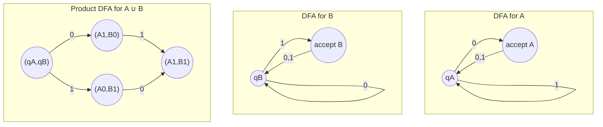

## Learning Objectives

- State which set operations (union, intersection, concatenation, Kleene star, complement) the class of regular languages is closed under.
- Explain why closure properties let a complex regular language be built from simpler, already-known-regular pieces instead of being designed as one automaton from scratch.
- Construct, explicitly, a DFA recognizing the union of two languages given DFAs for each, using a product-construction-style combination.
- Construct a DFA recognizing the complement of a regular language given a DFA for it.
- Use closure properties together to argue that a language built from simpler regular pieces via these operations is itself regular, without building its automaton directly.

## Context & Motivation

Once a language has been shown regular — by exhibiting a DFA, an NFA, or a regular expression for it — a natural next question is what happens when regular languages are combined. If A and B are both regular, is A ∪ B regular? Is A ∩ B? Is the language of strings NOT in A? These aren't idle questions: real specifications are almost never built as a single flat description. A lexical rule like "an identifier is a letter followed by letters or digits, but not one of the reserved keywords" is really three regular languages combined by concatenation, union, and complement, and the fact that the combination is guaranteed to still be regular is what lets a language designer specify it declaratively and trust that a recognizer exists at all, without having to reason about a single sprawling automaton by hand.

This is the payoff of the closure properties covered here. Each closure property is proved *constructively* — not just "the union of two regular languages happens to be regular" as an abstract fact, but "here is an explicit recipe that takes two automata and produces an automaton for the combined language." That constructive character matters practically: it is the same recipe, in essence, that a regex engine or a lexer generator runs internally when it compiles a specification with alternation, sequencing, and repetition into a single automaton. Understanding the construction is understanding what the machine underneath a tool like `grep` or a compiler's tokenizer is actually doing when it takes a rule written as `(digit)+` or `keyword|identifier` and turns it into something that runs in a single pass over the input.

The MIT 18.404J treatment (and Sipser's textbook, which the course follows closely) introduces closure properties immediately after DFA/NFA equivalence for exactly this reason: once NFAs and DFAs are known to be interchangeable, the constructions become much easier to state, because a construction can freely introduce nondeterminism (an ε-transition, an extra branching choice) and still land safely back in "regular," since NFA and DFA recognize the same class. This entry works through the union construction in full, in the disciplined "no nondeterminism needed" form — a genuine product construction over both DFAs at once — plus complement, intersection, concatenation, and Kleene star, so that by the end, every operation on the standard list has at least a sketch of why it preserves regularity.

## Core Theory

### The closure properties, listed

The class of regular languages is closed under each of the following operations. If A and B are regular languages over the same alphabet Σ, then all of the following are also regular:

1. **Union**: A ∪ B = {w : w ∈ A or w ∈ B}
2. **Intersection**: A ∩ B = {w : w ∈ A and w ∈ B}
3. **Concatenation**: A ∘ B = {xy : x ∈ A and y ∈ B}
4. **Kleene star**: A* = {x₁x₂...xₖ : k ≥ 0 and each xᵢ ∈ A}
5. **Complement**: A̅ = {w ∈ Σ* : w ∉ A}

These five are the standard list (Sipser, ch. 1). Each is proved by giving an explicit construction that builds a new automaton (or regex) for the combined language directly out of automata (or regexes) for the pieces — none of these facts is proved by some indirect argument that merely asserts existence without showing how to build the result.

### Why closure matters practically

Without closure properties, proving a complicated language regular would require constructing one large, ad hoc automaton by hand, tracking every possible configuration in a single diagram. With closure properties in hand, a language can instead be decomposed into small regular pieces whose regularity is either obvious (single symbols, small finite languages) or already established, and then reassembled using the operations known to preserve regularity. For example, "binary strings that contain `01` as a substring but do not end in `00`" decomposes as (Σ*01Σ*) ∩ complement(Σ*00) — an intersection of two much simpler regular languages, each easy to build a DFA for individually. Closure under intersection then guarantees, without any further work, that the combined language is regular too, and the product construction (below) even tells you exactly how to build its DFA if you need one explicitly.

### Construction: closure under union (product construction)

**Claim.** If A and B are regular languages, then A ∪ B is regular.

**Proof, by construction.** Since A and B are regular, there exist DFAs M_A = (Q_A, Σ, δ_A, q_A, F_A) recognizing A and M_B = (Q_B, Σ, δ_B, q_B, F_B) recognizing B, over the same alphabet Σ (pad the alphabets with unused symbols if they originally differ, which does not change either language). Build a new DFA M = (Q, Σ, δ, q₀, F) that runs M_A and M_B *simultaneously*, by tracking a pair of states — one from each machine — as a single combined state:

- **States:** Q = Q_A × Q_B (every pair (p, q) with p ∈ Q_A, q ∈ Q_B).
- **Start state:** q₀ = (q_A, q_B), the pair of both machines' start states.
- **Transition function:** δ((p, q), a) = (δ_A(p, a), δ_B(q, a)) — on symbol a, advance both component machines independently, using their own transition functions, and pair up the results.
- **Accept states:** F = {(p, q) : p ∈ F_A or q ∈ F_B} — accept a pair exactly when *either* component would have accepted, which directly encodes "accept if in A or in B."

This M reads an input string w exactly once, tracking where M_A would be and where M_B would be after that same prefix, simultaneously, as the two coordinates of a single state. Since M lands in an accepting combined state on w if and only if the A-component is accepting on w (w ∈ A) or the B-component is accepting on w (w ∈ B), M accepts exactly A ∪ B. Since M is a valid DFA (Q is finite because Q_A and Q_B both are; δ is a total function because δ_A and δ_B both are), A ∪ B is regular. ∎

This same "track both machines at once, pair up their states" idea — a **product construction** — is the general-purpose tool underlying all of the Boolean closure properties; only the accepting-set rule changes between them.

### Construction: closure under intersection and complement

**Intersection** uses the identical product construction, changing only the accepting set: F = {(p, q) : p ∈ F_A **and** q ∈ F_B} — accept a combined state only when *both* components would have accepted, which encodes "accept if in A and in B" instead of "or." Every other part of the construction — states, start state, transition function — is unchanged from the union construction above.

**Complement** is simpler still and needs only a single DFA. If M = (Q, Σ, δ, q₀, F) recognizes A, then M̅ = (Q, Σ, δ, q₀, Q − F) — the identical machine, with accepting and non-accepting states swapped — recognizes A̅. Since M is a DFA, it has exactly one run on any input string w, ending in some single state s ∈ Q; M accepts w exactly when s ∈ F, so M̅ accepts w exactly when s ∈ Q − F, i.e., exactly when M does *not* accept w, i.e., exactly when w ∉ A. This construction critically depends on M being a DFA — one defined transition per symbol, no missing transitions, no multiple choices — since flipping accept/non-accept on an NFA does not, in general, produce a correct complement (an NFA might have several runs on the same string, accepting via one and rejecting via another; flipping the accepting set doesn't turn "some run accepts" into "some run rejects on all paths").

### Construction: closure under concatenation and Kleene star

**Concatenation** and **Kleene star** are most naturally proved using NFAs rather than DFAs, leaning on the DFA-NFA equivalence already established: since every regular language has *some* NFA recognizing it, it suffices to build an NFA for the combined language, and NFA-recognizable is exactly regular.

For **concatenation** A ∘ B, given an NFA N_A for A and N_B for B, build a new NFA by taking every accept state of N_A and adding an ε-transition from it to N_B's start state, then designating N_A's original start state as the new start state and N_B's accept states as the new accept states. Any accepting run in the new machine reads some prefix that drives N_A to one of its accept states, silently ε-jumps into N_B, and reads the remaining suffix as an accepting run of N_B — exactly capturing "some split of the string into xy with x ∈ A and y ∈ B."

For **Kleene star** A*, given an NFA N_A for A, build a new NFA with a fresh start state that is also an accept state (to accept the empty string, always in A* by definition even when the empty string isn't in A), with an ε-transition from the new start state to N_A's old start state, and an ε-transition from every one of N_A's accept states back to N_A's old start state (to allow repeating). This exact construction is developed in full, symbol by symbol, in the companion entry on regular expressions to finite automata, since it is also precisely the inductive case used there for the `*` regex operator.

## Worked Examples

### Example 1 — union via the product construction, fully built

**Problem:** Let Σ = {0, 1}. Let A = "strings ending in 0" and B = "strings ending in 1" (both length ≥ 1). Build the union DFA for A ∪ B using the product construction, and verify it recognizes exactly "nonempty strings" — well, more precisely, verify it against a few strings directly, since A ∪ B is actually just Σ⁺ (any nonempty string ends in either 0 or 1).

**Component DFAs.** M_A over states {qA0, qA1} (qA0 = start / "doesn't end in 0 yet or is empty", qA1 = "ends in 0"): δ_A(qA0,0)=qA1, δ_A(qA0,1)=qA0, δ_A(qA1,0)=qA1, δ_A(qA1,1)=qA0. Accept: {qA1}. M_B is the mirror image over {qB0, qB1}: δ_B(qB0,1)=qB1, δ_B(qB0,0)=qB0, δ_B(qB1,1)=qB1, δ_B(qB1,0)=qB0. Accept: {qB1}.

**Product construction.** States: all 4 pairs (qA0,qB0), (qA0,qB1), (qA1,qB0), (qA1,qB1). Start: (qA0,qB0). Transitions computed componentwise, e.g. δ((qA0,qB0),0) = (δ_A(qA0,0), δ_B(qB0,0)) = (qA1,qB0). Accept states (union rule, "either accepts"): {(qA1,qB0), (qA0,qB1), (qA1,qB1)} — every pair except the start pair (qA0,qB0) itself, since that's the only pair where neither component is in its own accept state.

**Verification.** On input "0": (qA0,qB0) →0→ (qA1,qB0), which is accepting — correct, "0" ends in 0, so it's in A, so in A ∪ B. On input "1": (qA0,qB0) →1→ (qA0,qB1), accepting — correct, "1" ends in 1. On the empty string: stays at (qA0,qB0), not accepting — correct, the empty string is in neither A nor B (both require length ≥ 1). This matches Σ⁺ exactly, as expected.

### Example 2 — decomposing a language using multiple closure properties

**Problem:** Let Σ = {0,1}. Show that L = "strings that contain `00` as a substring and do not end in `1`" is regular, without directly building an automaton for L.

**Decomposition.** L = C ∩ D, where C = Σ*00Σ* ("contains 00 somewhere") and D = complement(Σ*1) ("does not end in 1"). Both C and D are individually easy to see as regular: C is literally described by the regular expression `Σ*00Σ*`, and Σ*1 (strings ending in 1) is likewise directly regular, so D is regular by closure under complement (construction above — flip accept/non-accept on a DFA for Σ*1). Since C and D are both regular, and regular languages are closed under intersection (construction above, "and" version of the product rule), L = C ∩ D is regular.

**No automaton for L was built directly** — the argument only invoked (a) two simple base languages that are visibly regular, and (b) two closure properties (complement, intersection) already proved in general. This is the entire practical point of closure properties: L's regularity is established with zero new construction work specific to L itself.

### Example 3 — complement construction on a small concrete DFA

**Problem:** Let M recognize A = "binary strings with an even number of 1s," with states {even, odd} (even = start = accept), δ(even,1)=odd, δ(even,0)=even, δ(odd,1)=even, δ(odd,0)=odd. Build M̅ for A̅ = "strings with an odd number of 1s," and verify on "101".

**Construction.** M̅ has the identical states and transitions as M; only accept states change from {even} to {odd}.

**Verification on "101".** Run through M: start even →1→ odd →0→ odd →1→ even. M ends at "even," so M accepts "101" (it has two 1s, an even count) — correct for A. Running the same path through M̅ (same transitions, accept set {odd} instead): M̅ also ends at "even," which is *not* in M̅'s accept set {odd}, so M̅ rejects "101" — correct, since "101" has an even, not odd, number of 1s, so it is not in A̅.

## Common Misconceptions & Pitfalls

- **"Complementing an NFA by just flipping accept and non-accept states works, the same as for a DFA."** It does not. An NFA typically has several possible runs on one input; flipping which states are accepting doesn't turn "some run accepts" into "every run rejects." Complementing an NFA correctly requires first converting it to an equivalent DFA (via the subset construction) and only then flipping accept states.
- **"The product construction for union and intersection are basically different algorithms."** They are the *same* construction (same states, same start state, same transition function); only the definition of the accepting set changes — "either component accepts" for union, "both components accept" for intersection. Treating them as unrelated procedures obscures how directly the two proofs share their machinery.
- **"Closure under concatenation is proved the same way as union — with a DFA product construction."** Concatenation genuinely needs the ε-transition NFA construction (or an equivalent regex-level argument); there is no natural way to run two DFAs "at once, in sequence" via a single simultaneous product the way union and intersection do, because concatenation requires *deciding when to switch* from the first machine to the second, which is exactly the kind of choice nondeterminism (or the subset construction after the fact) is suited for.
- **"If A is regular and B is regular, A − B (set difference) needs a whole new closure proof."** A − B = A ∩ B̅, so it follows immediately from closure under intersection and complement already established — no separate construction is needed, only composing the two.

## Summary

Regular languages are closed under union, intersection, concatenation, Kleene star, and complement — and each closure property is proved constructively, by an explicit recipe turning automata (or regexes) for the pieces into an automaton (or regex) for the combined language. Union and intersection share a single product construction that runs two DFAs simultaneously as pairs of states, differing only in which combined states count as accepting ("either" vs. "both"). Complement flips a DFA's accepting and non-accepting states outright, a step that specifically requires starting from a DFA rather than an NFA. Concatenation and Kleene star are most naturally handled via NFAs and ε-transitions, chaining or looping machines together. Practically, these properties mean a complicated regular language rarely needs to be designed as one large automaton from scratch — it can instead be decomposed into simple, obviously regular pieces and reassembled with operations already known to preserve regularity, exactly the way a lexer or regex engine builds a single recognizer out of a specification's individual alternatives, sequences, and repetitions.

## Documentation Links

- [Sipser — Introduction to the Theory of Computation, 3rd ed.](https://cs.brown.edu/courses/csci1810/fall-2023/resources/ch2_readings/Sipser_Introduction.to.the.Theory.of.Computation.3E.pdf) - doc
- [ACM/IEEE CS2013 — Full Curriculum Site](https://csed.acm.org/cs2013-version/) - doc
