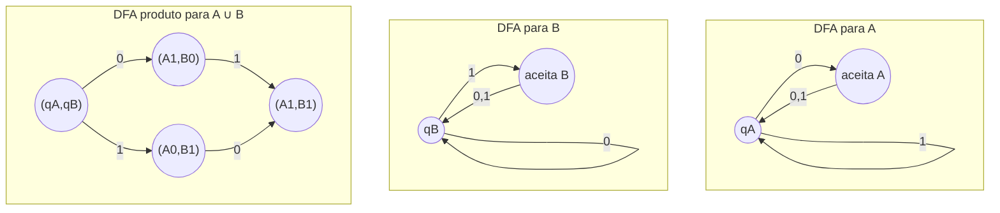

## Objetivos de Aprendizagem

- Enunciar sob quais operações de conjunto (união, interseção, concatenação, estrela de Kleene, complemento) a classe das linguagens regulares é fechada.
- Explicar por que propriedades de fechamento permitem que uma linguagem regular complexa seja construída a partir de peças mais simples, já conhecidas como regulares, em vez de ser desenhada como um único autômato do zero.
- Construir, explicitamente, um DFA reconhecendo a união de duas linguagens dados AFDs para cada uma, usando uma combinação no estilo de construção por produto.
- Construir um DFA reconhecendo o complemento de uma linguagem regular dado um DFA para ela.
- Usar propriedades de fechamento em conjunto para argumentar que uma linguagem construída a partir de peças regulares mais simples através dessas operações é ela mesma regular, sem construir seu autômato diretamente.

## Contexto e Motivação

Uma vez que uma linguagem tenha sido mostrada regular, exibindo um DFA, um NFA, ou uma expressão regular para ela, uma próxima pergunta natural é o que acontece quando linguagens regulares são combinadas. Se A e B são ambas regulares, A ∪ B é regular? E A ∩ B? E a linguagem das strings que NÃO estão em A? Essas não são perguntas ociosas: especificações reais quase nunca são construídas como uma única descrição plana. Uma regra léxica como "um identificador é uma letra seguida de letras ou dígitos, mas não uma das palavras-chave reservadas" é na verdade três linguagens regulares combinadas por concatenação, união, e complemento, e o fato de que a combinação tem garantia de continuar regular é o que permite a quem desenha uma linguagem especificá-la declarativamente e confiar que um reconhecedor existe, sem ter que raciocinar sobre um único autômato extenso à mão.

Esse é o ganho das propriedades de fechamento cobertas aqui. Cada propriedade de fechamento é provada *construtivamente*, não apenas "a união de duas linguagens regulares acontece de ser regular" como um fato abstrato, mas "aqui está uma receita explícita que toma dois autômatos e produz um autômato para a linguagem combinada." Esse caráter construtivo importa na prática: é essencialmente a mesma receita que um motor de regex ou um gerador de analisador léxico executa internamente quando compila uma especificação com alternância, sequenciamento, e repetição em um único autômato. Entender a construção é entender o que a máquina por trás de uma ferramenta como `grep` ou o tokenizador de um compilador está de fato fazendo quando pega uma regra escrita como `(dígito)+` ou `palavra-chave|identificador` e a transforma em algo que roda em uma única passagem sobre a entrada.

O tratamento do MIT 18.404J (e o livro de Sipser, que o curso segue de perto) introduz propriedades de fechamento imediatamente depois da equivalência DFA/NFA por exatamente esse motivo: uma vez que AFNs e AFDs são conhecidos como intercambiáveis, as construções se tornam muito mais fáceis de enunciar, porque uma construção pode livremente introduzir não-determinismo (uma transição-ε, uma escolha de ramificação extra) e ainda assim cair de volta com segurança em "regular", já que NFA e DFA reconhecem a mesma classe. Esta entrada trabalha a construção da união por completo, na forma disciplinada de "nenhum não-determinismo necessário", uma construção por produto genuína sobre ambos os AFDs ao mesmo tempo, além de complemento, interseção, concatenação, e estrela de Kleene, de modo que, ao final, toda operação da lista padrão tenha ao menos um esboço de por que ela preserva regularidade.

## Teoria Central

### As propriedades de fechamento, listadas

A classe das linguagens regulares é fechada sob cada uma das operações a seguir. Se A e B são linguagens regulares sobre o mesmo alfabeto Σ, então todas as seguintes também são regulares:

1. **União**: A ∪ B = {w : w ∈ A ou w ∈ B}
2. **Interseção**: A ∩ B = {w : w ∈ A e w ∈ B}
3. **Concatenação**: A ∘ B = {xy : x ∈ A e y ∈ B}
4. **Estrela de Kleene**: A* = {x₁x₂...xₖ : k ≥ 0 e cada xᵢ ∈ A}
5. **Complemento**: A̅ = {w ∈ Σ* : w ∉ A}

Essas cinco são a lista padrão (Sipser, cap. 1). Cada uma é provada dando uma construção explícita que constrói um novo autômato (ou regex) para a linguagem combinada diretamente a partir de autômatos (ou regexes) para as peças, nenhum desses fatos é provado por algum argumento indireto que meramente afirma existência sem mostrar como construir o resultado.

### Por que o fechamento importa na prática

Sem propriedades de fechamento, provar que uma linguagem complicada é regular exigiria construir um único autômato grande e ad hoc à mão, rastreando toda configuração possível em um único diagrama. Com propriedades de fechamento em mãos, uma linguagem pode em vez disso ser decomposta em pequenas peças regulares cuja regularidade ou é óbvia (símbolos únicos, pequenas linguagens finitas) ou já está estabelecida, e então remontada usando as operações conhecidas por preservar regularidade. Por exemplo, "strings binárias que contêm `01` como substring mas não terminam em `00`" se decompõe como (Σ*01Σ*) ∩ complemento(Σ*00), uma interseção de duas linguagens regulares muito mais simples, cada uma fácil de construir um DFA individualmente. O fechamento sob interseção então garante, sem nenhum trabalho adicional, que a linguagem combinada também é regular, e a construção por produto (abaixo) até diz exatamente como construir seu DFA caso você precise de um explicitamente.

### Construção: fechamento sob união (construção por produto)

**Afirmação.** Se A e B são linguagens regulares, então A ∪ B é regular.

**Prova, por construção.** Como A e B são regulares, existem AFDs M_A = (Q_A, Σ, δ_A, q_A, F_A) reconhecendo A e M_B = (Q_B, Σ, δ_B, q_B, F_B) reconhecendo B, sobre o mesmo alfabeto Σ (complete os alfabetos com símbolos não usados se originalmente diferirem, o que não muda nenhuma das duas linguagens). Construa um novo DFA M = (Q, Σ, δ, q₀, F) que roda M_A e M_B *simultaneamente*, rastreando um par de estados, um de cada máquina, como um único estado combinado:

- **Estados:** Q = Q_A × Q_B (todo par (p, q) com p ∈ Q_A, q ∈ Q_B).
- **Estado inicial:** q₀ = (q_A, q_B), o par dos estados iniciais de ambas as máquinas.
- **Função de transição:** δ((p, q), a) = (δ_A(p, a), δ_B(q, a)), no símbolo a, avance ambas as máquinas componentes independentemente, usando suas próprias funções de transição, e junte os resultados em par.
- **Estados de aceitação:** F = {(p, q) : p ∈ F_A ou q ∈ F_B}, aceite um par exatamente quando *qualquer um* dos componentes teria aceitado, o que codifica diretamente "aceite se em A ou em B."

Esse M lê uma string de entrada w exatamente uma vez, rastreando onde M_A estaria e onde M_B estaria depois desse mesmo prefixo, simultaneamente, como as duas coordenadas de um único estado. Como M cai em um estado combinado de aceitação em w se e somente se o componente A é de aceitação em w (w ∈ A) ou o componente B é de aceitação em w (w ∈ B), M aceita exatamente A ∪ B. Como M é um DFA válido (Q é finito porque Q_A e Q_B são ambos finitos; δ é uma função total porque δ_A e δ_B são ambas totais), A ∪ B é regular. ∎

Essa mesma ideia de "rastrear ambas as máquinas ao mesmo tempo, juntando seus estados em par", uma **construção por produto**, é a ferramenta de propósito geral por trás de todas as propriedades de fechamento booleanas; só a regra do conjunto de aceitação muda entre elas.

### Construção: fechamento sob interseção e complemento

**Interseção** usa a construção por produto idêntica, mudando apenas o conjunto de aceitação: F = {(p, q) : p ∈ F_A **e** q ∈ F_B}, aceite um estado combinado só quando *ambos* os componentes teriam aceitado, o que codifica "aceite se em A e em B" em vez de "ou." Toda outra parte da construção, estados, estado inicial, função de transição, permanece inalterada em relação à construção da união acima.

**Complemento** é ainda mais simples e precisa de apenas um único DFA. Se M = (Q, Σ, δ, q₀, F) reconhece A, então M̅ = (Q, Σ, δ, q₀, Q − F), a máquina idêntica, com estados de aceitação e não aceitação trocados, reconhece A̅. Como M é um DFA, ele tem exatamente uma execução em qualquer string de entrada w, terminando em algum único estado s ∈ Q; M aceita w exatamente quando s ∈ F, então M̅ aceita w exatamente quando s ∈ Q − F, ou seja, exatamente quando M *não* aceita w, ou seja, exatamente quando w ∉ A. Essa construção depende criticamente de M ser um DFA, uma transição definida por símbolo, sem transições faltando, sem múltiplas escolhas, já que trocar aceita/não aceita em um NFA não produz, em geral, um complemento correto (um NFA pode ter várias execuções na mesma string, aceitando por uma e rejeitando por outra; trocar o conjunto de aceitação não transforma "alguma execução aceita" em "alguma execução rejeita em todos os caminhos").

### Construção: fechamento sob concatenação e estrela de Kleene

**Concatenação** e **estrela de Kleene** são mais naturalmente provadas usando AFNs em vez de AFDs, apoiando-se na equivalência DFA-NFA já estabelecida: já que toda linguagem regular tem *algum* NFA que a reconhece, basta construir um NFA para a linguagem combinada, e reconhecível-por-NFA é exatamente regular.

Para **concatenação** A ∘ B, dados um NFA N_A para A e N_B para B, construa um novo NFA tomando todo estado de aceitação de N_A e adicionando uma transição-ε dele para o estado inicial de N_B, depois designando o estado inicial original de N_A como o novo estado inicial e os estados de aceitação de N_B como os novos estados de aceitação. Qualquer execução de aceitação na nova máquina lê algum prefixo que leva N_A a um de seus estados de aceitação, salta silenciosamente por ε para N_B, e lê o sufixo restante como uma execução de aceitação de N_B, capturando exatamente "alguma divisão da string em xy com x ∈ A e y ∈ B."

Para **estrela de Kleene** A*, dado um NFA N_A para A, construa um novo NFA com um novo estado inicial que também é um estado de aceitação (para aceitar a string vazia, sempre em A* por definição mesmo quando a string vazia não está em A), com uma transição-ε do novo estado inicial para o antigo estado inicial de N_A, e uma transição-ε de todo estado de aceitação de N_A de volta para o antigo estado inicial de N_A (para permitir repetição). Essa construção exata é desenvolvida por completo, símbolo por símbolo, na entrada complementar sobre expressões regulares para autômatos finitos, já que é também precisamente o caso indutivo usado ali para o operador de regex `*`.

## Exemplos Resolvidos

### Exemplo 1: união via a construção por produto, construída por completo

**Problema:** Seja Σ = {0, 1}. Sejam A = "strings terminando em 0" e B = "strings terminando em 1" (ambas de comprimento ≥ 1). Construa o DFA da união para A ∪ B usando a construção por produto, e verifique que ele reconhece exatamente "strings não vazias", bem, mais precisamente, verifique contra algumas strings diretamente, já que A ∪ B é na verdade apenas Σ⁺ (qualquer string não vazia termina em 0 ou em 1).

**AFDs componentes.** M_A sobre os estados {qA0, qA1} (qA0 = inicial / "ainda não termina em 0 ou está vazia", qA1 = "termina em 0"): δ_A(qA0,0)=qA1, δ_A(qA0,1)=qA0, δ_A(qA1,0)=qA1, δ_A(qA1,1)=qA0. Aceita: {qA1}. M_B é a imagem espelhada sobre {qB0, qB1}: δ_B(qB0,1)=qB1, δ_B(qB0,0)=qB0, δ_B(qB1,1)=qB1, δ_B(qB1,0)=qB0. Aceita: {qB1}.

**Construção por produto.** Estados: todos os 4 pares (qA0,qB0), (qA0,qB1), (qA1,qB0), (qA1,qB1). Inicial: (qA0,qB0). Transições calculadas componente a componente, por exemplo δ((qA0,qB0),0) = (δ_A(qA0,0), δ_B(qB0,0)) = (qA1,qB0). Estados de aceitação (regra da união, "qualquer um aceita"): {(qA1,qB0), (qA0,qB1), (qA1,qB1)}, todo par exceto o próprio par inicial (qA0,qB0), já que esse é o único par em que nenhum dos componentes está em seu próprio estado de aceitação.

**Verificação.** Na entrada "0": (qA0,qB0) →0→ (qA1,qB0), que é aceitador, correto, "0" termina em 0, então está em A, então em A ∪ B. Na entrada "1": (qA0,qB0) →1→ (qA0,qB1), aceitador, correto, "1" termina em 1. Na string vazia: permanece em (qA0,qB0), não aceitador, correto, a string vazia não está nem em A nem em B (ambas exigem comprimento ≥ 1). Isso corresponde exatamente a Σ⁺, como esperado.

### Exemplo 2: decompondo uma linguagem usando múltiplas propriedades de fechamento

**Problema:** Seja Σ = {0,1}. Mostre que L = "strings que contêm `00` como substring e não terminam em `1`" é regular, sem construir diretamente um autômato para L.

**Decomposição.** L = C ∩ D, onde C = Σ*00Σ* ("contém 00 em algum lugar") e D = complemento(Σ*1) ("não termina em 1"). Tanto C quanto D são individualmente fáceis de ver como regulares: C é literalmente descrita pela expressão regular `Σ*00Σ*`, e Σ*1 (strings terminando em 1) é igualmente diretamente regular, então D é regular pelo fechamento sob complemento (construção acima, trocando aceita/não aceita em um DFA para Σ*1). Como C e D são ambas regulares, e linguagens regulares são fechadas sob interseção (construção acima, versão "e" da regra do produto), L = C ∩ D é regular.

**Nenhum autômato para L foi construído diretamente**, o argumento só invocou (a) duas linguagens base simples que são visivelmente regulares, e (b) duas propriedades de fechamento (complemento, interseção) já provadas em geral. Esse é o ponto prático inteiro das propriedades de fechamento: a regularidade de L é estabelecida com zero trabalho de construção novo específico para L em si.

### Exemplo 3: construção do complemento sobre um DFA concreto pequeno

**Problema:** Seja M reconhecendo A = "strings binárias com um número par de 1s", com estados {par, ímpar} (par = inicial = aceita), δ(par,1)=ímpar, δ(par,0)=par, δ(ímpar,1)=par, δ(ímpar,0)=ímpar. Construa M̅ para A̅ = "strings com um número ímpar de 1s", e verifique em "101".

**Construção.** M̅ tem os estados e transições idênticos a M; só os estados de aceitação mudam de {par} para {ímpar}.

**Verificação em "101".** Execute por M: início par →1→ ímpar →0→ ímpar →1→ par. M termina em "par", então M aceita "101" (tem dois 1s, uma contagem par), correto para A. Executando o mesmo caminho por M̅ (mesmas transições, conjunto de aceitação {ímpar} em vez de): M̅ também termina em "par", que *não* está no conjunto de aceitação {ímpar} de M̅, então M̅ rejeita "101", correto, já que "101" tem um número par, não ímpar, de 1s, então não está em A̅.

## Equívocos Comuns e Armadilhas

- **"Complementar um NFA apenas trocando os estados de aceitação e não aceitação funciona, do mesmo jeito que para um DFA."** Não funciona. Um NFA tipicamente tem várias execuções possíveis em uma entrada; trocar quais estados são de aceitação não transforma "alguma execução aceita" em "toda execução rejeita." Complementar um NFA corretamente exige primeiro convertê-lo em um DFA equivalente (via a construção de subconjuntos) e só então trocar os estados de aceitação.
- **"A construção por produto para união e interseção são basicamente algoritmos diferentes."** Elas são a *mesma* construção (mesmos estados, mesmo estado inicial, mesma função de transição); só a definição do conjunto de aceitação muda, "qualquer componente aceita" para união, "ambos os componentes aceitam" para interseção. Tratá-las como procedimentos não relacionados obscurece o quanto as duas provas compartilham diretamente sua maquinaria.
- **"O fechamento sob concatenação é provado da mesma forma que a união, com uma construção por produto de AFDs."** Concatenação genuinamente precisa da construção de NFA com transição-ε (ou um argumento equivalente em nível de regex); não há forma natural de rodar dois AFDs "ao mesmo tempo, em sequência" via um único produto simultâneo da forma que união e interseção fazem, porque concatenação exige *decidir quando trocar* da primeira máquina para a segunda, que é exatamente o tipo de escolha para a qual o não-determinismo (ou a construção de subconjuntos depois do fato) é adequado.
- **"Se A é regular e B é regular, A − B (diferença de conjuntos) precisa de uma prova de fechamento inteiramente nova."** A − B = A ∩ B̅, então segue imediatamente do fechamento sob interseção e complemento já estabelecidos, nenhuma construção separada é necessária, apenas compor as duas.

## Resumo

Linguagens regulares são fechadas sob união, interseção, concatenação, estrela de Kleene, e complemento, e cada propriedade de fechamento é provada construtivamente, por uma receita explícita que transforma autômatos (ou regexes) para as peças em um autômato (ou regex) para a linguagem combinada. União e interseção compartilham uma única construção por produto que roda dois AFDs simultaneamente como pares de estados, diferindo apenas em quais estados combinados contam como aceitadores ("qualquer um" versus "ambos"). Complemento troca diretamente os estados de aceitação e não aceitação de um DFA, um passo que exige especificamente partir de um DFA em vez de um NFA. Concatenação e estrela de Kleene são tratadas mais naturalmente via AFNs e transições-ε, encadeando ou fazendo laço entre máquinas. Na prática, essas propriedades significam que uma linguagem regular complicada raramente precisa ser desenhada como um único autômato grande do zero, ela pode em vez disso ser decomposta em peças simples e obviamente regulares e remontada com operações já conhecidas por preservar regularidade, exatamente da forma que um analisador léxico ou motor de regex constrói um único reconhecedor a partir das alternativas, sequências, e repetições individuais de uma especificação.

## Documentation Links

- [Sipser: Introduction to the Theory of Computation, 3rd ed.](https://cs.brown.edu/courses/csci1810/fall-2023/resources/ch2_readings/Sipser_Introduction.to.the.Theory.of.Computation.3E.pdf): doc
- [ACM/IEEE CS2013: Full Curriculum Site](https://csed.acm.org/cs2013-version/): doc
