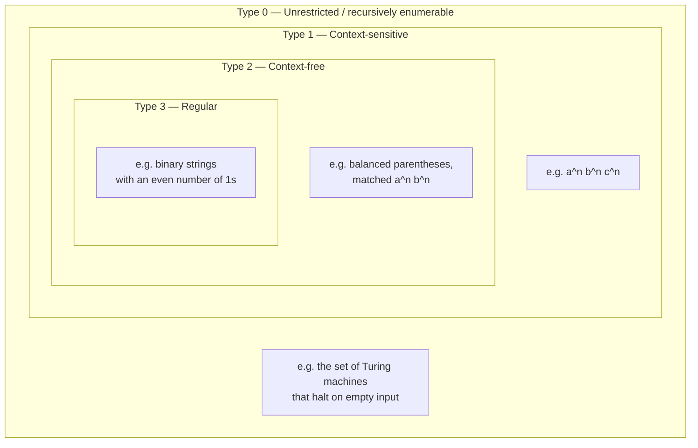

## Learning Objectives

- State the four levels of the Chomsky hierarchy in order and describe the nesting relationship (regular ⊂ context-free ⊂ context-sensitive ⊂ unrestricted) between them.
- Distinguish the four levels by the shape of the production rules a grammar at each level is allowed to use, without needing full formal definitions of the outer two.
- Explain, for a language known to sit at one level, why it is automatically a member of every level above it in the hierarchy.
- Identify which model of computation is the natural "recognizer" associated with each level (finite automaton, pushdown automaton, linear-bounded automaton, Turing machine) as an orienting fact, not a developed topic.
- Locate where this discipline's own scope sits inside the hierarchy, and name what is deliberately left to a different, later discipline.

## Context & Motivation

In 1956, the linguist Noam Chomsky proposed a classification of grammars — sets of rules for generating strings of symbols — that turned out to matter enormously beyond linguistics. Ranked by how much freedom their production rules are allowed, these grammars fall into four nested classes, and each class corresponds exactly to a natural class of languages recognizable by a particular kind of abstract machine. This correspondence, between a purely syntactic restriction on how rules may be written and a purely computational restriction on how much memory a recognizing machine needs, is one of the most durable results in all of theoretical computer science. It is the reason a regular expression engine, a JSON parser, and a general-purpose programming language compiler are fundamentally different kinds of software, built on fundamentally different machinery, even though on the surface they all just "read text and decide something about it."

This concept exists to give you the map before you start walking any of the individual roads. MIT's 18.404J (Theory of Computation) opens with essentially this framing, and it is worth taking seriously as a genuine organizing structure rather than a piece of historical trivia: everything else in this discipline — deterministic and nondeterministic finite automata, regular expressions, context-free grammars, pushdown automata — is entirely a study of the *bottom two* levels of this hierarchy. That is a deliberate scope decision, confirmed by real syllabi (both MIT's 18.404 and Stanford's CS154 structure their courses this way), and it means you should read this concept as a scaffold that names all four levels honestly, while being explicit that only two of them get developed in depth here.

The practical stakes are concrete. A recognizer for a regular language needs only a fixed, finite amount of memory (a DFA's state), regardless of how long the input string is. A recognizer for a context-free language needs a stack — memory that grows with input, but only in a very disciplined, last-in-first-out way. The two remaining levels need progressively less disciplined, more general memory, up to a Turing machine's unbounded tape — the model of general computation itself. Knowing in advance which of these four resource profiles a problem actually needs is often the single most important design decision in solving it: reaching for a general-purpose parser or a full interpreter to validate that a string matches a fixed pattern is solving a regular-language problem with unrestricted-language machinery, wasteful in both directions.

## Core Theory

### The four levels, in order of increasing generality

The Chomsky hierarchy ranks grammars — and the languages they generate — into four classes, conventionally numbered Type 3 down to Type 0 (the numbering runs backward from the ordering by generality, a historical artifact worth just noting once):

| Type | Name | Rule restriction (informal) | Recognizing machine |
|---|---|---|---|
| 3 | Regular | Left side is a single nonterminal; right side is a single terminal, optionally followed (or preceded) by a single nonterminal | Finite automaton (DFA/NFA) |
| 2 | Context-free | Left side is a single nonterminal; right side is *any* string of terminals and nonterminals | Pushdown automaton |
| 1 | Context-sensitive | Left side may be a string of symbols, not just one nonterminal; the right side must be at least as long as the left side (rules cannot shrink the string) | Linear-bounded automaton (a Turing machine restricted to the input's own tape space) |
| 0 | Unrestricted (recursively enumerable) | No restriction at all on either side of a rule | Turing machine |

Each level is characterized by *how much a grammar is allowed to say on the left-hand side of a rule, and how unconstrained the right-hand side is allowed to be*. Reading down the table, each level relaxes the constraints of the one above it a little further, which is exactly why the languages nest.

### Nesting: regular ⊂ context-free ⊂ context-sensitive ⊂ unrestricted

The core structural claim of the hierarchy is that these four classes of languages are strictly nested:

Every regular language is also a context-free language (any regular grammar's rules already have the restricted shape a context-free grammar allows — a regular grammar is simply a context-free grammar with an extra restriction on the right-hand side), every context-free language is also context-sensitive, and every context-sensitive language is also unrestricted. The containments are *strict*: at each boundary, there exists at least one language belonging to the larger class but not the smaller one. The classic example separating regular from context-free is the language of strings of the form aⁿbⁿ (n a's followed by exactly n b's) — a later concept in this discipline (the Pumping Lemma) proves rigorously that no finite automaton can recognize this language, while a very small context-free grammar generates it trivially. Similarly, aⁿbⁿcⁿ (equal numbers of three symbols, in order) is a standard example of a context-sensitive language that is not context-free.

This nesting is the single most load-bearing fact in the hierarchy: it means that once you know a language is regular, you get "it is also context-free" for free, without any additional argument — and it means that if you can show a language is *not* even context-free, you have automatically shown it is not regular either (the contrapositive of the containment).

### Why the rule shape matters: from syntax to computational power

The informal restrictions in the table above are not arbitrary bookkeeping — they directly determine how much memory a machine needs to simulate a derivation. A regular grammar's rules only ever let a derivation "remember" which single nonterminal it is currently at — nothing about the string generated so far needs to be recalled beyond that one piece of state, which is exactly why a finite automaton (a machine with no memory beyond its current state) suffices to recognize regular languages. A context-free grammar's rules allow a nonterminal on the right-hand side to be expanded independently of everything around it, which is exactly the discipline a stack provides: push a marker, recurse into the sub-expansion, pop it back off when done — hence a pushdown automaton (finite automaton plus one stack) suffices. Context-sensitive rules allow the replacement to depend on surrounding context (hence the name) but never shrink the string, which corresponds to a Turing machine restricted to using only the tape space the input itself occupies. Unrestricted grammars drop every restriction, and correspondingly need the full, unbounded tape of a general Turing machine.

### This discipline's place in the hierarchy

This discipline develops the bottom two levels — regular languages (finite automata, regular expressions, and their equivalence) and context-free languages (context-free grammars and pushdown automata) — in complete formal depth, because both are compact enough to admit a full, rigorous, one-term treatment and because together they cover the languages behind two extremely common pieces of real software: text-pattern matching (regular) and programming-language syntax (context-free). Context-sensitive and unrestricted languages are named and placed correctly in the hierarchy here, but are *not* developed further in this discipline. The unrestricted level — and specifically the Turing machine as the model of general computation, together with decidability, the Halting Problem, and complexity classes — is the entire subject of the sibling discipline, Computability & Complexity, which this discipline hands off to at its very end. Context-sensitive languages, sitting between the two, are genuinely less central to either discipline's core narrative and are mentioned here for completeness of the hierarchy rather than developed as a topic of their own.

## Worked Examples

### Example 1 — classifying three languages by their rules

**Problem:** For each of the following languages, identify the shape of a grammar rule needed to generate it, and place it at the correct level of the hierarchy.

1. L₁ = binary strings with an even number of 1s.
2. L₂ = strings of balanced parentheses, e.g. `(())()`.
3. L₃ = { aⁿbⁿcⁿ : n ≥ 0 } (equal counts of a's, then b's, then c's, in that order).

**Reasoning.**

For L₁: a grammar can track "even count so far" or "odd count so far" as two separate nonterminals, e.g. `Even → 0 Even | 1 Odd | ε` and `Odd → 0 Odd | 1 Even`. Every rule has a single nonterminal on the left and at most one nonterminal on the right, appearing at the end — the regular-grammar shape. L₁ is regular (Type 3).

For L₂: no finite amount of "which state am I in" tracking suffices, because the depth of nesting is unbounded and must be matched exactly — you need an unbounded stack of "how many parens are still open." A grammar `S → (S)S | ε` generates exactly this language, with an unrestricted right-hand side (`(S)S` mixes terminals and nonterminals with no restriction) but still just one nonterminal on the left. This is the context-free shape. L₂ is context-free (Type 2), not regular.

For L₃: even a stack is not enough — a pushdown automaton can match a's against b's, or b's against c's, using its one stack, but it cannot verify all three counts are simultaneously equal with only one stack's worth of memory (this is proved rigorously with the context-free pumping lemma in a later discipline topic, sketched here only informally). Generating this language requires rules where the left-hand side is a *string* of symbols and context can be checked, e.g. constructions using rules like `aB → aBb'` before a final cleanup pass — the context-sensitive shape. L₃ sits at Type 1, strictly above context-free, and is not developed further in this discipline.

### Example 2 — using the nesting to shortcut a classification

**Problem:** Given that L = { aⁿbⁿ : n ≥ 0 } has already been proven context-free (by exhibiting the grammar `S → aSb | ε`), what can be said immediately about where else L sits in the hierarchy, without any further argument?

**Reasoning.** By the strict nesting context-free ⊂ context-sensitive ⊂ unrestricted, any language already known to be context-free is *automatically* context-sensitive and unrestricted as well — no separate grammar or proof is required for those two claims; membership in a smaller class in the hierarchy always implies membership in every larger class above it. What is *not* free is the reverse direction: knowing L is context-free says nothing by itself about whether L is also regular (the smaller class below it) — that requires a separate argument, and in this case the separate argument (the Pumping Lemma for regular languages, covered later) shows L is *not* regular, so L sits at exactly the context-free level and no lower.

### Example 3 — reading a grammar's rule shapes to identify its level

**Problem:** A grammar has the rules `S → aSa | bSb | c`. What is the tightest level of the hierarchy this grammar's rule shapes place it at?

**Reasoning.** Every rule has a single nonterminal (`S`) on the left-hand side, and the right-hand side is an arbitrary mix of terminals and nonterminals (`aSa`, `bSb`, `c`) — not restricted to a single terminal followed by at most one nonterminal at the end, as a regular grammar would require. This is the context-free rule shape, so the grammar is (at least) a context-free grammar. Tracing a few derivations — `S ⇒ aSa ⇒ abSba ⇒ abcba` — shows this grammar generates palindromes of odd length over {a, b} centered on `c` (e.g. `abcba`, `aabcbaa`), a language that (like aⁿbⁿ) cannot be recognized by any finite automaton, confirming the grammar is genuinely context-free and not merely regular in disguise.

## Common Misconceptions & Pitfalls

- **"Higher Type number means more powerful."** It's the reverse: the numbering runs Type 3 (regular, most restricted) down to Type 0 (unrestricted, least restricted, most powerful). A common slip is to assume "Type 1 is weaker than Type 3" by analogy with version numbers or priority levels — instead, smaller Type number means fewer restrictions on the grammar and a strictly larger class of describable languages.
- **"If a language can be generated by a context-free grammar, it cannot also be regular."** The containment is not exclusive — every regular language is also, trivially, context-free (a regular grammar already satisfies the context-free restriction, since it has a single nonterminal on the left). A language being context-free never rules out it also being regular; concluding "not regular" requires a separate, positive argument (like the Pumping Lemma), never just the fact that a context-free grammar happens to exist for it.
- **"The hierarchy is really about programming languages, not abstract theory."** While the practical payoff (regex engines, parsers) is real and covered later in this discipline (`real-applications-regex-and-grammars`), the classification itself is a purely mathematical fact about sets of production rules and the languages they generate — it predates, and is independent of, any particular programming language or piece of software.
- **"Since this course covers automata, it must also cover Turing machines and the Halting Problem — they're related topics."** They are related, but deliberately out of scope here: this discipline stops at context-free languages and pushdown automata (Type 2 and Type 3), and hands off the unrestricted level — Turing machines, decidability, the Halting Problem, complexity classes — entirely to the sibling discipline, Computability & Complexity. This is a real, confirmed scope boundary (matching MIT 18.404 and Stanford CS154), not an oversight.

## Summary

The Chomsky hierarchy organizes grammars — and the languages they generate — into four strictly nested classes, ranked by how unrestricted their production rules are allowed to be: regular (Type 3) ⊂ context-free (Type 2) ⊂ context-sensitive (Type 1) ⊂ unrestricted (Type 0). Each level corresponds to a natural class of recognizing machine with a matching amount of memory — a finite automaton's fixed state, a pushdown automaton's single stack, a tape-bounded Turing machine, and a fully general Turing machine, respectively — which is why the purely syntactic classification of rule shapes lines up exactly with a purely computational classification of resource needs. The nesting means membership in a smaller class always implies membership in every larger class above it, but never the reverse. This discipline develops the bottom two levels — regular and context-free languages — in full depth, names the outer two levels honestly as part of the same hierarchy, and deliberately leaves the unrestricted level (Turing machines and everything built on them) to the sibling Computability & Complexity discipline.

## Documentation Links

- [MIT 18.404J — OCW Syllabus](https://ocw.mit.edu/courses/18-404j-theory-of-computation-fall-2020/pages/syllabus/) — doc
- [ACM/IEEE CS2013 — Full Curriculum Site](https://csed.acm.org/cs2013-version/) — doc
