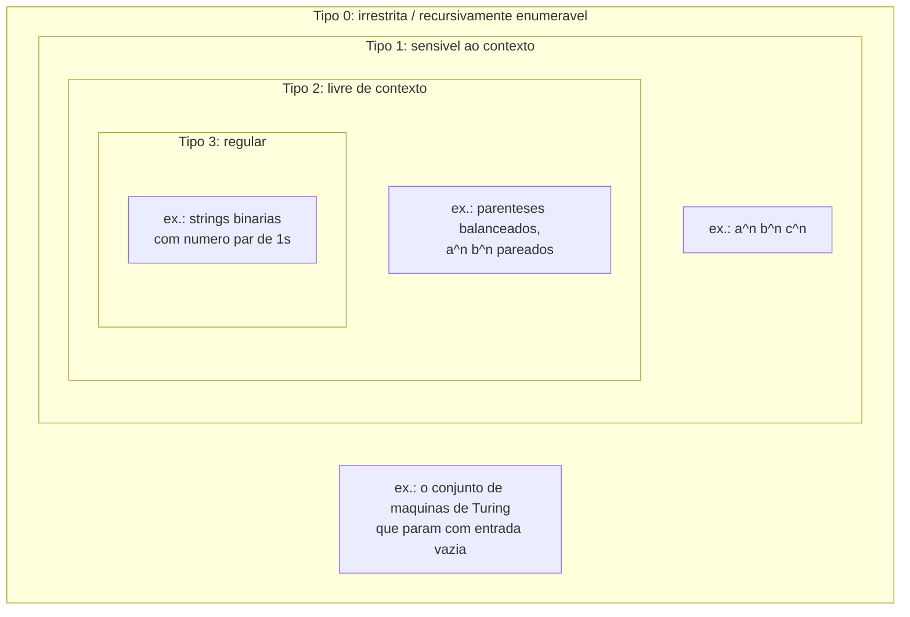

## Objetivos de Aprendizagem

- Enunciar os quatro níveis da hierarquia de Chomsky em ordem e descrever a relação de aninhamento (regular ⊂ livre de contexto ⊂ sensível ao contexto ⊂ irrestrita) entre eles.
- Distinguir os quatro níveis pela forma das regras de produção que uma gramática em cada nível tem permissão de usar, sem precisar de definições formais completas dos dois níveis externos.
- Explicar, para uma linguagem sabidamente situada em um nível, por que ela automaticamente é membro de todo nível acima dela na hierarquia.
- Identificar qual modelo de computação é o "reconhecedor" natural associado a cada nível (autômato finito, autômato de pilha, autômato linearmente limitado, máquina de Turing) como um fato de orientação, não um tópico desenvolvido.
- Localizar onde o escopo desta própria disciplina se situa dentro da hierarquia, e nomear o que é deliberadamente deixado para uma disciplina diferente, posterior.

## Contexto e Motivação

Em 1956, o linguista Noam Chomsky propôs uma classificação de gramáticas (conjuntos de regras para gerar strings de símbolos) que acabou importando enormemente além da linguística. Ordenadas por quanta liberdade suas regras de produção têm permissão de ter, essas gramáticas caem em quatro classes aninhadas, e cada classe corresponde exatamente a uma classe natural de linguagens reconhecíveis por um tipo particular de máquina abstrata. Essa correspondência, entre uma restrição puramente sintática sobre como regras podem ser escritas e uma restrição puramente computacional sobre quanta memória uma máquina reconhecedora precisa, é um dos resultados mais duradouros em toda a ciência da computação teórica. É a razão pela qual um mecanismo de expressão regular, um parser de JSON, e um compilador de linguagem de programação de propósito geral são tipos fundamentalmente diferentes de software, construídos sobre maquinaria fundamentalmente diferente, mesmo que na superfície todos apenas "leiam texto e decidam algo sobre ele."

Este conceito existe para dar o mapa antes de você começar a percorrer qualquer uma das estradas individuais. O 18.404J do MIT (Theory of Computation) abre com essencialmente esse enquadramento, e vale a pena levá-lo a sério como uma estrutura organizadora genuína em vez de uma curiosidade histórica: tudo mais nesta disciplina (autômatos finitos determinísticos e não determinísticos, expressões regulares, gramáticas livres de contexto, autômatos de pilha) é inteiramente um estudo dos *dois níveis inferiores* dessa hierarquia. Essa é uma decisão de escopo deliberada, confirmada por currículos reais (tanto o 18.404 do MIT quanto o CS154 de Stanford estruturam seus cursos dessa forma), e significa que você deve ler este conceito como um andaime que nomeia os quatro níveis honestamente, ao mesmo tempo em que é explícito que só dois deles são desenvolvidos em profundidade aqui.

As apostas práticas são concretas. Um reconhecedor para uma linguagem regular precisa apenas de uma quantidade fixa e finita de memória (o estado de um DFA), independentemente de quão longa a string de entrada seja. Um reconhecedor para uma linguagem livre de contexto precisa de uma pilha, memória que cresce com a entrada, mas só de uma forma muito disciplinada e last-in-first-out. Os dois níveis restantes precisam de memória progressivamente menos disciplinada e mais geral, até chegar à fita ilimitada de uma máquina de Turing, o próprio modelo de computação geral. Saber com antecedência qual desses quatro perfis de recursos um problema de fato precisa é frequentemente a decisão de design mais importante para resolvê-lo: recorrer a um parser de propósito geral ou a um interpretador completo para validar que uma string casa com um padrão fixo é resolver um problema de linguagem regular com maquinaria de linguagem irrestrita, desperdiçador nas duas direções.

## Teoria Central

### Os quatro níveis, em ordem de generalidade crescente

A hierarquia de Chomsky classifica gramáticas, e as linguagens que elas geram, em quatro classes, convencionalmente numeradas de Tipo 3 até Tipo 0 (a numeração corre ao contrário da ordenação por generalidade, um artefato histórico que vale a pena só observar uma vez):

| Tipo | Nome | Restrição de regra (informal) | Máquina reconhecedora |
|---|---|---|---|
| 3 | Regular | O lado esquerdo é um único não terminal; o lado direito é um único terminal, opcionalmente seguido (ou precedido) por um único não terminal | Autômato finito (DFA/NFA) |
| 2 | Livre de contexto | O lado esquerdo é um único não terminal; o lado direito é *qualquer* string de terminais e não terminais | Autômato de pilha |
| 1 | Sensível ao contexto | O lado esquerdo pode ser uma string de símbolos, não apenas um não terminal; o lado direito precisa ser pelo menos tão longo quanto o lado esquerdo (regras não podem encolher a string) | Autômato linearmente limitado (uma máquina de Turing restrita ao próprio espaço de fita da entrada) |
| 0 | Irrestrita (recursivamente enumerável) | Nenhuma restrição de forma alguma em nenhum dos lados de uma regra | Máquina de Turing |

Cada nível é caracterizado por *quanto uma gramática tem permissão de dizer no lado esquerdo de uma regra, e quão irrestrito o lado direito tem permissão de ser*. Lendo a tabela de cima para baixo, cada nível relaxa as restrições do nível acima dele um pouco mais, que é exatamente por que as linguagens se aninham.

### Aninhamento: regular ⊂ livre de contexto ⊂ sensível ao contexto ⊂ irrestrita

A alegação estrutural central da hierarquia é que essas quatro classes de linguagens estão estritamente aninhadas:

Toda linguagem regular também é uma linguagem livre de contexto (as regras de qualquer gramática regular já têm a forma restrita que uma gramática livre de contexto permite, uma gramática regular é simplesmente uma gramática livre de contexto com uma restrição extra sobre o lado direito), toda linguagem livre de contexto também é sensível ao contexto, e toda linguagem sensível ao contexto também é irrestrita. As contenções são *estritas*: em cada fronteira, existe pelo menos uma linguagem pertencente à classe maior mas não à menor. O exemplo clássico separando regular de livre de contexto é a linguagem de strings da forma aⁿbⁿ (n a's seguidos por exatamente n b's), um conceito posterior nesta disciplina (o Lema do Bombeamento) prova rigorosamente que nenhum autômato finito consegue reconhecer essa linguagem, enquanto uma gramática livre de contexto bem pequena a gera trivialmente. De forma similar, aⁿbⁿcⁿ (números iguais de três símbolos, em ordem) é um exemplo padrão de uma linguagem sensível ao contexto que não é livre de contexto.

Esse aninhamento é o fato mais essencial de toda a hierarquia: significa que uma vez que você sabe que uma linguagem é regular, você ganha "ela também é livre de contexto" de graça, sem argumento adicional algum, e significa que se você consegue mostrar que uma linguagem não é sequer livre de contexto, você automaticamente mostrou que ela também não é regular (a contrapositiva da contenção).

### Por que a forma da regra importa: da sintaxe ao poder computacional

As restrições informais na tabela acima não são burocracia arbitrária; elas determinam diretamente quanta memória uma máquina precisa para simular uma derivação. As regras de uma gramática regular só deixam uma derivação "lembrar" em qual único não terminal ela está atualmente, nada sobre a string gerada até agora precisa ser recordado além dessa única informação, que é exatamente por que um autômato finito (uma máquina sem memória além do seu estado corrente) é suficiente para reconhecer linguagens regulares. As regras de uma gramática livre de contexto permitem que um não terminal no lado direito seja expandido independentemente de tudo ao redor, o que é exatamente a disciplina que uma pilha fornece: empilhe um marcador, recurse na subexpansão, desempilhe-o de volta quando terminar, daí um autômato de pilha (autômato finito mais uma pilha) ser suficiente. Regras sensíveis ao contexto permitem que a substituição dependa do contexto ao redor (daí o nome) mas nunca encolhem a string, o que corresponde a uma máquina de Turing restrita a usar só o espaço de fita que a própria entrada ocupa. Gramáticas irrestritas descartam toda restrição, e correspondentemente precisam da fita completa e ilimitada de uma máquina de Turing geral.

### O lugar desta disciplina na hierarquia

Esta disciplina desenvolve os dois níveis inferiores (linguagens regulares: autômatos finitos, expressões regulares, e sua equivalência; e linguagens livres de contexto: gramáticas livres de contexto e autômatos de pilha) em profundidade formal completa, porque ambos são compactos o suficiente para admitir um tratamento completo, rigoroso, de um semestre, e porque juntos eles cobrem as linguagens por trás de dois pedaços de software real extremamente comuns: casamento de padrão de texto (regular) e sintaxe de linguagem de programação (livre de contexto). Linguagens sensíveis ao contexto e irrestritas são nomeadas e posicionadas corretamente na hierarquia aqui, mas *não* são desenvolvidas mais nesta disciplina. O nível irrestrito, e especificamente a máquina de Turing como o modelo de computação geral, junto com decidibilidade, o Problema da Parada, e classes de complexidade, é o assunto inteiro da disciplina irmã, Computability & Complexity, para a qual esta disciplina faz a transição bem no final. Linguagens sensíveis ao contexto, sentadas entre as duas, são genuinamente menos centrais à narrativa central de qualquer uma das disciplinas e são mencionadas aqui por completude da hierarquia em vez de desenvolvidas como um tópico próprio.

## Exemplos Resolvidos

### Exemplo 1: classificando três linguagens por suas regras

**Problema:** Para cada uma das linguagens a seguir, identifique a forma de uma regra de gramática necessária para gerá-la, e a posicione no nível correto da hierarquia.

1. L₁ = strings binárias com um número par de 1s.
2. L₂ = strings de parênteses balanceados, por exemplo `(())()`.
3. L₃ = { aⁿbⁿcⁿ : n ≥ 0 } (contagens iguais de a's, depois b's, depois c's, nessa ordem).

**Raciocínio.**

Para L₁: uma gramática pode rastrear "contagem par até agora" ou "contagem ímpar até agora" como dois não terminais separados, por exemplo `Even → 0 Even | 1 Odd | ε` e `Odd → 0 Odd | 1 Even`. Toda regra tem um único não terminal à esquerda e no máximo um não terminal à direita, aparecendo no final, a forma de gramática regular. L₁ é regular (Tipo 3).

Para L₂: nenhuma quantidade finita de rastreamento de "em que estado estou" é suficiente, porque a profundidade de aninhamento é ilimitada e precisa ser casada exatamente, você precisa de uma pilha ilimitada de "quantos parênteses ainda estão abertos." Uma gramática `S → (S)S | ε` gera exatamente essa linguagem, com um lado direito irrestrito (`(S)S` mistura terminais e não terminais sem restrição alguma) mas ainda com só um não terminal à esquerda. Essa é a forma livre de contexto. L₂ é livre de contexto (Tipo 2), não regular.

Para L₃: nem mesmo uma pilha é suficiente, um autômato de pilha consegue casar a's contra b's, ou b's contra c's, usando sua única pilha, mas não consegue verificar que as três contagens são simultaneamente iguais com só a memória de uma pilha (isso é provado rigorosamente com o lema do bombeamento livre de contexto em um tópico posterior da disciplina, esboçado aqui só informalmente). Gerar essa linguagem exige regras onde o lado esquerdo é uma *string* de símbolos e o contexto pode ser verificado, por exemplo construções usando regras como `aB → aBb'` antes de uma passagem final de limpeza, a forma sensível ao contexto. L₃ se situa no Tipo 1, estritamente acima de livre de contexto, e não é desenvolvida mais nesta disciplina.

### Exemplo 2: usando o aninhamento para atalhar uma classificação

**Problema:** Dado que L = { aⁿbⁿ : n ≥ 0 } já foi provada livre de contexto (exibindo a gramática `S → aSb | ε`), o que pode ser dito imediatamente sobre onde mais L se situa na hierarquia, sem argumento adicional algum?

**Raciocínio.** Pelo aninhamento estrito livre de contexto ⊂ sensível ao contexto ⊂ irrestrita, qualquer linguagem já sabidamente livre de contexto é *automaticamente* sensível ao contexto e irrestrita também, nenhuma gramática ou prova separada é exigida para essas duas alegações; ser membro de uma classe menor na hierarquia sempre implica ser membro de toda classe maior acima dela. O que *não* é de graça é a direção reversa: saber que L é livre de contexto não diz nada por si só sobre se L também é regular (a classe menor abaixo dela), isso exige um argumento separado, e neste caso o argumento separado (o Lema do Bombeamento para linguagens regulares, coberto depois) mostra que L *não* é regular, então L se situa exatamente no nível livre de contexto e não mais abaixo.

### Exemplo 3: lendo as formas de regra de uma gramática para identificar seu nível

**Problema:** Uma gramática tem as regras `S → aSa | bSb | c`. Qual é o nível mais rigoroso da hierarquia em que as formas de regra dessa gramática a posicionam?

**Raciocínio.** Toda regra tem um único não terminal (`S`) do lado esquerdo, e o lado direito é uma mistura arbitrária de terminais e não terminais (`aSa`, `bSb`, `c`), não restrita a um único terminal seguido por no máximo um não terminal no final, como uma gramática regular exigiria. Essa é a forma de regra livre de contexto, então a gramática é (pelo menos) uma gramática livre de contexto. Rastrear algumas derivações, `S ⇒ aSa ⇒ abSba ⇒ abcba`, mostra que essa gramática gera palíndromos de comprimento ímpar sobre {a, b} centrados em `c` (por exemplo `abcba`, `aabcbaa`), uma linguagem que (como aⁿbⁿ) não pode ser reconhecida por nenhum autômato finito, confirmando que a gramática é genuinamente livre de contexto e não meramente regular disfarçada.

## Equívocos Comuns e Armadilhas

- **"Número de Tipo maior significa mais poderoso."** É o contrário: a numeração corre do Tipo 3 (regular, mais restrito) até o Tipo 0 (irrestrito, menos restrito, mais poderoso). Um deslize comum é assumir que "Tipo 1 é mais fraco que Tipo 3" por analogia com números de versão ou níveis de prioridade, em vez disso, número de Tipo menor significa menos restrições na gramática e uma classe de linguagens descritíveis estritamente maior.
- **"Se uma linguagem pode ser gerada por uma gramática livre de contexto, ela não pode também ser regular."** A contenção não é exclusiva, toda linguagem regular também é, trivialmente, livre de contexto (uma gramática regular já satisfaz a restrição livre de contexto, já que tem um único não terminal à esquerda). Uma linguagem sendo livre de contexto nunca descarta que ela também seja regular; concluir "não regular" exige um argumento positivo separado (como o Lema do Bombeamento), nunca apenas o fato de que uma gramática livre de contexto por acaso existe para ela.
- **"A hierarquia é realmente sobre linguagens de programação, não teoria abstrata."** Embora o retorno prático (mecanismos de regex, parsers) seja real e coberto depois nesta disciplina (`real-applications-regex-and-grammars`), a classificação em si é um fato puramente matemático sobre conjuntos de regras de produção e as linguagens que elas geram, ela antecede, e é independente de, qualquer linguagem de programação ou pedaço de software em particular.
- **"Já que este curso cobre autômatos, ele também precisa cobrir máquinas de Turing e o Problema da Parada, são tópicos relacionados."** Eles são relacionados, mas deliberadamente fora de escopo aqui: esta disciplina para em linguagens livres de contexto e autômatos de pilha (Tipo 2 e Tipo 3), e faz a transição do nível irrestrito, máquinas de Turing, decidibilidade, o Problema da Parada, classes de complexidade, inteiramente para a disciplina irmã, Computability & Complexity. Essa é uma fronteira de escopo real e confirmada (casando com MIT 18.404 e Stanford CS154), não um descuido.

## Resumo

A hierarquia de Chomsky organiza gramáticas, e as linguagens que elas geram, em quatro classes estritamente aninhadas, ordenadas por quão irrestritas suas regras de produção têm permissão de ser: regular (Tipo 3) ⊂ livre de contexto (Tipo 2) ⊂ sensível ao contexto (Tipo 1) ⊂ irrestrita (Tipo 0). Cada nível corresponde a uma classe natural de máquina reconhecedora com uma quantidade de memória correspondente, o estado fixo de um autômato finito, a única pilha de um autômato de pilha, uma máquina de Turing limitada por fita, e uma máquina de Turing totalmente geral, respectivamente, que é por isso que a classificação puramente sintática das formas de regra se alinha exatamente com uma classificação puramente computacional das necessidades de recursos. O aninhamento significa que ser membro de uma classe menor sempre implica ser membro de toda classe maior acima dela, mas nunca o reverso. Esta disciplina desenvolve os dois níveis inferiores (linguagens regulares e livres de contexto) em profundidade completa, nomeia os dois níveis externos honestamente como parte da mesma hierarquia, e deliberadamente deixa o nível irrestrito (máquinas de Turing e tudo construído sobre elas) para a disciplina irmã Computability & Complexity.

## Documentation Links

- [MIT 18.404J: OCW Syllabus](https://ocw.mit.edu/courses/18-404j-theory-of-computation-fall-2020/pages/syllabus/): doc
- [ACM/IEEE CS2013: Full Curriculum Site](https://csed.acm.org/cs2013-version/): doc
