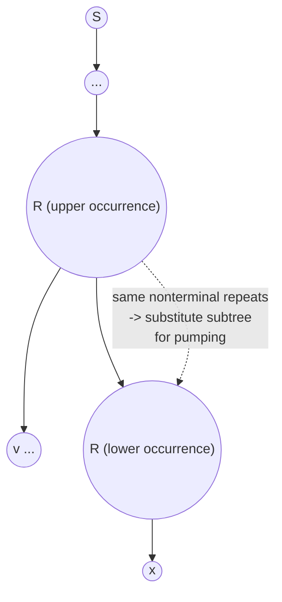

## Learning Objectives

- State the pumping lemma for context-free languages precisely, including all four conditions on the split s = uvxyz.
- Explain why Chomsky Normal Form makes the lemma's proof clean, via a pigeonhole argument relating tree height to the number of distinct nonterminals.
- Contrast this lemma's "two pumpable pieces, pumped together" structure with the single-piece pumping lemma for regular languages already covered.
- Apply the proof-by-contradiction method to show a specific language is not context-free, checking every case the split constraints allow.
- Recognize which kinds of languages (those requiring three or more mutually dependent unbounded counts) are the natural targets for this technique.

## Context & Motivation

The pumping lemma for regular languages, covered earlier in this discipline, gave a way to prove a negative: not "here is a machine that fails," but "no DFA or NFA, of any size, could possibly recognize this language," established once and for all by an argument about what any sufficiently long accepted string must structurally contain. Context-free languages are strictly more expressive than regular languages — every regular language is context-free, but {0ⁿ1ⁿ}, provably not regular, is easily context-free — so the natural next question is whether *this* larger class has a ceiling of its own, and whether a similar pumping argument can find it. It does. Just as {0ⁿ1ⁿ} sits exactly at the boundary that separates regular from context-free (needing one unbounded count, which a stack handles but a finite state set cannot), there is a next-tier boundary language sitting exactly at the edge that separates context-free from what comes after: {0ⁿ1ⁿ2ⁿ}, which needs *two* unbounded counts kept in lockstep with each other, a demand that defeats even a PDA's single stack, as the previous two concepts in this track set up directly (a stack can track one count by pushing then popping, but comparing two independently maintained counts is exactly what one LIFO stack cannot manage).

The pumping lemma for context-free languages is the tool that turns this intuition into a rigorous impossibility proof, in exactly the same proof-by-contradiction spirit as its regular-language predecessor: assume the language of interest is context-free, derive that some very specific string must be pumpable in a very specific way, then exhibit a pumped version of that string that provably falls outside the language — a contradiction, so the assumption was false. The one genuine complication, and the reason this lemma looks more elaborate than the regular one, is that a context-free derivation has two independent "repeatable" pieces rather than one (reflecting a grammar rule that can recurse through itself twice, not just once), and both pieces have to be pumped together, in matched multiples, for the argument to go through. Understanding exactly why that structure arises — and why it arises specifically because of Chomsky Normal Form — is the heart of this concept.

## Core Theory

### The lemma, stated precisely

> **Pumping Lemma for Context-Free Languages.** If A is a context-free language, then there exists a number p (the **pumping length**) such that any string s ∈ A with |s| ≥ p can be divided into five pieces, s = uvxyz, satisfying:
>
> 1. For every i ≥ 0, uvⁱxyⁱz ∈ A (both v and y are pumped together, the *same* number of times i, simultaneously).
> 2. |vy| > 0 (at least one of v, y is nonempty — pumping must actually do something).
> 3. |vxy| ≤ p (the two pumpable pieces v and y, together with the middle segment x between them, all fit within a window of length at most p).

Contrast this immediately with the regular-language pumping lemma's split s = xyz with only y pumpable: here there are *two* independently positioned pumpable substrings, v and y, and condition 1 pumps them by the *same* exponent i simultaneously — uv²xy²z, or uv⁰xy⁰z = uxz, never uv³xy¹z with mismatched exponents. This "two pieces, pumped in lockstep" shape is not an arbitrary strengthening; it falls directly out of the structure of context-free derivations, as the next section shows.

### Why Chomsky Normal Form makes the proof clean

Recall that a grammar in Chomsky Normal Form has every rule in one of exactly two shapes: A → BC (a nonterminal producing exactly two nonterminals) or A → a (a nonterminal producing exactly one terminal), with S → ε allowed only for the empty string as a special case. This restriction has a direct geometric consequence for parse trees: every internal node of a CNF parse tree has *exactly two* children (except leaves, which are terminal symbols with no children), so a CNF parse tree is a full binary tree, and a full binary tree of height h has at most 2^h leaves — a purely combinatorial fact about binary trees.

Now suppose G is a CFG in CNF with b distinct nonterminal symbols (a finite number, fixed by the grammar), and let p = 2^(b+1) (or any similarly-derived constant depending only on b — the exact formula is less important than what it guarantees). Consider any string s ∈ L(G) with |s| ≥ p. Since s has at least p leaves in its parse tree and a full binary tree needs height at least log₂(number of leaves) to have that many leaves, the parse tree for s must have height at least b + 1 — strictly greater than the number of distinct nonterminals. Now look at the longest root-to-leaf path in this tree: it passes through at least b + 2 nodes (height b+1 means b+2 nodes root to leaf), of which the last one is a terminal leaf and the rest are internal nodes labeled by nonterminals — so at least b + 1 internal nodes on this one path are labeled by nonterminals, but there are only b *distinct* nonterminals available in the whole grammar. By the **pigeonhole principle**, some nonterminal symbol, call it R, must repeat — appearing at two different nodes along this single root-to-leaf path, one strictly above (closer to the root) than the other.

This repeated nonterminal R is exactly what produces the two pumpable pieces: the subtree rooted at the *upper* occurrence of R generates some string vxy (where x is generated by the subtree rooted at the *lower* occurrence of R, and v, y are whatever terminals appear to its left and right within the upper subtree), while the whole tree generates s = uvxyz (u and z being everything outside the upper R-subtree entirely). Since both occurrences of R are the same nonterminal, the *lower* R-subtree (generating just x) can be substituted in place of the *upper* R-subtree entirely — collapsing v and y away, giving uxz — or, going the other direction, the entire upper R-subtree (generating vxy, which itself contains another copy of R at its base) can be substituted in place of the lower one, repeatedly, giving uvⁱxyⁱz for any i ≥ 0. Choosing R to be the repeated nonterminal *closest to the leaf* (lowest in the tree, among all repeats) among the last b+1 nonterminal-labeled nodes keeps the upper-to-lower span, and hence |vxy|, bounded by a constant depending only on b — which is exactly condition 3 of the lemma. Condition 2 (|vy| > 0) holds because CNF guarantees every internal node has exactly two children, so the upper R's subtree, having strictly greater height than the lower R's subtree (they are different nodes on the same path), must generate a strictly longer string — meaning v and y cannot both be empty.

### The two pieces, pumped together

The upshot: v is the terminal material generated to the left of the lower R inside the upper R's subtree, y is the terminal material generated to its right, and x is whatever the lower R's own subtree generates. Pumping up (i > 1) means re-inserting a copy of the upper R-subtree (contributing another v...y wrapped around) between where the lower R subtree sits and the rest; pumping down to i = 0 means deleting the upper R-subtree's "wrapper" entirely and splicing the lower R-subtree straight in. Because both v and y come from the *same* repeated-substitution structure, they must be pumped by the same number of copies simultaneously — there is no way to pump v three times while pumping y once, since both are artifacts of how many times the single R-subtree gets reinserted.

## Worked Examples

### Example 1 — proving {0ⁿ1ⁿ2ⁿ : n ≥ 0} is not context-free (complete)

**Problem:** Prove L = {0ⁿ1ⁿ2ⁿ : n ≥ 0} is not context-free.

**Proof, by contradiction.** Suppose L is context-free. Then the pumping lemma gives a pumping length p. Choose the string s = 0^p 1^p 2^p ∈ L (this string has length 3p ≥ p, so the lemma applies to it). By the lemma, s can be written s = uvxyz satisfying |vxy| ≤ p, |vy| > 0, and uvⁱxyⁱz ∈ L for every i ≥ 0.

The key structural fact to exploit is condition 3: |vxy| ≤ p. Since s = 0^p 1^p 2^p consists of three consecutive blocks each of length p, and the substring vxy has length at most p, **vxy cannot span all three blocks simultaneously** — it is too short to reach from inside the 0-block all the way into the 2-block, since doing so would require passing entirely through the middle 1-block, whose own length is p, meaning vxy would need length at least p + 2 (one 0, all p 1s, one 2) to touch both the 0s and the 2s, contradicting |vxy| ≤ p. So vxy touches **at most two** of the three distinct symbol blocks. This leaves exactly the cases to check:

**Case A: vxy lies entirely within the 0-block** (contains only 0s, or is empty — but |vy| > 0 rules out both v and y being empty, so at least one of them is a nonempty block of 0s). Pump up to i = 2: uv²xy²z inserts extra 0s (from whichever of v, y is nonempty) into the string, while the count of 1s and the count of 2s are completely unchanged (v and y are pure 0s, so pumping doesn't touch the 1-block or 2-block at all). The result has more 0s than 1s (or than 2s), so it is not of the form 0^n1^n2^n for any n — **not in L**. Contradiction.

**Case B: vxy lies entirely within the 1-block** (analogous to Case A, symmetric argument): pumping up changes only the count of 1s, leaving 0-count and 2-count unchanged — the result has an unequal number of 1s compared to 0s and 2s — **not in L**. Contradiction.

**Case C: vxy lies entirely within the 2-block** (symmetric again): pumping up changes only the count of 2s — **not in L**. Contradiction.

**Case D: vxy straddles the boundary between the 0-block and the 1-block** (so v consists of some trailing 0s, or is empty, and y consists of some leading 1s, or is empty — with x sitting exactly at the boundary, itself possibly containing both a few trailing 0s and a few leading 1s, or being empty). Since |vy| > 0, at least one of v, y is nonempty, so pumping up to i = 2 duplicates whatever is in v and/or y: if v is nonempty, it inserts extra 0s, increasing the 0-count while leaving the 2-count fixed at p — already breaking equality with the 2-block. If instead v is empty and only y is nonempty (y being some leading 1s), pumping inserts extra 1s, increasing the 1-count above p while the 0-count and 2-count stay at p — again breaking equality. Either way, pumping strictly increases the count of one block's symbol (0s or 1s) without correspondingly increasing the 2-block — **not in L**. Contradiction.

**Case E: vxy straddles the boundary between the 1-block and the 2-block** (symmetric to Case D: v is trailing 1s or empty, y is leading 2s or empty). Pumping up increases the count of 1s or the count of 2s without a matching increase in the 0-block's count — **not in L**. Contradiction.

Every case allowed by |vxy| ≤ p (vxy confined to one block, or straddling exactly one boundary between two adjacent blocks) leads to a pumped string not in L, contradicting condition 1 of the lemma (which requires uv²xy²z ∈ L). Since every possible position for vxy leads to a contradiction, no valid split exists — contradicting the pumping lemma's guarantee that one must. Therefore the original assumption is false: **L is not context-free.** ∎

### Example 2 — confirming the case split is exhaustive

**Problem:** Verify that Cases A through E above genuinely exhaust every possibility for where a length-≤p substring vxy can sit within 0^p 1^p 2^p.

**Reasoning:** the string s = 0^p1^p2^p has exactly two "boundaries" — between the 0-block and 1-block, and between the 1-block and 2-block. Any contiguous substring of length ≤ p either (a) lies entirely within one of the three blocks (three sub-cases, A/B/C), or (b) crosses exactly one of the two boundaries (two sub-cases, D/E), or (c) crosses both boundaries at once. Case (c) is exactly what condition |vxy| ≤ p rules out, as shown in the proof: crossing both boundaries would require the substring to include at least one symbol from the 0-block, all p symbols of the 1-block, and at least one symbol from the 2-block, for a minimum length of p + 2 > p. So (a) and (b) — five sub-cases total — are indeed exhaustive, and Example 1 checked all five.

### Example 3 — why {0ⁿ1ⁿ} (context-free) does NOT fall to this same argument

**Problem:** Explain why attempting the identical case-split strategy against {0ⁿ1ⁿ} (already known to be context-free, via the PDA and grammar built earlier in this track) correctly fails to produce a contradiction, as a sanity check on the technique.

**Reasoning:** take s = 0^p1^p ∈ {0ⁿ1ⁿ} and any split s = uvxyz with |vxy| ≤ p. Now vxy has only one boundary to worry about (0-block to 1-block), and even in the boundary-straddling case, pumping up inserts equal numbers of 0s and 1s *only if v and y are chosen from a derivation that actually pairs one 0 with one 1 per pump* — and indeed, a CNF grammar for {0ⁿ1ⁿ} (built from S → 0S1 | ε) produces exactly this pairing: the repeated nonterminal S sits at a point where its subtree generates "0 ... 1" symmetrically, so v = "0" and y = "1" for an appropriately chosen split, and uv^ixy^iz correctly adds i more 0s *and* i more 1s together, staying in the language for every i. This is exactly the mechanism the lemma's proof describes: the two pumped pieces come from one recursive nonterminal, and for {0ⁿ1ⁿ}, that recursion naturally keeps the two counts locked together — which is precisely why the case-split argument used against {0ⁿ1ⁿ2ⁿ} cannot succeed here; every case's pumped string legitimately stays in the language, so no contradiction is ever reached, correctly reflecting that {0ⁿ1ⁿ} really is context-free.

## Common Misconceptions & Pitfalls

- **"Only one substring gets pumped, same as the regular pumping lemma."** The context-free version pumps *two* pieces (v and y) simultaneously, by the same exponent — this is a structurally different, and structurally necessary, generalization tied directly to CNF parse trees having a repeated nonterminal on a root-to-leaf path generating material on *both* sides of a nested lower occurrence, not just one repeated block as in a DFA's cycle.
- **"Since |vy| > 0, both v and y must individually be nonempty."** Only their combined length must be positive — it is entirely valid (and happens routinely, as in Case D or E above) for exactly one of v, y to be empty while the other carries all the pumped material.
- **"The choice of s = 0^p1^p2^p is arbitrary; any long string in the language would do."** The choice is deliberate and load-bearing: it needs to be long enough to force |vxy| ≤ p to rule out spanning all three blocks, and structured so that every remaining case (confined to one block, or straddling one boundary) provably breaks one of the three required equal counts. A poorly chosen witness string can fail to produce a contradiction even for a genuinely non-context-free language, not because the language is secretly context-free, but because that particular string didn't stress the right structural weakness.
- **"Passing the pumping lemma test proves a language IS context-free."** As with the regular pumping lemma, this lemma only gives a *necessary* condition — a language failing to satisfy it is definitely not context-free, but a language that does satisfy every case of the lemma's conditions is not thereby proven context-free; the lemma is a one-directional tool for negative proofs only.

## Summary

The pumping lemma for context-free languages generalizes the regular-language pumping lemma from one pumpable piece to two, pumped together by the same exponent: any sufficiently long string s in a context-free language A splits as s = uvxyz with |vxy| ≤ p, |vy| > 0, and uvⁱxyⁱz ∈ A for every i ≥ 0. This shape falls directly out of Chomsky Normal Form: a CNF parse tree is a full binary tree, so a long enough string forces a tall enough tree that, by the pigeonhole principle on the finitely many distinct nonterminals, some nonterminal must repeat along a single root-to-leaf path — and that repeated nonterminal's two occurrences are exactly what produce v (material to its left) and y (material to its right), pumpable together by re-inserting or removing the subtree between them. The worked proof that {0ⁿ1ⁿ2ⁿ} is not context-free exhaustively checks every position |vxy| ≤ p could occupy relative to the three symbol-blocks — confined to one block (three cases) or straddling one boundary (two cases), never able to span all three blocks at once — and shows every case's pumped string breaks the required equal counts, completing the contradiction.

## Documentation Links

- [MIT 18.404J — OCW Calendar](https://ocw.mit.edu/courses/18-404j-theory-of-computation-fall-2020/pages/calendar/) — doc
- [Sipser — Introduction to the Theory of Computation, 3rd ed.](https://cs.brown.edu/courses/csci1810/fall-2023/resources/ch2_readings/Sipser_Introduction.to.the.Theory.of.Computation.3E.pdf) — doc
