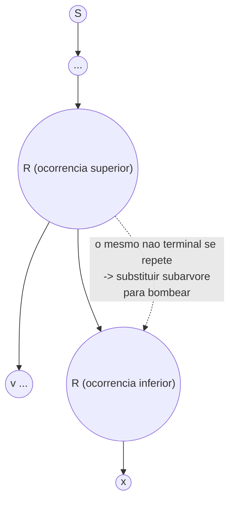

## Objetivos de Aprendizagem

- Enunciar precisamente o lema do bombeamento para linguagens livres de contexto, incluindo todas as quatro condições sobre a divisão s = uvxyz.
- Explicar por que a Forma Normal de Chomsky torna a prova do lema limpa, via um argumento de casa dos pombos relacionando a altura da árvore ao número de não terminais distintos.
- Contrastar a estrutura de "duas partes bombeáveis, bombeadas juntas" deste lema com o lema do bombeamento de peça única para linguagens regulares já coberto.
- Aplicar o método de prova por contradição para mostrar que uma linguagem específica não é livre de contexto, verificando todo caso que as restrições de divisão permitem.
- Reconhecer quais tipos de linguagens (aquelas que exigem três ou mais contagens ilimitadas mutuamente dependentes) são os alvos naturais dessa técnica.

## Contexto e Motivação

O lema do bombeamento para linguagens regulares, coberto anteriormente nesta disciplina, deu uma forma de provar um negativo: não "aqui está uma máquina que falha," mas "nenhum DFA ou NFA, de qualquer tamanho, poderia possivelmente reconhecer essa linguagem," estabelecido de uma vez por todas por um argumento sobre o que qualquer string aceita suficientemente longa precisa conter estruturalmente. Linguagens livres de contexto são estritamente mais expressivas do que linguagens regulares, toda linguagem regular é livre de contexto, mas {0ⁿ1ⁿ}, provadamente não regular, é facilmente livre de contexto, então a próxima pergunta natural é se *essa* classe maior tem um teto próprio, e se um argumento de bombeamento similar consegue encontrá-lo. Ele consegue. Assim como {0ⁿ1ⁿ} fica exatamente na fronteira que separa regular de livre de contexto (precisando de uma contagem ilimitada, que uma pilha administra mas um conjunto finito de estados não), existe uma linguagem de fronteira de próximo nível sentada exatamente na borda que separa livre de contexto do que vem depois: {0ⁿ1ⁿ2ⁿ}, que precisa de *duas* contagens ilimitadas mantidas em sincronia uma com a outra, uma demanda que derrota até a única pilha de um PDA, como os dois conceitos anteriores nesta trilha estabeleceram diretamente (uma pilha consegue rastrear uma contagem empilhando e depois desempilhando, mas comparar duas contagens mantidas independentemente é exatamente o que uma pilha LIFO não consegue administrar).

O lema do bombeamento para linguagens livres de contexto é a ferramenta que transforma essa intuição em uma prova de impossibilidade rigorosa, exatamente no mesmo espírito de prova por contradição do seu predecessor de linguagem regular: assuma que a linguagem de interesse é livre de contexto, derive que alguma string bem específica precisa ser bombeável de uma forma bem específica, então exiba uma versão bombeada dessa string que demonstravelmente cai fora da linguagem, uma contradição, então a suposição era falsa. A única complicação genuína, e a razão pela qual esse lema parece mais elaborado do que o regular, é que uma derivação livre de contexto tem duas partes "repetíveis" independentes em vez de uma (refletindo uma regra de gramática que pode recursar através de si mesma duas vezes, não apenas uma), e ambas as partes precisam ser bombeadas juntas, em múltiplos correspondentes, para o argumento funcionar. Entender exatamente por que essa estrutura surge, e por que ela surge especificamente por causa da Forma Normal de Chomsky, é o coração deste conceito.

## Teoria Central

### O lema, enunciado com precisão

> **Lema do Bombeamento para Linguagens Livres de Contexto.** Se A é uma linguagem livre de contexto, então existe um número p (o **comprimento de bombeamento**) tal que qualquer string s ∈ A com |s| ≥ p pode ser dividida em cinco partes, s = uvxyz, satisfazendo:
>
> 1. Para todo i ≥ 0, uvⁱxyⁱz ∈ A (tanto v quanto y são bombeados juntos, o *mesmo* número de vezes i, simultaneamente).
> 2. |vy| > 0 (pelo menos um de v, y é não vazio, bombear precisa de fato fazer algo).
> 3. |vxy| ≤ p (as duas partes bombeáveis v e y, junto com o segmento do meio x entre elas, cabem todas dentro de uma janela de comprimento no máximo p).

Contraste isso imediatamente com a divisão s = xyz do lema do bombeamento para linguagens regulares, com apenas y bombeável: aqui existem *duas* substrings bombeáveis posicionadas independentemente, v e y, e a condição 1 as bombeia pelo *mesmo* expoente i simultaneamente, uv²xy²z, ou uv⁰xy⁰z = uxz, nunca uv³xy¹z com expoentes diferentes. Essa forma de "duas partes, bombeadas em sincronia" não é um fortalecimento arbitrário; ela sai diretamente da estrutura das derivações livres de contexto, como a próxima seção mostra.

### Por que a Forma Normal de Chomsky torna a prova limpa

Lembre-se de que uma gramática na Forma Normal de Chomsky tem toda regra em exatamente uma de duas formas: A → BC (um não terminal produzindo exatamente dois não terminais) ou A → a (um não terminal produzindo exatamente um terminal), com S → ε permitido apenas para a string vazia como caso especial. Essa restrição tem uma consequência geométrica direta para árvores de análise: todo nó interno de uma árvore de análise em CNF tem *exatamente dois* filhos (exceto as folhas, que são símbolos terminais sem filhos), então uma árvore de análise em CNF é uma árvore binária completa, e uma árvore binária completa de altura h tem no máximo 2^h folhas, um fato puramente combinatório sobre árvores binárias.

Agora suponha que G é uma CFG em CNF com b símbolos não terminais distintos (um número finito, fixado pela gramática), e seja p = 2^(b+1) (ou qualquer constante similarmente derivada dependendo só de b, a fórmula exata é menos importante do que o que ela garante). Considere qualquer string s ∈ L(G) com |s| ≥ p. Já que s tem pelo menos p folhas em sua árvore de análise e uma árvore binária completa precisa de altura pelo menos log₂(número de folhas) para ter tantas folhas, a árvore de análise para s precisa ter altura pelo menos b + 1, estritamente maior do que o número de não terminais distintos. Agora olhe para o caminho raiz-a-folha mais longo nessa árvore: ele passa por pelo menos b + 2 nós (altura b+1 significa b+2 nós raiz a folha), dos quais o último é uma folha terminal e o resto são nós internos rotulados por não terminais, então pelo menos b + 1 nós internos nesse único caminho são rotulados por não terminais, mas existem apenas b não terminais *distintos* disponíveis na gramática inteira. Pelo **princípio da casa dos pombos**, algum símbolo não terminal, chame-o de R, precisa se repetir, aparecendo em dois nós diferentes ao longo desse único caminho raiz-a-folha, um estritamente acima (mais perto da raiz) do que o outro.

Esse não terminal repetido R é exatamente o que produz as duas partes bombeáveis: a subárvore com raiz na ocorrência *superior* de R gera alguma string vxy (onde x é gerado pela subárvore com raiz na ocorrência *inferior* de R, e v, y são quaisquer terminais que apareçam à sua esquerda e direita dentro da subárvore superior), enquanto a árvore inteira gera s = uvxyz (u e z sendo tudo fora da subárvore superior de R inteiramente). Já que ambas as ocorrências de R são o mesmo não terminal, a subárvore R *inferior* (gerando apenas x) pode ser substituída no lugar da subárvore R *superior* inteiramente, colapsando v e y para fora, dando uxz, ou, na outra direção, a subárvore R superior inteira (gerando vxy, que ela mesma contém outra cópia de R em sua base) pode ser substituída no lugar da inferior, repetidamente, dando uvⁱxyⁱz para qualquer i ≥ 0. Escolher R como o não terminal repetido *mais próximo da folha* (mais baixo na árvore, entre todas as repetições) entre os últimos b+1 nós rotulados por não terminais mantém o vão superior-para-inferior, e portanto |vxy|, limitado por uma constante dependendo só de b, que é exatamente a condição 3 do lema. A condição 2 (|vy| > 0) vale porque a CNF garante que todo nó interno tem exatamente dois filhos, então a subárvore do R superior, tendo altura estritamente maior do que a subárvore do R inferior (são nós diferentes no mesmo caminho), precisa gerar uma string estritamente mais longa, significando que v e y não podem ambos ser vazios.

### As duas partes, bombeadas juntas

A conclusão: v é o material terminal gerado à esquerda do R inferior dentro da subárvore do R superior, y é o material terminal gerado à sua direita, e x é o que a própria subárvore do R inferior gera. Bombear para cima (i > 1) significa reinserir uma cópia da subárvore do R superior (contribuindo com outro envoltório v...y) entre onde a subárvore do R inferior fica e o resto; bombear para baixo até i = 0 significa deletar o "envoltório" da subárvore do R superior inteiramente e encaixar a subárvore do R inferior diretamente no lugar. Porque tanto v quanto y vêm da *mesma* estrutura de substituição repetida, eles precisam ser bombeados pelo mesmo número de cópias simultaneamente, não há forma de bombear v três vezes enquanto bombeia y uma vez, já que ambos são artefatos de quantas vezes a única subárvore de R é reinserida.

## Exemplos Resolvidos

### Exemplo 1: provando que {0ⁿ1ⁿ2ⁿ : n ≥ 0} não é livre de contexto (completo)

**Problema:** Prove que L = {0ⁿ1ⁿ2ⁿ : n ≥ 0} não é livre de contexto.

**Prova, por contradição.** Suponha que L seja livre de contexto. Então o lema do bombeamento dá um comprimento de bombeamento p. Escolha a string s = 0^p 1^p 2^p ∈ L (essa string tem comprimento 3p ≥ p, então o lema se aplica a ela). Pelo lema, s pode ser escrita s = uvxyz satisfazendo |vxy| ≤ p, |vy| > 0, e uvⁱxyⁱz ∈ L para todo i ≥ 0.

O fato estrutural chave a explorar é a condição 3: |vxy| ≤ p. Já que s = 0^p 1^p 2^p consiste em três blocos consecutivos cada um de comprimento p, e a substring vxy tem comprimento no máximo p, **vxy não consegue abranger os três blocos simultaneamente**, é curta demais para ir de dentro do bloco de 0s até dentro do bloco de 2s, já que fazer isso exigiria passar inteiramente pelo bloco de 1s do meio, cujo próprio comprimento é p, significando que vxy precisaria de comprimento pelo menos p + 2 (um 0, todos os p 1s, um 2) para tocar tanto os 0s quanto os 2s, contradizendo |vxy| ≤ p. Então vxy toca **no máximo dois** dos três blocos de símbolos distintos. Isso deixa exatamente os casos a verificar:

**Caso A: vxy está inteiramente dentro do bloco de 0s** (contém só 0s, ou é vazio, mas |vy| > 0 descarta ambos v e y sendo vazios, então pelo menos um deles é um bloco não vazio de 0s). Bombeie para cima até i = 2: uv²xy²z insere 0s extras (a partir de qual quer que v ou y seja não vazio) na string, enquanto a contagem de 1s e a contagem de 2s ficam completamente inalteradas (v e y são 0s puros, então bombear não toca no bloco de 1s nem no bloco de 2s de forma alguma). O resultado tem mais 0s do que 1s (ou do que 2s), então não está na forma 0^n1^n2^n para nenhum n, **não está em L**. Contradição.

**Caso B: vxy está inteiramente dentro do bloco de 1s** (análogo ao Caso A, argumento simétrico): bombear para cima muda só a contagem de 1s, deixando a contagem de 0s e de 2s inalteradas, o resultado tem um número desigual de 1s comparado a 0s e 2s, **não está em L**. Contradição.

**Caso C: vxy está inteiramente dentro do bloco de 2s** (simétrico de novo): bombear para cima muda só a contagem de 2s, **não está em L**. Contradição.

**Caso D: vxy atravessa a fronteira entre o bloco de 0s e o bloco de 1s** (então v consiste em alguns 0s finais, ou é vazio, e y consiste em alguns 1s iniciais, ou é vazio, com x sentado exatamente na fronteira, ele mesmo possivelmente contendo tanto alguns 0s finais quanto alguns 1s iniciais, ou sendo vazio). Já que |vy| > 0, pelo menos um de v, y é não vazio, então bombear para cima até i = 2 duplica o que estiver em v e/ou y: se v é não vazio, insere 0s extras, aumentando a contagem de 0s enquanto deixa a contagem de 2s fixa em p, já quebrando a igualdade com o bloco de 2s. Se em vez disso v é vazio e só y é não vazio (y sendo alguns 1s iniciais), bombear insere 1s extras, aumentando a contagem de 1s acima de p enquanto a contagem de 0s e de 2s ficam em p, novamente quebrando a igualdade. De qualquer forma, bombear aumenta estritamente a contagem do símbolo de um bloco (0s ou 1s) sem aumentar correspondentemente o bloco de 2s, **não está em L**. Contradição.

**Caso E: vxy atravessa a fronteira entre o bloco de 1s e o bloco de 2s** (simétrico ao Caso D: v é 1s finais ou vazio, y é 2s iniciais ou vazio). Bombear para cima aumenta a contagem de 1s ou a contagem de 2s sem um aumento correspondente na contagem do bloco de 0s, **não está em L**. Contradição.

Todo caso permitido por |vxy| ≤ p (vxy confinado a um bloco, ou atravessando exatamente uma fronteira entre dois blocos adjacentes) leva a uma string bombeada fora de L, contradizendo a condição 1 do lema (que exige uv²xy²z ∈ L). Já que toda posição possível para vxy leva a uma contradição, nenhuma divisão válida existe, contradizendo a garantia do lema do bombeamento de que uma precisa existir. Portanto a suposição original é falsa: **L não é livre de contexto.** ∎

### Exemplo 2: confirmando que a divisão de casos é exaustiva

**Problema:** Verifique que os Casos A a E acima genuinamente esgotam toda possibilidade de onde uma substring vxy de comprimento ≤p pode se situar dentro de 0^p 1^p 2^p.

**Raciocínio:** a string s = 0^p1^p2^p tem exatamente duas "fronteiras", entre o bloco de 0s e o bloco de 1s, e entre o bloco de 1s e o bloco de 2s. Qualquer substring contígua de comprimento ≤ p ou (a) está inteiramente dentro de um dos três blocos (três subcasos, A/B/C), ou (b) atravessa exatamente uma das duas fronteiras (dois subcasos, D/E), ou (c) atravessa ambas as fronteiras ao mesmo tempo. O caso (c) é exatamente o que a condição |vxy| ≤ p descarta, como mostrado na prova: atravessar ambas as fronteiras exigiria que a substring incluísse pelo menos um símbolo do bloco de 0s, todos os p símbolos do bloco de 1s, e pelo menos um símbolo do bloco de 2s, para um comprimento mínimo de p + 2 > p. Então (a) e (b), cinco subcasos no total, são de fato exaustivos, e o Exemplo 1 verificou todos os cinco.

### Exemplo 3: por que {0ⁿ1ⁿ} (livre de contexto) NÃO cai nesse mesmo argumento

**Problema:** Explique por que tentar a mesma estratégia de divisão de casos contra {0ⁿ1ⁿ} (já sabidamente livre de contexto, via o PDA e a gramática construídos anteriormente nesta trilha) corretamente falha em produzir uma contradição, como uma verificação de sanidade para a técnica.

**Raciocínio:** tome s = 0^p1^p ∈ {0ⁿ1ⁿ} e qualquer divisão s = uvxyz com |vxy| ≤ p. Agora vxy tem só uma fronteira com que se preocupar (bloco de 0s para bloco de 1s), e mesmo no caso de atravessar a fronteira, bombear para cima insere números iguais de 0s e 1s *só se v e y forem escolhidos a partir de uma derivação que de fato pareia um 0 com um 1 por bombeamento*, e de fato, uma gramática CNF para {0ⁿ1ⁿ} (construída a partir de S → 0S1 | ε) produz exatamente esse pareamento: o não terminal repetido S se situa em um ponto onde sua subárvore gera "0 ... 1" simetricamente, então v = "0" e y = "1" para uma divisão escolhida apropriadamente, e uv^ixy^iz corretamente adiciona i 0s a mais *e* i 1s a mais juntos, permanecendo na linguagem para todo i. Esse é exatamente o mecanismo que a prova do lema descreve: as duas partes bombeadas vêm de um único não terminal recursivo, e para {0ⁿ1ⁿ}, aquela recursão naturalmente mantém as duas contagens travadas juntas, o que é precisamente por que o argumento de divisão de casos usado contra {0ⁿ1ⁿ2ⁿ} não consegue ter sucesso aqui; a string bombeada de todo caso legitimamente permanece na linguagem, então nenhuma contradição é jamais alcançada, refletindo corretamente que {0ⁿ1ⁿ} de fato é livre de contexto.

## Equívocos Comuns e Armadilhas

- **"Só uma substring é bombeada, igual ao lema do bombeamento regular."** A versão livre de contexto bombeia *duas* partes (v e y) simultaneamente, pelo mesmo expoente, essa é uma generalização estruturalmente diferente, e estruturalmente necessária, ligada diretamente ao fato de árvores de análise CNF terem um não terminal repetido em um caminho raiz-a-folha gerando material de *ambos* os lados de uma ocorrência inferior aninhada, não apenas um único bloco repetido como em um ciclo de DFA.
- **"Já que |vy| > 0, tanto v quanto y precisam ser individualmente não vazios."** Só o comprimento combinado deles precisa ser positivo, é inteiramente válido (e acontece rotineiramente, como nos Casos D ou E acima) que exatamente um de v, y seja vazio enquanto o outro carrega todo o material bombeado.
- **"A escolha de s = 0^p1^p2^p é arbitrária; qualquer string longa na linguagem serviria."** A escolha é deliberada e essencial: ela precisa ser longa o suficiente para forçar |vxy| ≤ p a descartar abranger os três blocos, e estruturada de modo que todo caso restante (confinado a um bloco, ou atravessando uma fronteira) demonstravelmente quebre uma das três contagens iguais exigidas. Uma string testemunha mal escolhida pode falhar em produzir uma contradição mesmo para uma linguagem genuinamente não livre de contexto, não porque a linguagem seja secretamente livre de contexto, mas porque aquela string específica não estressou a fraqueza estrutural certa.
- **"Passar no teste do lema do bombeamento prova que uma linguagem É livre de contexto."** Assim como o lema do bombeamento regular, esse lema só dá uma condição *necessária*, uma linguagem que falha em satisfazê-lo definitivamente não é livre de contexto, mas uma linguagem que satisfaz todo caso das condições do lema não fica assim provada livre de contexto; o lema é uma ferramenta unidirecional só para provas negativas.

## Resumo

O lema do bombeamento para linguagens livres de contexto generaliza o lema do bombeamento de linguagem regular de uma peça bombeável para duas, bombeadas juntas pelo mesmo expoente: qualquer string s suficientemente longa em uma linguagem livre de contexto A se divide como s = uvxyz com |vxy| ≤ p, |vy| > 0, e uvⁱxyⁱz ∈ A para todo i ≥ 0. Essa forma sai diretamente da Forma Normal de Chomsky: uma árvore de análise CNF é uma árvore binária completa, então uma string longa o suficiente força uma árvore alta o suficiente que, pelo princípio da casa dos pombos sobre os finitos não terminais distintos, algum não terminal precisa se repetir ao longo de um único caminho raiz-a-folha, e as duas ocorrências desse não terminal repetido são exatamente o que produz v (material à sua esquerda) e y (material à sua direita), bombeáveis juntos ao reinserir ou remover a subárvore entre eles. A prova resolvida de que {0ⁿ1ⁿ2ⁿ} não é livre de contexto verifica exaustivamente toda posição que |vxy| ≤ p poderia ocupar em relação aos três blocos de símbolos, confinada a um bloco (três casos) ou atravessando uma fronteira (dois casos), nunca conseguindo abranger os três blocos ao mesmo tempo, e mostra que a string bombeada de todo caso quebra as contagens iguais exigidas, completando a contradição.

## Documentation Links

- [MIT 18.404J: OCW Calendar](https://ocw.mit.edu/courses/18-404j-theory-of-computation-fall-2020/pages/calendar/): doc
- [Sipser: Introduction to the Theory of Computation, 3ª ed.](https://cs.brown.edu/courses/csci1810/fall-2023/resources/ch2_readings/Sipser_Introduction.to.the.Theory.of.Computation.3E.pdf): doc
