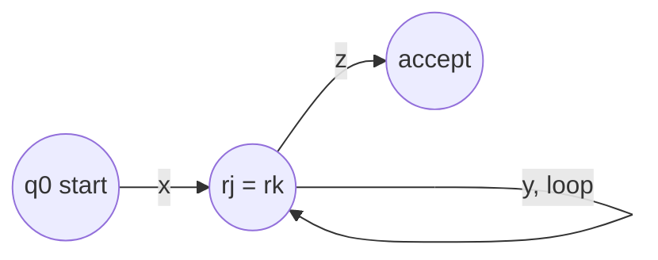

## Learning Objectives

- State the pumping lemma for regular languages precisely, including all three conditions on the split s = xyz.
- Explain why the lemma must hold for every regular language, using the pigeonhole principle applied to a DFA's states.
- Recognize the pumping lemma's role as a necessary (not sufficient) condition for regularity, and explain why it can only ever prove non-regularity, never regularity.
- Apply the pumping lemma inside a full proof by contradiction to show a specific language is not regular, checking every case the split allows.
- Choose a pumping-lemma witness string strategically, so that every allowed split leads to a violation.

## Context & Motivation

Every regular language has a DFA recognizing it, and every DFA has some fixed, finite number of states. That finiteness has a structural consequence that turns out to be extremely useful: if a DFA has p states and it reads a string of length p or more, it cannot possibly visit p or more *distinct* states while doing so — by the pigeonhole principle, some state must get revisited partway through. Revisiting a state means the machine has gone in a loop: the substring read between the first and second visit to that state can be repeated any number of times (or removed entirely) without changing whether the machine ends up in the same place afterward. This structural fact, made precise, is the **pumping lemma for regular languages**.

The pumping lemma matters practically for one specific reason: closure properties and the regex-to-NFA construction give tools for proving a language IS regular, but there is no comparably direct method for proving a language is NOT regular — no automaton to fail to find, since failing to find one after some amount of effort proves nothing (maybe a cleverer automaton exists). The pumping lemma flips this problem: instead of trying and failing to build an automaton, it gives a structural property that every DFA-recognizable language is *guaranteed* to have, so a language that provably lacks this property cannot have a DFA at all, regardless of how clever the attempted construction might be.

This is why MIT 18.404J and Sipser both introduce the pumping lemma directly after establishing DFA/NFA/regex equivalence: it is the first tool in the course capable of proving impossibility rather than possibility. And its standard use follows a very specific logical structure worth naming explicitly: it is an instance of **proof by contradiction** (covered in full in the companion entry on that technique). To prove some language A is not regular, the standard argument assumes, for the sake of contradiction, that A *is* regular — which forces the pumping lemma to apply to it, since the lemma holds for every regular language without exception — and then exhibits one specific string in A, long enough to trigger the lemma, for which *every* way of splitting it according to the lemma's rules produces a pumped variant that provably falls outside A. That is an outright contradiction (the lemma guarantees a valid split exists, yet none does), so the assumption that A is regular must be false.

## Core Theory

### The lemma, stated precisely

**Pumping Lemma for Regular Languages.** If A is a regular language, then there exists a number p ≥ 1 (called the **pumping length**) such that every string s ∈ A with |s| ≥ p can be divided into three pieces, s = xyz, satisfying all three of the following conditions:

1. |xy| ≤ p (the split point between y and z occurs within the first p characters of s);
2. |y| ≥ 1 (the middle piece y is nonempty — this is the piece that gets "pumped");
3. for every integer i ≥ 0, the string xyⁱz is also in A (repeating y any number of times, including zero times, always keeps the result inside A).

Here xyⁱz means x followed by i copies of y followed by z; xy⁰z = xz (y removed entirely), xy¹z = xyz = s itself, xy²z = xyyz, and so on.

### Why the lemma must be true: pigeonhole on a DFA's states

Suppose A is regular, so some DFA M = (Q, Σ, δ, q₀, F) recognizes it. Let p = |Q|, the number of states of M — this is the pumping length the lemma promises exists. Let s be any string in A with |s| ≥ p, and write s = s₁s₂...sₙ (n ≥ p) symbol by symbol. As M processes s from the start state, define r₀ = q₀ and rᵢ = δ(rᵢ₋₁, sᵢ) for i = 1, ..., n — the sequence of states M passes through, one per symbol read, r₀ through rₙ.

This sequence has n + 1 states listed (r₀ through rₙ), and n + 1 ≥ p + 1 > p = |Q|. Since M only has p distinct states total, by the **pigeonhole principle**, among the first p + 1 entries of this sequence (r₀ through r_p), at least two must be the same state — say rⱼ = rₖ for some 0 ≤ j < k ≤ p.

Now set x = s₁...sⱼ (the prefix read before the repeated state first occurs), y = sⱼ₊₁...sₖ (the substring read *during* the loop, from the first occurrence of the repeated state to the second), and z = sₖ₊₁...sₙ (everything after). This split satisfies all three conditions: |xy| = k ≤ p directly from k ≤ p in the pigeonhole argument; |y| = k − j ≥ 1 since j < k strictly; and for any i ≥ 0, xyⁱz drives M from q₀ along x to rⱼ, then around the loop from rⱼ back to rⱼ (since rⱼ = rₖ) exactly i times using y, then along z from rⱼ (= rₖ) to rₙ ∈ F, so M accepts xyⁱz for every i, meaning xyⁱz ∈ A for every i. This proves the lemma: it is a direct, mechanical consequence of a DFA having only finitely many states, applied via pigeonhole to any string long enough to force a repeat.

### The lemma as a one-way test: necessary, not sufficient

The pumping lemma states a property every regular language *must* have. It does **not** state that every language with this property is regular — languages exist that satisfy the pumping lemma's conclusion (some p exists with the stated splitting property) yet are not regular, so the lemma can never be used to *prove* a language regular, only to *disprove* it. This asymmetry is exactly why the lemma is used inside a proof by contradiction rather than as a direct test: the contrapositive of "A regular ⟹ pumping property holds" is "pumping property fails ⟹ A not regular," which is a perfectly valid tool, but "pumping property holds ⟹ A regular" is not a valid implication at all, since the original implication's converse was never claimed.

### The strategy for a non-regularity proof

To prove a specific language A is not regular using the pumping lemma, following the proof-by-contradiction structure named above:

1. Assume, for contradiction, that A is regular.
2. By the pumping lemma, some pumping length p exists satisfying the three conditions for every s ∈ A with |s| ≥ p.
3. Choose a specific string s ∈ A, with |s| ≥ p, chosen strategically so that no matter how it gets split (subject to the lemma's constraints), the pumped result breaks out of A.
4. Consider every way s = xyz could satisfy conditions 1 and 2 (there may be many, since the lemma doesn't say which split occurs, only that some split satisfying the conditions exists) — for each, show that some choice of i (usually i = 0 or i = 2) produces xyⁱz ∉ A.
5. Since every allowed split fails to satisfy condition 3, no split satisfying all three conditions exists for s — contradicting the pumping lemma's guarantee that one does.
6. Conclude the assumption in step 1 was false: A is not regular.

The crux of any such proof is step 4: it must genuinely rule out *every* split the lemma's conditions allow, not just a single "typical" one — an incomplete case check proves nothing, since the lemma only requires *some* split to work, so a proof of non-regularity must show that *none* does.

## Worked Examples

### Example 1 — {0ⁿ1ⁿ : n ≥ 0} is not regular (the classic proof, worked in full)

**Claim.** L = {0ⁿ1ⁿ : n ≥ 0} (equal numbers of 0s followed by 1s) is not regular.

**Proof, by contradiction.** Suppose, for contradiction, that L is regular. Then by the pumping lemma, there exists a pumping length p ≥ 1 such that every string in L of length ≥ p can be split as required.

**Choose the witness string.** Let s = 0ᵖ1ᵖ (p zeros followed by p ones). This string is in L (it has p zeros followed by p ones, an equal count) and has length 2p ≥ p, so the pumping lemma applies to it: s can be written s = xyz satisfying |xy| ≤ p, |y| ≥ 1, and xyⁱz ∈ L for all i ≥ 0.

**Case analysis on where y falls.** Since |xy| ≤ p and s begins with a block of p zeros, the entire prefix xy consists only of 0s (the first p characters of s = 0ᵖ1ᵖ are all zeros, and xy is a prefix of length ≤ p, so xy is entirely within that zero-block). This means y itself, being part of xy, consists entirely of 0s — say y = 0ᵏ for some k ≥ 1 (k ≥ 1 by condition 2, |y| ≥ 1).

This is in fact the *only* case that condition |xy| ≤ p permits — there is no possibility of y straddling the boundary between the 0s and 1s, or falling entirely within the 1s, given |xy| ≤ p and the first p symbols of s being all zeros. So every split satisfying the lemma's conditions has this same shape: x = 0ʲ, y = 0ᵏ (j + k ≤ p, k ≥ 1), z = 0^(p−j−k)1ᵖ.

**Pump down: i = 0.** xy⁰z = xz = 0ʲ · 0^(p−j−k) · 1ᵖ = 0^(p−k)1ᵖ. Since k ≥ 1, p − k < p, so this string has p − k zeros but still p ones — an unequal count of 0s and 1s. Therefore xy⁰z ∉ L.

Since this single case (0-region only, by the |xy| ≤ p constraint) covers *every* split the lemma's conditions permit, and pumping down (i = 0) breaks membership in L in that case, there is no split of s = 0ᵖ1ᵖ satisfying all three pumping-lemma conditions — because the one and only structurally possible split always fails condition 3.

**Contradiction and conclusion.** This directly contradicts the pumping lemma, which guarantees that *some* valid split exists for every string in L of length ≥ p. Since s ∈ L and |s| = 2p ≥ p, the lemma's guarantee should have applied to s, but no split of s satisfies all three conditions — an outright impossibility. This contradiction means the assumption that L is regular must be false. Therefore, L = {0ⁿ1ⁿ : n ≥ 0} is not regular. ∎

Every possible split allowed by the lemma's own constraints (there was, in this case, essentially one structural shape of split, parameterized by j and k) was checked and shown to fail — the proof does not merely check a "representative" split and stop, but shows the constraint |xy| ≤ p forces every valid split into the same zero-only shape, and that shape always fails when pumped down.

### Example 2 — {ww : w ∈ {0,1}*} is not regular

**Claim.** L = {ww : w ∈ {0,1}*} (strings that are some string repeated back-to-back) is not regular.

**Proof, by contradiction.** Suppose L is regular, giving a pumping length p. Choose s = 0ᵖ1 0ᵖ1 (that is, w = 0ᵖ1, so s = ww). This string is in L, and |s| = 2p + 2 ≥ p, so the lemma applies.

**Case analysis.** Since |xy| ≤ p, and the first p symbols of s are all 0s (s begins 0ᵖ...), xy lies entirely within this initial 0-block, exactly as in Example 1. So y = 0ᵏ for some k ≥ 1, with x = 0ʲ, j + k ≤ p, and z consisting of the remaining 0^(p−j−k), then 1, then 0ᵖ, then 1.

**Pump down: i = 0.** xy⁰z removes k zeros from the first 0-block only, giving 0^(p−k)1 0ᵖ1, of total length 2p + 2 − k. If this string were of the form ww, its length would have to split evenly into two identical halves. But the first "1" in this string occurs after only p − k zeros, while the second "1" occurs after a run of p zeros counted from just past the first "1" — the two blocks of zeros flanking the two 1s now have different lengths (p − k versus p), since only the first block lost zeros. Two identical halves ww would need their internal structure (the position of the 1 relative to the start of each half) to match exactly, which a length mismatch of k ≥ 1 between the two zero-blocks rules out. Therefore xy⁰z ∉ L.

**Conclusion.** As in Example 1, the |xy| ≤ p constraint forces every valid split into this same zero-only shape, and pumping down always produces a string with mismatched halves, never of the form ww. No split satisfies all three lemma conditions, contradicting the lemma's guarantee. So the assumption that L is regular is false, and L = {ww : w ∈ {0,1}*} is not regular. ∎

## Common Misconceptions & Pitfalls

- **"To disprove regularity, I just need to find one split of my chosen string that fails to pump correctly."** This gets the logic backwards. The pumping lemma guarantees *some* split works, not that *every* split works — so finding one bad split proves nothing on its own. A valid non-regularity proof must show that *every* split allowed by the lemma's constraints (|xy| ≤ p, |y| ≥ 1) fails to pump correctly, exactly as both worked examples above check the constraint forces a single structural shape of split and show that entire shape fails.
- **"The pumping lemma can be used to prove a language IS regular, by showing some string in it does pump correctly."** The lemma is a one-directional necessary condition, not an if-and-only-if test. A language can satisfy the pumping property (some p exists with the required splitting behavior) while still not being regular for entirely different reasons — the lemma's contrapositive is a valid non-regularity tool, but its converse was never claimed and is not true in general.
- **"Any string of length ≥ p works as the witness string."** The choice of witness string is the crux of the entire proof. A poorly chosen string might admit some split that pumps correctly even in a non-regular language, making the proof attempt fail to reach a contradiction. Example 1 works specifically because 0ᵖ1ᵖ, combined with the |xy| ≤ p constraint, forces every possible split into an easily analyzed single shape (0s only) — a less careful choice, like a string with 1s scattered throughout the first p characters, could leave more split cases to check, or fail to produce a clean contradiction at all.
- **"The pumping length p is something I get to choose."** p is produced by the pumping lemma as a consequence of assuming the language regular (concretely, p is the number of states of some hypothetical DFA) — it is treated as an arbitrary but fixed unknown handed to the proof, and the witness string is then chosen strategically *in terms of* p (e.g., 0ᵖ1ᵖ), not as some independently chosen fixed number.
- **"Skipping the 'assume regular, get a p' framing and just talking about 'the DFA' is the same proof."** It is the same underlying idea, but stating the proof explicitly as a proof by contradiction — assume L regular, derive the existence of p, derive an impossibility, conclude L is not regular — makes the logical structure airtight and matches the standard technique by name; sloppier framings risk leaving the actual logical form of the argument (and what exactly has been contradicted) unclear.

## Summary

The pumping lemma states that every regular language has a pumping length p such that any string in it of length ≥ p can be split into xyz with |xy| ≤ p, |y| ≥ 1, and xyⁱz remaining in the language for every i ≥ 0 — a direct consequence of the pigeonhole principle applied to a recognizing DFA's finite states, since any string long enough forces a state to repeat, creating a loop that can be pumped. The lemma is a one-way, necessary condition: it can prove a language is not regular (via its contrapositive) but can never prove a language is regular. The standard technique for using it is a proof by contradiction: assume the target language is regular, invoke the lemma to get a pumping length p, choose a witness string in the language whose length depends on p, show that every split the lemma's own constraints allow produces some pumped variant outside the language, and conclude the regularity assumption was false. The classic example, {0ⁿ1ⁿ : n ≥ 0}, illustrates the technique in full: the |xy| ≤ p constraint forces every valid split into an all-zeros shape, and pumping down (i = 0) always breaks the equal-count property, completing the contradiction.

## Documentation Links

- [MIT 18.404J — OCW Calendar](https://ocw.mit.edu/courses/18-404j-theory-of-computation-fall-2020/pages/calendar/) - doc
- [Sipser — Introduction to the Theory of Computation, 3rd ed.](https://cs.brown.edu/courses/csci1810/fall-2023/resources/ch2_readings/Sipser_Introduction.to.the.Theory.of.Computation.3E.pdf) - doc
