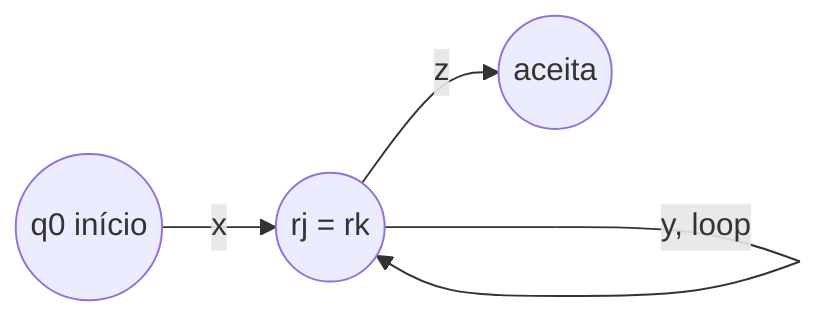

## Objetivos de Aprendizagem

- Enunciar precisamente o lema do bombeamento para linguagens regulares, incluindo as três condições sobre a divisão s = xyz.
- Explicar por que o lema deve valer para toda linguagem regular, usando o princípio da casa dos pombos aplicado aos estados de um DFA.
- Reconhecer o papel do lema do bombeamento como uma condição necessária (não suficiente) para regularidade, e explicar por que ele só pode provar não-regularidade, nunca regularidade.
- Aplicar o lema do bombeamento dentro de uma prova completa por contradição para mostrar que uma linguagem específica não é regular, verificando todos os casos que a divisão permite.
- Escolher uma string testemunha do lema do bombeamento de forma estratégica, de modo que toda divisão permitida leve a uma violação.

## Contexto e Motivação

Toda linguagem regular tem um DFA que a reconhece, e todo DFA tem algum número fixo e finito de estados. Essa finitude tem uma consequência estrutural que se revela extremamente útil: se um DFA tem p estados e lê uma string de comprimento p ou mais, ele não pode possivelmente visitar p ou mais estados *distintos* ao fazer isso, pelo princípio da casa dos pombos, algum estado deve ser revisitado no meio do caminho. Revisitar um estado significa que a máquina entrou em um loop: a substring lida entre a primeira e a segunda visita àquele estado pode ser repetida qualquer número de vezes (ou removida por completo) sem mudar se a máquina termina no mesmo lugar depois disso. Esse fato estrutural, tornado preciso, é o **lema do bombeamento para linguagens regulares**.

O lema do bombeamento importa na prática por uma razão específica: as propriedades de fechamento e a construção de regex para NFA dão ferramentas para provar que uma linguagem É regular, mas não existe um método comparavelmente direto para provar que uma linguagem NÃO é regular, não há autômato para deixar de encontrar, já que não encontrar um depois de algum esforço não prova nada (talvez exista um autômato mais engenhoso). O lema do bombeamento inverte esse problema: em vez de tentar e falhar em construir um autômato, ele fornece uma propriedade estrutural que toda linguagem reconhecível por DFA tem *garantidamente*, de modo que uma linguagem que provadamente carece dessa propriedade não pode ter um DFA de forma alguma, não importa quão engenhosa seja a construção tentada.

É por isso que tanto o MIT 18.404J quanto Sipser introduzem o lema do bombeamento logo após estabelecer a equivalência DFA/NFA/regex: é a primeira ferramenta do curso capaz de provar impossibilidade em vez de possibilidade. E seu uso padrão segue uma estrutura lógica bem específica que vale a pena nomear explicitamente: é uma instância de **prova por contradição** (coberta por completo na entrada complementar sobre essa técnica). Para provar que alguma linguagem A não é regular, o argumento padrão assume, para fins de contradição, que A *é* regular, o que força o lema do bombeamento a se aplicar a ela, já que o lema vale para toda linguagem regular sem exceção, e então exibe uma string específica em A, longa o suficiente para disparar o lema, para a qual *toda* forma de dividi-la segundo as regras do lema produz uma variante bombeada que provadamente cai fora de A. Isso é uma contradição direta (o lema garante que existe uma divisão válida, mas nenhuma existe), então a suposição de que A é regular deve ser falsa.

## Teoria Central

### O lema, enunciado precisamente

**Lema do Bombeamento para Linguagens Regulares.** Se A é uma linguagem regular, então existe um número p ≥ 1 (chamado o **comprimento de bombeamento**) tal que toda string s ∈ A com |s| ≥ p pode ser dividida em três partes, s = xyz, satisfazendo todas as três condições a seguir:

1. |xy| ≤ p (o ponto de divisão entre y e z ocorre dentro dos primeiros p caracteres de s);
2. |y| ≥ 1 (a parte do meio y é não vazia, esta é a parte que é "bombeada");
3. para todo inteiro i ≥ 0, a string xyⁱz também está em A (repetir y qualquer número de vezes, incluindo zero vezes, sempre mantém o resultado dentro de A).

Aqui xyⁱz significa x seguido de i cópias de y seguido de z; xy⁰z = xz (y removido por completo), xy¹z = xyz = s propriamente, xy²z = xyyz, e assim por diante.

### Por que o lema deve ser verdadeiro: casa dos pombos nos estados de um DFA

Suponha que A é regular, de modo que algum DFA M = (Q, Σ, δ, q₀, F) a reconhece. Seja p = |Q|, o número de estados de M: este é o comprimento de bombeamento que o lema promete existir. Seja s qualquer string em A com |s| ≥ p, e escreva s = s₁s₂...sₙ (n ≥ p) símbolo por símbolo. Enquanto M processa s a partir do estado inicial, defina r₀ = q₀ e rᵢ = δ(rᵢ₋₁, sᵢ) para i = 1, ..., n: a sequência de estados por onde M passa, um por símbolo lido, r₀ até rₙ.

Essa sequência tem n + 1 estados listados (r₀ até rₙ), e n + 1 ≥ p + 1 > p = |Q|. Como M tem apenas p estados distintos no total, pelo **princípio da casa dos pombos**, entre as primeiras p + 1 entradas dessa sequência (r₀ até r_p), pelo menos duas devem ser o mesmo estado, digamos rⱼ = rₖ para algum 0 ≤ j < k ≤ p.

Agora defina x = s₁...sⱼ (o prefixo lido antes da primeira ocorrência do estado repetido), y = sⱼ₊₁...sₖ (a substring lida *durante* o loop, da primeira ocorrência do estado repetido até a segunda), e z = sₖ₊₁...sₙ (tudo depois). Essa divisão satisfaz as três condições: |xy| = k ≤ p diretamente de k ≤ p no argumento da casa dos pombos; |y| = k − j ≥ 1 já que j < k estritamente; e para qualquer i ≥ 0, xyⁱz leva M de q₀ ao longo de x até rⱼ, depois ao redor do loop de rⱼ de volta a rⱼ (já que rⱼ = rₖ) exatamente i vezes usando y, depois ao longo de z de rⱼ (= rₖ) até rₙ ∈ F, então M aceita xyⁱz para todo i, significando que xyⁱz ∈ A para todo i. Isso prova o lema: é uma consequência direta e mecânica de um DFA ter apenas finitos estados, aplicada via casa dos pombos a qualquer string longa o suficiente para forçar uma repetição.

### O lema como um teste em uma via: necessário, não suficiente

O lema do bombeamento enuncia uma propriedade que toda linguagem regular *deve* ter. Ele **não** enuncia que toda linguagem com essa propriedade é regular: existem linguagens que satisfazem a conclusão do lema (algum p existe com a propriedade de divisão enunciada) e mesmo assim não são regulares, de modo que o lema nunca pode ser usado para *provar* que uma linguagem é regular, apenas para *refutar* isso. Essa assimetria é exatamente o motivo pelo qual o lema é usado dentro de uma prova por contradição em vez de como um teste direto: a contrapositiva de "A regular ⟹ a propriedade de bombeamento vale" é "a propriedade de bombeamento falha ⟹ A não é regular", que é uma ferramenta perfeitamente válida, mas "a propriedade de bombeamento vale ⟹ A é regular" não é uma implicação válida de forma alguma, já que a recíproca da implicação original nunca foi afirmada.

### A estratégia para uma prova de não-regularidade

Para provar que uma linguagem A específica não é regular usando o lema do bombeamento, seguindo a estrutura de prova por contradição nomeada acima:

1. Suponha, para contradição, que A é regular.
2. Pelo lema do bombeamento, existe algum comprimento de bombeamento p satisfazendo as três condições para toda s ∈ A com |s| ≥ p.
3. Escolha uma string específica s ∈ A, com |s| ≥ p, escolhida estrategicamente de modo que não importa como seja dividida (sujeita às restrições do lema), o resultado bombeado sai de A.
4. Considere toda forma pela qual s = xyz poderia satisfazer as condições 1 e 2 (pode haver muitas, já que o lema não diz qual divisão ocorre, apenas que alguma divisão satisfazendo as condições existe); para cada uma, mostre que alguma escolha de i (geralmente i = 0 ou i = 2) produz xyⁱz ∉ A.
5. Já que toda divisão permitida falha em satisfazer a condição 3, nenhuma divisão satisfazendo as três condições existe para s, contradizendo a garantia do lema do bombeamento de que uma existe.
6. Conclua que a suposição no passo 1 era falsa: A não é regular.

O ponto crucial de qualquer prova assim é o passo 4: ele deve genuinamente eliminar *toda* divisão que as condições do lema permitem, não apenas uma única divisão "típica"; uma verificação incompleta de casos não prova nada, já que o lema só exige que *alguma* divisão funcione, então uma prova de não-regularidade deve mostrar que *nenhuma* funciona.

## Exemplos Resolvidos

### Exemplo 1: {0ⁿ1ⁿ : n ≥ 0} não é regular (a prova clássica, resolvida por completo)

**Afirmação.** L = {0ⁿ1ⁿ : n ≥ 0} (números iguais de 0s seguidos de 1s) não é regular.

**Prova, por contradição.** Suponha, para contradição, que L é regular. Então, pelo lema do bombeamento, existe um comprimento de bombeamento p ≥ 1 tal que toda string em L de comprimento ≥ p pode ser dividida conforme exigido.

**Escolha da string testemunha.** Seja s = 0ᵖ1ᵖ (p zeros seguidos de p uns). Essa string está em L (tem p zeros seguidos de p uns, uma contagem igual) e tem comprimento 2p ≥ p, então o lema do bombeamento se aplica a ela: s pode ser escrita s = xyz satisfazendo |xy| ≤ p, |y| ≥ 1, e xyⁱz ∈ L para todo i ≥ 0.

**Análise de casos sobre onde y cai.** Como |xy| ≤ p e s começa com um bloco de p zeros, o prefixo inteiro xy consiste apenas de 0s (os primeiros p caracteres de s = 0ᵖ1ᵖ são todos zeros, e xy é um prefixo de comprimento ≤ p, então xy está inteiramente dentro daquele bloco de zeros). Isso significa que y mesmo, sendo parte de xy, consiste inteiramente de 0s, digamos y = 0ᵏ para algum k ≥ 1 (k ≥ 1 pela condição 2, |y| ≥ 1).

Esse é de fato o *único* caso que a condição |xy| ≤ p permite: não há possibilidade de y se espalhar sobre a fronteira entre os 0s e os 1s, ou cair inteiramente dentro dos 1s, dado |xy| ≤ p e os primeiros p símbolos de s sendo todos zeros. Então toda divisão satisfazendo as condições do lema tem essa mesma forma: x = 0ʲ, y = 0ᵏ (j + k ≤ p, k ≥ 1), z = 0^(p−j−k)1ᵖ.

**Bombeando para baixo: i = 0.** xy⁰z = xz = 0ʲ · 0^(p−j−k) · 1ᵖ = 0^(p−k)1ᵖ. Como k ≥ 1, p − k < p, então essa string tem p − k zeros mas ainda p uns: uma contagem desigual de 0s e 1s. Portanto xy⁰z ∉ L.

Já que esse único caso (apenas na região de zeros, pela restrição |xy| ≤ p) cobre *toda* divisão que as condições do lema permitem, e bombear para baixo (i = 0) quebra a pertinência a L nesse caso, não existe divisão de s = 0ᵖ1ᵖ satisfazendo as três condições do lema do bombeamento, porque a única divisão estruturalmente possível sempre falha a condição 3.

**Contradição e conclusão.** Isso contradiz diretamente o lema do bombeamento, que garante que *alguma* divisão válida existe para toda string em L de comprimento ≥ p. Já que s ∈ L e |s| = 2p ≥ p, a garantia do lema deveria ter se aplicado a s, mas nenhuma divisão de s satisfaz as três condições: uma impossibilidade completa. Essa contradição significa que a suposição de que L é regular deve ser falsa. Portanto, L = {0ⁿ1ⁿ : n ≥ 0} não é regular. ∎

Toda divisão possível permitida pelas próprias restrições do lema (havia, neste caso, essencialmente uma forma estrutural de divisão, parametrizada por j e k) foi verificada e mostrada como falha; a prova não apenas verifica uma divisão "representativa" e para, mas mostra que a restrição |xy| ≤ p força toda divisão válida na mesma forma só de zeros, e essa forma sempre falha quando bombeada para baixo.

### Exemplo 2: {ww : w ∈ {0,1}*} não é regular

**Afirmação.** L = {ww : w ∈ {0,1}*} (strings que são alguma string repetida consecutivamente) não é regular.

**Prova, por contradição.** Suponha que L é regular, dando um comprimento de bombeamento p. Escolha s = 0ᵖ1 0ᵖ1 (ou seja, w = 0ᵖ1, então s = ww). Essa string está em L, e |s| = 2p + 2 ≥ p, então o lema se aplica.

**Análise de casos.** Como |xy| ≤ p, e os primeiros p símbolos de s são todos 0s (s começa com 0ᵖ...), xy está inteiramente dentro desse bloco inicial de 0s, exatamente como no Exemplo 1. Então y = 0ᵏ para algum k ≥ 1, com x = 0ʲ, j + k ≤ p, e z consistindo do restante 0^(p−j−k), depois 1, depois 0ᵖ, depois 1.

**Bombeando para baixo: i = 0.** xy⁰z remove k zeros apenas do primeiro bloco de 0s, dando 0^(p−k)1 0ᵖ1, de comprimento total 2p + 2 − k. Se essa string fosse da forma ww, seu comprimento teria que se dividir uniformemente em duas metades idênticas. Mas o primeiro "1" nessa string ocorre depois de apenas p − k zeros, enquanto o segundo "1" ocorre depois de uma sequência de p zeros contados logo após o primeiro "1": os dois blocos de zeros que cercam os dois 1s agora têm comprimentos diferentes (p − k contra p), já que apenas o primeiro bloco perdeu zeros. Duas metades idênticas ww precisariam que sua estrutura interna (a posição do 1 em relação ao início de cada metade) correspondesse exatamente, o que um descompasso de comprimento de k ≥ 1 entre os dois blocos de zeros descarta. Portanto xy⁰z ∉ L.

**Conclusão.** Como no Exemplo 1, a restrição |xy| ≤ p força toda divisão válida nessa mesma forma só de zeros, e bombear para baixo sempre produz uma string com metades descompassadas, nunca da forma ww. Nenhuma divisão satisfaz as três condições do lema, contradizendo a garantia do lema. Então a suposição de que L é regular é falsa, e L = {ww : w ∈ {0,1}*} não é regular. ∎

## Equívocos Comuns e Armadilhas

- **"Para refutar regularidade, eu só preciso encontrar uma divisão da minha string escolhida que falha ao bombear corretamente."** Isso inverte a lógica. O lema do bombeamento garante que *alguma* divisão funciona, não que *toda* divisão funciona, então encontrar uma divisão ruim não prova nada por si só. Uma prova válida de não-regularidade deve mostrar que *toda* divisão permitida pelas restrições do lema (|xy| ≤ p, |y| ≥ 1) falha ao bombear corretamente, exatamente como ambos os exemplos resolvidos acima verificam que a restrição força uma única forma estrutural de divisão e mostram que essa forma inteira falha.
- **"O lema do bombeamento pode ser usado para provar que uma linguagem É regular, mostrando que alguma string nela bombeia corretamente."** O lema é uma condição necessária de mão única, não um teste se e somente se. Uma linguagem pode satisfazer a propriedade de bombeamento (algum p existe com o comportamento de divisão exigido) e ainda assim não ser regular por razões inteiramente diferentes: a contrapositiva do lema é uma ferramenta válida de não-regularidade, mas sua recíproca nunca foi afirmada e não é verdadeira em geral.
- **"Qualquer string de comprimento ≥ p funciona como a string testemunha."** A escolha da string testemunha é o ponto crucial da prova inteira. Uma string mal escolhida pode admitir alguma divisão que bombeia corretamente mesmo em uma linguagem não regular, fazendo a tentativa de prova falhar em chegar a uma contradição. O Exemplo 1 funciona especificamente porque 0ᵖ1ᵖ, combinado com a restrição |xy| ≤ p, força toda divisão possível em uma única forma facilmente analisada (apenas 0s); uma escolha menos cuidadosa, como uma string com 1s espalhados pelos primeiros p caracteres, poderia deixar mais casos de divisão para verificar, ou falhar em produzir uma contradição limpa de forma alguma.
- **"O comprimento de bombeamento p é algo que eu posso escolher."** p é produzido pelo lema do bombeamento como consequência de supor a linguagem regular (concretamente, p é o número de estados de algum DFA hipotético); ele é tratado como uma incógnita arbitrária mas fixa entregue à prova, e a string testemunha é então escolhida estrategicamente *em função de* p (por exemplo, 0ᵖ1ᵖ), não como algum número fixo escolhido de forma independente.
- **"Pular o enquadramento de 'suponha regular, obtenha um p' e simplesmente falar sobre 'o DFA' é a mesma prova."** É a mesma ideia subjacente, mas enunciar a prova explicitamente como uma prova por contradição (suponha L regular, derive a existência de p, derive uma impossibilidade, conclua que L não é regular) torna a estrutura lógica à prova de falhas e corresponde à técnica padrão pelo nome; enquadramentos mais descuidados arriscam deixar a forma lógica real do argumento (e o que exatamente foi contradito) pouco clara.

## Resumo

O lema do bombeamento enuncia que toda linguagem regular tem um comprimento de bombeamento p tal que qualquer string nela de comprimento ≥ p pode ser dividida em xyz com |xy| ≤ p, |y| ≥ 1, e xyⁱz permanecendo na linguagem para todo i ≥ 0, uma consequência direta do princípio da casa dos pombos aplicado aos estados finitos de um DFA reconhecedor, já que qualquer string longa o suficiente força um estado a se repetir, criando um loop que pode ser bombeado. O lema é uma condição necessária de mão única: ele pode provar que uma linguagem não é regular (via sua contrapositiva) mas nunca pode provar que uma linguagem é regular. A técnica padrão para usá-lo é uma prova por contradição: suponha que a linguagem alvo é regular, invoque o lema para obter um comprimento de bombeamento p, escolha uma string testemunha na linguagem cujo comprimento depende de p, mostre que toda divisão que as próprias restrições do lema permitem produz alguma variante bombeada fora da linguagem, e conclua que a suposição de regularidade era falsa. O exemplo clássico, {0ⁿ1ⁿ : n ≥ 0}, ilustra a técnica por completo: a restrição |xy| ≤ p força toda divisão válida em uma forma só de zeros, e bombear para baixo (i = 0) sempre quebra a propriedade de contagem igual, completando a contradição.

## Documentation Links

- [MIT 18.404J: OCW Calendar](https://ocw.mit.edu/courses/18-404j-theory-of-computation-fall-2020/pages/calendar/): doc
- [Sipser: Introduction to the Theory of Computation, 3rd ed.](https://cs.brown.edu/courses/csci1810/fall-2023/resources/ch2_readings/Sipser_Introduction.to.the.Theory.of.Computation.3E.pdf): doc
