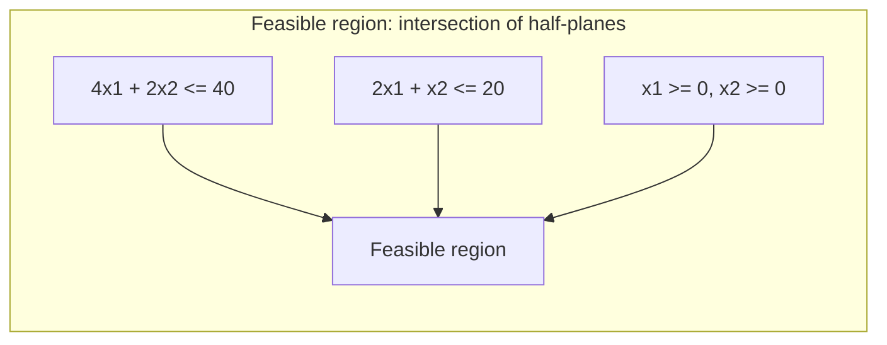

## Learning Objectives

- Describe a linear program's feasible region as the intersection of every constraint's half-plane (or half-space, in higher dimensions), and identify it as a convex polygon (a polytope, in general).
- Solve a two-variable linear program by the graphical method: plot every constraint, identify the feasible region, and evaluate the objective at each corner.
- Define a vertex (corner point) of a feasible region precisely, and explain why the objective function's linearity concentrates the search for an optimum at these points.
- Identify the three possible outcomes for a linear program: a unique optimum, an unbounded objective, or an infeasible (empty) region.
- Explain geometrically why a linear objective, unlike a curved one, cannot have an interior local maximum strictly inside a convex region.

## Context & Motivation

The previous concept established what a linear program is algebraically: an objective and a set of linear constraints. This concept turns to what that algebra actually looks like drawn out, because the geometric picture is not a mere illustration, it is the entire reason a linear program is solvable at all in a way a general nonlinear optimization problem is not. Every constraint carves the space of possible `(x₁, x₂, ..., xₙ)` values into a "keep" half and a "discard" half; the *feasible region*, every point satisfying all constraints at once, is what survives the intersection of all those halves. This concept works entirely in two dimensions, where the region can be drawn and reasoned about directly by eye, before the next concept extracts the fully general principle this picture reveals.

## Core Theory

### Constraints as half-planes, feasible region as their intersection

In two variables, a single linear constraint like `4x₁ + 2x₂ ≤ 40` divides the entire plane into two **half-planes**: every point satisfying the inequality, and every point that doesn't, separated by the line `4x₁ + 2x₂ = 40`. A linear program's **feasible region** is the set of points satisfying *every* constraint simultaneously, which is exactly the intersection of all the individual half-planes (plus the nonnegativity restrictions, each contributing its own half-plane, typically `x₁ ≥ 0` and `x₂ ≥ 0` cutting the picture down to the first quadrant).

The intersection of any number of half-planes (or, in more than two dimensions, half-spaces) is always a **convex polygon** (a **polytope**, in general dimension): a shape with straight edges, no indentations, where the line segment between any two points inside the region lies entirely inside the region too. This convexity is not incidental, it is the single most consequential geometric fact in this entire discipline, and the next several concepts return to it repeatedly.

### The graphical method, worked through directly

Applying the workshop example from the previous concept (`maximize 70x₁ + 30x₂`, subject to `4x₁ + 2x₂ ≤ 40`, `2x₁ + x₂ ≤ 20`, `x₁, x₂ ≥ 0`):

1. **Plot each constraint's boundary line.** `4x₁ + 2x₂ = 40` passes through `(10, 0)` and `(0, 20)`. `2x₁ + x₂ = 20` passes through `(10, 0)` and `(0, 20)` as well, coincidentally the same intercepts here (a specific feature of these particular numbers, not a general rule).
2. **Shade the feasible side of each line**, and intersect with the first quadrant (`x₁, x₂ ≥ 0`).
3. **Identify the resulting region's corners (vertices).** For this example: `(0,0)`, `(10,0)`, `(0,20)`, and the intersection of the two constraint lines themselves.
4. **Find that intersection algebraically.** Solving `4x₁ + 2x₂ = 40` and `2x₁ + x₂ = 20` simultaneously: the second equation gives `x₂ = 20 - 2x₁`; substituting into the first: `4x₁ + 2(20 - 2x₁) = 40` → `4x₁ + 40 - 4x₁ = 40` → `40 = 40`, true for *every* `x₁`, meaning these two lines are actually parallel and coincide exactly (both pass through the same two intercepts found in step 1), so this particular example's feasible region is bounded by only these two coincident lines plus the axes, with vertices `(0,0)`, `(10,0)`, `(0,20)` only.

### Why the optimum is always at a vertex, geometrically

A linear objective function `c₁x₁ + c₂x₂`, plotted as a family of parallel lines (one for each possible objective value, all sharing the same slope `-c₁/c₂`), sweeps across the plane as its value increases. Because the feasible region is convex and bounded by straight edges, the *last* point the sweeping objective line touches before leaving the feasible region entirely (the maximum) can never be strictly inside the region, nor strictly inside one of its edges, except in the special case where the objective line happens to be exactly parallel to an edge (in which case the entire edge, including both its endpoint vertices, ties for optimal). This is the geometric heart of why checking only the vertices, rather than the region's entire interior, suffices to find the optimum, formalized rigorously as the Fundamental Theorem of Linear Programming in the next concept.

### Three possible outcomes

Not every linear program has a single, well-behaved optimal vertex:

- **A unique optimal solution** exists when the feasible region is bounded (or bounded in the objective's direction of improvement) and the objective's sweep touches exactly one vertex last.
- **An unbounded objective** occurs when the feasible region extends infinitely in the direction the objective wants to improve (for a maximization, infinitely far in the direction of increasing objective value), so no finite maximum exists at all, a genuine possibility, not a computational failure, when a problem is missing a constraint that should have limited growth in some direction.
- **Infeasibility** occurs when the constraints, taken together, admit no point satisfying all of them simultaneously (the "intersection" of half-planes is the empty set), meaning the modeled problem has no valid solution at all under the stated restrictions.

## Worked Examples

### Example 1: solving the workshop problem graphically, vertex by vertex

**Problem:** Using the workshop LP (`maximize 70x₁ + 30x₂`, `4x₁ + 2x₂ ≤ 40`, `2x₁ + x₂ ≤ 20`, `x₁, x₂ ≥ 0`), evaluate the objective at every vertex identified in Core Theory and determine the optimum.

**Vertices:** `(0,0)`, `(10,0)`, `(0,20)` (as derived above, the two constraint lines coincide, so the feasible region is the triangle bounded by them and the axes).

**Evaluating the objective:** At `(0,0)`: `70(0) + 30(0) = 0`. At `(10,0)`: `70(10) + 30(0) = 700`. At `(0,20)`: `70(0) + 30(20) = 600`.

**Optimum:** The largest value, `700`, occurs at `(10, 0)`, meaning the workshop should make 10 tables and 0 chairs for a maximum profit of $700, a concrete, checkable answer to the question the "greedy by profit-per-unit" misconception in the previous concept warned against assuming without verification (it happens to agree here, but Example 2 shows a case where it would not).

### Example 2: a case where the highest-profit-per-unit item is not part of the optimal mix

**Problem:** Modify the workshop problem so tables require 1 hour of carpentry and 1 hour of finishing (profit $70), chairs require 1 hour of carpentry and 3 hours of finishing (profit $90), with 10 hours of carpentry and 24 hours of finishing available. `maximize 70x₁ + 90x₂` subject to `x₁ + x₂ ≤ 10`, `x₁ + 3x₂ ≤ 24`, `x₁, x₂ ≥ 0`. Find the optimal vertex.

**Vertices:** `(0,0)`; `(10,0)` (from `x₁ + x₂ ≤ 10` alone, checking it also satisfies `x₁+3x₂≤24`: `10 ≤ 24` ✓); `(0,8)` (from `x₁+3x₂≤24` alone, at `x₁=0`: `x₂=8`, checking `x₁+x₂≤10`: `8≤10` ✓); and the intersection of the two lines: `x₁+x₂=10` and `x₁+3x₂=24`. Subtracting: `2x₂=14`, so `x₂=7`, `x₁=3`.

**Evaluating the objective at all four vertices:** `(0,0)`: `0`. `(10,0)`: `700`. `(0,8)`: `90(8)=720`. `(3,7)`: `70(3)+90(7)=210+630=840`.

**Optimum:** `(3, 7)`, value `840`, strictly greater than either axis vertex. Chairs have the higher profit *per unit* (`$90` vs `$70`), yet the optimal mix is neither "all chairs" (`(0,8)`, value `720`) nor "all tables" (`(10,0)`, value `700`), it is a genuine mixture, confirming Core Theory's point that the interior vertex where two constraints bind simultaneously can beat either extreme, exactly why the graphical (or, for larger problems, simplex) method is necessary rather than a per-unit-profit shortcut.

## Common Misconceptions & Pitfalls

- **"The optimal solution could be anywhere in the feasible region, so the whole region needs to be searched."** Core Theory's sweeping-line argument shows the optimum (when one exists) is always achieved at a vertex, or along an entire edge in the tied case, never strictly in the interior; this is exactly what makes checking a finite list of vertices sufficient, rather than an infinite continuum of points.
- **"An unbounded feasible region always means an unbounded objective."** A feasible region can extend infinitely in some direction while the objective still has a finite maximum, if the objective's improving direction points away from where the region is unbounded; unboundedness of the *objective value*, not just the *region*, is what actually signals no finite optimum exists.
- **"If the two constraint lines don't intersect within the feasible quadrant, the problem must be infeasible."** Example 1's two constraint lines happen to be parallel and coincide entirely, a special case that still yields a perfectly well-defined, feasible, bounded triangular region; parallel constraint lines reduce the vertex count but do not by themselves cause infeasibility.
- **"Comparing profit-per-resource-unit across products tells you the optimal production mix directly, without needing to check vertices."** Example 2 is a direct, verified counterexample: chairs' higher per-unit profit does not make "all chairs" optimal, the interior vertex `(3,7)`, found only by actually solving the constraint intersection, beats both single-product extremes.

## Summary

A linear program's feasible region is the intersection of the half-planes (or half-spaces) each constraint carves out, always a convex polygon (polytope), and the graphical method solves a two-variable LP by plotting every constraint, identifying the resulting region's vertices, and evaluating the objective directly at each one. A linear objective's parallel-line sweep across a convex region always reaches its extreme value at a vertex (or along a tied edge), never strictly inside the region, which is why checking finitely many vertices suffices, formalized rigorously in the next concept. A linear program can resolve to a unique optimal vertex, an unbounded objective (the region extends infinitely in the direction of improvement), or infeasibility (no point satisfies every constraint at once), three genuinely different outcomes worth distinguishing before trusting any numeric answer. Example 2's interior optimum, beating both single-product extremes despite one product's higher per-unit profit, is exactly the kind of result that makes solving the actual geometry necessary rather than reasoning by profit-per-unit shortcuts. The next concept states, and proves, the general principle this picture has been building toward: the Fundamental Theorem of Linear Programming.

## Documentation Links

- [MIT 6.251 - Introduction to Mathematical Programming (OCW)](https://ocw.mit.edu/courses/6-251j-introduction-to-mathematical-programming-fall-2009/): doc
- [Stanford CS261 - Optimization and Algorithmic Paradigms](https://web.stanford.edu/class/cs261/): doc
