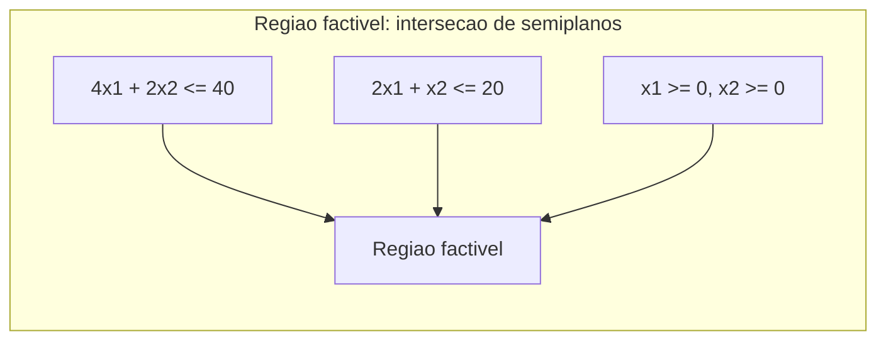

## Objetivos de Aprendizagem

- Descrever a região factível de um programa linear como a interseção do semiplano (ou semiespaço, em dimensões maiores) de toda restrição, e identificá-la como um polígono convexo (um politopo, em geral).
- Resolver um programa linear de duas variáveis pelo método gráfico: plotar toda restrição, identificar a região factível, e avaliar o objetivo em cada canto.
- Definir precisamente um vértice (ponto de canto) de uma região factível, e explicar por que a linearidade da função objetivo concentra a busca por um ótimo nesses pontos.
- Identificar os três resultados possíveis para um programa linear: um ótimo único, um objetivo ilimitado, ou uma região infactível (vazia).
- Explicar geometricamente por que um objetivo linear, ao contrário de um curvo, não pode ter um máximo local interior estritamente dentro de uma região convexa.

## Contexto e Motivação

O conceito anterior estabeleceu o que é um programa linear algebricamente: um objetivo e um conjunto de restrições lineares. Este conceito se volta para como essa álgebra realmente se parece desenhada, porque o quadro geométrico não é uma mera ilustração, é a razão inteira pela qual um programa linear é solucionável de uma forma que um problema geral de otimização não linear não é. Toda restrição talha o espaço de valores possíveis `(x₁, x₂, ..., xₙ)` em uma metade "manter" e uma metade "descartar"; a *região factível*, todo ponto satisfazendo todas as restrições ao mesmo tempo, é o que sobrevive à interseção de todas essas metades. Este conceito trabalha inteiramente em duas dimensões, onde a região pode ser desenhada e raciocinada diretamente a olho, antes de o próximo conceito extrair o princípio totalmente geral que esse quadro revela.

## Teoria Central

### Restrições como semiplanos, região factível como sua interseção

Em duas variáveis, uma única restrição linear como `4x₁ + 2x₂ ≤ 40` divide o plano inteiro em dois **semiplanos**: todo ponto satisfazendo a desigualdade, e todo ponto que não satisfaz, separados pela reta `4x₁ + 2x₂ = 40`. A **região factível** de um programa linear é o conjunto de pontos satisfazendo *toda* restrição simultaneamente, que é exatamente a interseção de todos os semiplanos individuais (mais as restrições de não-negatividade, cada uma contribuindo seu próprio semiplano, tipicamente `x₁ ≥ 0` e `x₂ ≥ 0` cortando o quadro até o primeiro quadrante).

A interseção de qualquer número de semiplanos (ou, em mais de duas dimensões, semiespaços) é sempre um **polígono convexo** (um **politopo**, em dimensão geral): uma forma com bordas retas, sem reentrâncias, onde o segmento de reta entre quaisquer dois pontos dentro da região também fica inteiramente dentro da região. Essa convexidade não é incidental, é o fato geométrico mais consequente em toda essa disciplina, e os próximos vários conceitos retornam a ele repetidamente.

### O método gráfico, trabalhado diretamente

Aplicando o exemplo da marcenaria do conceito anterior (`maximizar 70x₁ + 30x₂`, sujeito a `4x₁ + 2x₂ ≤ 40`, `2x₁ + x₂ ≤ 20`, `x₁, x₂ ≥ 0`):

1. **Plote a reta de fronteira de cada restrição.** `4x₁ + 2x₂ = 40` passa por `(10, 0)` e `(0, 20)`. `2x₁ + x₂ = 20` passa por `(10, 0)` e `(0, 20)` também, coincidentemente os mesmos interceptos aqui (uma característica específica desses números particulares, não uma regra geral).
2. **Sombreie o lado factível de cada reta**, e interseccione com o primeiro quadrante (`x₁, x₂ ≥ 0`).
3. **Identifique os cantos (vértices) da região resultante.** Para este exemplo: `(0,0)`, `(10,0)`, `(0,20)`, e a interseção das duas retas de restrição em si.
4. **Encontre essa interseção algebricamente.** Resolvendo `4x₁ + 2x₂ = 40` e `2x₁ + x₂ = 20` simultaneamente: a segunda equação dá `x₂ = 20 - 2x₁`; substituindo na primeira: `4x₁ + 2(20 - 2x₁) = 40` → `4x₁ + 40 - 4x₁ = 40` → `40 = 40`, verdadeiro para *todo* `x₁`, significando que essas duas retas na verdade são paralelas e coincidem exatamente (ambas passam pelos mesmos dois interceptos encontrados no passo 1), então a região factível deste exemplo particular é limitada só por essas duas retas coincidentes mais os eixos, com vértices `(0,0)`, `(10,0)`, `(0,20)` apenas.

### Por que o ótimo está sempre em um vértice, geometricamente

Uma função objetivo linear `c₁x₁ + c₂x₂`, plotada como uma família de retas paralelas (uma para cada valor objetivo possível, todas compartilhando a mesma inclinação `-c₁/c₂`), varre o plano conforme seu valor aumenta. Como a região factível é convexa e limitada por bordas retas, o *último* ponto que a reta objetivo varredora toca antes de deixar a região factível completamente (o máximo) nunca pode estar estritamente dentro da região, nem estritamente dentro de uma de suas bordas, exceto no caso especial em que a reta objetivo acontece de ser exatamente paralela a uma borda (caso em que a borda inteira, incluindo ambos os vértices de suas extremidades, empata como ótima). Este é o coração geométrico de por que verificar só os vértices, em vez do interior inteiro da região, basta para encontrar o ótimo, formalizado rigorosamente como o Teorema Fundamental da Programação Linear no próximo conceito.

### Três resultados possíveis

Nem todo programa linear tem um único vértice ótimo bem-comportado:

- **Uma solução ótima única** existe quando a região factível é limitada (ou limitada na direção de melhoria do objetivo) e a varredura do objetivo toca exatamente um vértice por último.
- **Um objetivo ilimitado** ocorre quando a região factível se estende infinitamente na direção que o objetivo quer melhorar (para uma maximização, infinitamente longe na direção de valor objetivo crescente), então nenhum máximo finito existe de forma alguma, uma possibilidade genuína, não uma falha computacional, quando um problema está sem uma restrição que deveria ter limitado o crescimento em alguma direção.
- **Infactibilidade** ocorre quando as restrições, tomadas em conjunto, não admitem nenhum ponto satisfazendo todas elas simultaneamente (a "interseção" de semiplanos é o conjunto vazio), significando que o problema modelado não tem nenhuma solução válida sob as restrições enunciadas.

## Exemplos Resolvidos

### Exemplo 1: resolvendo o problema da marcenaria graficamente, vértice por vértice

**Problema:** Usando o PL da marcenaria (`maximizar 70x₁ + 30x₂`, `4x₁ + 2x₂ ≤ 40`, `2x₁ + x₂ ≤ 20`, `x₁, x₂ ≥ 0`), avalie o objetivo em todo vértice identificado na Teoria Central e determine o ótimo.

**Vértices:** `(0,0)`, `(10,0)`, `(0,20)` (como derivado acima, as duas retas de restrição coincidem, então a região factível é o triângulo limitado por elas e os eixos).

**Avaliando o objetivo:** Em `(0,0)`: `70(0) + 30(0) = 0`. Em `(10,0)`: `70(10) + 30(0) = 700`. Em `(0,20)`: `70(0) + 30(20) = 600`.

**Ótimo:** O maior valor, `700`, ocorre em `(10, 0)`, significando que a marcenaria deveria fazer 10 mesas e 0 cadeiras para um lucro máximo de $700, uma resposta concreta e verificável para a pergunta que o equívoco de "guloso por lucro por unidade" no conceito anterior alertou contra assumir sem verificação (acontece de concordar aqui, mas o Exemplo 2 mostra um caso em que não concordaria).

### Exemplo 2: um caso em que o item de maior lucro por unidade não faz parte da mistura ótima

**Problema:** Modifique o problema da marcenaria de forma que mesas exijam 1 hora de carpintaria e 1 hora de acabamento (lucro $70), cadeiras exijam 1 hora de carpintaria e 3 horas de acabamento (lucro $90), com 10 horas de carpintaria e 24 horas de acabamento disponíveis. `maximizar 70x₁ + 90x₂` sujeito a `x₁ + x₂ ≤ 10`, `x₁ + 3x₂ ≤ 24`, `x₁, x₂ ≥ 0`. Encontre o vértice ótimo.

**Vértices:** `(0,0)`; `(10,0)` (de `x₁ + x₂ ≤ 10` sozinha, verificando que também satisfaz `x₁+3x₂≤24`: `10 ≤ 24` ✓); `(0,8)` (de `x₁+3x₂≤24` sozinha, em `x₁=0`: `x₂=8`, verificando `x₁+x₂≤10`: `8≤10` ✓); e a interseção das duas retas: `x₁+x₂=10` e `x₁+3x₂=24`. Subtraindo: `2x₂=14`, então `x₂=7`, `x₁=3`.

**Avaliando o objetivo nos quatro vértices:** `(0,0)`: `0`. `(10,0)`: `700`. `(0,8)`: `90(8)=720`. `(3,7)`: `70(3)+90(7)=210+630=840`.

**Ótimo:** `(3, 7)`, valor `840`, estritamente maior que qualquer vértice de eixo. Cadeiras têm o maior lucro *por unidade* (`$90` contra `$70`), mas a mistura ótima não é nem "só cadeiras" (`(0,8)`, valor `720`) nem "só mesas" (`(10,0)`, valor `700`), é uma mistura genuína, confirmando o ponto da Teoria Central de que o vértice interior onde duas restrições se vinculam simultaneamente pode superar qualquer extremo, exatamente por que o método gráfico (ou, para problemas maiores, o simplex) é necessário em vez de um atalho de lucro por unidade.

## Equívocos Comuns e Armadilhas

- **"A solução ótima poderia estar em qualquer lugar na região factível, então a região inteira precisa ser buscada."** O argumento de varredura da Teoria Central mostra que o ótimo (quando existe) é sempre alcançado em um vértice, ou ao longo de uma borda inteira no caso de empate, nunca estritamente no interior; isso é exatamente o que torna verificar uma lista finita de vértices suficiente, em vez de um contínuo infinito de pontos.
- **"Uma região factível ilimitada sempre significa um objetivo ilimitado."** Uma região factível pode se estender infinitamente em alguma direção enquanto o objetivo ainda tem um máximo finito, se a direção de melhoria do objetivo apontar para longe de onde a região é ilimitada; ilimitação do *valor do objetivo*, não só da *região*, é o que de fato sinaliza que nenhum ótimo finito existe.
- **"Se as duas retas de restrição não se cruzam dentro do quadrante factível, o problema precisa ser infactível."** As duas retas de restrição do Exemplo 1 acontecem de ser paralelas e coincidir inteiramente, um caso especial que ainda produz uma região triangular perfeitamente bem definida, factível e limitada; retas de restrição paralelas reduzem a contagem de vértices mas não causam infactibilidade por si só.
- **"Comparar lucro por unidade de recurso entre produtos diz diretamente a mistura de produção ótima, sem precisar verificar vértices."** O Exemplo 2 é um contraexemplo direto e verificado: o maior lucro por unidade das cadeiras não torna "só cadeiras" ótimo, o vértice interior `(3,7)`, encontrado só resolvendo de fato a interseção das restrições, supera ambos os extremos de produto único.

## Resumo

A região factível de um programa linear é a interseção dos semiplanos (ou semiespaços) que cada restrição talha, sempre um polígono convexo (politopo), e o método gráfico resolve um PL de duas variáveis plotando toda restrição, identificando os vértices da região resultante, e avaliando o objetivo diretamente em cada um. A varredura de retas paralelas de um objetivo linear através de uma região convexa sempre alcança seu valor extremo em um vértice (ou ao longo de uma borda empatada), nunca estritamente dentro da região, que é por que verificar finitos vértices basta, formalizado rigorosamente no próximo conceito. Um programa linear pode se resolver em um único vértice ótimo, um objetivo ilimitado (a região se estende infinitamente na direção de melhoria), ou infactibilidade (nenhum ponto satisfaz toda restrição ao mesmo tempo), três resultados genuinamente diferentes que vale a pena distinguir antes de confiar em qualquer resposta numérica. O ótimo interior do Exemplo 2, superando ambos os extremos de produto único apesar do maior lucro por unidade de um produto, é exatamente o tipo de resultado que torna resolver a geometria real necessário em vez de raciocinar por atalhos de lucro por unidade. O próximo conceito enuncia, e prova, o princípio geral para o qual este quadro vem construindo: o Teorema Fundamental da Programação Linear.

## Documentation Links

- [MIT 6.251 - Introduction to Mathematical Programming (OCW)](https://ocw.mit.edu/courses/6-251j-introduction-to-mathematical-programming-fall-2009/): doc
- [Stanford CS261 - Optimization and Algorithmic Paradigms](https://web.stanford.edu/class/cs261/): doc
