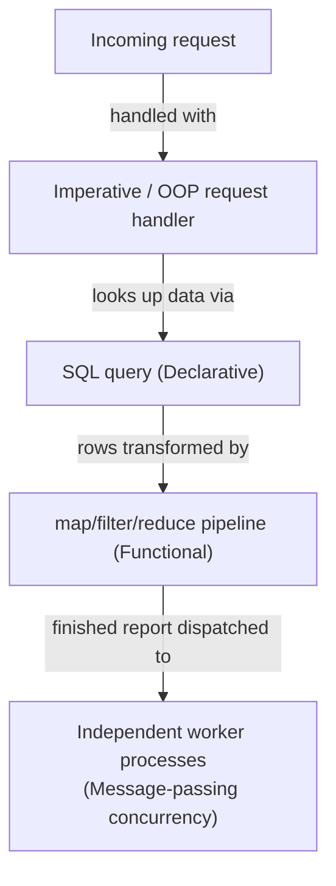

## Learning Objectives

- Summarize, in one phrase each, the core idea of all six paradigms covered in this discipline: imperative, object-oriented, functional, logic, concurrent, and declarative.
- Match a realistic problem description to the paradigm (or paradigms) that fit it most naturally, and explain why.
- Read a comparison table across all six paradigms and use it as a genuine decision aid, not just a recap.
- Explain, with concrete examples, why real languages and real systems typically mix paradigms rather than committing to exactly one.
- Given an unfamiliar problem statement, articulate which paradigm you would reach for first and what about the problem's shape justifies that choice.

## Context & Motivation

This discipline has, one concept at a time, built up six genuinely different ways of thinking about "how do I tell a computer what to do": imperative programming's sequence of state-changing steps, object-oriented programming's bundling of state and behavior into interacting objects, functional programming's pure functions and immutable data transformed through composition and recursion, logic programming's facts and rules resolved by unification, concurrent programming's two models for multiple things happening at once, and declarative programming's description of a result with the how left to the system. Each one was presented and motivated on its own terms, with its own worked examples, its own vocabulary, its own common mistakes. What has not yet been asked, directly, is the practical question every one of these concepts was really building toward: given an actual problem, which of these do you reach for?

This is not a purely academic question. It's the question a working programmer answers, often without fully articulating it, dozens of times: should this data model be a set of classes, or a handful of pure functions over plain records? Should this multi-step data pipeline be written as a loop with mutable accumulators, or as a chain of `map`/`filter`/`reduce` calls? Should this "find all the things related to X" problem be handled with nested loops, or does it smell like a query — either literally SQL against a database, or a small in-memory search closer in spirit to logic programming? Should these independent background jobs share a data structure protected by careful bookkeeping, or would they be simpler and safer as isolated tasks that only exchange messages? None of these questions has one universally correct answer; each depends on the *shape* of the specific problem in front of you, which is exactly what this concept is organized around.

The honest, closing point of this entire discipline — and the reason this concept exists as a capstone rather than just a summary — is that almost no real system commits to exactly one paradigm. Python, the language used throughout most of this discipline's worked examples, supports imperative loops, object-oriented classes, and functional higher-order functions and comprehensions, often within the same file, chosen line by line based on what fits best locally. A typical web application queries a SQL database *declaratively* while the application logic wrapped around that query is written *imperatively* or in an *object-oriented* style, and might farm out background work using *message-passing* concurrency between worker processes. Recognizing which paradigm fits which piece of a larger problem — and being comfortable that different pieces of the same system can, and usually should, use different paradigms — is the actual, durable skill this whole discipline has been building toward.

## Core Theory

### The comparison table

The table below is the genuine synthesis this capstone is built around: each paradigm's core idea in one phrase, and the realistic problem shapes it fits most naturally.

| Paradigm | Core idea in one phrase | Problem types it fits naturally |
|---|---|---|
| **Imperative** | A sequence of explicit steps that change state as they run | You need direct, fine-grained control over exactly what happens and in what order (e.g., a performance-critical inner loop, a simple script that mutates a small amount of state directly) |
| **Object-Oriented** | Bundle state and behavior together into interacting objects, organized by class hierarchies | You need to model a complex domain with many related entity types that share behavior and structure (e.g., a simulation with many kinds of interacting game entities, a GUI toolkit's widgets) |
| **Functional** | Build results by composing pure functions over immutable data, with recursion as the primary repetition tool | You're transforming data through a pipeline of independent steps, and want each step easy to test and reason about in isolation (e.g., a data-cleaning pipeline, a compiler's sequence of AST transformations) |
| **Logic** | Describe facts and rules; ask a query and let unification search for an answer | You're querying relationships in a knowledge base, or exploring a search space defined by constraints rather than a fixed procedure (e.g., a small rules engine, constraint satisfaction, symbolic reasoning) |
| **Concurrent (message-passing)** | Independent tasks with private state, coordinating only by explicit messages | You need many independent tasks making progress at once with minimal shared state, and want to avoid race conditions by construction (e.g., independent worker processes, an actor-based simulation, isolated background jobs) |
| **Declarative** | Describe the result you want; let the system decide how to produce it | You're describing a query against structured data, or specifying a desired outcome where the execution strategy is someone else's problem to optimize (e.g., a SQL query against a relational database, a build system's dependency description) |

### Reading the table as a decision aid, not just a recap

The table is only useful if you use it the way a working programmer would: start from the *shape* of the problem, not from a paradigm you already like. A problem that involves "many kinds of related entities with shared behavior" (say, a fleet of vehicles, each a different subtype, all needing a `move()` behavior with type-specific variations) points toward object-oriented programming because inheritance and polymorphism directly model "shared behavior, per-type variation" — not because object-oriented programming is a default to reach for regardless of the problem. A problem that's fundamentally "take this data and transform it, in stages, without needing to track a mutable running state" (parsing a file, then filtering, then aggregating) points toward functional programming's composition of pure functions, because each stage can be understood, tested, and swapped independently, with no hidden shared mutable state connecting them. The table's second column exists to be interrogated against the actual problem statement in front of you, not memorized as an abstract list.

### Multiple paradigms, one problem

Many nontrivial problems don't map onto a single row cleanly — they decompose into pieces that each map onto a *different* row. Consider a small web service: it receives requests (naturally handled with straightforward imperative or object-oriented request-handling code), looks up data with a SQL query (declarative), computes a derived report by transforming the query's rows through a chain of pure functions (functional), and dispatches independent notification emails to several background worker processes that only communicate by passing along the finished report (message-passing concurrency). No paradigm in this discipline is "wrong" for this system — each piece of it is being handled by whichever paradigm fits that piece's own shape, and the system as a whole is better for it, not worse.

### Why this matters: paradigm as a tool, not an identity

None of the six paradigms in this discipline is "the best" in any absolute sense, and treating one as a permanent identity ("I am a functional programmer" as a fixed stance, rather than a description of the tool being used for a given piece of code right now) tends to produce worse solutions than treating each paradigm as one tool among several, picked because it fits the problem at hand. The practical skill this capstone is asking you to build is exactly that: given a problem's actual shape — its data, its need for shared state or isolation, whether it's best expressed as a procedure or as a description of a result — pick the paradigm (or combination of paradigms) that shape calls for, and be equally comfortable reaching for any of the six.

## Worked Examples

### Example 1 — matching problem shapes to paradigms

**Problem.** For each scenario below, identify the paradigm that fits most naturally, and justify the choice using the problem's shape.

1. *"Model a company's org chart, where every employee is one of several kinds (Manager, Engineer, Intern), each sharing common behavior (`get_salary()`) but overriding it differently."*
   **Fit: Object-oriented.** Many related entity types, sharing structure and behavior through a hierarchy, with per-type variation — the textbook shape for classes, inheritance, and polymorphism.

2. *"Given a list of raw log lines, strip whitespace, parse each into a structured record, filter out malformed ones, and count occurrences by error code."*
   **Fit: Functional.** A pipeline of independent transformation stages (strip, parse, filter, count) over immutable data, each easily expressed and tested as a pure function composed with the next — no need for a running mutable state threaded through the whole process.

3. *"Given a database of employee-manager relationships, find every employee two or more levels below a given executive."*
   **Fit: Logic (or its declarative cousin, SQL, if the data is already in a relational database).** This is a relationship query over a small knowledge base — exactly the shape a Prolog-style rule (`reports_transitively(X, Z) :- reports_to(X, Y), (reports_to(Y, Z) ; reports_transitively(Y, Z))`) or a recursive SQL query is built to answer, letting the engine's search or query planner do the traversal rather than hand-writing the graph walk.

4. *"Run three independent data-validation jobs that must not interfere with each other, and combine their pass/fail results at the end."*
   **Fit: Concurrent, message-passing.** Independent tasks with no need to share state, coordinating only by handing back a final result — exactly the shape that avoids race conditions by construction, since nothing is shared to race over.

5. *"Retrieve every order placed in the last 30 days by customers in a given region."*
   **Fit: Declarative (SQL).** A description of the desired rows (`SELECT * FROM orders WHERE date > ... AND region = ...`), with the scan strategy, index use, and execution plan left entirely to the database engine.

### Example 2 — decomposing one larger problem across multiple paradigms

**Problem.** Design, at a high level, a system that ingests a batch of customer support tickets, tags each with a category, and emails a daily digest to the right team — identify which paradigm handles each piece.

**Decomposition.**
- Reading tickets from a database (`SELECT * FROM tickets WHERE created_at > yesterday`) — **declarative** (SQL); the query states which rows are wanted, not how the engine retrieves them.
- Tagging each ticket with a category by running it through a chain of pure classification functions (normalize text, extract keywords, map keywords to a category) — **functional**; each stage is a pure transformation, easy to test independently, composed into a pipeline.
- Modeling "Ticket," "Team," and "Digest" as related entities, each with their own data and behavior (a `Ticket` object knowing its own category, a `Team` object knowing which categories it owns) — **object-oriented**; several related entity types with shared and per-type behavior.
- Sending the finished digests to several teams' email systems as independent background jobs, so a slow or failing send to one team doesn't block the others — **concurrent, message-passing**; independent tasks, coordinating only by handing off a finished digest message, with no shared state between them to corrupt.

**Reasoning.** No single paradigm was "the" answer for this system — each piece was handled by whichever paradigm's shape matched that piece's own nature. This is not a compromise or a failure to commit; it's the normal, healthy way nontrivial real systems get built, and recognizing it is the actual point of this capstone.

### Example 3 — a problem that looks like it needs one paradigm, but doesn't

**Problem.** "I need to process a huge list of numbers with a loop that mutates a running total — doesn't that mean this whole program has to be imperative?"

**Reasoning.** No — the *specific step* of accumulating a running total over a huge list is naturally expressed either imperatively (`total = 0; for n in numbers: total += n`) or functionally (`total = functools.reduce(lambda acc, n: acc + n, numbers, 0)`, or simply `sum(numbers)`), and choosing between them is a local decision about that one step, not a commitment binding the entire surrounding program. The larger program this step lives inside might be thoroughly object-oriented in how it organizes its data, might read its input declaratively from a database, and might run several such accumulations concurrently across independent workers. One imperative-looking loop, or one functional-looking `reduce`, does not force everything around it into the same paradigm — this is exactly the "paradigm as a tool for the piece at hand, not an identity for the whole program" idea from Core Theory.

## Common Misconceptions & Pitfalls

- **"A well-designed program picks one paradigm and uses it consistently throughout."** As Example 2 and the Core Theory web-service walkthrough show, real systems typically decompose into pieces with genuinely different shapes, and the strongest designs let each piece use the paradigm that fits it — a system that forces one paradigm onto every piece regardless of fit usually produces awkward code somewhere, not more consistent code.
- **"Learning six paradigms means I now have to decide, once, which one I 'am.'"** Treating a paradigm as a personal identity, rather than a tool selected per-problem (or per-piece-of-a-problem), is precisely the mindset Core Theory warns against. The practical skill is fluency across all six, applied situationally.
- **"Declarative and logic programming are basically obsolete compared to OOP and functional, so the table's rows aren't equally worth learning."** They are not equally *load-bearing* in modern curricula and codebases — this discipline has been honest about that, especially for logic programming's elective status — but "not equally central" is different from "not worth knowing." SQL alone (thoroughly declarative) is arguably the single most-used query interface in all of software, and recognizing a query-shaped problem for what it is remains a genuinely practical skill.
- **"If a problem doesn't map cleanly onto exactly one row of the table, the table is wrong or the problem is unusual."** Most nontrivial real problems decompose into several rows at once, as Example 2 shows — the table isn't meant to force one label per problem; it's meant to help you correctly label each *piece*.
- **"Concurrency (message-passing) is only relevant for large-scale distributed systems, not everyday programming."** The problem-type guidance in the table — "many independent tasks coordinating with minimal shared state" — shows up at much smaller scales too: independent validation jobs, independent background tasks in a single application, anywhere isolation is more valuable than shared, fast access.

## Summary

Six paradigms, six different core ideas: imperative (sequential, state-changing steps), object-oriented (bundled state and behavior, modeled through classes and hierarchies), functional (pure functions and immutable data, composed and recursed over), logic (facts and rules, resolved by unification), concurrent (shared-state or message-passing, two different answers to "multiple things at once"), and declarative (describe the result, leave the how to the system). The comparison table in Core Theory exists to be used as a genuine decision aid: start from a problem's actual shape — many related entity types, an independent-stages pipeline, a relationship query, independent tasks needing isolation, a description of a desired result — and let that shape point to the paradigm (or, very often, paradigms) that fit it. The closing, honest point of this entire discipline is that almost no real system commits to exactly one paradigm: Python programs freely mix imperative, object-oriented, and functional style; a typical application queries a database declaratively while its own logic runs imperatively or in an object-oriented style, dispatching background work with message-passing concurrency. The durable skill was never "pick a paradigm" — it was learning to recognize which paradigm a given piece of a problem is actually asking for, and being equally comfortable reaching for any of the six.

## Documentation Links

- [University of Washington / Coursera — Programming Languages, Part A (Grossman)](https://www.coursera.org/learn/programming-languages) — doc
- [ACM/IEEE CS2013 — Programming Languages Knowledge Area](https://csed.acm.org/knowledge-areas-programming-languages-pl-cs2013-version/) — doc
