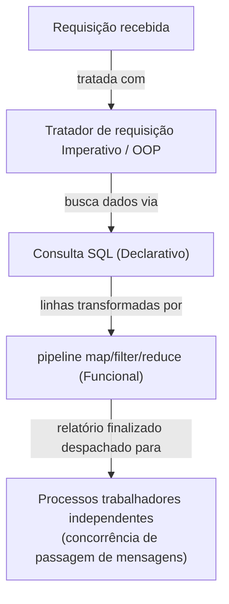

## Objetivos de Aprendizagem

- Resumir, em uma frase cada, a ideia central de todos os seis paradigmas cobertos nesta disciplina: imperativo, orientado a objetos, funcional, lógico, concorrente, e declarativo.
- Combinar a descrição de um problema realista com o paradigma (ou paradigmas) que se encaixa mais naturalmente, e explicar por quê.
- Ler uma tabela de comparação através de todos os seis paradigmas e usá-la como um auxílio de decisão genuíno, não só uma revisão.
- Explicar, com exemplos concretos, por que linguagens reais e sistemas reais tipicamente misturam paradigmas em vez de se comprometer com exatamente um.
- Dado um enunciado de problema não familiar, articular qual paradigma você buscaria primeiro e o que sobre a forma do problema justifica aquela escolha.

## Contexto e Motivação

Esta disciplina construiu, um conceito de cada vez, seis formas genuinamente diferentes de pensar sobre "como eu digo a um computador o que fazer": a sequência de passos que mudam estado da programação imperativa, o agrupamento de estado e comportamento em objetos interagindo da programação orientada a objetos, as funções puras e dados imutáveis transformados através de composição e recursão da programação funcional, os fatos e regras resolvidos por unificação da programação lógica, os dois modelos para múltiplas coisas acontecendo ao mesmo tempo da programação concorrente, e a descrição de um resultado com o como deixado para o sistema da programação declarativa. Cada um foi apresentado e motivado em seus próprios termos, com seus próprios exemplos resolvidos, seu próprio vocabulário, seus próprios erros comuns. O que ainda não foi perguntado, diretamente, é a pergunta prática para a qual cada um desses conceitos estava de fato construindo: dado um problema real, para qual deles você recorre?

Esta não é uma pergunta puramente acadêmica. É a pergunta que um programador em atividade responde, frequentemente sem articulá-la por completo, dezenas de vezes: esse modelo de dado deveria ser um conjunto de classes, ou um punhado de funções puras sobre registros simples? Esse pipeline de dados de múltiplos passos deveria ser escrito como um laço com acumuladores mutáveis, ou como uma cadeia de chamadas `map`/`filter`/`reduce`? Esse problema de "encontre todas as coisas relacionadas a X" deveria ser tratado com laços aninhados, ou tem cheiro de uma consulta, seja SQL literal contra um banco de dados, ou uma pequena busca em memória mais próxima em espírito de programação lógica? Essas tarefas de segundo plano independentes deveriam compartilhar uma estrutura de dados protegida por contabilidade cuidadosa, ou seriam mais simples e seguras como tarefas isoladas que só trocam mensagens? Nenhuma dessas perguntas tem uma resposta universalmente correta; cada uma depende da *forma* do problema específico à sua frente, o que é exatamente em torno do que este conceito está organizado.

O ponto honesto, de encerramento, desta disciplina inteira, e a razão pela qual este conceito existe como um capstone em vez de só um resumo, é que quase nenhum sistema real se compromete com exatamente um paradigma. Python, a linguagem usada ao longo da maioria dos exemplos resolvidos desta disciplina, suporta laços imperativos, classes orientadas a objetos, e funções de ordem superior e compreensões funcionais, frequentemente dentro do mesmo arquivo, escolhidos linha por linha com base no que se encaixa melhor localmente. Uma aplicação web típica consulta um banco de dados SQL *declarativamente* enquanto a lógica da aplicação em torno daquela consulta é escrita *imperativamente* ou em um estilo *orientado a objetos*, e pode terceirizar trabalho de segundo plano usando concorrência de *passagem de mensagens* entre processos trabalhadores. Reconhecer qual paradigma se encaixa em qual pedaço de um problema maior, e estar confortável com o fato de que pedaços diferentes do mesmo sistema podem, e geralmente deveriam, usar paradigmas diferentes, é a habilidade real, durável, para a qual essa disciplina inteira estava construindo.

## Teoria Central

### A tabela de comparação

A tabela abaixo é a síntese genuína em torno da qual este capstone é construído: a ideia central de cada paradigma em uma frase, e as formas de problema realistas que se encaixa mais naturalmente.

| Paradigma | Ideia central em uma frase | Tipos de problema que se encaixa naturalmente |
|---|---|---|
| **Imperativo** | Uma sequência de passos explícitos que mudam estado conforme executam | Você precisa de controle direto, granular sobre exatamente o que acontece e em que ordem (ex: um laço interno crítico de desempenho, um script simples que muta uma pequena quantidade de estado diretamente) |
| **Orientado a Objetos** | Agrupe estado e comportamento juntos em objetos interagindo, organizados por hierarquias de classe | Você precisa modelar um domínio complexo com muitos tipos de entidade relacionados que compartilham comportamento e estrutura (ex: uma simulação com muitos tipos de entidades de jogo interagindo, os widgets de um toolkit de GUI) |
| **Funcional** | Construa resultados compondo funções puras sobre dados imutáveis, com recursão como a ferramenta primária de repetição | Você está transformando dados através de um pipeline de passos independentes, e quer que cada passo seja fácil de testar e raciocinar isoladamente (ex: um pipeline de limpeza de dados, a sequência de transformações de AST de um compilador) |
| **Lógico** | Descreva fatos e regras; faça uma consulta e deixe unificação buscar uma resposta | Você está consultando relacionamentos em uma base de conhecimento, ou explorando um espaço de busca definido por restrições em vez de um procedimento fixo (ex: um pequeno motor de regras, satisfação de restrições, raciocínio simbólico) |
| **Concorrente (passagem de mensagens)** | Tarefas independentes com estado privado, coordenando só através de mensagens explícitas | Você precisa de muitas tarefas independentes fazendo progresso ao mesmo tempo com estado compartilhado mínimo, e quer evitar condições de corrida por construção (ex: processos trabalhadores independentes, uma simulação baseada em atores, tarefas de segundo plano isoladas) |
| **Declarativo** | Descreva o resultado que você quer; deixe o sistema decidir como produzi-lo | Você está descrevendo uma consulta contra dados estruturados, ou especificando um resultado desejado onde a estratégia de execução é problema de outra pessoa otimizar (ex: uma consulta SQL contra um banco de dados relacional, a descrição de dependências de um sistema de build) |

### Lendo a tabela como um auxílio de decisão, não só uma revisão

A tabela só é útil se você a usar da forma que um programador em atividade usaria: comece a partir da *forma* do problema, não de um paradigma que você já gosta. Um problema que envolve "muitos tipos de entidade relacionados com comportamento compartilhado" (digamos, uma frota de veículos, cada um um subtipo diferente, todos precisando de um comportamento `move()` com variações específicas por tipo) aponta para programação orientada a objetos porque herança e polimorfismo modelam diretamente "comportamento compartilhado, variação por tipo", não porque programação orientada a objetos é um padrão a se buscar independentemente do problema. Um problema que é fundamentalmente "pegue este dado e transforme-o, em estágios, sem precisar rastrear um estado corrente mutável" (analisar um arquivo, depois filtrar, depois agregar) aponta para a composição de funções puras da programação funcional, porque cada estágio pode ser entendido, testado, e trocado independentemente, sem nenhum estado mutável compartilhado escondido conectando-os. A segunda coluna da tabela existe para ser interrogada contra o enunciado de problema real à sua frente, não memorizada como uma lista abstrata.

### Múltiplos paradigmas, um problema

Muitos problemas não triviais não mapeiam para uma única linha de forma limpa, eles se decompõem em pedaços que cada um mapeia para uma linha *diferente*. Considere um pequeno serviço web: ele recebe requisições (naturalmente tratadas com código de tratamento de requisição imperativo ou orientado a objetos direto), busca dados com uma consulta SQL (declarativo), calcula um relatório derivado transformando as linhas da consulta através de uma cadeia de funções puras (funcional), e despacha emails de notificação independentes para vários processos trabalhadores de segundo plano que só se comunicam passando adiante o relatório finalizado (concorrência de passagem de mensagens). Nenhum paradigma nesta disciplina está "errado" para este sistema, cada pedaço dele está sendo tratado por qualquer paradigma que se encaixe na forma daquele pedaço, e o sistema como um todo é melhor por isso, não pior.

### Por que isso importa: paradigma como ferramenta, não identidade

Nenhum dos seis paradigmas nesta disciplina é "o melhor" em qualquer sentido absoluto, e tratar um como uma identidade permanente ("eu sou um programador funcional" como uma postura fixa, em vez de uma descrição da ferramenta sendo usada para um dado pedaço de código agora) tende a produzir soluções piores do que tratar cada paradigma como uma ferramenta entre várias, escolhida porque se encaixa no problema em questão. A habilidade prática que este capstone está pedindo para você construir é exatamente essa: dada a forma real de um problema, seus dados, sua necessidade de estado compartilhado ou isolamento, se é melhor expressado como um procedimento ou como uma descrição de um resultado, escolha o paradigma (ou combinação de paradigmas) que aquela forma exige, e esteja igualmente confortável recorrendo a qualquer um dos seis.

## Exemplos Resolvidos

### Exemplo 1 — combinando formas de problema com paradigmas

**Problema.** Para cada cenário abaixo, identifique o paradigma que se encaixa mais naturalmente, e justifique a escolha usando a forma do problema.

1. *"Modele o organograma de uma empresa, onde todo funcionário é um dentre vários tipos (Manager, Engineer, Intern), cada um compartilhando comportamento comum (`get_salary()`) mas sobrescrevendo-o de forma diferente."*
   **Encaixe: Orientado a objetos.** Muitos tipos de entidade relacionados, compartilhando estrutura e comportamento através de uma hierarquia, com variação por tipo, a forma de livro-texto para classes, herança, e polimorfismo.

2. *"Dada uma lista de linhas de log cruas, remova espaços em branco, analise cada uma em um registro estruturado, filtre as malformadas, e conte ocorrências por código de erro."*
   **Encaixe: Funcional.** Um pipeline de estágios de transformação independentes (remover, analisar, filtrar, contar) sobre dados imutáveis, cada um facilmente expresso e testado como uma função pura composta com o próximo, sem necessidade de um estado mutável corrente entrelaçado por todo o processo.

3. *"Dado um banco de dados de relacionamentos funcionário-gerente, encontre todo funcionário dois ou mais níveis abaixo de um dado executivo."*
   **Encaixe: Lógico (ou sua prima declarativa, SQL, se o dado já está em um banco de dados relacional).** Esta é uma consulta de relacionamento sobre uma pequena base de conhecimento, exatamente a forma que uma regra estilo Prolog (`reports_transitively(X, Z) :- reports_to(X, Y), (reports_to(Y, Z) ; reports_transitively(Y, Z))`) ou uma consulta SQL recursiva é construída para responder, deixando a busca do motor ou o planejador de consultas fazer a travessia em vez de escrever à mão a caminhada do grafo.

4. *"Rode três tarefas independentes de validação de dados que não devem interferir umas nas outras, e combine seus resultados de sucesso/falha no final."*
   **Encaixe: Concorrente, passagem de mensagens.** Tarefas independentes sem necessidade de compartilhar estado, coordenando só entregando um resultado final, exatamente a forma que evita condições de corrida por construção, já que nada é compartilhado sobre o que competir.

5. *"Recupere todo pedido feito nos últimos 30 dias por clientes em uma dada região."*
   **Encaixe: Declarativo (SQL).** Uma descrição das linhas desejadas (`SELECT * FROM orders WHERE date > ... AND region = ...`), com a estratégia de varredura, uso de índice, e plano de execução deixados inteiramente para o motor de banco de dados.

### Exemplo 2 — decompondo um problema maior através de múltiplos paradigmas

**Problema.** Desenhe, em alto nível, um sistema que ingere um lote de tickets de suporte ao cliente, marca cada um com uma categoria, e envia por email um resumo diário para a equipe certa, identifique qual paradigma trata cada pedaço.

**Decomposição.**
- Ler tickets de um banco de dados (`SELECT * FROM tickets WHERE created_at > yesterday`), **declarativo** (SQL); a consulta enuncia quais linhas são desejadas, não como o motor as recupera.
- Marcar cada ticket com uma categoria rodando-o através de uma cadeia de funções puras de classificação (normalizar texto, extrair palavras-chave, mapear palavras-chave para uma categoria), **funcional**; cada estágio é uma transformação pura, fácil de testar independentemente, composta em um pipeline.
- Modelar "Ticket," "Team," e "Digest" como entidades relacionadas, cada uma com seus próprios dados e comportamento (um objeto `Ticket` conhecendo sua própria categoria, um objeto `Team` conhecendo quais categorias possui), **orientado a objetos**; vários tipos de entidade relacionados com comportamento compartilhado e por tipo.
- Enviar os resumos finalizados para os sistemas de email de várias equipes como tarefas de segundo plano independentes, para que um envio lento ou falho para uma equipe não bloqueie os outros, **concorrente, passagem de mensagens**; tarefas independentes, coordenando só entregando uma mensagem de resumo finalizado, sem estado compartilhado entre elas para corromper.

**Raciocínio.** Nenhum paradigma único foi "a" resposta para este sistema, cada pedaço foi tratado por qualquer paradigma cuja forma correspondesse à natureza própria daquele pedaço. Isso não é um compromisso ou uma falha em se decidir; é a forma normal, saudável, pela qual sistemas reais não triviais são construídos, e reconhecer isso é o ponto real deste capstone.

### Exemplo 3 — um problema que parece precisar de um paradigma, mas não precisa

**Problema.** "Eu preciso processar uma lista enorme de números com um laço que muta um total corrente, isso não significa que o programa inteiro tem que ser imperativo?"

**Raciocínio.** Não, o *passo específico* de acumular um total corrente sobre uma lista enorme é naturalmente expresso tanto imperativamente (`total = 0; for n in numbers: total += n`) quanto funcionalmente (`total = functools.reduce(lambda acc, n: acc + n, numbers, 0)`, ou simplesmente `sum(numbers)`), e escolher entre eles é uma decisão local sobre aquele único passo, não um compromisso vinculando o programa inteiro ao redor. O programa maior dentro do qual este passo vive pode ser completamente orientado a objetos em como organiza seus dados, pode ler sua entrada declarativamente de um banco de dados, e pode rodar várias dessas acumulações concorrentemente através de trabalhadores independentes. Um laço de aparência imperativa, ou um `reduce` de aparência funcional, não força tudo ao redor para o mesmo paradigma, esta é exatamente a ideia de "paradigma como uma ferramenta para o pedaço em questão, não uma identidade para o programa inteiro" da Teoria Central.

## Equívocos Comuns e Armadilhas

- **"Um programa bem desenhado escolhe um paradigma e o usa consistentemente ao longo de tudo."** Como o Exemplo 2 e o passo a passo do serviço web da Teoria Central mostram, sistemas reais tipicamente se decompõem em pedaços com formas genuinamente diferentes, e os designs mais fortes deixam cada pedaço usar o paradigma que se encaixa nele, um sistema que força um paradigma sobre todo pedaço independentemente do encaixe geralmente produz código estranho em algum lugar, não código mais consistente.
- **"Aprender seis paradigmas significa que agora eu tenho que decidir, de uma vez, qual eu 'sou'."** Tratar um paradigma como uma identidade pessoal, em vez de uma ferramenta selecionada por problema (ou por pedaço de um problema), é precisamente a mentalidade contra a qual a Teoria Central alerta. A habilidade prática é fluência através dos seis, aplicada situacionalmente.
- **"Programação declarativa e lógica são basicamente obsoletas comparadas a OOP e funcional, então as linhas da tabela não valem igualmente a pena aprender."** Elas não são igualmente *estruturais* em currículos e bases de código modernas, esta disciplina tem sido honesta sobre isso, especialmente para o status eletivo de programação lógica, mas "não igualmente central" é diferente de "não vale a pena conhecer." SQL sozinho (completamente declarativo) é indiscutivelmente a interface de consulta mais usada em todo o software, e reconhecer um problema em forma de consulta pelo que é continua sendo uma habilidade genuinamente prática.
- **"Se um problema não mapeia de forma limpa para exatamente uma linha da tabela, a tabela está errada ou o problema é incomum."** A maioria dos problemas reais não triviais se decompõe em várias linhas ao mesmo tempo, como o Exemplo 2 mostra, a tabela não pretende forçar um rótulo por problema; pretende ajudar você a rotular corretamente cada *pedaço*.
- **"Concorrência (passagem de mensagens) só é relevante para sistemas distribuídos em larga escala, não programação do dia a dia."** A orientação de tipo de problema na tabela, "muitas tarefas independentes coordenando com estado compartilhado mínimo", aparece em escalas muito menores também: tarefas de validação independentes, tarefas de segundo plano independentes em uma única aplicação, em qualquer lugar onde isolamento é mais valioso que acesso compartilhado, rápido.

## Resumo

Seis paradigmas, seis ideias centrais diferentes: imperativo (passos sequenciais, que mudam estado), orientado a objetos (estado e comportamento agrupados, modelados através de classes e hierarquias), funcional (funções puras e dados imutáveis, compostos e recursados), lógico (fatos e regras, resolvidos por unificação), concorrente (estado compartilhado ou passagem de mensagens, duas respostas diferentes a "múltiplas coisas ao mesmo tempo"), e declarativo (descreva o resultado, deixe o como para o sistema). A tabela de comparação na Teoria Central existe para ser usada como um auxílio de decisão genuíno: comece a partir da forma real de um problema, muitos tipos de entidade relacionados, um pipeline de estágios independentes, uma consulta de relacionamento, tarefas independentes precisando de isolamento, uma descrição de um resultado desejado, e deixe aquela forma apontar para o paradigma (ou, muito frequentemente, paradigmas) que se encaixa nela. O ponto de encerramento, honesto, desta disciplina inteira é que quase nenhum sistema real se compromete com exatamente um paradigma: programas Python misturam livremente estilo imperativo, orientado a objetos, e funcional; uma aplicação típica consulta um banco de dados declarativamente enquanto sua própria lógica roda imperativamente ou em um estilo orientado a objetos, despachando trabalho de segundo plano com concorrência de passagem de mensagens. A habilidade durável nunca foi "escolha um paradigma", foi aprender a reconhecer qual paradigma um dado pedaço de um problema está de fato pedindo, e estar igualmente confortável recorrendo a qualquer um dos seis.

## Documentation Links

- [University of Washington / Coursera — Programming Languages, Part A (Grossman)](https://www.coursera.org/learn/programming-languages) — doc
- [ACM/IEEE CS2013 — Programming Languages Knowledge Area](https://csed.acm.org/knowledge-areas-programming-languages-pl-cs2013-version/) — doc
