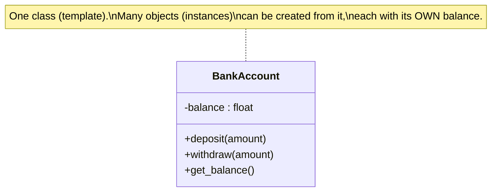
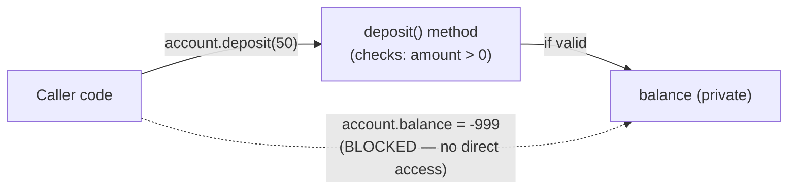

## Learning Objectives

- Define a class as a bundling of data (attributes) and the operations on that data (methods) into a single unit, and an object as one concrete instance of a class.
- Explain encapsulation as the mechanism that hides an object's internal data behind its methods, and state precisely what it prevents (uncontrolled external access that could violate an invariant).
- Connect a class's public methods and hidden data directly to the ADT notion of "interface separate from implementation," identifying which language construct plays which role.
- Design a small class that enforces an invariant a caller could otherwise violate by manipulating the data directly, and demonstrate the enforcement with concrete calls.

## Context & Motivation

An earlier concept in this curriculum, the Abstract Data Type, established a split that turned out to matter enormously: a set of operations and the behavioral contract governing them (the "what") kept deliberately separate from any particular in-memory realization of those operations (the "how"). That earlier treatment was, quite deliberately, informal about mechanism — a Stack ADT was "a set of operations plus a contract," and its Python implementations were ordinary classes used mostly as a convenient way to group some functions and a list together, without much comment on why a `class` was the vehicle chosen for the job, or what the language was actually doing for you by letting you write it that way. This concept picks up exactly that thread and formalizes it: a **class**, as a genuine language-level construct, is nothing more or less than the ADT's interface/implementation split given real syntax, an enforcement mechanism, and a name — **encapsulation**.

This is the first place in this entire computer science curriculum where object-oriented programming appears. A deliberate decision was made earlier in this curriculum's foundations to exclude OOP from the general treatment of programming and computational thinking, precisely so it could be introduced here, properly, as one paradigm among the several this discipline surveys, rather than folded in early as if it were simply "how you organize code." That earlier deferral is the reason this material carries real weight: nothing before this point in the curriculum has formally covered what a class is, what an object is, or what encapsulation actually buys you, so this concept — and the two that follow it, inheritance and polymorphism — are genuinely new territory, not a review of something briefly touched on before.

The motivation for bundling data and operations together, rather than leaving them as separate, loosely associated pieces, is precisely the same motivation the ADT concept already built: interchangeability, and — the piece that concept left mostly implicit — enforceability. A Bag ADT's `add` and `contains` operations could, in that earlier treatment, be implemented as either an unsorted or sorted list, and a caller manipulating only those two operations could never tell which one it was holding, nor could it accidentally break either implementation, because the ADT's operations were the *only* sanctioned way to interact with the data. But that earlier treatment never precisely specified what stops a caller from reaching past the operations and mutating the underlying list directly — in a language without a real class construct, nothing does. A class, formalized properly with private data and public methods, is what actually closes that gap: it gives the "interface versus implementation" split a hard boundary, enforced by the language itself, not merely by a polite convention that callers are trusted to respect. This is exactly the depth this concept adds on top of the ADT idea it builds from — a real mechanism, with real syntax, for a distinction that was, until now, more of a design discipline than an enforceable rule.

Per the comparative, Programming-Languages-course framing this whole discipline follows (not a language-specific OOP deep-dive — this platform has a separate, dedicated track for that), the goal here is a solid, working command of classes, objects, and encapsulation as one paradigm's founding move, with real code you could actually run — not an exhaustive catalog of every access-control keyword or edge case a particular language offers.

## Core Theory

### Classes and objects: a template and its instances

A **class** is a definition — a template — specifying two things bundled together: **attributes** (the pieces of data an object of this class will hold) and **methods** (the operations that act on that data). An **object** (or **instance**) is one concrete thing built from that template, with its own actual values stored in its attributes. The relationship is the same as the relationship between a blueprint and a building: the blueprint (class) specifies "a building has rooms, doors, a foundation" once; each actual building (object) constructed from it has its own specific rooms with its own specific furniture, independent of every other building built from the same blueprint. Creating an object from a class is called **instantiation**, and a program can instantiate the same class many times, producing many independent objects, each with its own copy of the attributes the class defines, all sharing the same methods.



### The data-plus-operations bundle, and why it is the paradigm's founding move

Before classes, in a purely imperative style, data (say, a dictionary holding an account's balance) and the functions that act on it (a `deposit` function, a `withdraw` function) exist as two separate, only loosely associated things — nothing in the language stops a caller from ignoring the functions entirely and mutating the dictionary directly. A class changes this by making the operations a *permanent, attached part* of the same unit that holds the data: a method is defined *inside* the class, and every object created from that class carries both its own data and access to those same shared methods together, as one inseparable package. This bundling — data plus the operations on that data, as a single unit — is object-oriented programming's founding, defining move, and everything else in the paradigm (encapsulation, inheritance, polymorphism) builds on top of this one bundling decision.

### Encapsulation: hiding data behind an enforced boundary

**Encapsulation** is the practice — and, with the right language support, the *enforced* rule — that an object's internal data should be accessed and modified only through its own methods, never manipulated directly from outside. Concretely, this usually means marking an attribute as **private** (by convention or by real access control, depending on the language) so that external code cannot read or write it directly, and instead must go through public methods that the class itself provides. The payoff is exactly the payoff the ADT concept flagged but did not yet have a mechanism for: a method can check conditions — an **invariant**, a rule that must always hold true about the object's data — before allowing a change to happen, and refuse the change if it would break that rule. Direct access to the raw data has no such checkpoint; a method call does, because the method's code runs on every single attempt to change the data, with no way around it.



### Connecting back to the ADT: which piece plays which role

Mapped directly onto the ADT vocabulary already established: a class's set of public methods is the ADT's **operations**; the rules those methods enforce (an invariant that must hold before and after every call) are the ADT's **behavioral contract**; and the class's private attributes, together with the actual code inside its methods, are the **implementation** — the concrete, in-memory realization of the contract, exactly as an array-backed or linked-list-backed stack was a concrete realization of the Stack ADT's contract. What a class adds that the earlier, informal ADT treatment did not have is a language-enforced wall between the two: a caller of a well-encapsulated class genuinely *cannot* reach the implementation, whereas a caller of an ADT described only informally (as in the earlier concept's examples, all plain attributes with no enforced privacy) was merely *asked, by convention,* not to.

## Worked Examples

### Example 1 — a `BankAccount` class enforcing a real invariant

**Problem:** Model a bank account with a balance that must never go negative. Show concretely why encapsulation, not just documentation, is what makes this invariant hold.

```python
class BankAccount:
    def __init__(self, opening_balance=0):
        if opening_balance < 0:
            raise ValueError("opening balance cannot be negative")
        self._balance = opening_balance   # "private" by convention: the leading underscore

    def deposit(self, amount):
        if amount <= 0:
            raise ValueError("deposit amount must be positive")
        self._balance = self._balance + amount

    def withdraw(self, amount):
        if amount <= 0:
            raise ValueError("withdraw amount must be positive")
        if amount > self._balance:
            raise ValueError("insufficient funds")   # the invariant check
        self._balance = self._balance - amount

    def get_balance(self):
        return self._balance
```

**Using it.**

```python
acc = BankAccount(100)
acc.deposit(50)          # balance: 150
acc.withdraw(30)          # balance: 120
acc.withdraw(9999)        # raises ValueError: insufficient funds — balance stays 120
```

**Reasoning.** The invariant — "balance never goes negative" — lives entirely inside `withdraw`'s check `if amount > self._balance`. Every single path by which `_balance` can change (there is exactly one method that decreases it, `withdraw`, and exactly one that increases it, `deposit`) passes through code that can refuse the change. Now consider what would happen without encapsulation, with `balance` as an ordinary, directly-accessible attribute and no methods at all: any caller could simply write `acc.balance = acc.balance - 9999`, and the "account" would silently go to −9879, with nothing in the program ever having checked whether that was allowed. The invariant was never actually a property of the data — a bare number can be anything — it is a property of the *code path* the data is forced through, and encapsulation is precisely the mechanism that forces every change through that path. Note also that `__init__` (the method that runs when a new `BankAccount` object is instantiated) enforces the same invariant at creation time, so it holds from the very first moment the object exists.

### Example 2 — comparing an encapsulated class to the unenforced version

**Problem:** Rewrite `BankAccount` without encapsulation — a plain data holder with the balance directly exposed — and show a concrete case where the invariant breaks.

```python
class UnprotectedAccount:
    def __init__(self, opening_balance=0):
        self.balance = opening_balance   # public — directly accessible from outside
```

```python
acc = UnprotectedAccount(100)
acc.balance = acc.balance - 9999   # nothing stops this
print(acc.balance)                  # -9899 — the invariant is broken
```

**Reasoning.** `UnprotectedAccount` is still, technically, "a class" in the bare sense of Core Theory (it bundles a name, `balance`, with an object) — but it does no enforcement whatsoever, because there is no method standing between a caller and the data; the caller writes directly to `balance` and the class has no opportunity to object. This is the direct, concrete demonstration of why encapsulation is doing real work, not merely providing tidier syntax: `BankAccount` and `UnprotectedAccount` hold the identical piece of data (a number), but only one of them can guarantee, as a matter of provable fact about the code, that the number never goes negative. The other can only ask, by convention or comment, that callers behave.

### Example 3 — a second small class to generalize the pattern: `Rectangle` with a derived, always-consistent attribute

**Problem:** Model a rectangle by its width and height, with an `area` accessible to callers, but never storable as a raw number a caller could set inconsistently with the actual width and height.

```python
class Rectangle:
    def __init__(self, width, height):
        if width <= 0 or height <= 0:
            raise ValueError("width and height must be positive")
        self._width = width
        self._height = height

    def area(self):
        return self._width * self._height   # always computed fresh — never stale

    def resize(self, width, height):
        if width <= 0 or height <= 0:
            raise ValueError("width and height must be positive")
        self._width = width
        self._height = height
```

**Reasoning.** If `area` were instead stored as a plain attribute set once at construction time, resizing the rectangle later would require the caller to remember to update `area` too — and nothing would stop a caller from updating `width` and forgetting `area`, leaving the object internally inconsistent (a rectangle claiming an area that no longer matches its own width times height). By making `area` a method that recomputes the value from the private `_width` and `_height` every time it is called, the class guarantees the returned value is always correct relative to the object's actual current state, with no possibility of the two drifting out of sync — another concrete instance of encapsulation enforcing a rule ("area must always equal width times height") that plain, directly-settable data could not guarantee on its own.

## Common Misconceptions & Pitfalls

- **"A class is just a way to group some data and functions together for organization — like a folder."** Grouping is a side effect, not the point. As Example 2 shows, a "class" with fully public data groups things together but enforces nothing; the actual payoff of object-oriented programming's founding move is the *enforcement* encapsulation adds, not the mere organizational convenience.
- **"Encapsulation means the data is technically hidden somewhere I can't see it."** In many languages, "private" is a convention or a soft restriction (as with Python's leading-underscore convention above), not an impenetrable vault — a determined caller can often still reach in. The real, load-bearing point of encapsulation is not secrecy for its own sake; it's that *well-behaved* callers, using the class as intended through its public methods, get their invariants enforced automatically, every time, without having to remember to check anything themselves.
- **"A class and an object are the same thing — people use the words interchangeably."** A class is the one-time template (`BankAccount`, defined once); an object is a specific instance built from it (a specific customer's specific account, with its own specific balance). Two different objects created from the same class have completely independent data — depositing into one account's balance never touches another account's balance — even though both share the exact same method code, defined only once in the class.
- **"Since `BankAccount` builds directly on the ADT concept, a class IS an ADT — there's no real difference."** A class is one particular, concrete, language-level mechanism for realizing the ADT idea — a real, enforceable one, with syntax and a compiler or interpreter backing it up — but the ADT concept itself is more general than any one mechanism; the earlier concept's point stands independently of classes existing at all (its examples used plain Python classes only as a convenient container, without discussing enforcement). This concept's contribution is showing precisely how a class formalizes that split with a real boundary, not claiming the two ideas were secretly identical all along.

## Summary

A class bundles data (attributes) and the operations on that data (methods) into a single, reusable template; an object is one concrete instance built from that template, with its own independent copy of the attributes. This bundling is the object-oriented paradigm's founding move, and it directly formalizes the ADT's interface/implementation split already established earlier in this curriculum: a class's public methods play the role of the ADT's operations, the rules those methods enforce play the role of its behavioral contract, and the private data plus method bodies play the role of the concrete implementation. What a class adds that an informally-described ADT did not yet have is **encapsulation** — a real, language-enforced boundary that routes every change to an object's data through its methods, making it possible to enforce an **invariant** (as `BankAccount.withdraw` enforced "balance never goes negative") as a guaranteed property of the code, not merely a convention callers are trusted to respect. The next concept, inheritance, builds on this same class mechanism to let one class extend and reuse another's behavior.

## Documentation Links

- [University of Washington / Coursera — Programming Languages, Part A (Grossman)](https://www.coursera.org/learn/programming-languages) — doc
- [ACM/IEEE CS2013 — Programming Languages Knowledge Area](https://csed.acm.org/knowledge-areas-programming-languages-pl-cs2013-version/) — doc
