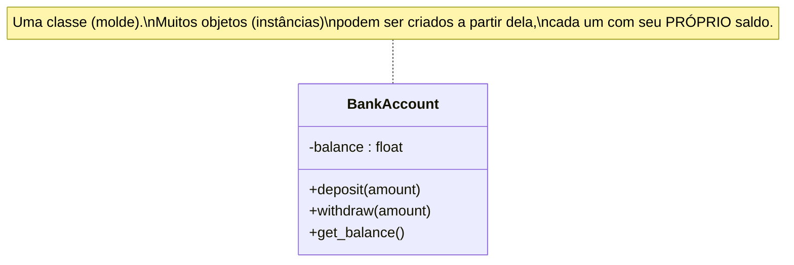
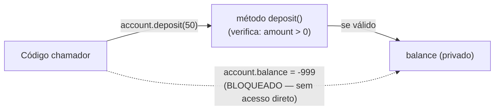

## Objetivos de Aprendizagem

- Definir uma classe como um empacotamento de dados (atributos) e as operações sobre esses dados (métodos) em uma única unidade, e um objeto como uma instância concreta de uma classe.
- Explicar encapsulamento como o mecanismo que esconde os dados internos de um objeto atrás de seus métodos, e enunciar precisamente o que previne (acesso externo descontrolado que poderia violar um invariante).
- Conectar os métodos públicos e dados escondidos de uma classe diretamente à noção de TAD de "interface separada de implementação," identificando qual construção de linguagem desempenha qual papel.
- Projetar uma pequena classe que aplica um invariante que um chamador de outra forma poderia violar manipulando os dados diretamente, e demonstrar a aplicação com chamadas concretas.

## Contexto e Motivação

Um conceito anterior neste currículo, o Tipo de Dado Abstrato, estabeleceu uma divisão que acabou importando enormemente: um conjunto de operações e o contrato comportamental que as governa (o "o quê") mantido deliberadamente separado de qualquer realização particular em memória dessas operações (o "como"). Aquele tratamento anterior foi, bastante deliberadamente, informal sobre mecanismo, um TAD Pilha era "um conjunto de operações mais um contrato," e suas implementações Python eram classes comuns usadas principalmente como uma forma conveniente de agrupar algumas funções e uma lista juntas, sem muito comentário sobre por que uma `class` era o veículo escolhido para o trabalho, ou o que a linguagem estava de fato fazendo por você ao deixá-lo escrever daquela forma. Este conceito retoma exatamente esse fio e o formaliza: uma **classe**, como uma construção genuína no nível de linguagem, não é nada mais nem menos que a divisão interface/implementação do TAD com sintaxe real, um mecanismo de aplicação, e um nome, **encapsulamento**.

Este é o primeiro lugar em todo este currículo de ciência da computação onde programação orientada a objetos aparece. Uma decisão deliberada foi tomada anteriormente nos fundamentos deste currículo de excluir POO do tratamento geral de programação e pensamento computacional, precisamente para que pudesse ser introduzida aqui, propriamente, como um paradigma entre os vários que esta disciplina pesquisa, em vez de dobrada cedo como se fosse simplesmente "como você organiza código." Aquele adiamento anterior é a razão pela qual este material carrega peso real: nada antes deste ponto no currículo cobriu formalmente o que é uma classe, o que é um objeto, ou o que encapsulamento de fato compra, então este conceito, e os dois que o seguem, herança e polimorfismo, são território genuinamente novo, não uma revisão de algo brevemente tocado antes.

A motivação para empacotar dados e operações juntos, em vez de deixá-los como peças separadas, frouxamente associadas, é precisamente a mesma motivação que o conceito de TAD já construiu: intercambiabilidade, e, a peça que aquele conceito deixou majoritariamente implícita, aplicabilidade. As operações `add` e `contains` de um TAD Bag podiam, naquele tratamento anterior, ser implementadas ou como uma lista não ordenada ou ordenada, e um chamador manipulando só essas duas operações jamais poderia dizer qual estava mantendo, nem poderia acidentalmente quebrar nenhuma implementação, porque as operações do TAD eram a *única* forma sancionada de interagir com os dados. Mas aquele tratamento anterior nunca especificou precisamente o que impede um chamador de alcançar além das operações e mutar a lista subjacente diretamente, em uma linguagem sem uma construção de classe real, nada impede. Uma classe, formalizada propriamente com dados privados e métodos públicos, é o que de fato fecha essa lacuna: dá à divisão "interface versus implementação" uma fronteira rígida, aplicada pela própria linguagem, não meramente por uma convenção educada que chamadores são confiados a respeitar. Essa é exatamente a profundidade que este conceito adiciona em cima da ideia de TAD da qual se constrói, um mecanismo real, com sintaxe real, para uma distinção que era, até agora, mais uma disciplina de design do que uma regra aplicável.

Conforme o enquadramento comparativo, de curso de Linguagens de Programação, que a disciplina inteira segue (não um mergulho profundo em POO específico de linguagem, esta plataforma tem uma trilha separada, dedicada, para isso), o objetivo aqui é um comando sólido, funcional de classes, objetos, e encapsulamento como o movimento fundador de um paradigma, com código real que você poderia de fato rodar, não um catálogo exaustivo de toda palavra-chave de controle de acesso ou caso de borda que uma linguagem particular oferece.

## Teoria Central

### Classes e objetos: um molde e suas instâncias

Uma **classe** é uma definição, um molde, especificando duas coisas empacotadas juntas: **atributos** (os pedaços de dado que um objeto desta classe manterá) e **métodos** (as operações que agem sobre aqueles dados). Um **objeto** (ou **instância**) é uma coisa concreta construída a partir daquele molde, com seus próprios valores reais armazenados em seus atributos. A relação é a mesma que a relação entre uma planta baixa e um edifício: a planta baixa (classe) especifica "um edifício tem quartos, portas, uma fundação" uma vez; todo edifício real (objeto) construído a partir dela tem seus próprios quartos específicos com sua própria mobília específica, independente de todo outro edifício construído a partir da mesma planta baixa. Criar um objeto a partir de uma classe é chamado **instanciação**, e um programa pode instanciar a mesma classe muitas vezes, produzindo muitos objetos independentes, cada um com sua própria cópia dos atributos que a classe define, todos compartilhando os mesmos métodos.



### O empacotamento de dados-mais-operações, e por que é o movimento fundador do paradigma

Antes de classes, em um estilo puramente imperativo, dados (digamos, um dicionário mantendo o saldo de uma conta) e as funções que agem sobre ele (uma função `deposit`, uma função `withdraw`) existem como duas coisas separadas, só frouxamente associadas, nada na linguagem impede um chamador de ignorar as funções completamente e mutar o dicionário diretamente. Uma classe muda isso tornando as operações uma parte *permanente, anexada* da mesma unidade que mantém os dados: um método é definido *dentro* da classe, e todo objeto criado a partir daquela classe carrega tanto seus próprios dados quanto acesso àqueles mesmos métodos compartilhados juntos, como um pacote inseparável único. Esse empacotamento, dados mais as operações sobre esses dados, como uma única unidade, é o movimento fundador, definidor, da programação orientada a objetos, e tudo mais no paradigma (encapsulamento, herança, polimorfismo) se constrói em cima dessa única decisão de empacotamento.

### Encapsulamento: escondendo dados atrás de uma fronteira aplicada

**Encapsulamento** é a prática, e, com o suporte de linguagem certo, a regra *aplicada*, de que os dados internos de um objeto deveriam ser acessados e modificados só através de seus próprios métodos, nunca manipulados diretamente de fora. Concretamente, isso geralmente significa marcar um atributo como **privado** (por convenção ou por controle de acesso real, dependendo da linguagem) para que código externo não possa lê-lo ou escrevê-lo diretamente, e em vez disso deve passar por métodos públicos que a própria classe fornece. O ganho é exatamente o ganho que o conceito de TAD sinalizou mas ainda não tinha um mecanismo para: um método pode verificar condições, um **invariante**, uma regra que deve sempre valer sobre os dados do objeto, antes de permitir que uma mudança aconteça, e recusar a mudança se quebrasse aquela regra. Acesso direto aos dados brutos não tem tal ponto de verificação; uma chamada de método tem, porque o código do método roda em toda única tentativa de mudar os dados, sem forma de contornar.



### Conectando de volta ao TAD: qual peça desempenha qual papel

Mapeado diretamente no vocabulário de TAD já estabelecido: o conjunto de métodos públicos de uma classe são as **operações** do TAD; as regras que aqueles métodos aplicam (um invariante que deve valer antes e depois de toda chamada) são o **contrato comportamental** do TAD; e os atributos privados da classe, junto com o código real dentro de seus métodos, são a **implementação**, a realização concreta, em memória, do contrato, exatamente como uma pilha apoiada em array ou em lista ligada era uma realização concreta do contrato do TAD Pilha. O que uma classe adiciona que o tratamento de TAD anterior, informal, não tinha é uma parede aplicada pela linguagem entre os dois: um chamador de uma classe bem encapsulada genuinamente *não pode* alcançar a implementação, enquanto um chamador de um TAD descrito só informalmente (como nos exemplos do conceito anterior, todos atributos simples sem privacidade aplicada) era meramente *pedido, por convenção,* que não o fizesse.

## Exemplos Resolvidos

### Exemplo 1 — uma classe `BankAccount` aplicando um invariante real

**Problema:** Modele uma conta bancária com um saldo que nunca deve ficar negativo. Mostre concretamente por que encapsulamento, não só documentação, é o que faz esse invariante valer.

```python
class BankAccount:
    def __init__(self, opening_balance=0):
        if opening_balance < 0:
            raise ValueError("opening balance cannot be negative")
        self._balance = opening_balance   # "privado" por convenção: o underscore inicial

    def deposit(self, amount):
        if amount <= 0:
            raise ValueError("deposit amount must be positive")
        self._balance = self._balance + amount

    def withdraw(self, amount):
        if amount <= 0:
            raise ValueError("withdraw amount must be positive")
        if amount > self._balance:
            raise ValueError("insufficient funds")   # a verificação do invariante
        self._balance = self._balance - amount

    def get_balance(self):
        return self._balance
```

**Usando-a.**

```python
acc = BankAccount(100)
acc.deposit(50)          # saldo: 150
acc.withdraw(30)          # saldo: 120
acc.withdraw(9999)        # levanta ValueError: insufficient funds — saldo permanece 120
```

**Raciocínio.** O invariante, "saldo nunca fica negativo", vive inteiramente dentro da verificação `if amount > self._balance` de `withdraw`. Todo único caminho pelo qual `_balance` pode mudar (há exatamente um método que o diminui, `withdraw`, e exatamente um que o aumenta, `deposit`) passa por código que pode recusar a mudança. Agora considere o que aconteceria sem encapsulamento, com `balance` como um atributo comum, diretamente acessível, e nenhum método afinal: qualquer chamador poderia simplesmente escrever `acc.balance = acc.balance - 9999`, e a "conta" iria silenciosamente para −9879, sem que nada no programa jamais tivesse verificado se isso era permitido. O invariante nunca foi de fato uma propriedade dos dados, um número simples pode ser qualquer coisa, é uma propriedade do *caminho de código* pelo qual os dados são forçados a passar, e encapsulamento é precisamente o mecanismo que força toda mudança através daquele caminho. Note também que `__init__` (o método que roda quando um novo objeto `BankAccount` é instanciado) aplica o mesmo invariante no momento da criação, então vale desde o primeiríssimo momento em que o objeto existe.

### Exemplo 2 — comparando uma classe encapsulada com a versão não aplicada

**Problema:** Reescreva `BankAccount` sem encapsulamento, um simples mantenedor de dado com o saldo diretamente exposto, e mostre um caso concreto onde o invariante quebra.

```python
class UnprotectedAccount:
    def __init__(self, opening_balance=0):
        self.balance = opening_balance   # público — diretamente acessível de fora
```

```python
acc = UnprotectedAccount(100)
acc.balance = acc.balance - 9999   # nada impede isso
print(acc.balance)                  # -9899 — o invariante está quebrado
```

**Raciocínio.** `UnprotectedAccount` ainda é, tecnicamente, "uma classe" no sentido simples da Teoria Central (empacota um nome, `balance`, com um objeto), mas não aplica absolutamente nada, porque não há nenhum método entre um chamador e os dados; o chamador escreve diretamente em `balance` e a classe não tem oportunidade de objetar. Essa é a demonstração direta, concreta, de por que encapsulamento está fazendo trabalho real, não meramente fornecendo sintaxe mais arrumada: `BankAccount` e `UnprotectedAccount` mantêm o pedaço de dado idêntico (um número), mas só uma delas pode garantir, como uma questão de fato demonstrável sobre o código, que o número nunca fica negativo. A outra só pode pedir, por convenção ou comentário, que chamadores se comportem.

### Exemplo 3 — uma segunda classe pequena para generalizar o padrão: `Rectangle` com um atributo derivado, sempre consistente

**Problema:** Modele um retângulo por sua largura e altura, com uma `area` acessível a chamadores, mas nunca armazenável como um número bruto que um chamador poderia definir inconsistentemente com a largura e altura reais.

```python
class Rectangle:
    def __init__(self, width, height):
        if width <= 0 or height <= 0:
            raise ValueError("width and height must be positive")
        self._width = width
        self._height = height

    def area(self):
        return self._width * self._height   # sempre calculado fresco — nunca obsoleto

    def resize(self, width, height):
        if width <= 0 or height <= 0:
            raise ValueError("width and height must be positive")
        self._width = width
        self._height = height
```

**Raciocínio.** Se `area` fosse em vez disso armazenada como um atributo simples definido uma vez no momento da construção, redimensionar o retângulo depois exigiria que o chamador se lembrasse de atualizar `area` também, e nada impediria um chamador de atualizar `width` e esquecer `area`, deixando o objeto internamente inconsistente (um retângulo afirmando uma área que não mais combina com sua própria largura vezes altura). Ao tornar `area` um método que recalcula o valor a partir de `_width` e `_height` privados toda vez que é chamado, a classe garante que o valor retornado é sempre correto em relação ao estado atual real do objeto, sem possibilidade dos dois derivarem para fora de sincronia, outra instância concreta de encapsulamento aplicando uma regra ("área deve sempre igualar largura vezes altura") que dados simples, diretamente definíveis, não poderiam garantir por conta própria.

## Equívocos Comuns e Armadilhas

- **"Uma classe é só uma forma de agrupar alguns dados e funções juntos por organização, como uma pasta."** Agrupar é um efeito colateral, não o ponto. Como o Exemplo 2 mostra, uma "classe" com dados totalmente públicos agrupa coisas juntas mas não aplica nada; o ganho real do movimento fundador da programação orientada a objetos é a *aplicação* que encapsulamento adiciona, não a mera conveniência organizacional.
- **"Encapsulamento significa que os dados estão tecnicamente escondidos em algum lugar que não posso ver."** Em muitas linguagens, "privado" é uma convenção ou uma restrição suave (como com a convenção de underscore inicial do Python acima), não um cofre impenetrável, um chamador determinado frequentemente ainda pode alcançar. O ponto real, estrutural, de encapsulamento não é sigilo por si só; é que chamadores *bem-comportados*, usando a classe como pretendido através de seus métodos públicos, têm seus invariantes aplicados automaticamente, toda vez, sem ter que se lembrar de verificar nada eles próprios.
- **"Uma classe e um objeto são a mesma coisa, as pessoas usam as palavras alternadamente."** Uma classe é o molde de uma vez única (`BankAccount`, definido uma vez); um objeto é uma instância específica construída a partir dela (a conta específica de um cliente específico, com seu próprio saldo específico). Dois objetos diferentes criados a partir da mesma classe têm dados completamente independentes, depositar no saldo de uma conta nunca toca o saldo de outra conta, mesmo que ambas compartilhem exatamente o mesmo código de método, definido só uma vez na classe.
- **"Já que `BankAccount` se constrói diretamente sobre o conceito de TAD, uma classe É um TAD, não há diferença real."** Uma classe é um mecanismo particular, concreto, no nível de linguagem para realizar a ideia de TAD, um real, aplicável, com sintaxe e um compilador ou interpretador apoiando-o, mas o próprio conceito de TAD é mais geral que qualquer mecanismo único; o ponto do conceito anterior vale independentemente de classes existirem afinal (seus exemplos usaram classes Python simples só como um contêiner conveniente, sem discutir aplicação). A contribuição deste conceito é mostrar precisamente como uma classe formaliza aquela divisão com uma fronteira real, não afirmando que as duas ideias eram secretamente idênticas o tempo todo.

## Resumo

Uma classe empacota dados (atributos) e as operações sobre esses dados (métodos) em um único molde reutilizável; um objeto é uma instância concreta construída a partir daquele molde, com sua própria cópia independente dos atributos. Esse empacotamento é o movimento fundador do paradigma orientado a objetos, e formaliza diretamente a divisão interface/implementação do TAD já estabelecida anteriormente neste currículo: os métodos públicos de uma classe desempenham o papel das operações do TAD, as regras que aqueles métodos aplicam desempenham o papel de seu contrato comportamental, e os dados privados mais os corpos de método desempenham o papel da implementação concreta. O que uma classe adiciona que um TAD descrito informalmente ainda não tinha é **encapsulamento**, uma fronteira real, aplicada pela linguagem, que roteia toda mudança aos dados de um objeto através de seus métodos, tornando possível aplicar um **invariante** (como `BankAccount.withdraw` aplicou "saldo nunca fica negativo") como uma propriedade garantida do código, não meramente uma convenção que chamadores são confiados a respeitar. O próximo conceito, herança, se constrói sobre esse mesmo mecanismo de classe para deixar uma classe estender e reutilizar o comportamento de outra.

## Documentation Links

- [University of Washington / Coursera — Programming Languages, Part A (Grossman)](https://www.coursera.org/learn/programming-languages) — doc
- [ACM/IEEE CS2013 — Programming Languages Knowledge Area](https://csed.acm.org/knowledge-areas-programming-languages-pl-cs2013-version/) — doc
