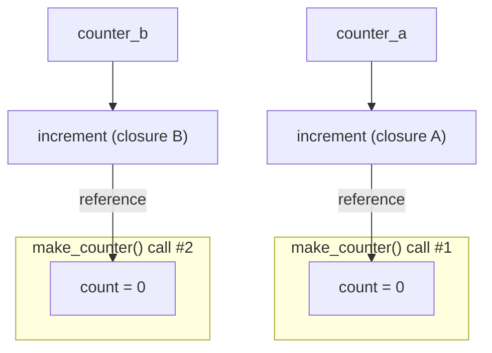

## Learning Objectives

- Define a closure as a function that retains access to variables from its enclosing scope after that scope has finished executing.
- Trace, for a given closure, exactly which variables it captures and why each one remains alive after the enclosing function returns.
- Implement a function factory (a function that returns a customized function) using a closure, and verify that separately created closures are independent.
- Explain concretely, in terms of references and garbage collection, why a captured variable is not cleaned up when its enclosing scope returns.
- Connect closures to higher-order functions by identifying when a closure is the thing being *returned*, as opposed to the thing being *passed in*.

## Context & Motivation

The previous concept showed `map`, `filter`, and `reduce` as higher-order functions that *take* a function as an argument. Closures are what makes the other direction of that same idea work: a higher-order function that *returns* a function, where the returned function needs to carry some state along with it — state that was set up in the outer function's scope but has to keep working correctly long after that outer function has already returned and its local variables would, in an ordinary function, simply be gone.

A **closure** is exactly that: a function that "remembers" the variables from the scope it was defined in, even after that scope has finished executing. This is not a special syntax or a separate language feature bolted on top of ordinary functions — it falls directly out of functions being first-class values, combined with Python allowing one function to be defined textually inside another. When an inner function refers to a variable from its enclosing function, and that inner function is then returned (or otherwise escapes) rather than called and discarded immediately, Python keeps that variable alive for as long as the inner function itself remains reachable, rather than destroying it the instant the outer function's own execution ends.

The canonical illustration of why this matters is a counter factory: a function `make_counter()` that, each time it's called, returns a brand-new function, and each returned function has its own independent count that increases every time *it* is called, entirely separately from any other counter created the same way. Getting this to work with ordinary, non-mutable local variables and no global state at all is exactly what closures are for, and understanding *why* it works — not just that it does — means understanding that the returned function keeps an actual reference to its enclosing scope's variables, which is precisely what keeps those variables from being garbage-collected once the outer call that created them returns. This material builds directly on functions-as-values and higher-order functions already covered: a closure is very often specifically what a higher-order function *returns*, and the two ideas are best understood as one continuous idea rather than separate topics.

## Core Theory

### The canonical example: `make_counter`

```python
def make_counter():
    count = 0
    def increment():
        nonlocal count
        count += 1
        return count
    return increment          # returns a FUNCTION, carrying `count` along with it

counter_a = make_counter()
counter_b = make_counter()

print(counter_a())   # 1
print(counter_a())   # 2
print(counter_b())   # 1 -- counter_b has its OWN count, unaffected by counter_a
print(counter_a())   # 3 -- counter_a's count kept accumulating independently
```

Each call to `make_counter()` creates a fresh local variable `count`, and a fresh inner function `increment` that refers to it. `increment` is then returned — and crucially, `count` does not get destroyed when `make_counter()` finishes executing, the way an ordinary local variable would once its function returns. Instead, `increment` keeps a live reference to that specific `count`, and every subsequent call to the returned function reads and updates that same, still-alive variable. `counter_a` and `counter_b` are two entirely separate closures, each with its own `count`, because each call to `make_counter()` created a fresh scope and a fresh inner function tied to it.

### Why this actually works: scope survival via reference

In an ordinary (non-closure) function, local variables are destroyed once the function returns — nothing outside is holding a reference to them, so Python's garbage collector reclaims their memory. A closure changes this specifically because the *returned function itself* holds a reference to its enclosing scope. As long as `counter_a` (the returned `increment` function) is reachable from somewhere in the program, the scope it was created in — including `count` — must stay alive too, because `increment`'s own code depends on being able to read and modify it. The moment `counter_a` itself becomes unreachable (no variable refers to it any more), *then* its captured `count` becomes eligible for garbage collection along with it, exactly like any other object with no remaining references.



Each `increment` function object carries its own reference to its own enclosing `count`; the two closures share code (the same function body, textually) but not state — each one's captured variable is a genuinely separate object in memory.

### `nonlocal`: writing to a captured variable, not just reading it

Python distinguishes reading a captured variable from reassigning it. Reading works automatically:

```python
def make_greeter(greeting):
    def greet(name):
        return f"{greeting}, {name}!"     # reads `greeting` -- no special syntax needed
    return greet

hello = make_greeter("Hello")
print(hello("Ada"))   # Hello, Ada!
```

But *reassigning* a captured variable from inside the inner function requires an explicit `nonlocal` declaration, because without it, Python assumes any name assigned inside a function is a new local variable belonging to that function, not the enclosing one:

```python
def make_counter_broken():
    count = 0
    def increment():
        count += 1        # UnboundLocalError: `count` is treated as a new local here,
        return count      # because it's assigned to, and read before that assignment
    return increment
```

Adding `nonlocal count` at the top of `increment` tells Python explicitly: this `count` refers to the enclosing function's variable, not a new local one — which is exactly the line that made the original `make_counter` example work. Reading a captured variable never needs `nonlocal`; only reassigning one does.

### Closures as what higher-order functions return

The connection to the previous concept is direct: `make_multiplier` from earlier material —

```python
def make_multiplier(factor):
    def multiply(x):
        return x * factor      # captures `factor` from the enclosing scope
    return multiply

double = make_multiplier(2)
triple = make_multiplier(3)
```

— is itself a closure example, just without the vocabulary attached yet. `multiply` is a closure over `factor`; `double` and `triple` are two distinct closures, each remembering a different captured value. A higher-order function that returns a function almost always needs that returned function to depend on *something* set up in the outer call — a factor to multiply by, a running count, a configuration value — and a closure is precisely the mechanism that lets the returned function carry that dependency along with it, rather than needing it passed in fresh on every call.

## Worked Examples

### Example 1 — `make_counter`, traced call by call

**Problem:** confirm, step by step, that two counters created from the same factory function are genuinely independent.

```python
def make_counter():
    count = 0
    def increment():
        nonlocal count
        count += 1
        return count
    return increment

a = make_counter()
b = make_counter()

print(a())   # 1   -- a's count: 0 -> 1
print(a())   # 2   -- a's count: 1 -> 2
print(b())   # 1   -- b's count: 0 -> 1 (its OWN count, untouched by a's calls)
print(a())   # 3   -- a's count: 2 -> 3
print(b())   # 2   -- b's count: 1 -> 2
```

Each call to `make_counter()` runs the body fresh, creating a brand-new `count = 0` and a brand-new `increment` closure tied to that specific `count`. `a` and `b` never interact, because they were built from two separate calls to `make_counter`, each with its own captured variable — confirming that a closure captures a specific *instance* of a variable, not a shared slot reused across every closure created from the same factory.

### Example 2 — a configurable validator built with a closure

**Problem:** build a family of validation functions, each checking that a number falls within its own specific range, without writing a separate named function for every range needed.

```python
def make_range_validator(low, high):
    def validate(value):
        return low <= value <= high
    return validate

is_valid_age = make_range_validator(0, 120)
is_valid_percentage = make_range_validator(0, 100)

print(is_valid_age(45))          # True
print(is_valid_age(150))         # False
print(is_valid_percentage(85))   # True
print(is_valid_percentage(150))  # False
```

`is_valid_age` and `is_valid_percentage` are both closures over `validate`, each capturing its own `low` and `high` from the specific call to `make_range_validator` that created it. This is the direct payoff promised in the Context & Motivation section: a higher-order function (`make_range_validator`) returns a customized function, and a closure is exactly what lets that customization (the specific `low`/`high` pair) travel along with the returned function.

### Example 3 — a closure used as a `map` callback, tying both concepts together

**Problem:** given a list of prices, apply a specific, configurable discount to every one, using `map` with a closure as the mapping function.

```python
def make_discounter(percent_off):
    def discount(price):
        return round(price * (1 - percent_off / 100), 2)
    return discount

prices = [100, 50, 20]
ten_percent_off = make_discounter(10)
print(list(map(ten_percent_off, prices)))   # [90.0, 45.0, 18.0]

twenty_five_percent_off = make_discounter(25)
print(list(map(twenty_five_percent_off, prices)))   # [75.0, 37.5, 15.0]
```

`make_discounter` is a higher-order function returning a closure (`discount`, capturing `percent_off`); that closure is then itself passed as the higher-order function argument to `map`. This is the two concepts working together directly: a closure supplies the "remembered" configuration (`percent_off`), and `map` supplies the "apply this to every element" behavior — neither one duplicates what the other already does.

## Common Misconceptions & Pitfalls

- **"Once `make_counter()` returns, its local `count` variable should be gone — it's a local variable in a function that already finished."** This is true for an *ordinary* local variable, but not for one captured by a closure that escapes the function (by being returned). The returned function holds a live reference to that variable's scope, which keeps it alive exactly as long as the closure itself remains reachable — not merely as long as the outer function is still running.
- **"All closures created from the same factory function share the same captured variable."** Example 1 demonstrates the opposite: each *call* to `make_counter()` creates a fresh `count` and a fresh `increment` tied to it. Two closures built from two separate calls to the same factory are independent, even though they share identical code.
- **"Reading a variable from an enclosing scope requires `nonlocal`, just like writing one does."** `nonlocal` is only required when the inner function *reassigns* the captured variable (like `count += 1`, which is a reassignment). Merely reading it, as in `make_greeter`'s `greet` function, works with no special declaration — Python only needs to be told explicitly when a name inside a function is meant to bind to the enclosing scope rather than create a new local one.
- **"A closure is a totally different mechanism from returning a function — it's some special case that occasionally applies."** Any time an inner function referring to an enclosing variable is returned (or otherwise outlives that enclosing call), it is a closure, automatically, with no extra syntax required to "turn on" the behavior — `make_multiplier` from the earlier first-class-functions material was already a closure example, even before the term was introduced.

## Summary

A closure is a function that retains access to variables from the scope it was defined in, even after that enclosing scope has finished executing — made possible because the returned function keeps a live reference to those variables, which is exactly what prevents them from being garbage-collected once the outer call returns. `make_counter()` is the canonical demonstration: each call creates a fresh captured variable and a fresh closure over it, so counters created from separate calls are fully independent, while `nonlocal` is the explicit signal needed only when the inner function reassigns (not merely reads) a captured variable. Closures connect directly to higher-order functions: a function that returns a customized function almost always needs a closure to carry that customization along, and a closure itself can then be passed into another higher-order function (like `map`) exactly as any other function value can.

## Documentation Links

- [MIT SICP — Wikipedia (course/book overview)](https://en.wikipedia.org/wiki/Structure_and_Interpretation_of_Computer_Programs) — doc
- [University of Washington / Coursera — Programming Languages, Part A (Grossman)](https://www.coursera.org/learn/programming-languages) — doc
