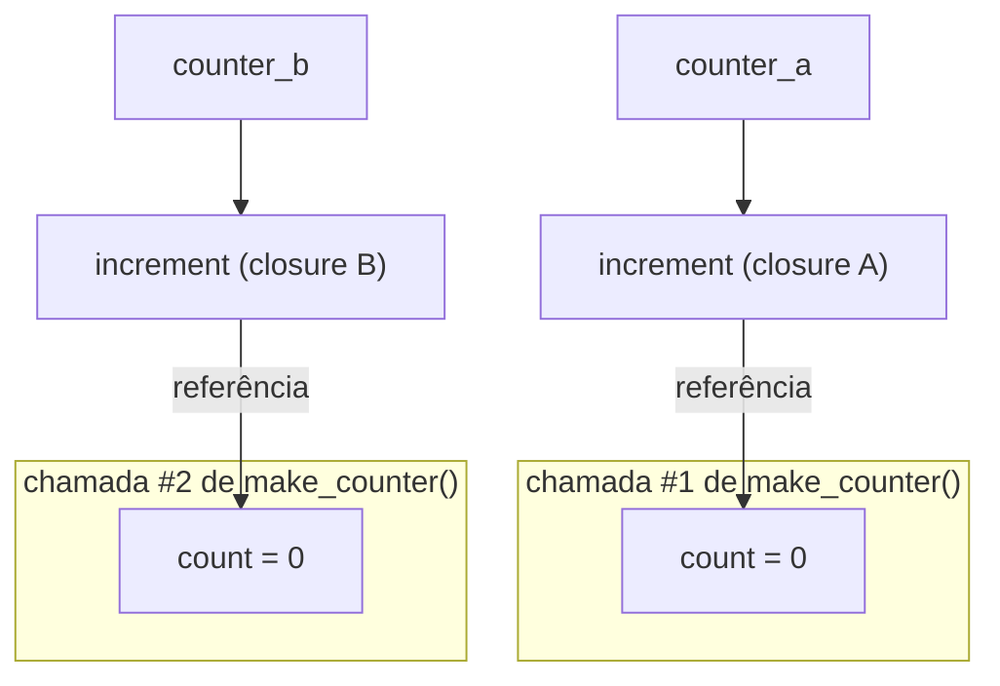

## Objetivos de Aprendizagem

- Definir closure como uma função que retém acesso a variáveis do seu escopo envolvente depois que aquele escopo terminou de executar.
- Rastrear, para uma dada closure, exatamente quais variáveis ela captura e por que cada uma permanece viva depois que a função envolvente retorna.
- Implementar uma fábrica de funções (uma função que retorna uma função customizada) usando uma closure, e verificar que closures criadas separadamente são independentes.
- Explicar concretamente, em termos de referências e coleta de lixo, por que uma variável capturada não é limpa quando seu escopo envolvente retorna.
- Conectar closures a funções de ordem superior identificando quando uma closure é a coisa sendo *retornada*, em oposição à coisa sendo *passada como argumento*.

## Contexto e Motivação

O conceito anterior mostrou `map`, `filter`, e `reduce` como funções de ordem superior que *recebem* uma função como argumento. Closures são o que faz a outra direção dessa mesma ideia funcionar: uma função de ordem superior que *retorna* uma função, onde a função retornada precisa carregar algum estado consigo, estado que foi configurado no escopo da função externa mas tem que continuar funcionando corretamente muito depois que aquela função externa já retornou e suas variáveis locais, em uma função comum, simplesmente teriam desaparecido.

Uma **closure** é exatamente isso: uma função que "lembra" as variáveis do escopo onde foi definida, mesmo depois que aquele escopo terminou de executar. Isso não é uma sintaxe especial ou um recurso de linguagem separado, encaixado por cima de funções comuns, decorre diretamente de funções serem valores de primeira classe, combinado com o Python permitir que uma função seja definida textualmente dentro de outra. Quando uma função interna se refere a uma variável de sua função envolvente, e aquela função interna é então retornada (ou de outra forma escapa) em vez de ser chamada e descartada imediatamente, Python mantém aquela variável viva enquanto a própria função interna permanecer alcançável, em vez de destruí-la no instante em que a execução da função externa termina.

A ilustração canônica de por que isso importa é uma fábrica de contadores: uma função `make_counter()` que, toda vez que é chamada, retorna uma função inteiramente nova, e cada função retornada tem sua própria contagem independente que aumenta toda vez que *ela* é chamada, inteiramente separada de qualquer outro contador criado da mesma forma. Fazer isso funcionar com variáveis locais comuns, não mutáveis, e nenhum estado global é exatamente para o que closures servem, e entender *por que* funciona, não só que funciona, significa entender que a função retornada mantém uma referência real às variáveis de seu escopo envolvente, o que é precisamente o que impede que essas variáveis sejam coletadas pelo garbage collector assim que a chamada externa que as criou retorna. Este material constrói diretamente sobre funções-como-valores e funções de ordem superior já cobertas: uma closure é frequentemente exatamente o que uma função de ordem superior *retorna*, e as duas ideias são melhor entendidas como uma ideia contínua, não tópicos separados.

## Teoria Central

### O exemplo canônico: `make_counter`

```python
def make_counter():
    count = 0
    def increment():
        nonlocal count
        count += 1
        return count
    return increment          # retorna uma FUNÇÃO, carregando `count` consigo

counter_a = make_counter()
counter_b = make_counter()

print(counter_a())   # 1
print(counter_a())   # 2
print(counter_b())   # 1 -- counter_b tem seu PRÓPRIO count, não afetado por counter_a
print(counter_a())   # 3 -- o count de counter_a continuou acumulando independentemente
```

Cada chamada a `make_counter()` cria uma variável local `count` nova, e uma função interna `increment` nova que se refere a ela. `increment` é então retornada, e crucialmente, `count` não é destruída quando `make_counter()` termina de executar, como uma variável local comum seria assim que sua função retorna. Em vez disso, `increment` mantém uma referência viva àquele `count` específico, e toda chamada subsequente à função retornada lê e atualiza aquela mesma variável, ainda viva. `counter_a` e `counter_b` são duas closures inteiramente separadas, cada uma com seu próprio `count`, porque cada chamada a `make_counter()` criou um escopo novo e uma função interna nova ligada a ele.

### Por que isso realmente funciona: sobrevivência de escopo via referência

Em uma função comum (sem closure), variáveis locais são destruídas assim que a função retorna, nada fora dela está segurando uma referência a elas, então o coletor de lixo do Python recupera sua memória. Uma closure muda isso especificamente porque a *própria função retornada* mantém uma referência ao seu escopo envolvente. Enquanto `counter_a` (a função `increment` retornada) for alcançável de algum lugar do programa, o escopo em que foi criada, incluindo `count`, tem que permanecer vivo também, porque o próprio código de `increment` depende de conseguir ler e modificar aquela variável. No momento em que `counter_a` em si se torna inalcançável (nenhuma variável mais se refere a ela), *então* seu `count` capturado se torna elegível para coleta de lixo junto com ela, exatamente como qualquer outro objeto sem referências restantes.



Cada objeto de função `increment` carrega sua própria referência ao seu próprio `count` envolvente; as duas closures compartilham código (o mesmo corpo de função, textualmente), mas não estado, a variável capturada de cada uma é um objeto genuinamente separado na memória.

### `nonlocal`: escrevendo em uma variável capturada, não só lendo-a

Python distingue ler uma variável capturada de reatribuí-la. Ler funciona automaticamente:

```python
def make_greeter(greeting):
    def greet(name):
        return f"{greeting}, {name}!"     # lê `greeting` -- nenhuma sintaxe especial necessária
    return greet

hello = make_greeter("Hello")
print(hello("Ada"))   # Hello, Ada!
```

Mas *reatribuir* uma variável capturada de dentro da função interna requer uma declaração `nonlocal` explícita, porque sem ela, Python assume que qualquer nome atribuído dentro de uma função é uma variável local nova pertencente àquela função, não à envolvente:

```python
def make_counter_broken():
    count = 0
    def increment():
        count += 1        # UnboundLocalError: `count` é tratado como um local novo aqui,
        return count      # porque é atribuído, e lido antes daquela atribuição
    return increment
```

Adicionar `nonlocal count` no topo de `increment` diz ao Python explicitamente: este `count` se refere à variável da função envolvente, não a uma local nova, que é exatamente a linha que fez o exemplo original de `make_counter` funcionar. Ler uma variável capturada nunca precisa de `nonlocal`, só reatribuí-la precisa.

### Closures como o que funções de ordem superior retornam

A conexão com o conceito anterior é direta: `make_multiplier` do material anterior,

```python
def make_multiplier(factor):
    def multiply(x):
        return x * factor      # captura `factor` do escopo envolvente
    return multiply

double = make_multiplier(2)
triple = make_multiplier(3)
```

já é ela mesma um exemplo de closure, só sem o vocabulário associado ainda. `multiply` é uma closure sobre `factor`; `double` e `triple` são duas closures distintas, cada uma lembrando um valor capturado diferente. Uma função de ordem superior que retorna uma função quase sempre precisa que a função retornada dependa de *algo* configurado na chamada externa, um fator para multiplicar, uma contagem corrente, um valor de configuração, e uma closure é precisamente o mecanismo que permite à função retornada carregar aquela dependência consigo, em vez de precisar recebê-la nova a cada chamada.

## Exemplos Resolvidos

### Exemplo 1 — `make_counter`, rastreado chamada por chamada

**Problema:** confirme, passo a passo, que dois contadores criados da mesma função fábrica são genuinamente independentes.

```python
def make_counter():
    count = 0
    def increment():
        nonlocal count
        count += 1
        return count
    return increment

a = make_counter()
b = make_counter()

print(a())   # 1   -- count de a: 0 -> 1
print(a())   # 2   -- count de a: 1 -> 2
print(b())   # 1   -- count de b: 0 -> 1 (o SEU PRÓPRIO count, intocado pelas chamadas de a)
print(a())   # 3   -- count de a: 2 -> 3
print(b())   # 2   -- count de b: 1 -> 2
```

Cada chamada a `make_counter()` executa o corpo do zero, criando um `count = 0` inteiramente novo e uma closure `increment` nova ligada àquele `count` específico. `a` e `b` nunca interagem, porque foram construídos a partir de duas chamadas separadas a `make_counter`, cada uma com sua própria variável capturada, confirmando que uma closure captura uma *instância* específica de uma variável, não um slot compartilhado reutilizado por toda closure criada da mesma fábrica.

### Exemplo 2 — um validador configurável construído com uma closure

**Problema:** construa uma família de funções de validação, cada uma verificando que um número cai dentro de sua própria faixa específica, sem escrever uma função nomeada separada para cada faixa necessária.

```python
def make_range_validator(low, high):
    def validate(value):
        return low <= value <= high
    return validate

is_valid_age = make_range_validator(0, 120)
is_valid_percentage = make_range_validator(0, 100)

print(is_valid_age(45))          # True
print(is_valid_age(150))         # False
print(is_valid_percentage(85))   # True
print(is_valid_percentage(150))  # False
```

`is_valid_age` e `is_valid_percentage` são ambas closures sobre `validate`, cada uma capturando seus próprios `low` e `high` da chamada específica a `make_range_validator` que a criou. Este é o retorno direto prometido na seção de Contexto e Motivação: uma função de ordem superior (`make_range_validator`) retorna uma função customizada, e uma closure é exatamente o que permite que aquela customização (o par específico `low`/`high`) viaje junto com a função retornada.

### Exemplo 3 — uma closure usada como callback de `map`, unindo os dois conceitos

**Problema:** dada uma lista de preços, aplique um desconto específico e configurável a cada um, usando `map` com uma closure como função de mapeamento.

```python
def make_discounter(percent_off):
    def discount(price):
        return round(price * (1 - percent_off / 100), 2)
    return discount

prices = [100, 50, 20]
ten_percent_off = make_discounter(10)
print(list(map(ten_percent_off, prices)))   # [90.0, 45.0, 18.0]

twenty_five_percent_off = make_discounter(25)
print(list(map(twenty_five_percent_off, prices)))   # [75.0, 37.5, 15.0]
```

`make_discounter` é uma função de ordem superior retornando uma closure (`discount`, capturando `percent_off`); aquela closure é então ela mesma passada como o argumento de função de ordem superior para `map`. Isso é os dois conceitos trabalhando juntos diretamente: uma closure fornece a configuração "lembrada" (`percent_off`), e `map` fornece o comportamento de "aplique isso a todo elemento", nenhum dos dois duplica o que o outro já faz.

## Equívocos Comuns e Armadilhas

- **"Assim que `make_counter()` retorna, sua variável local `count` deveria ter desaparecido, é uma variável local em uma função que já terminou."** Isso é verdade para uma variável local *comum*, mas não para uma capturada por uma closure que escapa da função (por ser retornada). A função retornada mantém uma referência viva ao escopo daquela variável, o que a mantém viva exatamente enquanto a própria closure permanecer alcançável, não só enquanto a função externa ainda estiver executando.
- **"Todas as closures criadas da mesma função fábrica compartilham a mesma variável capturada."** O Exemplo 1 demonstra o oposto: cada *chamada* a `make_counter()` cria um `count` novo e um `increment` novo ligado a ele. Duas closures construídas de duas chamadas separadas à mesma fábrica são independentes, mesmo compartilhando código idêntico.
- **"Ler uma variável de um escopo envolvente requer `nonlocal`, assim como escrever nela requer."** `nonlocal` só é necessário quando a função interna *reatribui* a variável capturada (como `count += 1`, que é uma reatribuição). Meramente lê-la, como na função `greet` de `make_greeter`, funciona sem nenhuma declaração especial, Python só precisa ser informado explicitamente quando um nome dentro de uma função deve se ligar ao escopo envolvente em vez de criar um local novo.
- **"Uma closure é um mecanismo totalmente diferente de retornar uma função, é algum caso especial que ocasionalmente se aplica."** Toda vez que uma função interna se referindo a uma variável envolvente é retornada (ou de outra forma sobrevive àquela chamada envolvente), é uma closure, automaticamente, sem sintaxe extra necessária para "ativar" o comportamento, `make_multiplier` do material anterior de funções de primeira classe já era um exemplo de closure, mesmo antes de o termo ser introduzido.

## Resumo

Uma closure é uma função que retém acesso a variáveis do escopo em que foi definida, mesmo depois que aquele escopo envolvente terminou de executar, possível porque a função retornada mantém uma referência viva àquelas variáveis, o que é exatamente o que impede que sejam coletadas pelo garbage collector assim que a chamada externa retorna. `make_counter()` é a demonstração canônica: cada chamada cria uma variável capturada nova e uma closure nova sobre ela, então contadores criados de chamadas separadas são totalmente independentes, enquanto `nonlocal` é o sinal explícito necessário só quando a função interna reatribui (não meramente lê) uma variável capturada. Closures se conectam diretamente a funções de ordem superior: uma função que retorna uma função customizada quase sempre precisa de uma closure para carregar aquela customização consigo, e uma closure em si pode então ser passada para outra função de ordem superior (como `map`) exatamente como qualquer outro valor de função pode.

## Documentation Links

- [MIT SICP — Wikipedia (course/book overview)](https://en.wikipedia.org/wiki/Structure_and_Interpretation_of_Computer_Programs) — doc
- [University of Washington / Coursera — Programming Languages, Part A (Grossman)](https://www.coursera.org/learn/programming-languages) — doc
