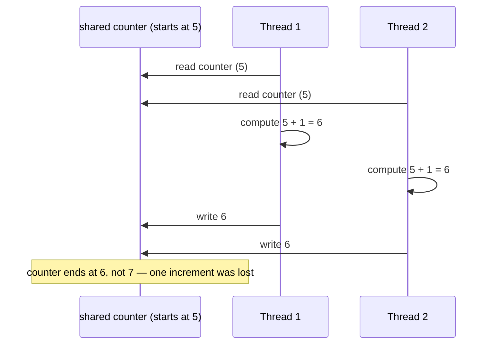

## Learning Objectives

- Describe concurrency as "multiple things happening at once, or interleaved" and distinguish it, at least informally, from plain sequential execution.
- Explain the shared-state model of concurrency — multiple tasks reading and writing the same memory — and describe, at a conceptual level, what a race condition is and why it happens.
- Explain the message-passing model of concurrency — tasks that never share memory and only exchange explicit messages — and state why it avoids race conditions by construction.
- Compare the two models on the specific question of coordination: what has to be managed, and by whom, in each.
- Recognize that this concept introduces the two models as ways of thinking, not as a tutorial in locks, synchronization primitives, or thread-safety mechanics.

## Context & Motivation

Every paradigm covered so far in this discipline — imperative, object-oriented, functional, logic — has been about a *single* line of computation: one sequence of steps (however that sequence is expressed) proceeding from start to finish. Concurrent programming asks a different question entirely: what happens when there is more than one such sequence in progress *at the same time* — genuinely in parallel on separate processor cores, or merely interleaved on one core, switching back and forth so fast it looks simultaneous? Either way, the moment two independent streams of computation can affect each other's outcome, you need a mental model for what "at the same time" even means, and what can go wrong.

This matters because it is not an exotic corner case. Modern hardware ships with multiple cores as standard, web servers handle many requests simultaneously, user interfaces must stay responsive while background work runs, and distributed systems are, definitionally, many computers computing "at once." The Stanford CS242 course, and the ACM/IEEE CS2013 Programming Languages Knowledge Area, both treat concurrency as a genuinely distinct dimension of language design — orthogonal to whether a language is imperative, functional, or object-oriented — because *any* of those paradigms can be made concurrent, and each one raises the same underlying question in a different guise: when two things can run at once, how do they coordinate?

This concept stays deliberately at the level of two *mental models* — two different ways of thinking about "multiple things happening at once" — rather than a deep dive into how locks, mutexes, or other synchronization mechanisms actually work under the hood. That deeper, systems-level treatment belongs elsewhere; here, the goal is to recognize shared-state and message-passing as two fundamentally different starting assumptions about what concurrent tasks are allowed to touch, and to see, at a conceptual level, why that single assumption changes everything about what can go wrong and how you'd have to think about preventing it.

## Core Theory

### Concurrency as a way of thinking, not a single mechanism

**Concurrency** means multiple tasks make progress during overlapping time periods — whether truly simultaneously (parallel hardware) or interleaved on a single core (a scheduler switching between tasks fast enough that both appear to progress). What makes concurrent programming a distinct *paradigm*, rather than just "more of imperative programming," is that a concurrent program's correctness can depend on things a purely sequential program never has to consider: the relative order in which two tasks' individual steps happen to interleave. Two different runs of the same concurrent program, with the same inputs, can produce different results purely because the scheduler interleaved the tasks differently — a possibility that simply does not exist in single-threaded sequential code.

### Shared-state concurrency

In the **shared-state** model, multiple tasks (threads, in most mainstream languages) operate on the same region of memory — the same variables, the same data structures — directly. This is the natural extension of ordinary imperative programming to multiple simultaneous tasks: each task just keeps doing normal reads and writes to shared variables, the same as it would alone, except now another task might also be reading or writing that same variable at an overlapping moment.

The problem this creates has a name: a **race condition** — a situation where the correctness of a result depends on the precise timing of two or more tasks' operations, and different orderings of those operations produce different (and sometimes wrong) outcomes. The canonical example is two tasks incrementing a shared counter: each increment conceptually requires reading the current value, adding one, and writing the new value back. If two tasks each read the counter at the same moment (before either has written its result back), both read the same starting value, both add one to it, and both write back the same incremented value — so two increments happen, but the counter only goes up by one instead of two. Nothing in the code looks wrong on a line-by-line reading; the bug exists only in the *interleaving*, which is exactly why race conditions are notoriously hard to spot and to reproduce.



Shared-state concurrency requires some form of coordination to prevent this kind of conflict — at minimum, some agreement about which task is allowed to touch shared memory at any given moment. The mechanics of *how* that coordination is actually implemented (locks, mutexes, and the rest) are a systems-level topic for elsewhere; the point to take from this model is the underlying tradeoff: shared state gives tasks direct, fast, natural access to common data, at the price of needing explicit discipline to keep them from stepping on each other.

### Message-passing concurrency

In the **message-passing** model, tasks (often called processes, or actors) never share memory at all. Each task owns its own private state, invisible to every other task, and the *only* way one task can affect another is by sending it an explicit message — a discrete, self-contained piece of data — which the receiving task processes on its own schedule, at its own pace, using only its own private state.

This single structural choice eliminates race conditions **by construction**: there is nothing to race over, because there is no memory location that two tasks could simultaneously read and write. If two independent tasks each maintain their own separate counter, and coordinate only by sending each other messages like "increment your counter" or "report your current count," there is no possible interleaving of their internal steps that produces a wrong answer — each task's own counter is only ever touched by that one task, sequentially, no matter how the two tasks' message exchanges happen to interleave in time.

```mermaid
sequenceDiagram
    participant P1 as Process 1 (own counter = 5)
    participant P2 as Process 2 (own counter = 12)
    P1->>P2: message: "what's your count?"
    P2->>P2: reads its OWN counter (12) — no other process touches it
    P2->>P1: message: "12"
    Note over P1,P2: each process's state is private;<br/>coordination happens only through messages, never shared memory
```

Message passing does not make concurrency effortless — a task can still get a message it didn't expect, in an order it didn't anticipate, or wait a long time for a reply that never comes — but the *specific* failure mode of two tasks corrupting the same piece of memory simply cannot happen, because no piece of memory is ever shared in the first place.

### The core contrast

The two models differ in exactly one foundational assumption — is memory shared or not — and that single assumption cascades into everything else: shared-state concurrency is efficient (no copying, no message overhead) but demands explicit coordination discipline to avoid race conditions; message-passing concurrency is inherently free of that particular hazard, at the cost of needing every interaction to be expressed as an explicit, sometimes higher-overhead, message. Neither model is strictly "better" — they are two different starting points for thinking about "multiple things happening at once," and different languages, frameworks, and problems lean toward one or the other (shared-memory threading is common in systems languages and traditional operating-system-level concurrency; message-passing shows up in actor-model languages, distributed systems, and any design that explicitly wants to avoid shared mutable state).

## Worked Examples

### Example 1 — a shared-state race, made concrete in Python

**Problem.** Show, conceptually, why two threads incrementing a shared counter without coordination can produce a wrong final total.

```python
counter = 0

def increment_many(times):
    global counter
    for _ in range(times):
        current = counter      # read
        counter = current + 1  # write

# Conceptually: two threads both call increment_many(100_000)
# at the same time, sharing the same `counter` variable.
#
# If the two threads' read/write steps interleave — e.g.
#   thread A reads counter (500)
#   thread B reads counter (500)      <- before A's write lands
#   thread A writes 501
#   thread B writes 501               <- overwrites A's update
# then one of the two increments is silently lost.
#
# Run enough interleaved increments like this and the final
# counter value ends up LESS than 200_000 — the exact amount
# lost depends on the exact, unpredictable timing of the
# interleaving, which is precisely what makes race conditions
# hard to reproduce and debug.
```

**Reasoning.** Each individual line of Python here is unremarkable — read a value, add one, write it back. The bug exists only in the possibility that another thread's read happens to land in the gap between this thread's read and its write. Nothing about the *mechanics* of preventing this (locks, atomic operations) is the point of this example; the point is recognizing that shared, mutable state accessed by more than one task at once creates exactly this category of risk, purely from the *model* being used — regardless of which specific coordination tool would later fix it.

### Example 2 — the same task, reframed as message-passing

**Problem.** Show the same "total count across two workers" goal, but structured so that no memory is ever shared.

```python
# Each "worker" owns its own private state completely.
class Worker:
    def __init__(self):
        self.count = 0          # private — no other worker ever touches this

    def handle_message(self, message):
        if message == "increment":
            self.count += 1     # only this worker ever modifies self.count
        elif message == "report":
            return self.count

worker_a = Worker()
worker_b = Worker()

# Coordination happens only through messages, e.g. a coordinator
# sends "increment" to worker_a 100_000 times and to worker_b
# 100_000 times (on whatever schedule, in whatever interleaving),
# then sends "report" to each and adds the two replies together:

total = 0
for _ in range(100_000):
    worker_a.handle_message("increment")
for _ in range(100_000):
    worker_b.handle_message("increment")

total = worker_a.handle_message("report") + worker_b.handle_message("report")
# total is reliably 200_000 — no matter how the two workers'
# message processing happens to interleave in a real concurrent
# runtime, because worker_a.count and worker_b.count are never
# the same memory, and each is only ever modified by its own
# worker, one message at a time.
```

**Reasoning.** The two workers' internal counters can never conflict, because they are never the same variable — `worker_a.count` and `worker_b.count` are entirely separate. Combining their results happens only after each has finished its own private work and reported it explicitly. This is the essential shape of message-passing concurrency: coordination is always an explicit exchange (`handle_message(...)`, `report`), never an implicit shared variable that two tasks might touch at overlapping moments.

## Common Misconceptions & Pitfalls

- **"Race conditions only happen with 'complicated' shared data structures, not simple things like a counter."** Example 1 shows a race condition on the simplest possible piece of shared state — a single integer counter — with an ordinary three-step read-modify-write. Complexity is not what causes races; *sharing plus overlapping access* is.
- **"Message passing is 'slower shared-state' — the same idea, just with extra steps."** It's a genuinely different foundational assumption, not a slower version of the same one: shared-state tasks can, in principle, touch the exact same memory location; message-passing tasks structurally cannot touch each other's memory at all. That difference is what eliminates race conditions in the message-passing model by construction, not by discipline or care.
- **"If a race condition doesn't show up when I test it, my shared-state code is safe."** Race conditions depend on the precise timing of an interleaving that may or may not occur on a given run, a given machine, or under a given load — a race that doesn't manifest during testing can still be present and can manifest later under different timing conditions. This is exactly what makes them a genuinely different kind of bug from a plain logic error, and is one of the main reasons the shared-state model demands real discipline.
- **"Message passing means there's no state at all."** Each task in the message-passing model still very much has its own state (Example 2's `self.count` on each `Worker`) — what message passing removes is *shared* state, not state itself. The private state inside one task is exactly as real and mutable as it would be in an ordinary sequential program; it simply isn't visible to any other task.
- **"This concept should have taught me how to actually prevent race conditions with locks."** Deliberately not covered here — this concept introduces shared-state and message-passing as two different mental models for concurrency at a conceptual, paradigm-comparison level. The mechanics of synchronization primitives and thread-safety belong to a more advanced, systems-level treatment elsewhere.

## Summary

Concurrent programming means more than one task making progress over overlapping time — and that single fact introduces a hazard sequential programming never has: outcomes can depend on the precise interleaving of independent tasks' steps. The **shared-state** model lets multiple tasks read and write the same memory directly, which is efficient and natural but opens the door to **race conditions** — timing-dependent bugs, like two threads' increments silently overwriting each other, that exist only in the interleaving, not in any single line of code. The **message-passing** model instead gives every task its own private memory and lets tasks affect each other only through explicit messages, which eliminates race conditions by construction, since there is no shared memory location left to race over. Neither model is a strictly better default — they are two different starting assumptions about what "coordinating multiple tasks" even means, and this concept has deliberately stayed at that conceptual, comparative level rather than descending into the mechanics of locks or synchronization, which belong to a more advanced treatment elsewhere.

## Documentation Links

- [Stanford CS242 — Course Site](https://stanford-cs242.github.io/f19/) — doc
- [ACM/IEEE CS2013 — Programming Languages Knowledge Area](https://csed.acm.org/knowledge-areas-programming-languages-pl-cs2013-version/) — doc
