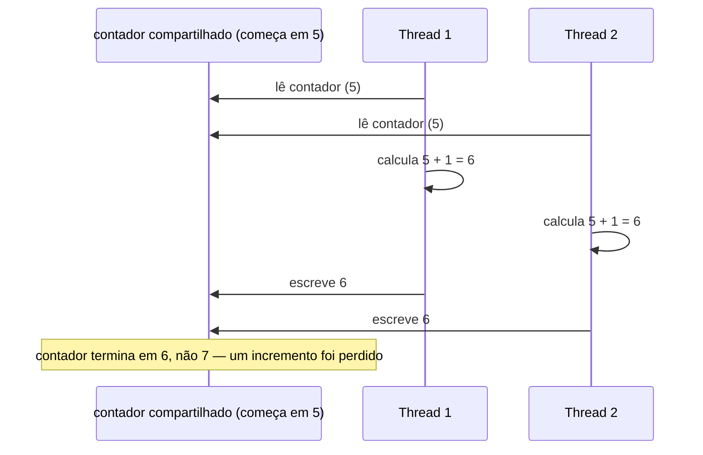

## Objetivos de Aprendizagem

- Descrever concorrência como "múltiplas coisas acontecendo ao mesmo tempo, ou intercaladas" e distingui-la, ao menos informalmente, de mera execução sequencial.
- Explicar o modelo de estado compartilhado de concorrência, múltiplas tarefas lendo e escrevendo na mesma memória, e descrever, em nível conceitual, o que é uma condição de corrida e por que acontece.
- Explicar o modelo de passagem de mensagens de concorrência, tarefas que nunca compartilham memória e só trocam mensagens explícitas, e enunciar por que evita condições de corrida por construção.
- Comparar os dois modelos na questão específica de coordenação: o que tem que ser gerenciado, e por quem, em cada um.
- Reconhecer que este conceito introduz os dois modelos como formas de pensar, não como um tutorial de locks, primitivas de sincronização, ou mecânica de segurança de threads.

## Contexto e Motivação

Todo paradigma coberto até agora nesta disciplina, imperativo, orientado a objetos, funcional, lógico, tem sido sobre uma *única* linha de computação: uma sequência de passos (seja como for que aquela sequência é expressa) procedendo do início ao fim. Programação concorrente faz uma pergunta inteiramente diferente: o que acontece quando há mais de uma dessas sequências em andamento *ao mesmo tempo*, genuinamente em paralelo em núcleos de processador separados, ou meramente intercaladas em um núcleo, alternando de um lado para o outro tão rápido que parece simultâneo? De qualquer forma, no momento em que dois fluxos independentes de computação podem afetar o resultado um do outro, você precisa de um modelo mental para o que "ao mesmo tempo" sequer significa, e o que pode dar errado.

Isso importa porque não é um caso de canto exótico. Hardware moderno vem com múltiplos núcleos como padrão, servidores web tratam muitas requisições simultaneamente, interfaces de usuário precisam permanecer responsivas enquanto trabalho em segundo plano roda, e sistemas distribuídos são, por definição, muitos computadores computando "ao mesmo tempo." O curso Stanford CS242, e a Área de Conhecimento de Linguagens de Programação do ACM/IEEE CS2013, ambos tratam concorrência como uma dimensão genuinamente distinta de design de linguagem, ortogonal a se uma linguagem é imperativa, funcional, ou orientada a objetos, porque *qualquer* desses paradigmas pode ser tornado concorrente, e cada um levanta a mesma questão subjacente sob um disfarce diferente: quando duas coisas podem rodar ao mesmo tempo, como elas coordenam?

Este conceito permanece deliberadamente no nível de dois *modelos mentais*, duas formas diferentes de pensar sobre "múltiplas coisas acontecendo ao mesmo tempo", em vez de um mergulho profundo em como locks, mutexes, ou outros mecanismos de sincronização de fato funcionam por baixo. Aquele tratamento mais profundo, em nível de sistemas, pertence a outro lugar; aqui, o objetivo é reconhecer estado compartilhado e passagem de mensagens como duas suposições iniciais fundamentalmente diferentes sobre o que tarefas concorrentes têm permissão de tocar, e ver, em nível conceitual, por que essa única suposição muda tudo sobre o que pode dar errado e como você teria que pensar em preveni-lo.

## Teoria Central

### Concorrência como uma forma de pensar, não um único mecanismo

**Concorrência** significa que múltiplas tarefas fazem progresso durante períodos de tempo sobrepostos, seja verdadeiramente simultâneo (hardware paralelo) ou intercalado em um único núcleo (um escalonador alternando entre tarefas rápido o bastante para que ambas pareçam progredir). O que torna programação concorrente um *paradigma* distinto, em vez de só "mais programação imperativa", é que a correção de um programa concorrente pode depender de coisas que um programa puramente sequencial nunca precisa considerar: a ordem relativa na qual os passos individuais de duas tarefas acontecem de se intercalar. Duas execuções diferentes do mesmo programa concorrente, com as mesmas entradas, podem produzir resultados diferentes puramente porque o escalonador intercalou as tarefas de forma diferente, uma possibilidade que simplesmente não existe em código sequencial de thread única.

### Concorrência de estado compartilhado

No modelo de **estado compartilhado**, múltiplas tarefas (threads, na maioria das linguagens mainstream) operam sobre a mesma região de memória, as mesmas variáveis, as mesmas estruturas de dados, diretamente. Esta é a extensão natural da programação imperativa comum para múltiplas tarefas simultâneas: cada tarefa simplesmente continua fazendo leituras e escritas normais em variáveis compartilhadas, o mesmo que faria sozinha, exceto que agora outra tarefa também pode estar lendo ou escrevendo aquela mesma variável em um momento sobreposto.

O problema que isso cria tem um nome: uma **condição de corrida**, uma situação onde a correção de um resultado depende do timing preciso das operações de duas ou mais tarefas, e ordenações diferentes dessas operações produzem resultados diferentes (e às vezes errados). O exemplo canônico é duas tarefas incrementando um contador compartilhado: cada incremento conceitualmente requer ler o valor corrente, somar um, e escrever o valor novo de volta. Se duas tarefas cada uma lê o contador no mesmo momento (antes de qualquer uma ter escrito seu resultado de volta), ambas leem o mesmo valor inicial, ambas somam um a ele, e ambas escrevem de volta o mesmo valor incrementado, então dois incrementos acontecem, mas o contador só sobe em um em vez de dois. Nada no código parece errado em uma leitura linha por linha; o bug existe só na *intercalação*, o que é exatamente por que condições de corrida são notoriamente difíceis de detectar e reproduzir.



Concorrência de estado compartilhado requer alguma forma de coordenação para prevenir esse tipo de conflito, no mínimo, algum acordo sobre qual tarefa tem permissão de tocar memória compartilhada em um dado momento. A mecânica de *como* aquela coordenação é de fato implementada (locks, mutexes, e o resto) é um tópico em nível de sistemas para outro lugar; o ponto a levar deste modelo é o trade-off subjacente: estado compartilhado dá às tarefas acesso direto, rápido, natural a dados comuns, ao preço de precisar de disciplina explícita para impedi-las de pisar umas nas outras.

### Concorrência de passagem de mensagens

No modelo de **passagem de mensagens**, tarefas (frequentemente chamadas processos, ou atores) nunca compartilham memória de forma alguma. Cada tarefa possui seu próprio estado privado, invisível a toda outra tarefa, e a *única* forma de uma tarefa afetar outra é enviando a ela uma mensagem explícita, uma peça de dado discreta, autocontida, que a tarefa receptora processa em seu próprio cronograma, em seu próprio ritmo, usando só seu próprio estado privado.

Essa única escolha estrutural elimina condições de corrida **por construção**: não há nada sobre o que competir, porque não há localização de memória que duas tarefas poderiam simultaneamente ler e escrever. Se duas tarefas independentes cada uma mantém seu próprio contador separado, e coordenam só enviando mensagens uma à outra como "incremente seu contador" ou "reporte sua contagem corrente", não há intercalação possível de seus passos internos que produza uma resposta errada, o próprio contador de cada tarefa só é tocado por aquela única tarefa, sequencialmente, não importa como as trocas de mensagens das duas tarefas aconteçam de se intercalar no tempo.

```mermaid
sequenceDiagram
    participant P1 as Processo 1 (contador próprio = 5)
    participant P2 as Processo 2 (contador próprio = 12)
    P1->>P2: mensagem: "qual sua contagem?"
    P2->>P2: lê seu PRÓPRIO contador (12) — nenhum outro processo o toca
    P2->>P1: mensagem: "12"
    Note over P1,P2: o estado de cada processo é privado;<br/>coordenação acontece só através de mensagens, nunca memória compartilhada
```

Passagem de mensagens não torna concorrência sem esforço, uma tarefa ainda pode receber uma mensagem que não esperava, em uma ordem que não antecipou, ou esperar muito tempo por uma resposta que nunca chega, mas o modo de falha *específico* de duas tarefas corromperem a mesma peça de memória simplesmente não pode acontecer, porque nenhuma peça de memória é jamais compartilhada em primeiro lugar.

### O contraste central

Os dois modelos diferem em exatamente uma suposição fundacional, memória é compartilhada ou não, e essa única suposição se propaga em cascata para tudo mais: concorrência de estado compartilhado é eficiente (sem cópia, sem sobrecarga de mensagens) mas exige disciplina de coordenação explícita para evitar condições de corrida; concorrência de passagem de mensagens é inerentemente livre daquele risco específico, ao custo de precisar que toda interação seja expressa como uma mensagem explícita, às vezes de sobrecarga maior. Nenhum dos dois modelos é estritamente "melhor", são dois pontos de partida diferentes para pensar sobre "múltiplas coisas acontecendo ao mesmo tempo", e diferentes linguagens, frameworks, e problemas pendem para um ou outro (threading de memória compartilhada é comum em linguagens de sistemas e concorrência tradicional em nível de sistema operacional; passagem de mensagens aparece em linguagens de modelo de atores, sistemas distribuídos, e qualquer design que explicitamente quer evitar estado mutável compartilhado).

## Exemplos Resolvidos

### Exemplo 1 — uma corrida de estado compartilhado, tornada concreta em Python

**Problema.** Mostre, conceitualmente, por que duas threads incrementando um contador compartilhado sem coordenação podem produzir um total final errado.

```python
counter = 0

def increment_many(times):
    global counter
    for _ in range(times):
        current = counter      # leitura
        counter = current + 1  # escrita

# Conceitualmente: duas threads ambas chamam increment_many(100_000)
# ao mesmo tempo, compartilhando a mesma variável `counter`.
#
# Se os passos de leitura/escrita das duas threads se intercalarem — ex.
#   thread A lê counter (500)
#   thread B lê counter (500)      <- antes de a escrita de A aterrissar
#   thread A escreve 501
#   thread B escreve 501           <- sobrescreve a atualização de A
# então um dos dois incrementos é silenciosamente perdido.
#
# Rode incrementos intercalados o bastante assim e o valor final
# do contador termina MENOR que 200_000 — a quantidade exata
# perdida depende do timing exato, imprevisível, da
# intercalação, que é precisamente o que torna condições de
# corrida difíceis de reproduzir e depurar.
```

**Raciocínio.** Cada linha individual de Python aqui é comum, ler um valor, somar um, escrever de volta. O bug existe só na possibilidade de a leitura de outra thread acontecer de aterrissar no intervalo entre a leitura desta thread e sua escrita. Nada sobre a *mecânica* de prevenir isso (locks, operações atômicas) é o ponto deste exemplo; o ponto é reconhecer que estado compartilhado, mutável acessado por mais de uma tarefa ao mesmo tempo cria exatamente essa categoria de risco, puramente a partir do *modelo* sendo usado, independente de qual ferramenta de coordenação específica depois o corrigiria.

### Exemplo 2 — a mesma tarefa, reformulada como passagem de mensagens

**Problema.** Mostre o mesmo objetivo de "contagem total através de dois trabalhadores", mas estruturado de forma que nenhuma memória seja jamais compartilhada.

```python
# Cada "trabalhador" possui seu próprio estado privado por completo.
class Worker:
    def __init__(self):
        self.count = 0          # privado — nenhum outro worker jamais toca isso

    def handle_message(self, message):
        if message == "increment":
            self.count += 1     # só este worker jamais modifica self.count
        elif message == "report":
            return self.count

worker_a = Worker()
worker_b = Worker()

# Coordenação acontece só através de mensagens, ex., um coordenador
# envia "increment" para worker_a 100_000 vezes e para worker_b
# 100_000 vezes (em qualquer cronograma, em qualquer intercalação),
# depois envia "report" para cada um e soma as duas respostas juntas:

total = 0
for _ in range(100_000):
    worker_a.handle_message("increment")
for _ in range(100_000):
    worker_b.handle_message("increment")

total = worker_a.handle_message("report") + worker_b.handle_message("report")
# total é confiavelmente 200_000 — não importa como o processamento
# de mensagens dos dois workers acontece de se intercalar em um
# runtime concorrente real, porque worker_a.count e worker_b.count
# nunca são a mesma memória, e cada um só é jamais modificado
# pelo seu próprio worker, uma mensagem de cada vez.
```

**Raciocínio.** Os contadores internos dos dois workers nunca podem entrar em conflito, porque nunca são a mesma variável, `worker_a.count` e `worker_b.count` são inteiramente separados. Combinar seus resultados acontece só depois que cada um terminou seu próprio trabalho privado e o reportou explicitamente. Esta é a forma essencial de concorrência de passagem de mensagens: coordenação é sempre uma troca explícita (`handle_message(...)`, `report`), nunca uma variável compartilhada implícita que duas tarefas poderiam tocar em momentos sobrepostos.

## Equívocos Comuns e Armadilhas

- **"Condições de corrida só acontecem com estruturas de dados compartilhadas 'complicadas', não coisas simples como um contador."** O Exemplo 1 mostra uma condição de corrida na peça mais simples possível de estado compartilhado, um único contador inteiro, com um leitura-modificação-escrita de três passos comum. Complexidade não é o que causa corridas; *compartilhamento mais acesso sobreposto* é.
- **"Passagem de mensagens é 'estado compartilhado mais lento', a mesma ideia, só com passos extras."** É uma suposição fundacional genuinamente diferente, não uma versão mais lenta da mesma: tarefas de estado compartilhado podem, em princípio, tocar exatamente a mesma localização de memória; tarefas de passagem de mensagens estruturalmente não podem tocar a memória umas das outras de forma alguma. Aquela diferença é o que elimina condições de corrida no modelo de passagem de mensagens por construção, não por disciplina ou cuidado.
- **"Se uma condição de corrida não aparece quando eu testo, meu código de estado compartilhado é seguro."** Condições de corrida dependem do timing preciso de uma intercalação que pode ou não ocorrer em uma dada execução, uma dada máquina, ou sob uma dada carga, uma corrida que não se manifesta durante teste ainda pode estar presente e pode se manifestar depois sob condições de timing diferentes. Isso é exatamente o que as torna um tipo genuinamente diferente de bug de um erro de lógica comum, e é uma das principais razões pelas quais o modelo de estado compartilhado exige disciplina real.
- **"Passagem de mensagens significa que não há estado de forma alguma."** Cada tarefa no modelo de passagem de mensagens ainda muito bem tem seu próprio estado (o `self.count` do Exemplo 2 em cada `Worker`), o que passagem de mensagens remove é estado *compartilhado*, não estado em si. O estado privado dentro de uma tarefa é exatamente tão real e mutável quanto seria em um programa sequencial comum; simplesmente não é visível a nenhuma outra tarefa.
- **"Este conceito deveria ter me ensinado como de fato prevenir condições de corrida com locks."** Deliberadamente não coberto aqui, este conceito introduz estado compartilhado e passagem de mensagens como dois modelos mentais diferentes para concorrência em um nível conceitual, de comparação de paradigma. A mecânica de primitivas de sincronização e segurança de threads pertence a um tratamento mais avançado, em nível de sistemas, em outro lugar.

## Resumo

Programação concorrente significa mais de uma tarefa fazendo progresso sobre tempo sobreposto, e esse único fato introduz um risco que programação sequencial nunca tem: resultados podem depender da intercalação precisa dos passos de tarefas independentes. O modelo de **estado compartilhado** deixa múltiplas tarefas lerem e escreverem na mesma memória diretamente, o que é eficiente e natural mas abre a porta para **condições de corrida**, bugs dependentes de timing, como incrementos de duas threads silenciosamente se sobrescrevendo, que existem só na intercalação, não em nenhuma única linha de código. O modelo de **passagem de mensagens** em vez disso dá a toda tarefa sua própria memória privada e deixa tarefas se afetarem só através de mensagens explícitas, o que elimina condições de corrida por construção, já que não sobra nenhuma localização de memória compartilhada sobre a qual competir. Nenhum dos dois modelos é um padrão estritamente melhor, são duas suposições iniciais diferentes sobre o que "coordenar múltiplas tarefas" sequer significa, e este conceito deliberadamente permaneceu naquele nível conceitual, comparativo, em vez de descer à mecânica de locks ou sincronização, que pertence a um tratamento mais avançado em outro lugar.

## Documentation Links

- [Stanford CS242 — Course Site](https://stanford-cs242.github.io/f19/) — doc
- [ACM/IEEE CS2013 — Programming Languages Knowledge Area](https://csed.acm.org/knowledge-areas-programming-languages-pl-cs2013-version/) — doc
