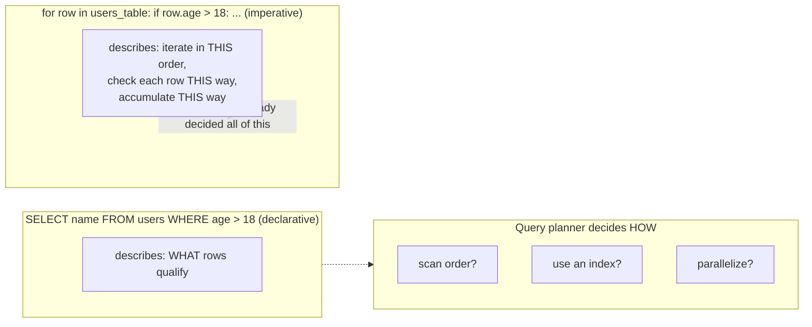

## Learning Objectives

- Define declarative programming as describing the desired result, rather than the procedure that produces it, and contrast it directly with imperative programming.
- Read and write a simple SQL query, and explain what the database engine is free to decide that the query itself never specifies.
- Translate a small SQL query into equivalent imperative pseudocode, and identify exactly which decisions the imperative version makes explicit that the declarative version leaves implicit.
- Explain why logic programming (facts, rules, and queries) is also declarative in spirit, and connect the two concepts explicitly.
- Identify declarative code in unfamiliar contexts by recognizing the absence of explicit control flow describing *how* a result is produced.

## Context & Motivation

Every paradigm covered so far in this discipline, with one partial exception, asks you to write down a *procedure*: a sequence of steps (imperative), a chain of method calls on objects (object-oriented), a composition of function applications (functional), even a search strategy of sorts implied by how facts and rules are ordered (logic programming, though there the search machinery itself is hidden). Declarative programming pushes that idea to its natural conclusion: you describe *what* result you want, in as much or as little structural detail as the language provides, and you leave *how* to get there entirely to the system executing your description. The system — a database engine, a build tool, a logic interpreter — is then free to choose whatever execution strategy it judges best, including strategies you never considered and might not even understand, as long as the result matches what you asked for.

The single most widely used real example of this idea, by an enormous margin, is SQL. A query like `SELECT name FROM users WHERE age > 18` says exactly one thing: "give me the `name` of every row in `users` where `age` is greater than 18." It says nothing about whether the database engine should scan every row in order, use an index on `age` to jump straight to the qualifying range, run the scan in parallel across multiple cores, or cache the result of an identical query run five seconds ago. All of those are real strategies a production database engine might actually choose, dynamically, based on table size, existing indexes, and query planner statistics — and the query itself is silent on all of it, deliberately. This is not a limitation of SQL; it is the entire point. Every relational database built since the 1970s has been designed around exactly this separation: the query describes the *what*, and a component called the query planner or query optimizer decides the *how*, often changing that decision over time as the underlying data and indexes change, without the query itself ever needing to be rewritten.

This idea should already feel half-familiar. Logic programming — facts, rules, and queries, covered in the previous concept — is declarative in exactly the same sense: a Prolog query like `?- grandparent(tom, X).` describes a relationship to search for, and the unification-and-backtracking search that actually finds `X = ann` and `X = pat` is carried out entirely by the language's built-in inference engine, never written by the programmer. SQL and Prolog are, in this specific sense, close cousins — both born from the same underlying conviction that a very large and important class of programs should be expressed as descriptions of results, with the search or retrieval strategy delegated to a general-purpose engine rather than hand-written anew each time.

## Core Theory

### The core distinction: what versus how

**Declarative programming** describes the properties a result must have, without specifying the sequence of operations used to compute it. **Imperative programming** (and, to varying degrees, object-oriented and even much everyday functional code) describes the sequence of operations directly — a loop, a conditional check, an explicit step-by-step procedure that the reader can trace start to finish to see exactly how the result gets produced. The distinction is not about which language you're using in some absolute sense (a general-purpose language like Python is used imperatively far more often than declaratively) — it's about a specific piece of code, and whether that code names a procedure or only a result.

### SQL as the primary example

Consider the query from the Context section:

```sql
SELECT name FROM users WHERE age > 18;
```

This states a *what*: the set of `name` values belonging to rows where `age` exceeds 18. It does not state:
- whether to scan the table row by row, or use an index;
- what order to check rows in;
- whether to run the check in parallel;
- how to represent the intermediate matching set before returning `name`.

All of that is the database engine's decision, made by a component often called the **query planner** or **query optimizer**, which inspects the query, consults statistics about the table (its size, whether an index exists on `age`, how selective the condition is likely to be), and picks a concrete execution plan. Crucially, the *same query* can be executed by two different strategies on two different days, as the table grows or an index gets added, with zero changes to the SQL itself — because the SQL never committed to a strategy in the first place.

### The imperative equivalent, made explicit

To see exactly what SQL leaves out, write the equivalent logic as an explicit procedure:

```python
# Imperative equivalent of: SELECT name FROM users WHERE age > 18
results = []
for row in users_table:        # explicit iteration order: table order, start to finish
    if row["age"] > 18:        # explicit per-row check
        results.append(row["name"])  # explicit accumulation
# results now holds exactly what the SQL query would have returned
```

This version names a *how*: iterate the table in a specific order, check each row's `age` one at a time, build up a result list by appending. Change the table's physical storage order, and this code's *behavior* (which row gets checked first) changes with it, even though its *output* doesn't — the loop has committed to a procedure the SQL version never did. Nothing here is wrong, and for many purposes writing the loop is exactly the right level of control — but it is a fundamentally different kind of statement than the SQL query: one names steps, the other names only the desired outcome.



### The connection back to logic programming

A Prolog query, `?- grandparent(tom, X).`, is declarative in precisely the same structural sense as the SQL example: it names a relationship (X such that tom is a grandparent of X) and leaves the search procedure — unification against facts and rules, in whatever order the engine's resolution strategy dictates — entirely to the underlying inference engine. Both SQL and Prolog delegate "how do I actually find this" to a general-purpose engine built once and reused for every query; neither language's queries themselves ever encode a search loop. This shared structure is exactly why logic programming is often cited, alongside SQL, as one of the two clearest large-scale illustrations of the declarative idea — one searches a relational table, the other searches a fact-and-rule base, but the *shape* of the delegation (describe the result, let the engine find it) is identical.

### Declarative is a spectrum, not a strict category

Very few real languages are purely one or the other. Most SQL usage is thoroughly declarative, but a single SQL script might also contain imperative-flavored procedural extensions (stored procedures with loops and conditionals). Most Python usage is thoroughly imperative, but a list comprehension like `[name for row in users if row["age"] > 18 for name in [row["name"]]]` gestures toward the declarative end, in that it describes the resulting collection more than the step-by-step mechanics of building it — even though, under the hood, Python still executes it as a loop. Treat "declarative" and "imperative" as two ends of a spectrum that a specific piece of code sits somewhere along, not as two disjoint bins every language falls cleanly into.

## Worked Examples

### Example 1 — SQL: a filter-and-project query, and its query-planner freedom

**Problem (SQL).** Given a table `users(id, name, age, city)` with a million rows and an existing index on `age`, retrieve the names of all users older than 18.

```sql
SELECT name FROM users WHERE age > 18;
```

**Reasoning.** The query names exactly two things: the projection (`name`) and the filter condition (`age > 18`). Given the existing index on `age`, a realistic query planner would very likely choose an index scan — jump directly to the range of index entries where `age > 18`, then fetch just those rows' `name` values — rather than scanning all one million rows one by one. If that index didn't exist, the planner might instead choose a full table scan. Either way, the SQL text itself is completely unchanged; the choice of strategy lives entirely in the engine, informed by information (the index) the query never had to mention.

### Example 2 — the same query, made imperative, to see what's now fixed

**Problem (Python).** Write the loop-based equivalent of Example 1's SQL query, assuming `users_table` is a list of dictionaries, and name every decision this version makes that the SQL version left open.

```python
matching_names = []
for row in users_table:            # decision 1: iterate in list order, no index used
    if row["age"] > 18:            # decision 2: check every row, one at a time
        matching_names.append(row["name"])  # decision 3: accumulate into a list, in scan order
```

**Reasoning.** This code produces the identical set of names as the SQL query (modulo ordering, which SQL also leaves unspecified unless an `ORDER BY` is added) — but it has committed, explicitly and irreversibly without further edits, to a specific procedure: scan the whole list, in the order it's stored, checking one row at a time. If `users_table` grew to contain a million rows and this loop became a performance problem, *fixing* it (adding an index-like lookup structure, parallelizing the scan) would require rewriting this code — whereas the SQL version could absorb exactly that same improvement by the database engine adding an index, with the query text untouched.

### Example 3 — a query with grouping, and the how it hides

**Problem (SQL).** Count how many users there are per city.

```sql
SELECT city, COUNT(*) AS user_count
FROM users
GROUP BY city;
```

**Reasoning.** This states: partition the rows by `city`, and for each partition, report its size. It does not say whether the engine builds a hash table keyed by city (one pass, accumulating counts as it goes), sorts the rows by city first and then counts consecutive runs, or uses a pre-built index on `city` to skip straight to per-city counts. Any of these are legitimate strategies a real engine might pick, and — as with Example 1 — the choice can change over time as the table grows or new indexes appear, with the SQL text staying exactly as written. Contrast this with the equivalent imperative version, which would need to explicitly choose one of these strategies (most naturally, build a dictionary keyed by city and increment a counter per row) and would need to be edited by hand to switch strategies later.

## Common Misconceptions & Pitfalls

- **"Declarative code is just imperative code with a nicer syntax — the loop is still 'really' happening underneath, so it's the same thing."** It's true that *something* executes underneath every declarative query — but the crucial difference is that the query text itself never committed to a specific execution strategy, and the engine is free to change that strategy (add an index, switch algorithms) without the query changing. Imperative code, by contrast, has hard-coded the strategy into the code itself; changing the strategy means editing the code.
- **"SQL has no control at all over performance, since you can't specify the algorithm."** You influence performance heavily and legitimately — by adding indexes, by how you structure the query, by database configuration — but you do so through mechanisms *other than* dictating the exact procedure inside the query itself. This is a different kind of control than an imperative loop's, not an absence of control.
- **"Declarative and imperative are two completely separate categories of language."** As Core Theory notes, it's more accurate to treat this as a spectrum that specific pieces of code sit along — a general-purpose language like Python is used declaratively sometimes (comprehensions, certain library calls) and imperatively far more often, and even mostly-declarative SQL supports procedural extensions.
- **"Logic programming and SQL are unrelated, since one uses `SELECT` and the other uses `?-`."** The syntax differs completely, but the underlying idea — describe the result, delegate the search to a general-purpose engine — is the same structural move in both, which is exactly why they're presented together in this discipline as the two clearest illustrations of declarative programming.
- **"If I can't see the how, I can't reason about correctness."** You reason about a declarative query's correctness by checking that its *description* of the result is accurate (does this WHERE clause actually capture "older than 18"?), not by tracing an execution path — that shift, from tracing steps to checking a description, is itself one of the practical benefits of writing declaratively when it's the right tool for the job.

## Summary

Declarative programming means describing the properties a result must have and leaving the procedure that produces it to the system executing the description — in direct contrast to imperative programming's explicit, step-by-step procedures. SQL is the single most widely used real-world example: `SELECT name FROM users WHERE age > 18` names a *what* (the qualifying rows' names) and leaves every *how* decision — scan order, index use, parallelization — to the database engine's query planner, which can change strategy over time without the query text ever changing, unlike the equivalent imperative loop, which hard-codes one specific procedure into the code itself. This is exactly the same structural idea already met in logic programming: a Prolog query also names a relationship and delegates the search (unification and backtracking) to a general-purpose engine, which is why SQL and logic programming are treated together as the two clearest large-scale illustrations of "what, not how." Declarative and imperative are better understood as two ends of a spectrum a given piece of code sits along, not as two languages' fixed, disjoint categories.

## Documentation Links

- [ACM/IEEE CS2013 — Programming Languages Knowledge Area](https://csed.acm.org/knowledge-areas-programming-languages-pl-cs2013-version/) — doc
- [MIT SICP — Wikipedia (course/book overview)](https://en.wikipedia.org/wiki/Structure_and_Interpretation_of_Computer_Programs) — doc
