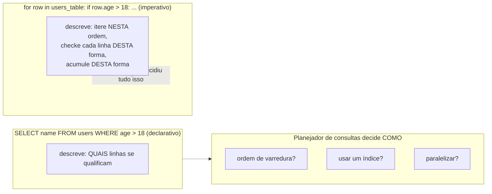

## Objetivos de Aprendizagem

- Definir programação declarativa como descrever o resultado desejado, em vez do procedimento que o produz, e contrastá-la diretamente com programação imperativa.
- Ler e escrever uma consulta SQL simples, e explicar o que o motor de banco de dados está livre para decidir que a própria consulta nunca especifica.
- Traduzir uma pequena consulta SQL para pseudocódigo imperativo equivalente, e identificar exatamente quais decisões a versão imperativa torna explícitas que a versão declarativa deixa implícitas.
- Explicar por que programação lógica (fatos, regras, e consultas) também é declarativa em espírito, e conectar os dois conceitos explicitamente.
- Identificar código declarativo em contextos não familiares reconhecendo a ausência de fluxo de controle explícito descrevendo *como* um resultado é produzido.

## Contexto e Motivação

Todo paradigma coberto até agora nesta disciplina, com uma exceção parcial, pede para você escrever um *procedimento*: uma sequência de passos (imperativo), uma cadeia de chamadas de método em objetos (orientado a objetos), uma composição de aplicações de função (funcional), até mesmo uma estratégia de busca de certo tipo implícita em como fatos e regras são ordenados (programação lógica, embora ali a própria maquinaria de busca esteja escondida). Programação declarativa leva essa ideia à sua conclusão natural: você descreve *qual* resultado quer, com tanto ou tão pouco detalhe estrutural quanto a linguagem fornece, e deixa *como* chegar lá inteiramente para o sistema executando sua descrição. O sistema, um motor de banco de dados, uma ferramenta de build, um interpretador lógico, está então livre para escolher qualquer estratégia de execução que julgue melhor, incluindo estratégias que você nunca considerou e talvez nem entenda, contanto que o resultado corresponda ao que você pediu.

O exemplo real mais amplamente usado dessa ideia, de longe, é SQL. Uma consulta como `SELECT name FROM users WHERE age > 18` diz exatamente uma coisa: "me dê o `name` de toda linha em `users` onde `age` é maior que 18." Não diz nada sobre se o motor de banco de dados deveria varrer toda linha em ordem, usar um índice em `age` para pular direto para a faixa qualificante, rodar a varredura em paralelo através de múltiplos núcleos, ou fazer cache do resultado de uma consulta idêntica rodada cinco segundos atrás. Todas essas são estratégias reais que um motor de banco de dados de produção poderia de fato escolher, dinamicamente, com base no tamanho da tabela, índices existentes, e estatísticas do planejador de consultas, e a própria consulta é silenciosa sobre tudo isso, deliberadamente. Isso não é uma limitação do SQL; é o ponto inteiro. Todo banco de dados relacional construído desde os anos 1970 foi desenhado em torno exatamente dessa separação: a consulta descreve o *quê*, e um componente chamado planejador de consultas ou otimizador de consultas decide o *como*, frequentemente mudando aquela decisão ao longo do tempo conforme os dados subjacentes e índices mudam, sem que a própria consulta jamais precise ser reescrita.

Essa ideia já deveria parecer meio familiar. Programação lógica, fatos, regras, e consultas, coberta no conceito anterior, é declarativa exatamente no mesmo sentido: uma consulta Prolog como `?- grandparent(tom, X).` descreve um relacionamento a ser buscado, e a busca de unificação-e-retrocesso que de fato encontra `X = ann` e `X = pat` é realizada inteiramente pelo motor de inferência embutido da linguagem, nunca escrita pelo programador. SQL e Prolog são, nesse sentido específico, primos próximos, ambos nascidos da mesma convicção subjacente de que uma classe muito grande e importante de programas deveria ser expressa como descrições de resultados, com a estratégia de busca ou recuperação delegada a um motor de propósito geral em vez de escrita à mão de novo a cada vez.

## Teoria Central

### A distinção central: o quê versus como

**Programação declarativa** descreve as propriedades que um resultado precisa ter, sem especificar a sequência de operações usada para calculá-lo. **Programação imperativa** (e, em graus variados, orientada a objetos e até muito código funcional do dia a dia) descreve a sequência de operações diretamente, um laço, uma checagem condicional, um procedimento explícito passo a passo que o leitor pode rastrear do início ao fim para ver exatamente como o resultado é produzido. A distinção não é sobre qual linguagem você está usando em algum sentido absoluto (uma linguagem de propósito geral como Python é usada imperativamente muito mais frequentemente que declarativamente), é sobre um pedaço específico de código, e se aquele código nomeia um procedimento ou só um resultado.

### SQL como o exemplo principal

Considere a consulta da seção de Contexto:

```sql
SELECT name FROM users WHERE age > 18;
```

Isso enuncia um *quê*: o conjunto de valores `name` pertencentes a linhas onde `age` excede 18. Não enuncia:
- se deve varrer a tabela linha por linha, ou usar um índice;
- em que ordem checar as linhas;
- se deve rodar a checagem em paralelo;
- como representar o conjunto correspondente intermediário antes de retornar `name`.

Tudo isso é decisão do motor de banco de dados, tomada por um componente frequentemente chamado **planejador de consultas** ou **otimizador de consultas**, que inspeciona a consulta, consulta estatísticas sobre a tabela (seu tamanho, se existe um índice em `age`, quão seletiva a condição provavelmente será), e escolhe um plano de execução concreto. Crucialmente, a *mesma consulta* pode ser executada por duas estratégias diferentes em dois dias diferentes, conforme a tabela cresce ou um índice é adicionado, com zero mudanças no próprio SQL, porque o SQL nunca se comprometeu com uma estratégia em primeiro lugar.

### O equivalente imperativo, tornado explícito

Para ver exatamente o que SQL deixa de fora, escreva a lógica equivalente como um procedimento explícito:

```python
# Equivalente imperativo de: SELECT name FROM users WHERE age > 18
results = []
for row in users_table:        # ordem de iteração explícita: ordem da tabela, do início ao fim
    if row["age"] > 18:        # checagem por linha explícita
        results.append(row["name"])  # acumulação explícita
# results agora contém exatamente o que a consulta SQL teria retornado
```

Esta versão nomeia um *como*: itere a tabela em uma ordem específica, checa o `age` de cada linha uma de cada vez, constrói uma lista de resultado anexando. Mude a ordem de armazenamento físico da tabela, e o *comportamento* deste código (qual linha é checada primeiro) muda junto, mesmo que sua *saída* não mude, o laço se comprometeu com um procedimento que a versão SQL nunca fez. Nada aqui está errado, e para muitos propósitos escrever o laço é exatamente o nível certo de controle, mas é um tipo de enunciado fundamentalmente diferente da consulta SQL: um nomeia passos, o outro nomeia só o resultado desejado.



### A conexão de volta com programação lógica

Uma consulta Prolog, `?- grandparent(tom, X).`, é declarativa precisamente no mesmo sentido estrutural que o exemplo SQL: nomeia um relacionamento (X tal que tom é avô de X) e deixa o procedimento de busca, unificação contra fatos e regras, em qualquer ordem que a estratégia de resolução do motor ditar, inteiramente para o motor de inferência subjacente. Tanto SQL quanto Prolog delegam "como eu de fato encontro isso" a um motor de propósito geral construído uma vez e reutilizado para toda consulta; as próprias consultas de nenhuma das linguagens jamais codificam um laço de busca. Essa estrutura compartilhada é exatamente por que programação lógica é frequentemente citada, ao lado de SQL, como uma das duas ilustrações mais claras em larga escala da ideia declarativa, uma busca em uma tabela relacional, a outra busca em uma base de fatos e regras, mas a *forma* da delegação (descreva o resultado, deixe o motor encontrá-lo) é idêntica.

### Declarativo é um espectro, não uma categoria estrita

Muito poucas linguagens reais são puramente uma coisa ou outra. A maior parte do uso de SQL é completamente declarativa, mas um único script SQL também pode conter extensões procedurais de sabor imperativo (procedimentos armazenados com laços e condicionais). A maior parte do uso de Python é completamente imperativa, mas uma compreensão de lista como `[name for row in users if row["age"] > 18 for name in [row["name"]]]` gesticula em direção ao extremo declarativo, no sentido de que descreve a coleção resultante mais do que a mecânica passo a passo de construí-la, mesmo que, por baixo, Python ainda a execute como um laço. Trate "declarativo" e "imperativo" como duas pontas de um espectro onde um pedaço específico de código se situa em algum lugar ao longo, não como duas caixas disjuntas em que toda linguagem cai de forma limpa.

## Exemplos Resolvidos

### Exemplo 1 — SQL: uma consulta de filtro-e-projeção, e a liberdade de seu planejador de consultas

**Problema (SQL).** Dada uma tabela `users(id, name, age, city)` com um milhão de linhas e um índice existente em `age`, recupere os nomes de todos os usuários com mais de 18 anos.

```sql
SELECT name FROM users WHERE age > 18;
```

**Raciocínio.** A consulta nomeia exatamente duas coisas: a projeção (`name`) e a condição de filtro (`age > 18`). Dado o índice existente em `age`, um planejador de consultas realista muito provavelmente escolheria uma varredura de índice, pular diretamente para a faixa de entradas de índice onde `age > 18`, depois buscar só os valores `name` daquelas linhas, em vez de varrer todo o milhão de linhas uma por uma. Se aquele índice não existisse, o planejador poderia em vez disso escolher uma varredura completa da tabela. De qualquer forma, o próprio texto SQL permanece completamente inalterado; a escolha de estratégia vive inteiramente no motor, informada por informação (o índice) que a consulta nunca precisou mencionar.

### Exemplo 2 — a mesma consulta, tornada imperativa, para ver o que agora está fixo

**Problema (Python).** Escreva o equivalente baseado em laço da consulta SQL do Exemplo 1, assumindo que `users_table` é uma lista de dicionários, e nomeie toda decisão que esta versão toma que a versão SQL deixou em aberto.

```python
matching_names = []
for row in users_table:            # decisão 1: iterar na ordem da lista, nenhum índice usado
    if row["age"] > 18:            # decisão 2: checar toda linha, uma de cada vez
        matching_names.append(row["name"])  # decisão 3: acumular em uma lista, na ordem de varredura
```

**Raciocínio.** Este código produz o conjunto idêntico de nomes da consulta SQL (módulo ordenação, que SQL também deixa não especificada a menos que um `ORDER BY` seja adicionado), mas se comprometeu, explícita e irreversivelmente sem edições adicionais, com um procedimento específico: varrer a lista inteira, na ordem em que está armazenada, checando uma linha de cada vez. Se `users_table` crescesse para conter um milhão de linhas e este laço se tornasse um problema de desempenho, *corrigi-lo* (adicionar uma estrutura de busca tipo índice, paralelizar a varredura) exigiria reescrever este código, enquanto a versão SQL poderia absorver exatamente essa mesma melhoria com o motor de banco de dados adicionando um índice, com o texto da consulta intocado.

### Exemplo 3 — uma consulta com agrupamento, e o como que ela esconde

**Problema (SQL).** Conte quantos usuários existem por cidade.

```sql
SELECT city, COUNT(*) AS user_count
FROM users
GROUP BY city;
```

**Raciocínio.** Isso enuncia: particione as linhas por `city`, e para cada partição, reporte seu tamanho. Não diz se o motor constrói uma tabela hash indexada por cidade (uma passagem, acumulando contagens conforme avança), ordena as linhas por cidade primeiro e depois conta sequências consecutivas, ou usa um índice pré-construído em `city` para pular direto para contagens por cidade. Qualquer uma dessas é uma estratégia legítima que um motor real poderia escolher, e, como no Exemplo 1, a escolha pode mudar ao longo do tempo conforme a tabela cresce ou novos índices aparecem, com o texto SQL permanecendo exatamente como escrito. Contraste isso com a versão imperativa equivalente, que precisaria escolher explicitamente uma dessas estratégias (mais naturalmente, construir um dicionário indexado por cidade e incrementar um contador por linha) e precisaria ser editada à mão para trocar de estratégia depois.

## Equívocos Comuns e Armadilhas

- **"Código declarativo é só código imperativo com uma sintaxe mais bonita, o laço ainda está 'de verdade' acontecendo por baixo, então é a mesma coisa."** É verdade que *algo* executa por baixo de toda consulta declarativa, mas a diferença crucial é que o próprio texto da consulta nunca se comprometeu com uma estratégia de execução específica, e o motor está livre para mudar aquela estratégia (adicionar um índice, trocar de algoritmo) sem que a consulta mude. Código imperativo, em contraste, codificou a estratégia diretamente no próprio código; mudar a estratégia significa editar o código.
- **"SQL não tem controle nenhum sobre desempenho, já que você não pode especificar o algoritmo."** Você influencia desempenho pesada e legitimamente, adicionando índices, por como você estrutura a consulta, por configuração do banco de dados, mas você o faz através de mecanismos *diferentes* de ditar o procedimento exato dentro da própria consulta. Este é um tipo diferente de controle do de um laço imperativo, não uma ausência de controle.
- **"Declarativo e imperativo são duas categorias completamente separadas de linguagem."** Como a Teoria Central observa, é mais preciso tratar isso como um espectro ao longo do qual pedaços específicos de código se situam, uma linguagem de propósito geral como Python é usada declarativamente às vezes (compreensões, certas chamadas de biblioteca) e imperativamente muito mais frequentemente, e até o SQL majoritariamente declarativo suporta extensões procedurais.
- **"Programação lógica e SQL não têm relação, já que uma usa `SELECT` e a outra usa `?-`."** A sintaxe difere completamente, mas a ideia subjacente, descreva o resultado, delegue a busca a um motor de propósito geral, é o mesmo movimento estrutural em ambas, o que é exatamente por que são apresentadas juntas nesta disciplina como as duas ilustrações mais claras de programação declarativa.
- **"Se eu não consigo ver o como, não consigo raciocinar sobre correção."** Você raciocina sobre a correção de uma consulta declarativa checando que sua *descrição* do resultado é precisa (esta cláusula WHERE de fato captura "mais de 18 anos"?), não rastreando um caminho de execução, essa mudança, de rastrear passos para checar uma descrição, é ela mesma um dos benefícios práticos de escrever declarativamente quando é a ferramenta certa para o trabalho.

## Resumo

Programação declarativa significa descrever as propriedades que um resultado precisa ter e deixar o procedimento que o produz para o sistema executando a descrição, em contraste direto com os procedimentos explícitos, passo a passo, da programação imperativa. SQL é o exemplo real mais amplamente usado: `SELECT name FROM users WHERE age > 18` nomeia um *quê* (os nomes das linhas qualificantes) e deixa toda decisão de *como*, ordem de varredura, uso de índice, paralelização, para o planejador de consultas do motor de banco de dados, que pode mudar de estratégia ao longo do tempo sem que o texto da consulta jamais mude, diferente do laço imperativo equivalente, que codifica um procedimento específico diretamente no próprio código. Esta é exatamente a mesma ideia estrutural já vista em programação lógica: uma consulta Prolog também nomeia um relacionamento e delega a busca (unificação e retrocesso) a um motor de propósito geral, o que é por que SQL e programação lógica são tratados juntos como as duas ilustrações mais claras em larga escala de "o quê, não como." Declarativo e imperativo são melhor entendidos como duas pontas de um espectro ao longo do qual um dado pedaço de código se situa, não como categorias fixas, disjuntas, de duas linguagens.

## Documentation Links

- [ACM/IEEE CS2013 — Programming Languages Knowledge Area](https://csed.acm.org/knowledge-areas-programming-languages-pl-cs2013-version/) — doc
- [MIT SICP — Wikipedia (course/book overview)](https://en.wikipedia.org/wiki/Structure_and_Interpretation_of_Computer_Programs) — doc
