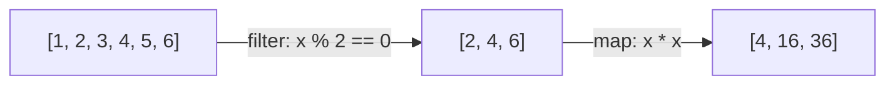
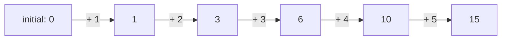

## Learning Objectives

- Define a higher-order function as one that takes another function as an argument, returns one, or both.
- Solve a given transform-and-select problem using `map` and `filter`, and explain what each one abstracts away from an explicit loop.
- Use `functools.reduce` to collapse a sequence into a single accumulated value, and state what its three arguments each mean.
- Rewrite an explicit accumulator loop as an equivalent `map`/`filter`/`reduce` pipeline, and vice versa.
- Compare the two styles for the same problem and identify what each communicates about the computation that the other leaves implicit.

## Context & Motivation

You've already seen that a function in Python is an ordinary object — it can be assigned to a variable, stored in a dictionary, passed as an argument, or returned from another function, exactly like any other value. That earlier material treated this as a language feature: a useful mechanic, illustrated through dispatch tables and `sorted(..., key=...)`. Here, that same mechanic stops being one useful trick among several and becomes the **central idiom of an entire paradigm**. Functional programming's characteristic style isn't just "functions happen to be values" — it's built on functions whose entire *purpose* is to take other functions as arguments, using them to abstract away the explicit control flow that imperative loops spell out by hand. A function that takes another function as an argument, returns one, or both, is called a **higher-order function**, and three of them — `map`, `filter`, and `reduce` — form the backbone of how functional code expresses "do something to every element," "keep only some elements," and "combine everything into one result," replacing the `for` loop as the default tool for each.

The shift is easiest to see against a single concrete problem, solved both ways. Take: given a list of numbers, get the squares of the even ones. The imperative style — the one already covered as its own paradigm — states this as a sequence of steps: start an empty accumulator list, walk the input one element at a time, test each one, and conditionally append a computed value to the accumulator. The functional style states the exact same problem as a composition of two higher-order functions, each parameterized by a small function describing *what* to do, with no explicit loop or accumulator variable written anywhere by the programmer at all. Neither style computes anything the other can't — but they communicate the computation differently, and that difference in what's explicit versus implicit is exactly what distinguishes the two paradigms in practice.

This material traces directly to the same course line that introduced functions as first-class values and paradigm-level treatments of functional programming (SICP builds its central methodology around exactly this move — describing computation via composed, general-purpose combinators like `map` rather than hand-written loops). Recognizing `map`, `filter`, and `reduce` as higher-order functions — not just three isolated built-ins to memorize — is what makes the rest of functional programming click: closures, which come next, are frequently what a higher-order function *returns*, and the whole paradigm depends on treating "pass a function as an argument" as the default way to parameterize behavior, not a special case.

## Core Theory

### What makes a function "higher-order"

A **higher-order function** is any function that does at least one of the following: takes one or more functions as arguments, returns a function as its result, or both. `map`, `filter`, and `functools.reduce` all take a function as their first argument — that argument tells each one *what* to do to each element, while the higher-order function itself supplies the looping and combining logic once, generically, for any function you hand it. This is the direct generalization of the earlier `sorted(words, key=len)` pattern: there, one specific higher-order function (`sorted`) took one specific kind of function argument (a comparison key). Here, three general-purpose higher-order functions each take an arbitrary function argument to parameterize a different, common shape of loop.

### The same problem, two ways: squares of the even numbers

**Imperative style** — an explicit loop with an accumulator, the pattern already covered under imperative programming:

```python
def squares_of_evens_imperative(numbers):
    result = []
    for n in numbers:
        if n % 2 == 0:
            result.append(n * n)
    return result

squares_of_evens_imperative([1, 2, 3, 4, 5, 6])   # [4, 16, 36]
```

Every step here is spelled out by hand: the accumulator's initial state, the loop that visits each element, the conditional test, and the mutation that grows the accumulator.

**Functional style** — compose `filter` (keep only the even numbers) with `map` (square what's left), with no accumulator variable and no explicit loop written by the programmer:

```python
evens_squared = list(map(lambda x: x * x, filter(lambda x: x % 2 == 0, numbers)))
```

Or, equivalently, as a list comprehension — Python's own syntactic sugar over exactly this same map/filter composition:

```python
evens_squared = [x * x for x in numbers if x % 2 == 0]
```



Both the `map`/`filter` version and the comprehension compute identically to the imperative loop — but neither one names an accumulator or writes out the stepping logic; both simply describe *what* each stage does, and leave *how* elements get visited and combined to `map` and `filter` themselves.

### `map`: apply a function to every element

`map(function, iterable)` returns an iterator that applies `function` to each element of `iterable` in turn, producing one output per input, in order:

```python
prices = [19.99, 5.50, 100.00]
with_tax = list(map(lambda p: round(p * 1.08, 2), prices))
print(with_tax)   # [21.59, 5.94, 108.0]
```

`map` never changes how many elements there are — it transforms each one independently, in place in the output sequence, with no way for one element's transformation to depend on any other's.

### `filter`: keep only the elements that pass a test

`filter(predicate, iterable)` returns an iterator containing only the elements for which `predicate(element)` is truthy — `predicate` is a function returning `True` or `False` (or any truthy/falsy value), evaluated once per element:

```python
words = ["apple", "fig", "banana", "kiwi", "watermelon"]
long_words = list(filter(lambda w: len(w) > 4, words))
print(long_words)   # ['apple', 'banana', 'watermelon']
```

Unlike `map`, `filter` can and typically does change how many elements come out — it selects a subset, dropping every element the predicate rejects, without transforming the ones it keeps.

### `reduce`: collapse a sequence into a single value

`functools.reduce(function, iterable, initial)` repeatedly applies a two-argument `function` — first to `initial` and the first element, then to that result and the next element, and so on — collapsing the entire sequence down to one final value:

```python
from functools import reduce

numbers = [1, 2, 3, 4, 5]
total = reduce(lambda acc, x: acc + x, numbers, 0)
print(total)   # 15
```



`function`'s first argument (`acc`, for "accumulator") carries the running result forward from one call to the next; `initial` seeds that running result before the first real element is folded in. `reduce(lambda acc, x: acc * x, [1, 2, 3, 4], 1)` computes a factorial-style product (`24`) the same way; the only thing that changes between different uses of `reduce` is which combining function is handed in — the folding-one-at-a-time mechanism itself never changes.

### Where `map`/`filter`/`reduce` and the explicit loop diverge

An explicit loop names an accumulator variable and mutates it directly, which means the loop body can, in principle, do anything at all to that accumulator, including operations unrelated to the stated purpose of the loop. `map`, `filter`, and `reduce` each constrain what's possible far more narrowly: `map` can only transform elements one at a time and cannot change their count; `filter` can only select a subset and cannot transform what it selects; `reduce` can only fold elements pairwise into a running total using the exact combining function it's given. This narrowness is a deliberate trade — less flexibility in exchange for code whose *shape* immediately tells a reader which of these three things is happening, without needing to read the loop body to find out.

## Worked Examples

### Example 1 — `map` used standalone: converting units

**Problem:** given a list of distances in miles, convert every one to kilometers.

```python
miles = [1, 5, 26.2, 100]
kilometers = list(map(lambda m: m * 1.60934, miles))
print(kilometers)   # [1.60934, 8.0467, 42.16471, 160.934]
```

`map` applies the conversion to every element independently; no element's converted value depends on any other's, and the output has exactly as many elements as the input — the defining shape of a `map` operation.

### Example 2 — `filter` used standalone: validating a batch of records

**Problem:** given a list of ages, keep only the ones representing adults (18 or older).

```python
ages = [15, 22, 8, 45, 17, 30]
adults = list(filter(lambda age: age >= 18, ages))
print(adults)   # [22, 45, 30]
```

`filter` here does no transformation at all — every value it keeps passes through unchanged; it only decides, element by element, whether that value belongs in the output.

### Example 3 — `reduce` used standalone: finding the maximum without `max()`

**Problem:** find the largest value in a list using `reduce` instead of the built-in `max`.

```python
from functools import reduce

scores = [42, 17, 89, 63, 91, 8]

def bigger(a, b):
    return a if a > b else b

largest = reduce(bigger, scores)
print(largest)   # 91
```

Without an explicit `initial` argument, `reduce` uses the sequence's own first element (`42`) as the starting accumulator and folds in the rest one at a time — `bigger(42, 17)` → `42`, `bigger(42, 89)` → `89`, and so on until every element has been compared exactly once. This demonstrates `reduce`'s generality: it isn't just for sums or products, but for collapsing a sequence via *any* two-argument combining rule, including one that discards one of its two inputs each time, as `bigger` does.

### Example 4 — the full pipeline, and its imperative twin, side by side

**Problem:** given order totals, compute the total revenue from orders over $50, after a 10% discount is applied to each.

Imperative version:

```python
def revenue_imperative(totals):
    result = 0
    for t in totals:
        if t > 50:
            result += t * 0.9
    return result

revenue_imperative([30, 80, 120, 45, 60])   # 234.0
```

Functional version, composing all three higher-order functions in one pipeline:

```python
from functools import reduce

totals = [30, 80, 120, 45, 60]
revenue = reduce(
    lambda acc, t: acc + t,
    map(lambda t: t * 0.9, filter(lambda t: t > 50, totals)),
    0,
)
print(revenue)   # 234.0
```

The functional version reads as three named stages — filter the qualifying orders, discount each one, sum what's left — with no accumulator variable ever assigned or mutated by hand; the imperative version does the identical arithmetic, but the "filter," "discount," and "sum" steps are interleaved inside a single loop body rather than named as separate, composable stages.

## Common Misconceptions & Pitfalls

- **"`map` and a list comprehension are different operations, not two spellings of the same idea."** `[f(x) for x in xs]` and `list(map(f, xs))` compute identically — a comprehension is Python's own built-in syntax for exactly the same operation `map` performs, and `[x for x in xs if p(x)]` is the same relationship to `filter`. Neither is "more functional" than the other; the choice between them is purely stylistic, and Python's own style guidance often prefers comprehensions for readability.
- **"`reduce` is obscure and rarely needed — sums and products cover its only real uses."** `sum()` and the built-in `max`/`min` cover the two most common special cases, which is exactly why `reduce` can look unnecessary at first — but `reduce`'s generality is the point: any "combine everything pairwise into one result" computation (concatenating strings, finding the most frequent item, composing a sequence of functions) fits the same shape, with only the combining function changing.
- **"Since `map` and `filter` return iterators, `map(f, xs)` already IS the list of results."** `map` and `filter` in Python 3 are lazy — they return an iterator object, not a list, and nothing is actually computed until that iterator is consumed (by `list(...)`, a `for` loop, or similar). Printing a bare `map(f, xs)` shows something like `<map object at 0x...>`, not the transformed values, which surprises anyone expecting Python 2's eager behavior.
- **"Chaining `map`/`filter`/`reduce` is always clearer than a loop, so it should always be preferred."** The pipeline in Example 4 reads cleanly for three simple stages; a pipeline nesting five or six stages of `map`/`filter`/`reduce`, each with a nontrivial lambda, can become harder to read than an equivalent loop with clearly named intermediate variables. The paradigm's value is in what it makes explicit for simple, composable transformations — not a guarantee that more composition is always more readable.

## Summary

A higher-order function is one that takes a function as an argument, returns one, or both — and where the earlier material on functions-as-values introduced this as a language mechanic, `map`, `filter`, and `reduce` turn it into the functional paradigm's primary way of expressing computation over a sequence, replacing the explicit loop. `map` transforms every element independently, preserving the count; `filter` selects a subset, preserving each kept element unchanged; `functools.reduce` folds an entire sequence pairwise into one accumulated value, seeded by an optional initial value. The same problem — squares of the even numbers, revenue from qualifying orders — can always be written either as an explicit accumulator loop or as a composition of these three higher-order functions; both compute the same answer, but the functional version names each stage of the computation directly, while the imperative version interleaves them inside one loop body.

## Documentation Links

- [University of Washington / Coursera — Programming Languages, Part A (Grossman)](https://www.coursera.org/learn/programming-languages) — doc
- [MIT SICP — Wikipedia (course/book overview)](https://en.wikipedia.org/wiki/Structure_and_Interpretation_of_Computer_Programs) — doc
