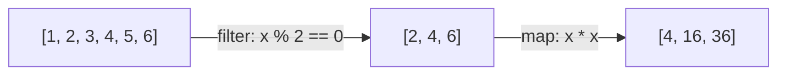
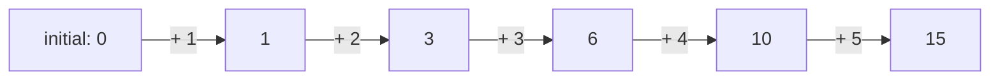

## Objetivos de Aprendizagem

- Definir uma função de ordem superior como aquela que recebe outra função como argumento, retorna uma, ou ambos.
- Resolver um dado problema de transformar-e-selecionar usando `map` e `filter`, e explicar o que cada uma abstrai de um laço explícito.
- Usar `functools.reduce` para colapsar uma sequência em um único valor acumulado, e enunciar o que cada um de seus três argumentos significa.
- Reescrever um laço acumulador explícito como um pipeline `map`/`filter`/`reduce` equivalente, e vice-versa.
- Comparar os dois estilos para o mesmo problema e identificar o que cada um comunica sobre a computação que o outro deixa implícito.

## Contexto e Motivação

Você já viu que uma função em Python é um objeto comum, pode ser atribuída a uma variável, armazenada em um dicionário, passada como um argumento, ou retornada de outra função, exatamente como qualquer outro valor. Aquele material anterior tratou isso como um recurso de linguagem: uma mecânica útil, ilustrada através de tabelas de despacho e `sorted(..., key=...)`. Aqui, essa mesma mecânica para de ser um truque útil entre vários e se torna o **idioma central de um paradigma inteiro**. O estilo característico da programação funcional não é só "funções acontecem de ser valores", é construído sobre funções cujo *propósito* inteiro é receber outras funções como argumentos, usando-as para abstrair o fluxo de controle explícito que laços imperativos soletram manualmente. Uma função que recebe outra função como argumento, retorna uma, ou ambos, é chamada uma **função de ordem superior**, e três delas, `map`, `filter`, e `reduce`, formam a espinha dorsal de como código funcional expressa "faça algo a todo elemento", "mantenha só alguns elementos", e "combine tudo em um resultado", substituindo o laço `for` como a ferramenta padrão para cada uma.

A mudança é mais fácil de ver contra um único problema concreto, resolvido de ambas as formas. Tome: dada uma lista de números, obtenha os quadrados dos pares. O estilo imperativo, aquele já coberto como seu próprio paradigma, enuncia isso como uma sequência de passos: comece uma lista acumuladora vazia, percorra a entrada um elemento de cada vez, teste cada um, e condicionalmente anexe um valor calculado ao acumulador. O estilo funcional enuncia o exato mesmo problema como uma composição de duas funções de ordem superior, cada uma parametrizada por uma pequena função descrevendo *o quê* fazer, sem nenhum laço explícito ou variável acumuladora escrita em lugar nenhum pelo programador afinal. Nenhum estilo calcula algo que o outro não consegue, mas comunicam a computação diferentemente, e essa diferença no que é explícito versus implícito é exatamente o que distingue os dois paradigmas na prática.

Este material remonta diretamente à mesma linha de curso que introduziu funções como valores de primeira classe e tratamentos de nível de paradigma de programação funcional (o SICP constrói sua metodologia central em torno exatamente desse movimento, descrevendo computação via combinadores compostos, de propósito geral como `map` em vez de laços escritos à mão). Reconhecer `map`, `filter`, e `reduce` como funções de ordem superior, não só três embutidos isolados para memorizar, é o que faz o resto de programação funcional clicar: closures, que vêm em seguida, são frequentemente o que uma função de ordem superior *retorna*, e o paradigma inteiro depende de tratar "passe uma função como um argumento" como a forma padrão de parametrizar comportamento, não um caso especial.

## Teoria Central

### O que torna uma função "de ordem superior"

Uma **função de ordem superior** é qualquer função que faz pelo menos uma das seguintes: recebe uma ou mais funções como argumentos, retorna uma função como seu resultado, ou ambos. `map`, `filter`, e `functools.reduce` todas recebem uma função como seu primeiro argumento, aquele argumento diz a cada uma *o que* fazer a cada elemento, enquanto a própria função de ordem superior fornece a lógica de laço e combinação uma vez, genericamente, para qualquer função que você entregue. Essa é a generalização direta do padrão anterior `sorted(words, key=len)`: ali, uma função de ordem superior específica (`sorted`) recebia um tipo específico de argumento de função (uma chave de comparação). Aqui, três funções de ordem superior de propósito geral cada uma recebe um argumento de função arbitrário para parametrizar um formato diferente, comum, de laço.

### O mesmo problema, duas formas: quadrados dos números pares

**Estilo imperativo**, um laço explícito com um acumulador, o padrão já coberto sob programação imperativa:

```python
def squares_of_evens_imperative(numbers):
    result = []
    for n in numbers:
        if n % 2 == 0:
            result.append(n * n)
    return result

squares_of_evens_imperative([1, 2, 3, 4, 5, 6])   # [4, 16, 36]
```

Todo passo aqui é soletrado manualmente: o estado inicial do acumulador, o laço que visita cada elemento, o teste condicional, e a mutação que cresce o acumulador.

**Estilo funcional**, compõe `filter` (mantém só os números pares) com `map` (eleva ao quadrado o que resta), sem nenhuma variável acumuladora e nenhum laço explícito escrito pelo programador:

```python
evens_squared = list(map(lambda x: x * x, filter(lambda x: x % 2 == 0, numbers)))
```

Ou, equivalentemente, como uma compreensão de lista, o próprio açúcar sintático do Python sobre exatamente essa mesma composição map/filter:

```python
evens_squared = [x * x for x in numbers if x % 2 == 0]
```



Tanto a versão `map`/`filter` quanto a compreensão calculam identicamente ao laço imperativo, mas nenhuma nomeia um acumulador ou escreve a lógica de passo; ambas simplesmente descrevem *o que* cada estágio faz, e deixam *como* elementos são visitados e combinados para o próprio `map` e `filter`.

### `map`: aplique uma função a todo elemento

`map(function, iterable)` retorna um iterador que aplica `function` a cada elemento de `iterable` por sua vez, produzindo uma saída por entrada, em ordem:

```python
prices = [19.99, 5.50, 100.00]
with_tax = list(map(lambda p: round(p * 1.08, 2), prices))
print(with_tax)   # [21.59, 5.94, 108.0]
```

`map` nunca muda quantos elementos existem, transforma cada um independentemente, no lugar na sequência de saída, sem forma de a transformação de um elemento depender de qualquer outro.

### `filter`: mantenha só os elementos que passam em um teste

`filter(predicate, iterable)` retorna um iterador contendo só os elementos para os quais `predicate(element)` é verdadeiro, `predicate` é uma função retornando `True` ou `False` (ou qualquer valor verdadeiro/falso), avaliada uma vez por elemento:

```python
words = ["apple", "fig", "banana", "kiwi", "watermelon"]
long_words = list(filter(lambda w: len(w) > 4, words))
print(long_words)   # ['apple', 'banana', 'watermelon']
```

Diferente de `map`, `filter` pode e tipicamente muda quantos elementos saem, seleciona um subconjunto, descartando todo elemento que o predicado rejeita, sem transformar os que mantém.

### `reduce`: colapse uma sequência em um único valor

`functools.reduce(function, iterable, initial)` repetidamente aplica uma `function` de dois argumentos, primeiro a `initial` e o primeiro elemento, depois àquele resultado e o próximo elemento, e assim por diante, colapsando a sequência inteira em um valor final único:

```python
from functools import reduce

numbers = [1, 2, 3, 4, 5]
total = reduce(lambda acc, x: acc + x, numbers, 0)
print(total)   # 15
```



O primeiro argumento de `function` (`acc`, de "acumulador") carrega o resultado corrente para frente de uma chamada para a próxima; `initial` semeia aquele resultado corrente antes que o primeiro elemento real seja dobrado. `reduce(lambda acc, x: acc * x, [1, 2, 3, 4], 1)` calcula um produto estilo fatorial (`24`) da mesma forma; a única coisa que muda entre usos diferentes de `reduce` é qual função combinadora é entregue, o próprio mecanismo de dobrar-um-de-cada-vez nunca muda.

### Onde `map`/`filter`/`reduce` e o laço explícito divergem

Um laço explícito nomeia uma variável acumuladora e a muta diretamente, o que significa que o corpo do laço pode, em princípio, fazer qualquer coisa afinal àquele acumulador, incluindo operações não relacionadas ao propósito declarado do laço. `map`, `filter`, e `reduce` cada uma restringe o que é possível muito mais estreitamente: `map` só pode transformar elementos um de cada vez e não pode mudar sua contagem; `filter` só pode selecionar um subconjunto e não pode transformar o que seleciona; `reduce` só pode dobrar elementos par-a-par em um total corrente usando exatamente a função combinadora que recebe. Essa estreiteza é uma troca deliberada, menos flexibilidade em troca de código cujo *formato* imediatamente diz a um leitor qual dessas três coisas está acontecendo, sem precisar ler o corpo do laço para descobrir.

## Exemplos Resolvidos

### Exemplo 1: `map` usado isoladamente: convertendo unidades

**Problema:** dada uma lista de distâncias em milhas, converta cada uma para quilômetros.

```python
miles = [1, 5, 26.2, 100]
kilometers = list(map(lambda m: m * 1.60934, miles))
print(kilometers)   # [1.60934, 8.0467, 42.16471, 160.934]
```

`map` aplica a conversão a todo elemento independentemente; o valor convertido de nenhum elemento depende de qualquer outro, e a saída tem exatamente tantos elementos quanto a entrada, o formato definidor de uma operação `map`.

### Exemplo 2: `filter` usado isoladamente: validando um lote de registros

**Problema:** dada uma lista de idades, mantenha só as que representam adultos (18 ou mais).

```python
ages = [15, 22, 8, 45, 17, 30]
adults = list(filter(lambda age: age >= 18, ages))
print(adults)   # [22, 45, 30]
```

`filter` aqui não faz nenhuma transformação afinal, todo valor que mantém passa inalterado; só decide, elemento por elemento, se aquele valor pertence à saída.

### Exemplo 3: `reduce` usado isoladamente: encontrando o máximo sem `max()`

**Problema:** encontre o maior valor em uma lista usando `reduce` em vez do `max` embutido.

```python
from functools import reduce

scores = [42, 17, 89, 63, 91, 8]

def bigger(a, b):
    return a if a > b else b

largest = reduce(bigger, scores)
print(largest)   # 91
```

Sem um argumento `initial` explícito, `reduce` usa o próprio primeiro elemento da sequência (`42`) como o acumulador inicial e dobra o resto um de cada vez, `bigger(42, 17)` → `42`, `bigger(42, 89)` → `89`, e assim por diante até que todo elemento tenha sido comparado exatamente uma vez. Isso demonstra a generalidade de `reduce`: não é só para somas ou produtos, mas para colapsar uma sequência via *qualquer* regra combinadora de dois argumentos, incluindo uma que descarta uma de suas duas entradas toda vez, como `bigger` faz.

### Exemplo 4: o pipeline completo, e seu gêmeo imperativo, lado a lado

**Problema:** dados totais de pedido, calcule a receita total de pedidos acima de $50, depois que um desconto de 10% é aplicado a cada um.

Versão imperativa:

```python
def revenue_imperative(totals):
    result = 0
    for t in totals:
        if t > 50:
            result += t * 0.9
    return result

revenue_imperative([30, 80, 120, 45, 60])   # 234.0
```

Versão funcional, compondo as três funções de ordem superior em um pipeline:

```python
from functools import reduce

totals = [30, 80, 120, 45, 60]
revenue = reduce(
    lambda acc, t: acc + t,
    map(lambda t: t * 0.9, filter(lambda t: t > 50, totals)),
    0,
)
print(revenue)   # 234.0
```

A versão funcional se lê como três estágios nomeados, filtre os pedidos qualificados, desconte cada um, some o que resta, sem nenhuma variável acumuladora jamais atribuída ou mutada manualmente; a versão imperativa faz a aritmética idêntica, mas os passos "filtrar," "descontar," e "somar" estão intercalados dentro de um único corpo de laço em vez de nomeados como estágios separados, compostos.

## Equívocos Comuns e Armadilhas

- **"`map` e uma compreensão de lista são operações diferentes, não duas grafias da mesma ideia."** `[f(x) for x in xs]` e `list(map(f, xs))` calculam identicamente, uma compreensão é a própria sintaxe embutida do Python para exatamente a mesma operação que `map` realiza, e `[x for x in xs if p(x)]` é a mesma relação com `filter`. Nenhuma é "mais funcional" que a outra; a escolha entre elas é puramente estilística, e a própria orientação de estilo do Python frequentemente prefere compreensões por legibilidade.
- **"`reduce` é obscuro e raramente necessário, somas e produtos cobrem seus únicos usos reais."** `sum()` e os `max`/`min` embutidos cobrem os dois casos especiais mais comuns, que é exatamente por que `reduce` pode parecer desnecessário à primeira vista, mas a generalidade de `reduce` é o ponto: qualquer computação de "combine tudo par-a-par em um resultado" (concatenar strings, encontrar o item mais frequente, compor uma sequência de funções) se encaixa no mesmo formato, com só a função combinadora mudando.
- **"Já que `map` e `filter` retornam iteradores, `map(f, xs)` já É a lista de resultados."** `map` e `filter` no Python 3 são preguiçosos, retornam um objeto iterador, não uma lista, e nada é de fato calculado até que aquele iterador seja consumido (por `list(...)`, um laço `for`, ou similar). Imprimir um `map(f, xs)` puro mostra algo como `<map object at 0x...>`, não os valores transformados, o que surpreende qualquer um esperando o comportamento ávido do Python 2.
- **"Encadear `map`/`filter`/`reduce` é sempre mais claro que um laço, então deveria sempre ser preferido."** O pipeline no Exemplo 4 se lê limpamente para três estágios simples; um pipeline aninhando cinco ou seis estágios de `map`/`filter`/`reduce`, cada um com uma lambda não trivial, pode se tornar mais difícil de ler que um laço equivalente com variáveis intermediárias claramente nomeadas. O valor do paradigma está no que torna explícito para transformações simples, componíveis, não uma garantia de que mais composição é sempre mais legível.

## Resumo

Uma função de ordem superior é aquela que recebe uma função como argumento, retorna uma, ou ambos, e onde o material anterior sobre funções-como-valores introduziu isso como uma mecânica de linguagem, `map`, `filter`, e `reduce` a transformam na forma primária do paradigma funcional de expressar computação sobre uma sequência, substituindo o laço explícito. `map` transforma todo elemento independentemente, preservando a contagem; `filter` seleciona um subconjunto, preservando cada elemento mantido inalterado; `functools.reduce` dobra uma sequência inteira par-a-par em um valor acumulado, semeado por um valor inicial opcional. O mesmo problema, quadrados dos números pares, receita de pedidos qualificados, sempre pode ser escrito ou como um laço acumulador explícito ou como uma composição dessas três funções de ordem superior; ambos calculam a mesma resposta, mas a versão funcional nomeia cada estágio da computação diretamente, enquanto a versão imperativa os intercala dentro de um corpo de laço único.

## Documentation Links

- [University of Washington / Coursera: Programming Languages, Part A (Grossman)](https://www.coursera.org/learn/programming-languages): doc
- [MIT SICP: Wikipedia (course/book overview)](https://en.wikipedia.org/wiki/Structure_and_Interpretation_of_Computer_Programs): doc
