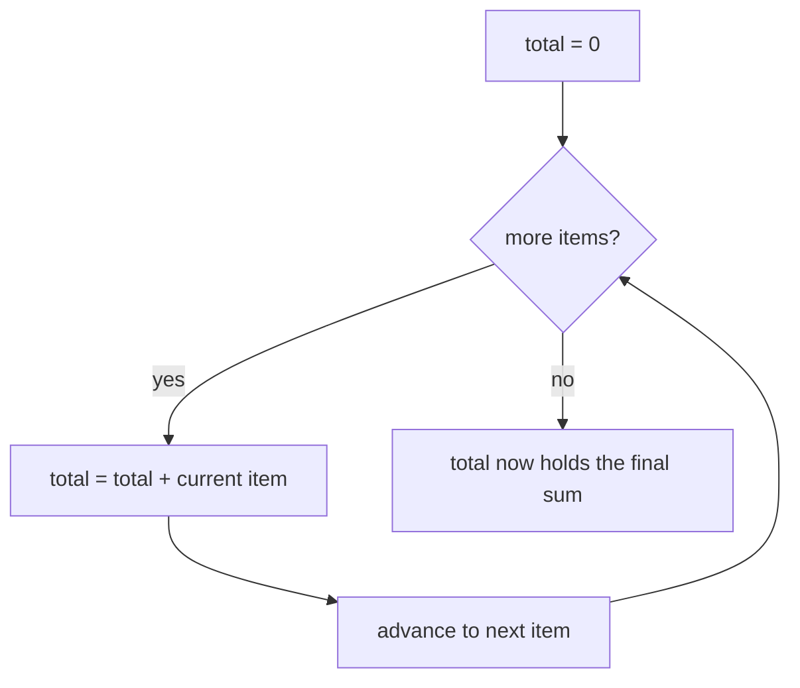

## Learning Objectives

- Define imperative programming by its defining trait: state that changes over time via explicit, ordered instructions.
- Identify the imperative constructs (assignment, loops, mutation) already used in every prior program in this curriculum, and recognize them as a paradigm choice rather than "the default."
- Trace, step by step, how a mutable accumulator variable changes value across the iterations of a loop.
- Contrast the imperative approach to a small problem with a preview of how a different paradigm will approach the identical problem later in this discipline.

## Context & Motivation

Every single program written earlier in this curriculum — every loop that walked over an array, every variable reassigned inside a function, every accumulator that grew as a computation progressed — was, without exception, written in the imperative paradigm. That fact was never stated outright before now, because there was no contrast yet to state it against; a paradigm invisible against a background of nothing but itself simply looks like "how programming works." Now that the previous concept has introduced the idea that a paradigm is a deliberate stance on what a program IS, it becomes possible — and worthwhile — to look back at all of that earlier code and name, precisely, the stance it was quietly taking all along: a program is a sequence of instructions, executed one after another, each one permitted to change the state of the machine (a variable's value, an array's contents, an object's fields), with the final answer emerging as whatever state remains once the sequence finishes running.

This naming matters for a very practical reason. The next several concepts in this discipline will introduce genuinely different stances — object-oriented programming, where behavior is bundled with the data it acts on; functional programming, where mutation is avoided altogether and a "step" is the evaluation of an expression rather than a change to stored state. None of those alternatives will make sense as *alternatives* unless imperative programming is first isolated and named as the specific, particular set of choices it actually is, rather than left as an unexamined background assumption. The University of Washington's Programming Languages course (Grossman), one of the sources this discipline draws its comparative structure from, spends real, deliberate time on exactly this move — walking students through code they already know how to write, and asking them to notice, explicitly, what they were assuming about how computation works the whole time.

Imperative programming's defining trait is state that changes over time: a variable's value at one point in a running program can be different from its value at an earlier point, and the program's behavior depends on that history of changes, not merely on some fixed input-to-output mapping. An assignment statement (`x = x + 1`) is the paradigm's fundamental operation, and a loop is the paradigm's primary tool for repeating that operation many times, its state accumulating across iterations. This is also, not coincidentally, extremely close to how physical computer hardware actually operates — a processor executes instructions one after another, each one capable of overwriting a register or a memory location — which is part of why the imperative style has historically felt like "the natural way to program": it maps almost directly onto the machine underneath. That closeness to the hardware is a genuine, real advantage (imperative code is often easy to reason about in terms of exactly what the machine will do, and easy to optimize for exact performance characteristics), but it is an advantage, not evidence that imperative programming is somehow more fundamentally "correct" than the paradigms that follow it in this discipline. Recognizing it as one paradigm among several — with its own specific trade-offs, not just "the normal way" — is precisely the shift in stance this concept exists to produce, and it sets up the sharpest possible point of comparison for what follows: the very next major topic in this discipline, functional programming, will solve the identical problem worked through below without ever mutating a variable at all.

## Core Theory

### The defining trait: mutable state, changed by explicit instructions

An imperative program's central feature is that variables are *mutable* — a variable is not merely a name bound once to a value, but a storage location whose contents can be overwritten, repeatedly, by later instructions. The assignment statement is the operation that performs this overwrite, and its meaning is fundamentally about *time*: `x = x + 1` does not assert a mathematical equation (it would be false as one, in general) — it instructs the machine to compute the current value of `x`, add one, and store the result back into the same location, replacing whatever was there before. Two consecutive executions of the same line of code can therefore produce two different effects, because the state they act upon has changed in between. This is the single most important thing to notice about imperative programming as a paradigm: correctness reasoning about an imperative program generally requires tracking a whole *sequence* of states — the value of every relevant variable at every point in the program's execution — not just the program's inputs and final output.

### Sequencing, iteration, and the accumulator pattern

Because imperative programs are built from ordered instructions, *sequencing* — doing one thing, then another, in a specific order — is fundamental, and so is *iteration*: repeating a block of instructions, typically via a `for` or `while` loop, often with a *loop variable* that is itself mutated on each pass (an index counting upward, or a pointer moving through a structure). The **accumulator pattern** combines these two ideas and is arguably the single most common idiom in imperative code: a variable is initialized to some starting value before a loop begins, and on every iteration of the loop, that same variable is mutated — its new value computed from its old value plus some contribution from the current iteration. By the time the loop finishes, the accumulator holds the combined result of every iteration's contribution, but that result was never "returned" by a single expression — it was built up, one mutation at a time, as a side effect of the loop running.



### Control flow: the other half of "sequence of instructions"

Beyond assignment and iteration, imperative programming relies on conditional branching (`if`/`else`) to decide, at each point in the sequence, which instruction runs next, and on the ability to jump around that sequence (function calls, early returns, `break`/`continue` inside a loop). All of this reinforces the same underlying model: a program is a path traced through a sequence of possible instructions, with the machine's current state determining, at each branch point, which path is actually taken — and each instruction along that path is free to alter the state that later instructions, and later branch decisions, will see.

### What imperative programming is NOT (a preview of the contrast to come)

It is worth being explicit, here, about what the imperative style specifically commits to, precisely because the next paradigms in this discipline will each reject one of these commitments deliberately. Imperative programming commits to: (1) variables that can be reassigned, not just bound once; (2) a notion of "before" and "after" in a program's execution that actually matters to its correctness; (3) side effects — an instruction's job is often to *change something*, not merely to compute a value. Functional programming (covered later in this discipline) rejects (1) and (3) outright, insisting that computations be expressed as pure, side-effect-free evaluations of expressions. Object-oriented programming (covered next) does not reject mutation, but reorganizes *where* it happens — state and the operations that mutate it get bundled together into objects, rather than sitting as loose variables acted on by loose functions. Seeing imperative programming named and isolated here is what will make each of those later departures legible as a genuine departure, rather than as an arbitrary stylistic variation.

## Worked Examples

### Example 1 — summing a list, the imperative way

**Problem:** Given a list of numbers, compute their sum, using explicit imperative constructs (a mutable accumulator and a loop).

```python
def sum_list(numbers):
    total = 0                  # initialize the accumulator
    for x in numbers:          # sequence through each element, in order
        total = total + x      # mutate the accumulator: overwrite its value
    return total                # the accumulator's final state IS the answer
```

**Tracing execution on `[3, 7, 2, 9]`.**

| Step | `x` | `total` before | `total` after |
|---|---|---|---|
| start | — | — | 0 |
| 1 | 3 | 0 | 3 |
| 2 | 7 | 3 | 10 |
| 3 | 2 | 10 | 12 |
| 4 | 9 | 12 | 21 |

**Reasoning.** Notice what the trace actually shows: `total` is not one fixed thing — it is a storage location whose contents change four separate times over the course of running this one function call. The final answer, 21, is not the result of evaluating some single expression; it is whatever `total` happens to hold at the moment the loop finishes. This is the accumulator pattern in its purest form, and it is worth holding onto this exact trace: a later concept in this discipline's Functional Programming topic solves this identical problem — same input, same output, 21 — using a single reduction expression, with no variable ever assigned more than once and no table of "before/after" states required to understand it. Keep this trace in mind as the point of comparison when that concept arrives.

### Example 2 — finding the maximum, with explicit conditional mutation

**Problem:** Given a non-empty list of numbers, find the largest one imperatively.

```python
def find_max(numbers):
    best = numbers[0]           # seed the accumulator with the first element
    for x in numbers[1:]:       # sequence through the rest, in order
        if x > best:             # a branch point, decided by CURRENT state
            best = x              # conditionally mutate the accumulator
    return best
```

**Reasoning.** This example makes a second imperative ingredient visible alongside the accumulator pattern: conditional mutation. The instruction `best = x` does not run every iteration — whether it runs at all depends on the *current* value of `best`, which is itself the accumulated result of every prior iteration's decisions. Tracing `[3, 7, 2, 9]`: `best` starts at 3; on seeing 7 (7 > 3), `best` becomes 7; on seeing 2 (2 > 7 is false), `best` stays 7; on seeing 9 (9 > 7), `best` becomes 9. The branch condition `x > best` is only meaningful because `best` carries history forward from earlier iterations — remove the notion of mutable, carried-forward state, and the condition `x > best` stops making sense as something that can differ from one iteration to the next.

### Example 3 — the same loop, written with `while` instead of `for`, to expose the loop variable's own mutation

**Problem:** Rewrite Example 1's sum using an explicit index and a `while` loop, to make the mutation of the loop-control variable itself visible (a `for`-over-a-list loop in Python hides this detail).

```python
def sum_list_while(numbers):
    total = 0
    i = 0                        # a second mutable variable: the loop index
    while i < len(numbers):      # branch decision depends on i's current value
        total = total + numbers[i]
        i = i + 1                 # mutate i so the loop eventually terminates
    return total
```

**Reasoning.** This version has two mutable variables instead of one: `total`, accumulating the answer, and `i`, tracking progress through the list and controlling when the loop ends. Both are instances of the same underlying idea — a storage location, overwritten repeatedly, whose current value determines what happens next. Crucially, the loop's termination itself now depends on a piece of mutable state (`i`) crossing a threshold (`len(numbers)`); forgetting to mutate `i` (a classic beginner bug) produces a loop that runs forever, precisely because nothing about the machine's state ever changes to signal that it should stop. This dependence of even the *loop's ending* on mutable state is itself a distinctly imperative concern — it will not have a direct equivalent when this discipline later reaches recursion as functional programming's default way of repeating an action.

## Common Misconceptions & Pitfalls

- **"This is just 'the normal way to write code' — it isn't really a 'paradigm' at all, it's just programming."** This is exactly the assumption this concept sets out to dismantle. Every construct used above — mutable variables, loops, conditional branching that depends on accumulated state — is a specific, nameable set of choices, not an unavoidable fact about computation; the rest of this discipline demonstrates working, correct programs that make none of these choices.
- **"An accumulator variable and a mathematical variable mean the same thing."** In `total = total + x`, `total` on the right refers to the value stored *before* this instruction runs, and `total` on the left refers to the (different) value stored *after* — treating this as an algebraic equation ("total equals total plus x," which is only true if x is 0) is a common source of confusion for anyone reading imperative code with a purely mathematical mindset. Assignment is an instruction to change storage, not an assertion of equality.
- **"Since Example 3's `while` loop uses an explicit index and Example 1's `for` loop doesn't, they must be different paradigms."** They are not — Example 1 is doing exactly the same index-mutation and bounds-checking internally; Python's `for ... in` syntax simply performs that bookkeeping automatically rather than requiring it to be written out. Recognizing that both are imperative despite the surface difference is the same skill practiced in the previous concept's Example 1 (paradigm versus syntax).
- **"Forgetting to update the loop variable is a typo, not a conceptual issue."** As Example 3's reasoning shows, an infinite loop from a forgotten `i = i + 1` is a direct, structural consequence of imperative programming's reliance on mutable state to decide control flow — it is a category of bug that is only possible *because* the paradigm allows termination conditions to depend on state that instructions are responsible for changing correctly.

## Summary

Imperative programming is the paradigm every prior program in this curriculum has been written in, without that fact ever being named until now: a program is a sequence of instructions, executed in order, each one free to mutate the state of variables, arrays, or other stored data, with a program's final result being whatever state remains once the sequence of instructions finishes. Its central idioms are the assignment statement (an instruction to overwrite storage, not a mathematical equality), the loop (repeating a block of instructions, often with its own mutating control variable), and the accumulator pattern (a variable initialized before a loop and mutated on every iteration to build up a combined result). Summing a list of numbers imperatively — accumulator initialized to 0, mutated once per element, in a loop — produced 21 for the input `[3, 7, 2, 9]`, arrived at through a traceable sequence of four distinct states, not through evaluating a single expression. This exact example is the one this discipline will return to when functional programming is introduced later, to make the contrast between "state that changes over time" and "a value derived from an expression, once" as concrete as possible.

## Documentation Links

- [University of Washington / Coursera — Programming Languages, Part A (Grossman)](https://www.coursera.org/learn/programming-languages) — doc
- [ACM/IEEE CS2013 — Programming Languages Knowledge Area](https://csed.acm.org/knowledge-areas-programming-languages-pl-cs2013-version/) — doc
