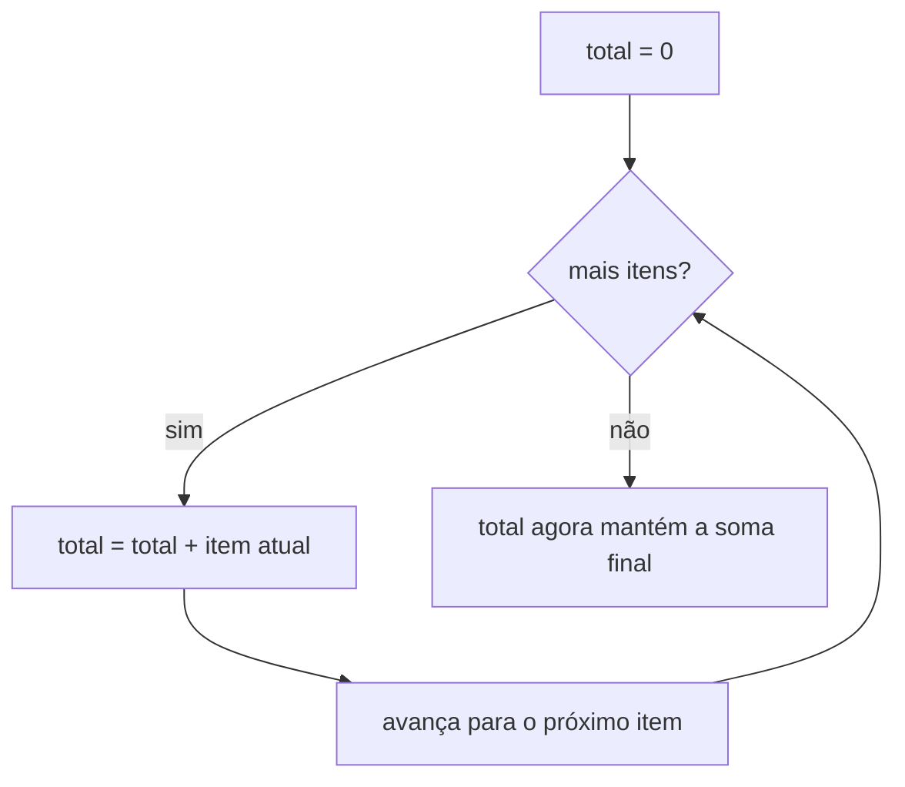

## Objetivos de Aprendizagem

- Definir programação imperativa por seu traço definidor: estado que muda ao longo do tempo via instruções explícitas, ordenadas.
- Identificar as construções imperativas (atribuição, laços, mutação) já usadas em todo programa anterior neste currículo, e reconhecê-las como uma escolha de paradigma em vez de "o padrão."
- Rastrear, passo a passo, como uma variável acumuladora mutável muda de valor através das iterações de um laço.
- Contrastar a abordagem imperativa a um pequeno problema com uma prévia de como um paradigma diferente abordará o problema idêntico depois nesta disciplina.

## Contexto e Motivação

Cada programa único escrito anteriormente neste currículo, todo laço que percorreu um array, toda variável reatribuída dentro de uma função, todo acumulador que cresceu conforme uma computação progredia, foi, sem exceção, escrito no paradigma imperativo. Esse fato nunca foi enunciado diretamente até agora, porque não havia nenhum contraste ainda contra o qual enunciá-lo; um paradigma invisível contra um fundo de nada além de si mesmo simplesmente parece "como programação funciona." Agora que o conceito anterior introduziu a ideia de que um paradigma é uma postura deliberada sobre o que um programa É, se torna possível, e valioso, olhar para trás para todo aquele código anterior e nomear, precisamente, a postura que estava silenciosamente tomando o tempo todo: um programa é uma sequência de instruções, executadas uma depois da outra, cada uma permitida mudar o estado da máquina (o valor de uma variável, o conteúdo de um array, os campos de um objeto), com a resposta final emergindo como o que quer que seja o estado que resta uma vez que a sequência termine de rodar.

Essa nomeação importa por uma razão muito prática. Os próximos vários conceitos nesta disciplina introduzirão posturas genuinamente diferentes, programação orientada a objetos, onde comportamento é empacotado com os dados sobre os quais age; programação funcional, onde mutação é evitada completamente e um "passo" é a avaliação de uma expressão em vez de uma mudança em estado armazenado. Nenhuma dessas alternativas fará sentido como *alternativas* a menos que programação imperativa seja primeiro isolada e nomeada como o conjunto específico, particular de escolhas que de fato é, em vez de deixada como uma suposição de fundo não examinada. O curso de Linguagens de Programação da Universidade de Washington (Grossman), uma das fontes das quais esta disciplina retira sua estrutura comparativa, gasta tempo real, deliberado, exatamente nesse movimento, guiando estudantes através de código que já sabem escrever, e pedindo que notem, explicitamente, o que estavam assumindo sobre como computação funciona o tempo todo.

O traço definidor de programação imperativa é estado que muda ao longo do tempo: o valor de uma variável em um ponto de um programa rodando pode ser diferente de seu valor em um ponto anterior, e o comportamento do programa depende daquele histórico de mudanças, não meramente de algum mapeamento fixo de entrada-para-saída. Uma declaração de atribuição (`x = x + 1`) é a operação fundamental do paradigma, e um laço é a ferramenta principal do paradigma para repetir aquela operação muitas vezes, seu estado se acumulando através de iterações. Isso também é, não por coincidência, extremamente próximo de como hardware de computador físico de fato opera, um processador executa instruções uma depois da outra, cada uma capaz de sobrescrever um registrador ou uma localização de memória, que é parte de por que o estilo imperativo tem historicamente parecido "a forma natural de programar": mapeia quase diretamente sobre a máquina por baixo. Essa proximidade com o hardware é uma vantagem genuína, real (código imperativo é frequentemente fácil de raciocinar em termos de exatamente o que a máquina fará, e fácil de otimizar para características de desempenho exatas), mas é uma vantagem, não evidência de que programação imperativa é de alguma forma mais fundamentalmente "correta" do que os paradigmas que a seguem nesta disciplina. Reconhecê-la como um paradigma entre vários, com suas próprias trocas específicas, não só "a forma normal", é precisamente a mudança de postura que este conceito existe para produzir, e prepara o ponto de comparação mais afiado possível para o que segue: o próprio próximo tópico principal nesta disciplina, programação funcional, resolverá o problema idêntico trabalhado abaixo sem jamais mutar uma variável de forma alguma.

## Teoria Central

### O traço definidor: estado mutável, mudado por instruções explícitas

A característica central de um programa imperativo é que variáveis são *mutáveis*, uma variável não é meramente um nome vinculado uma vez a um valor, mas uma localização de armazenamento cujo conteúdo pode ser sobrescrito, repetidamente, por instruções posteriores. A declaração de atribuição é a operação que realiza essa sobrescrita, e seu significado é fundamentalmente sobre *tempo*: `x = x + 1` não afirma uma equação matemática (seria falsa como uma, em geral), instrui a máquina a calcular o valor atual de `x`, adicionar um, e armazenar o resultado de volta na mesma localização, substituindo o que quer que estivesse lá antes. Duas execuções consecutivas da mesma linha de código podem portanto produzir dois efeitos diferentes, porque o estado sobre o qual agem mudou entre elas. Essa é a coisa mais importante única a notar sobre programação imperativa como um paradigma: raciocínio de correção sobre um programa imperativo geralmente exige rastrear uma *sequência* inteira de estados, o valor de toda variável relevante em todo ponto da execução do programa, não só as entradas e saída final do programa.

### Sequenciamento, iteração, e o padrão acumulador

Porque programas imperativos são construídos a partir de instruções ordenadas, *sequenciamento*, fazer uma coisa, depois outra, em uma ordem específica, é fundamental, e assim é *iteração*: repetir um bloco de instruções, tipicamente via um laço `for` ou `while`, frequentemente com uma *variável de laço* que ela própria é mutada a cada passagem (um índice contando para cima, ou um ponteiro se movendo através de uma estrutura). O **padrão acumulador** combina essas duas ideias e é indiscutivelmente o idioma único mais comum em código imperativo: uma variável é inicializada com algum valor inicial antes de um laço começar, e em toda iteração do laço, essa mesma variável é mutada, seu novo valor calculado a partir de seu valor antigo mais alguma contribuição da iteração atual. No momento em que o laço termina, o acumulador mantém o resultado combinado da contribuição de toda iteração, mas esse resultado nunca foi "retornado" por uma única expressão, foi construído, uma mutação de cada vez, como um efeito colateral do laço rodando.



### Fluxo de controle: a outra metade de "sequência de instruções"

Além de atribuição e iteração, programação imperativa depende de ramificação condicional (`if`/`else`) para decidir, em cada ponto na sequência, qual instrução roda em seguida, e na capacidade de pular ao redor daquela sequência (chamadas de função, retornos antecipados, `break`/`continue` dentro de um laço). Tudo isso reforça o mesmo modelo subjacente: um programa é um caminho traçado através de uma sequência de instruções possíveis, com o estado atual da máquina determinando, em cada ponto de ramificação, qual caminho é de fato tomado, e toda instrução ao longo daquele caminho é livre para alterar o estado que instruções posteriores, e decisões de ramificação posteriores, verão.

### O que programação imperativa NÃO é (uma prévia do contraste por vir)

Vale a pena ser explícito, aqui, sobre com o que o estilo imperativo especificamente se compromete, precisamente porque os próximos paradigmas nesta disciplina cada um rejeitará um desses compromissos deliberadamente. Programação imperativa se compromete com: (1) variáveis que podem ser reatribuídas, não só vinculadas uma vez; (2) uma noção de "antes" e "depois" na execução de um programa que de fato importa para sua correção; (3) efeitos colaterais, o trabalho de uma instrução é frequentemente *mudar algo*, não meramente calcular um valor. Programação funcional (coberta depois nesta disciplina) rejeita (1) e (3) completamente, insistindo que computações sejam expressas como avaliações puras, sem efeito colateral, de expressões. Programação orientada a objetos (coberta em seguida) não rejeita mutação, mas reorganiza *onde* acontece, estado e as operações que o mutam ficam empacotados juntos em objetos, em vez de sentar como variáveis soltas agidas por funções soltas. Ver programação imperativa nomeada e isolada aqui é o que tornará cada uma dessas partidas posteriores legível como uma partida genuína, em vez de uma variação estilística arbitrária.

## Exemplos Resolvidos

### Exemplo 1: somando uma lista, da forma imperativa

**Problema:** Dada uma lista de números, calcule sua soma, usando construções imperativas explícitas (um acumulador mutável e um laço).

```python
def sum_list(numbers):
    total = 0                  # inicializa o acumulador
    for x in numbers:          # sequencia através de cada elemento, em ordem
        total = total + x      # muta o acumulador: sobrescreve seu valor
    return total                # o estado final do acumulador É a resposta
```

**Rastreando execução em `[3, 7, 2, 9]`.**

| Passo | `x` | `total` antes | `total` depois |
|---|---|---|---|
| início |: |: | 0 |
| 1 | 3 | 0 | 3 |
| 2 | 7 | 3 | 10 |
| 3 | 2 | 10 | 12 |
| 4 | 9 | 12 | 21 |

**Raciocínio.** Note o que o rastreamento de fato mostra: `total` não é uma coisa fixa única, é uma localização de armazenamento cujo conteúdo muda quatro vezes separadas ao longo da execução dessa única chamada de função. A resposta final, 21, não é o resultado de avaliar alguma expressão única; é o que quer que `total` aconteça de manter no momento em que o laço termina. Esse é o padrão acumulador em sua forma mais pura, e vale a pena reter esse rastreamento exato: um conceito posterior no tópico de Programação Funcional desta disciplina resolve esse problema idêntico, mesma entrada, mesma saída, 21, usando uma única expressão de redução, sem nenhuma variável jamais atribuída mais de uma vez e nenhuma tabela de estados "antes/depois" necessária para entendê-la. Mantenha esse rastreamento em mente como o ponto de comparação quando aquele conceito chegar.

### Exemplo 2: encontrando o máximo, com mutação condicional explícita

**Problema:** Dada uma lista não vazia de números, encontre o maior imperativamente.

```python
def find_max(numbers):
    best = numbers[0]           # semeia o acumulador com o primeiro elemento
    for x in numbers[1:]:       # sequencia através do resto, em ordem
        if x > best:             # um ponto de ramificação, decidido pelo estado ATUAL
            best = x              # muta condicionalmente o acumulador
    return best
```

**Raciocínio.** Este exemplo torna visível um segundo ingrediente imperativo ao lado do padrão acumulador: mutação condicional. A instrução `best = x` não roda toda iteração, se roda afinal depende do valor *atual* de `best`, que é ele próprio o resultado acumulado das decisões de toda iteração anterior. Rastreando `[3, 7, 2, 9]`: `best` começa em 3; ao ver 7 (7 > 3), `best` se torna 7; ao ver 2 (2 > 7 é falso), `best` permanece 7; ao ver 9 (9 > 7), `best` se torna 9. A condição de ramificação `x > best` só é significativa porque `best` carrega histórico para frente de iterações anteriores, remova a noção de estado mutável, carregado adiante, e a condição `x > best` para de fazer sentido como algo que pode diferir de uma iteração para a próxima.

### Exemplo 3: o mesmo laço, escrito com `while` em vez de `for`, para expor a mutação da própria variável de laço

**Problema:** Reescreva a soma do Exemplo 1 usando um índice explícito e um laço `while`, para tornar visível a mutação da própria variável de controle de laço (um laço `for`-sobre-uma-lista em Python esconde esse detalhe).

```python
def sum_list_while(numbers):
    total = 0
    i = 0                        # uma segunda variável mutável: o índice de laço
    while i < len(numbers):      # decisão de ramificação depende do valor atual de i
        total = total + numbers[i]
        i = i + 1                 # muta i para que o laço eventualmente termine
    return total
```

**Raciocínio.** Esta versão tem duas variáveis mutáveis em vez de uma: `total`, acumulando a resposta, e `i`, rastreando progresso através da lista e controlando quando o laço termina. Ambas são instâncias da mesma ideia subjacente, uma localização de armazenamento, sobrescrita repetidamente, cujo valor atual determina o que acontece em seguida. Crucialmente, a própria terminação do laço agora depende de um pedaço de estado mutável (`i`) cruzando um limiar (`len(numbers)`); esquecer de mutar `i` (um bug clássico de iniciante) produz um laço que roda para sempre, precisamente porque nada sobre o estado da máquina jamais muda para sinalizar que deveria parar. Essa dependência até da *terminação do laço* em estado mutável é em si uma preocupação distintamente imperativa, não terá um equivalente direto quando esta disciplina depois alcançar recursão como a forma padrão de programação funcional de repetir uma ação.

## Equívocos Comuns e Armadilhas

- **"Isso é só 'a forma normal de escrever código', não é realmente um 'paradigma' afinal, é só programação."** Essa é exatamente a suposição que este conceito se propõe a desmantelar. Toda construção usada acima, variáveis mutáveis, laços, ramificação condicional que depende de estado acumulado, é um conjunto específico, nomeável de escolhas, não um fato inevitável sobre computação; o resto desta disciplina demonstra programas funcionando, corretos, que não fazem nenhuma dessas escolhas.
- **"Uma variável acumuladora e uma variável matemática significam a mesma coisa."** Em `total = total + x`, `total` do lado direito se refere ao valor armazenado *antes* dessa instrução rodar, e `total` do lado esquerdo se refere ao valor (diferente) armazenado *depois*, tratar isso como uma equação algébrica ("total é igual a total mais x," que só é verdade se x é 0) é uma fonte comum de confusão para qualquer um lendo código imperativo com uma mentalidade puramente matemática. Atribuição é uma instrução para mudar armazenamento, não uma afirmação de igualdade.
- **"Já que o laço `while` do Exemplo 3 usa um índice explícito e o laço `for` do Exemplo 1 não, devem ser paradigmas diferentes."** Não são, o Exemplo 1 está fazendo exatamente a mesma mutação de índice e verificação de limite internamente; a sintaxe `for ... in` do Python simplesmente realiza essa contabilidade automaticamente em vez de exigir que seja escrita explicitamente. Reconhecer que ambos são imperativos apesar da diferença de superfície é a mesma habilidade praticada no Exemplo 1 do conceito anterior (paradigma versus sintaxe).
- **"Esquecer de atualizar a variável de laço é um erro de digitação, não uma questão conceitual."** Como o raciocínio do Exemplo 3 mostra, um laço infinito por causa de um `i = i + 1` esquecido é uma consequência direta, estrutural, da dependência da programação imperativa em estado mutável para decidir fluxo de controle, é uma categoria de bug que só é possível *porque* o paradigma permite que condições de terminação dependam de estado que instruções são responsáveis por mudar corretamente.

## Resumo

Programação imperativa é o paradigma no qual todo programa anterior neste currículo foi escrito, sem que esse fato jamais fosse nomeado até agora: um programa é uma sequência de instruções, executadas em ordem, cada uma livre para mutar o estado de variáveis, arrays, ou outros dados armazenados, com o resultado final de um programa sendo o que quer que seja o estado que resta uma vez que a sequência de instruções termine. Seus idiomas centrais são a declaração de atribuição (uma instrução para sobrescrever armazenamento, não uma igualdade matemática), o laço (repetindo um bloco de instruções, frequentemente com sua própria variável de controle mutante), e o padrão acumulador (uma variável inicializada antes de um laço e mutada em toda iteração para construir um resultado combinado). Somar uma lista de números imperativamente, acumulador inicializado em 0, mutado uma vez por elemento, em um laço, produziu 21 para a entrada `[3, 7, 2, 9]`, alcançado através de uma sequência rastreável de quatro estados distintos, não através de avaliar uma única expressão. Esse exemplo exato é o que esta disciplina retornará quando programação funcional for introduzida depois, para tornar o contraste entre "estado que muda ao longo do tempo" e "um valor derivado de uma expressão, uma vez" tão concreto quanto possível.

## Documentation Links

- [University of Washington / Coursera: Programming Languages, Part A (Grossman)](https://www.coursera.org/learn/programming-languages): doc
- [ACM/IEEE CS2013: Programming Languages Knowledge Area](https://csed.acm.org/knowledge-areas-programming-languages-pl-cs2013-version/): doc
