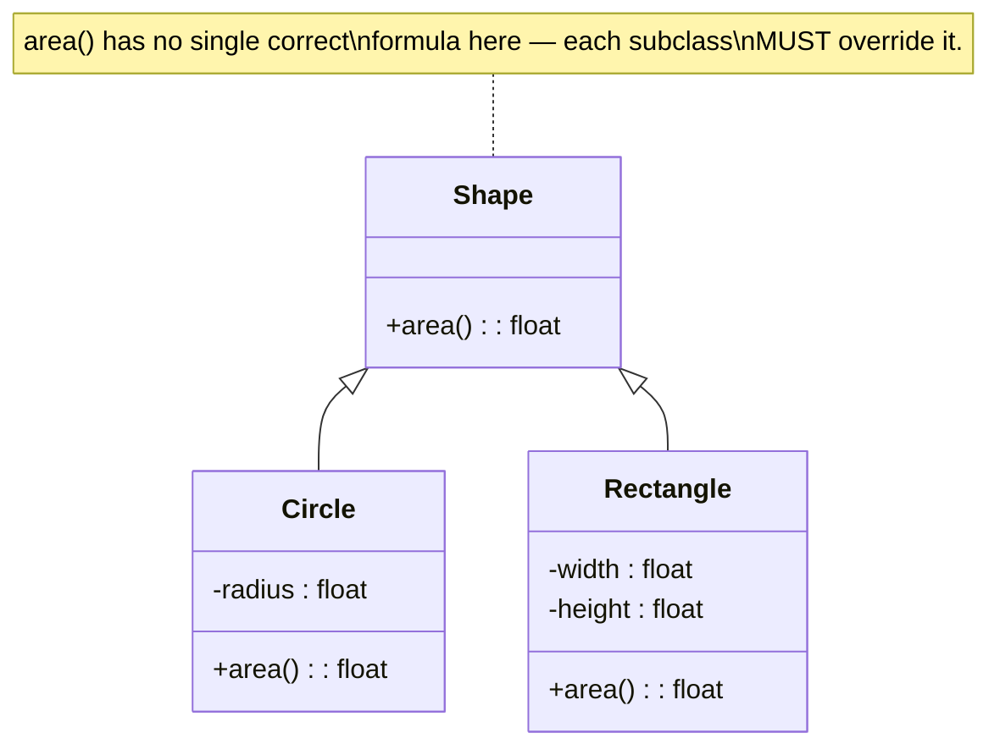

## Learning Objectives

- Define inheritance as defining a new class (a subclass) that extends an existing class (a superclass), reusing its attributes and methods.
- Distinguish reusing an inherited method unchanged from overriding it, and explain when each is the appropriate choice.
- Build a small class hierarchy with a shared base method that different subclasses override differently.
- State the "fragile base class" trade-off precisely: what specifically breaks, and why it is a direct, structural consequence of the coupling inheritance creates, not an occasional implementation mistake.

## Context & Motivation

The previous concept established the class as object-oriented programming's founding move — bundling data and the operations on it into a single unit, with encapsulation enforcing a boundary around that bundle. A natural question follows almost immediately once you have written more than a handful of classes: what happens when two classes are almost the same, differing only in some specific piece of behavior? A `SavingsAccount` and a `CheckingAccount`, for instance, both need a balance, both need `deposit`, and both need most of `withdraw` — they might differ only in one detail, such as whether overdrawing is ever permitted. Writing both classes completely separately means writing (and maintaining, and fixing bugs in, twice) all of that shared logic redundantly. **Inheritance** is object-oriented programming's answer: define a new class that extends an existing one, automatically gaining everything the existing class already does, and then write only the parts that genuinely need to differ.

This matters for a reason beyond mere typing savings. Reuse through inheritance is meant to capture something real about the relationship between two concepts — a `Circle` and a `Rectangle` really are both, fundamentally, `Shape`s, in a sense that is not just a naming coincidence: any code that only cares "does this thing have an area?" should be able to treat a `Circle` and a `Rectangle` identically, precisely because both extend the same base notion of `Shape`. This idea — writing code that works uniformly across a family of related classes — is the direct setup for the very next concept in this discipline, polymorphism, which is really the payoff that inheritance exists to make possible. Inheritance on its own, without that payoff, would be little more than a code-reuse shortcut; the two concepts together are what make object-oriented programming's central promise (write to a shared shape, get correct behavior for many different actual types) work in practice.

As with the previous concept, the treatment here stays comparative rather than exhaustive, per this discipline's Programming-Languages-course framing (a separate, language-specific track on this platform covers OOP in full depth, including the finer distinctions — abstract classes versus interfaces, multiple inheritance's edge cases, and so on — that a comparative survey has no need to dwell on). What matters here is the core mechanism — reuse, together with selective overriding — and one real, well-known trade-off that comes bundled with it, worth understanding honestly rather than only being sold the benefits.

## Core Theory

### Subclass and superclass: extending, not copying

A class that extends another is called a **subclass** (or **derived class**, or **child class**); the class it extends is called its **superclass** (or **base class**, or **parent class**). Critically, a subclass does not *copy* its superclass's code — it *extends* it, meaning a subclass automatically has access to every attribute and method the superclass defines, without that code being duplicated anywhere. If the superclass's method is later fixed or improved, every subclass that has not overridden that method picks up the change automatically, for free, because there was only ever one copy of that code to begin with. This is the mechanism's central benefit: shared behavior lives in exactly one place.

### Overriding: replacing inherited behavior selectively

A subclass may **override** a method it inherits — providing its own, different implementation of a method with the same name that the superclass already defines. When an overridden method is called on an object of the subclass, the subclass's version runs, not the superclass's — the subclass's implementation takes priority for that specific object. Overriding is selective by nature: a subclass can override exactly the methods that need to differ, while leaving every other inherited method untouched, reusing the superclass's version unchanged. This selectivity is precisely what avoids the redundant-rewriting problem that motivated inheritance in the first place — a subclass only writes new code for genuine differences, and gets everything else automatically.



### The inheritance chain, and where a method lookup actually resolves

When a method is called on an object, the language searches for that method starting at the object's own class and, if not found there, moves upward through its chain of superclasses until a matching method is found (or, if none is found anywhere in the chain, an error results). Overriding works by exploiting exactly this search order: a subclass's own method with the same name is found *first*, before the search ever reaches the superclass's version, so the subclass's version wins. A subclass that does *not* override a given method simply has nothing to find at its own level, and the search continues upward to the superclass, which is why an unoverridden inherited method runs exactly as the superclass defined it.

### The trade-off: tight coupling and the fragile base class problem

Inheritance's reuse comes at a real, structural cost: a subclass depends directly on the internal behavior of its superclass, not merely on some documented, stable contract — and that dependency runs in a direction the subclass has no control over. If a superclass's method is later changed (its logic altered, even to fix an unrelated bug, or even just to improve performance), every subclass that inherited or built upon that method's *previous* behavior can silently break, without any change ever having been made to the subclass's own code. This is known, precisely, as the **fragile base class problem**: the base (super)class is "fragile" in the specific sense that changes to it can ripple, invisibly and unpredictably, into every class that extends it, because the coupling between a superclass and its subclasses is much tighter than the coupling between, say, two unrelated classes communicating only through well-defined public methods. This is not a rare implementation mistake to be coded around — it is a direct, structural consequence of what inheritance fundamentally is: subclasses reusing a superclass's actual implementation, not just its interface, which means a change to that implementation is a change every subclass is exposed to, whether or not the person changing the superclass even knows those subclasses exist.

## Worked Examples

### Example 1 — a `Shape` base class with `Circle` and `Rectangle` subclasses

**Problem:** Define a base `Shape` class with an `area()` method, and two subclasses, `Circle` and `Rectangle`, each overriding `area()` with the correct formula for that shape.

```python
class Shape:
    def area(self):
        raise NotImplementedError("subclasses must override area()")


class Circle(Shape):
    def __init__(self, radius):
        self.radius = radius

    def area(self):
        return 3.14159 * self.radius ** 2   # overrides Shape.area()


class Rectangle(Shape):
    def __init__(self, width, height):
        self.width = width
        self.height = height

    def area(self):
        return self.width * self.height     # overrides Shape.area()
```

**Using it.**

```python
c = Circle(5)
r = Rectangle(4, 6)
print(c.area())   # 78.53975
print(r.area())   # 24
```

**Reasoning.** `Circle(Shape)` and `Rectangle(Shape)` both declare `Shape` as their superclass — both inherit from it. Neither subclass could sensibly reuse `Shape.area()` unchanged (there is no single formula that computes both a circle's and a rectangle's area), so both *override* it, each supplying its own correct implementation. Notice, though, what each subclass did *not* have to rewrite: neither needed to redeclare that a shape "has an `area` method" as a concept — `Shape` already establishes that every shape in this hierarchy is expected to answer that question, and each subclass's `__init__` method (introduced fresh, not inherited, since `Shape` never defined one) sets up whatever data that particular shape's formula needs. `Shape.area()` itself, left deliberately unimplemented (raising an error if ever called directly), signals plainly that `Shape` on its own is not meant to be used as a complete shape — it exists to be extended, not instantiated directly in ordinary use.

### Example 2 — reusing an inherited method unchanged, alongside an overridden one

**Problem:** Add a `describe()` method to `Shape` that both `Circle` and `Rectangle` should share exactly as written, with no per-shape difference.

```python
class Shape:
    def area(self):
        raise NotImplementedError("subclasses must override area()")

    def describe(self):
        return f"A shape with area {self.area():.2f}"
```

**Reasoning.** `describe()` is written exactly once, in `Shape`, and neither `Circle` nor `Rectangle` needs to override it — both inherit it unchanged, and calling `c.describe()` or `r.describe()` runs precisely the same `Shape.describe` code either way. What makes this work correctly for both subclasses despite being written with no knowledge of either one specifically is that `describe()` calls `self.area()` — and because the method lookup for `area()` starts at the *actual* object's own class first (Circle's `area`, or Rectangle's `area`), `self.area()` inside the inherited `describe()` correctly picks up whichever subclass's override applies to the actual object it was called on, not `Shape`'s own (unimplemented) version. This is the mechanism, working exactly as intended: reuse for the identical behavior (`describe`), a selective override for the behavior that genuinely differs (`area`), combined seamlessly on the very same objects.

### Example 3 — the fragile base class problem, demonstrated concretely

**Problem:** Show a concrete case where an apparently reasonable change to `Shape` silently breaks a subclass that was never touched.

```python
# Version 1 of Shape, already relied upon by an existing Square subclass:
class Shape:
    def area(self):
        raise NotImplementedError

    def scaled_area(self, factor):
        return self.area() * factor


class Square(Shape):
    def __init__(self, side):
        self.side = side

    def area(self):
        return self.side ** 2


sq = Square(4)
print(sq.scaled_area(2))   # 32 — correct, relied upon elsewhere in a larger program
```

```python
# Later, someone "improves" Shape.scaled_area for a performance reason,
# believing this change only affects Shape itself:
class Shape:
    def area(self):
        raise NotImplementedError

    def scaled_area(self, factor):
        return self.area() * factor * factor   # changed: now squares the factor too
                                                  # (correct for a NEW use case involving
                                                  # linear scaling of a shape's dimensions —
                                                  # but nobody checked existing callers)


sq = Square(4)
print(sq.scaled_area(2))   # now 64 — silently different, Square's own code never changed
```

**Reasoning.** `Square` was never modified — not one line of its own code changed between the two versions above — yet `sq.scaled_area(2)` silently produced a different answer, purely because `Shape`, the class `Square` extends, changed underneath it. Whoever modified `Shape.scaled_area` may well have had a perfectly good reason (matching a genuinely different use case elsewhere), and may not even have known `Square`, or any other subclass, existed at all. This is precisely the fragile base class problem stated in Core Theory made concrete: `Square`'s correctness turned out to depend on the *exact internal behavior* of an inherited method, not merely on some stable, documented contract, and that dependency broke without any warning at `Square`'s own call site. The lesson is not "never use inheritance" — Example 1 and Example 2 show real, working benefits — but that the coupling it creates is real and worth naming honestly, not treated as a purely cost-free form of code reuse.

## Common Misconceptions & Pitfalls

- **"Inheritance copies the superclass's code into the subclass."** It does not — Example 2's `describe()` is written exactly once, in `Shape`, and both subclasses share that single copy; nothing is duplicated. This is precisely why a bug fix to a non-overridden inherited method benefits every subclass automatically, and precisely why the fragile base class problem (Example 3) is possible at all — there being only one copy is *both* the reuse benefit and the coupling risk, at the same time.
- **"A subclass has to override every method its superclass defines."** Example 2 shows the opposite: `Circle` and `Rectangle` both override `area()` (because it must differ) but neither overrides `describe()` (because it should not). Overriding is selective, applied only where a subclass's behavior genuinely needs to depart from its superclass's.
- **"Inheritance is basically free code reuse, with no real downside."** Example 3 demonstrates a concrete, working case where a subclass that was never itself modified nonetheless produced a silently wrong answer, purely because of a change to its superclass. The fragile base class problem is a well-known, named issue in software engineering practice precisely because this kind of silent breakage is a structural risk of the mechanism, not a rare fluke limited to badly-written code.
- **"If `Shape.area()` raises an error, that means `Shape` is broken."** `Shape` is deliberately incomplete on its own — Example 1's unimplemented `area()` is a signal that `Shape` exists specifically to be extended, with each subclass responsible for supplying the one piece of behavior that cannot sensibly be shared. This is not a bug; it is the base class doing exactly the job a base class in a hierarchy like this one is meant to do.

## Summary

Inheritance lets a subclass extend a superclass, automatically gaining its attributes and methods without duplicating any code, and selectively **override** only the specific methods that need to behave differently — as `Circle` and `Rectangle` each did for `area()`, while both left `describe()` inherited unchanged from `Shape`. The mechanism resolves a method call by searching the object's own class first and moving upward through the chain of superclasses, which is exactly why an override "wins" over an inherited version, and exactly why a shared method like `describe()`, calling `self.area()` internally, correctly picks up whichever subclass's override actually applies. This reuse is not free: because a subclass depends on its superclass's actual internal behavior, not merely on a stable public contract, a change to the superclass can silently break subclasses that were never themselves touched — the well-known **fragile base class problem**, demonstrated concretely when a "safe," locally-reasoned change to `Shape.scaled_area` silently altered `Square`'s output with zero changes to `Square` itself. The next concept, polymorphism, is the direct payoff this reuse sets up: writing code that treats a `Circle` and a `Rectangle` uniformly, through their shared `Shape` ancestry.

## Documentation Links

- [University of Washington / Coursera — Programming Languages, Part A (Grossman)](https://www.coursera.org/learn/programming-languages) — doc
- [ACM/IEEE CS2013 — Programming Languages Knowledge Area](https://csed.acm.org/knowledge-areas-programming-languages-pl-cs2013-version/) — doc
