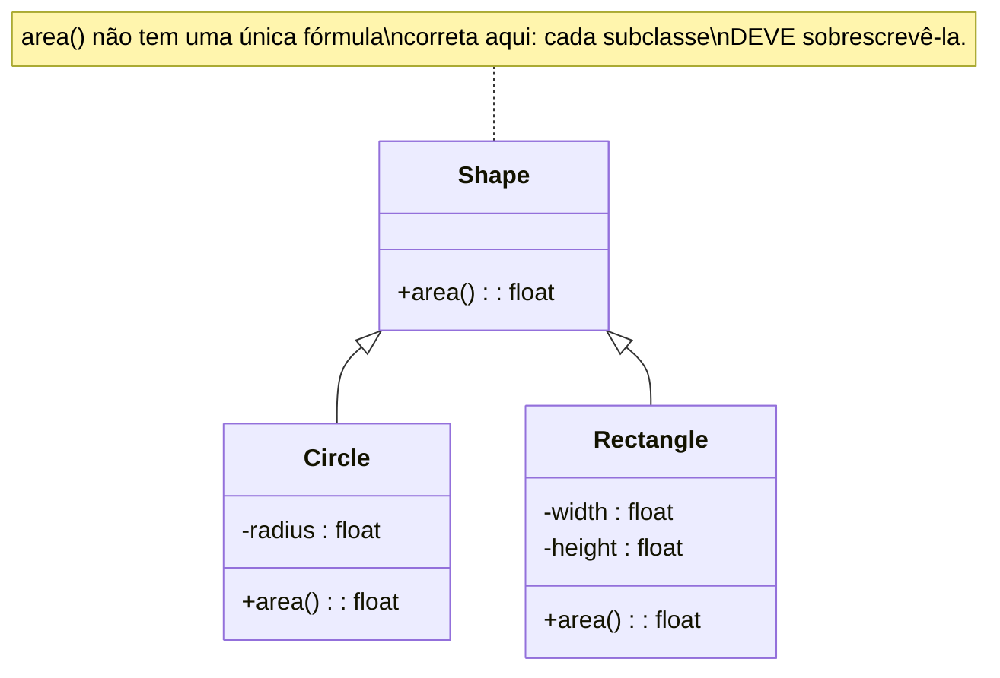

## Objetivos de Aprendizagem

- Definir herança como definir uma nova classe (uma subclasse) que estende uma classe existente (uma superclasse), reutilizando seus atributos e métodos.
- Distinguir reutilizar um método herdado sem mudança de sobrescrevê-lo, e explicar quando cada um é a escolha apropriada.
- Construir uma pequena hierarquia de classe com um método base compartilhado que subclasses diferentes sobrescrevem diferentemente.
- Enunciar a troca da "classe base frágil" precisamente: o que especificamente quebra, e por que é uma consequência estrutural direta do acoplamento que herança cria, não um erro de implementação ocasional.

## Contexto e Motivação

O conceito anterior estabeleceu a classe como o movimento fundador da programação orientada a objetos, empacotar dados e as operações sobre eles em uma única unidade, com encapsulamento aplicando uma fronteira ao redor daquele pacote. Uma pergunta natural segue quase imediatamente uma vez que você escreveu mais que um punhado de classes: o que acontece quando duas classes são quase iguais, diferindo só em algum pedaço específico de comportamento? Uma `SavingsAccount` e uma `CheckingAccount`, por exemplo, ambas precisam de um saldo, ambas precisam de `deposit`, e ambas precisam da maioria de `withdraw`, podem diferir só em um detalhe, como se saque a descoberto é alguma vez permitido. Escrever ambas as classes completamente separadamente significa escrever (e manter, e corrigir bugs em, duas vezes) toda aquela lógica compartilhada redundantemente. **Herança** é a resposta da programação orientada a objetos: defina uma nova classe que estende uma existente, ganhando automaticamente tudo que a classe existente já faz, e depois escreva só as partes que genuinamente precisam diferir.

Isso importa por uma razão além de mera economia de digitação. Reúso através de herança é destinado a capturar algo real sobre a relação entre dois conceitos, um `Circle` e um `Rectangle` realmente são ambos, fundamentalmente, `Shape`s, em um sentido que não é só uma coincidência de nomenclatura: qualquer código que só se importa "essa coisa tem uma área?" deveria ser capaz de tratar um `Circle` e um `Rectangle` identicamente, precisamente porque ambos estendem a mesma noção base de `Shape`. Essa ideia, escrever código que funciona uniformemente através de uma família de classes relacionadas, é a preparação direta para o próprio próximo conceito nesta disciplina, polimorfismo, que é realmente o ganho que herança existe para tornar possível. Herança por conta própria, sem esse ganho, seria pouco mais que um atalho de reúso de código; os dois conceitos juntos são o que fazem a promessa central da programação orientada a objetos (escreva para uma forma compartilhada, obtenha comportamento correto para muitos tipos reais diferentes) funcionar na prática.

Como com o conceito anterior, o tratamento aqui permanece comparativo em vez de exaustivo, conforme o enquadramento de curso de Linguagens de Programação desta disciplina (uma trilha separada, específica de linguagem, nesta plataforma cobre POO em profundidade completa, incluindo as distinções mais finas, classes abstratas versus interfaces, casos de borda de herança múltipla, e assim por diante, com as quais uma pesquisa comparativa não precisa se demorar). O que importa aqui é o mecanismo central, reúso, junto com sobrescrita seletiva, e uma troca real, bem conhecida, que vem empacotada com ele, valendo a pena entender honestamente em vez de só vendida pelos benefícios.

## Teoria Central

### Subclasse e superclasse: estendendo, não copiando

Uma classe que estende outra é chamada uma **subclasse** (ou **classe derivada**, ou **classe filha**); a classe que estende é chamada sua **superclasse** (ou **classe base**, ou **classe pai**). Criticamente, uma subclasse não *copia* o código de sua superclasse, ela a *estende*, significando que uma subclasse automaticamente tem acesso a todo atributo e método que a superclasse define, sem que aquele código seja duplicado em lugar nenhum. Se o método da superclasse é depois corrigido ou melhorado, toda subclasse que não sobrescreveu aquele método pega a mudança automaticamente, de graça, porque só jamais havia uma cópia daquele código para começar. Esse é o benefício central do mecanismo: comportamento compartilhado vive em exatamente um lugar.

### Sobrescrita: substituindo comportamento herdado seletivamente

Uma subclasse pode **sobrescrever** um método que herda, fornecendo sua própria implementação diferente de um método com o mesmo nome que a superclasse já define. Quando um método sobrescrito é chamado em um objeto da subclasse, a versão da subclasse roda, não a da superclasse, a implementação da subclasse tem prioridade para aquele objeto específico. Sobrescrita é seletiva por natureza: uma subclasse pode sobrescrever exatamente os métodos que precisam diferir, enquanto deixa todo outro método herdado intocado, reutilizando a versão da superclasse sem mudança. Essa seletividade é precisamente o que evita o problema de reescrita redundante que motivou herança em primeiro lugar, uma subclasse só escreve código novo para diferenças genuínas, e obtém tudo mais automaticamente.



### A cadeia de herança, e onde uma busca de método de fato se resolve

Quando um método é chamado em um objeto, a linguagem busca por aquele método começando na própria classe do objeto e, se não encontrado ali, se move para cima através de sua cadeia de superclasses até que um método correspondente seja encontrado (ou, se nenhum é encontrado em lugar nenhum na cadeia, um erro resulta). Sobrescrita funciona explorando exatamente essa ordem de busca: o próprio método de uma subclasse com o mesmo nome é encontrado *primeiro*, antes que a busca jamais alcance a versão da superclasse, então a versão da subclasse vence. Uma subclasse que *não* sobrescreve um dado método simplesmente não tem nada para encontrar em seu próprio nível, e a busca continua para cima até a superclasse, que é por que um método herdado não sobrescrito roda exatamente como a superclasse o definiu.

### A troca: acoplamento apertado e o problema da classe base frágil

O reúso de herança vem a um custo real, estrutural: uma subclasse depende diretamente do comportamento interno de sua superclasse, não meramente de algum contrato documentado, estável, e essa dependência corre em uma direção sobre a qual a subclasse não tem controle. Se um método de uma superclasse é depois mudado (sua lógica alterada, mesmo para corrigir um bug não relacionado, ou mesmo só para melhorar desempenho), toda subclasse que herdou ou construiu em cima do comportamento *anterior* daquele método pode silenciosamente quebrar, sem que nenhuma mudança jamais tenha sido feita ao próprio código da subclasse. Isso é conhecido, precisamente, como o **problema da classe base frágil**: a classe base (super) é "frágil" no sentido específico de que mudanças a ela podem se propagar, invisível e imprevisivelmente, em toda classe que a estende, porque o acoplamento entre uma superclasse e suas subclasses é muito mais apertado que o acoplamento entre, digamos, duas classes não relacionadas se comunicando só através de métodos públicos bem definidos. Esse não é um erro de implementação raro para contornar com código, é uma consequência estrutural direta do que herança fundamentalmente é: subclasses reutilizando a implementação real de uma superclasse, não só sua interface, o que significa que uma mudança àquela implementação é uma mudança à qual toda subclasse é exposta, quer a pessoa mudando a superclasse sequer saiba que essas subclasses existem.

## Exemplos Resolvidos

### Exemplo 1: uma classe base `Shape` com subclasses `Circle` e `Rectangle`

**Problema:** Defina uma classe base `Shape` com um método `area()`, e duas subclasses, `Circle` e `Rectangle`, cada uma sobrescrevendo `area()` com a fórmula correta para aquela forma.

```python
class Shape:
    def area(self):
        raise NotImplementedError("subclasses must override area()")


class Circle(Shape):
    def __init__(self, radius):
        self.radius = radius

    def area(self):
        return 3.14159 * self.radius ** 2   # sobrescreve Shape.area()


class Rectangle(Shape):
    def __init__(self, width, height):
        self.width = width
        self.height = height

    def area(self):
        return self.width * self.height     # sobrescreve Shape.area()
```

**Usando-a.**

```python
c = Circle(5)
r = Rectangle(4, 6)
print(c.area())   # 78.53975
print(r.area())   # 24
```

**Raciocínio.** `Circle(Shape)` e `Rectangle(Shape)` ambos declaram `Shape` como sua superclasse, ambos herdam dela. Nenhuma das duas subclasses poderia sensatamente reutilizar `Shape.area()` sem mudança (não há uma única fórmula que calcula tanto a área de um círculo quanto de um retângulo), então ambas a *sobrescrevem*, cada uma fornecendo sua própria implementação correta. Note, porém, o que cada subclasse não teve que reescrever: nenhuma precisou redeclarar que uma forma "tem um método `area`" como um conceito, `Shape` já estabelece que toda forma nessa hierarquia é esperada responder aquela pergunta, e o método `__init__` de cada subclasse (introduzido novo, não herdado, já que `Shape` nunca definiu um) configura quaisquer dados que a fórmula daquela forma particular precise. O próprio `Shape.area()`, deliberadamente deixado não implementado (levantando um erro se jamais chamado diretamente), sinaliza claramente que `Shape` por conta própria não é destinada a ser usada como uma forma completa, existe para ser estendida, não instanciada diretamente em uso comum.

### Exemplo 2: reutilizando um método herdado sem mudança, ao lado de um sobrescrito

**Problema:** Adicione um método `describe()` a `Shape` que tanto `Circle` quanto `Rectangle` deveriam compartilhar exatamente como escrito, sem diferença por forma.

```python
class Shape:
    def area(self):
        raise NotImplementedError("subclasses must override area()")

    def describe(self):
        return f"A shape with area {self.area():.2f}"
```

**Raciocínio.** `describe()` é escrito exatamente uma vez, em `Shape`, e nem `Circle` nem `Rectangle` precisa sobrescrevê-lo, ambos o herdam sem mudança, e chamar `c.describe()` ou `r.describe()` roda precisamente o mesmo código `Shape.describe` de qualquer forma. O que faz isso funcionar corretamente para ambas as subclasses apesar de ser escrito sem conhecimento de nenhuma delas especificamente é que `describe()` chama `self.area()`, e porque a busca de método para `area()` começa na própria classe do objeto *real* primeiro (o `area` de Circle, ou o `area` de Rectangle), `self.area()` dentro do `describe()` herdado corretamente pega qualquer que seja a sobrescrita da subclasse que se aplica ao objeto real no qual foi chamado, não a própria versão (não implementada) de `Shape`. Esse é o mecanismo, funcionando exatamente como pretendido: reúso para o comportamento idêntico (`describe`), uma sobrescrita seletiva para o comportamento que genuinamente difere (`area`), combinados perfeitamente nos mesmos objetos.

### Exemplo 3: o problema da classe base frágil, demonstrado concretamente

**Problema:** Mostre um caso concreto onde uma mudança aparentemente razoável a `Shape` silenciosamente quebra uma subclasse que nunca foi tocada.

```python
# Versão 1 de Shape, já confiada por uma subclasse Square existente:
class Shape:
    def area(self):
        raise NotImplementedError

    def scaled_area(self, factor):
        return self.area() * factor


class Square(Shape):
    def __init__(self, side):
        self.side = side

    def area(self):
        return self.side ** 2


sq = Square(4)
print(sq.scaled_area(2))   # 32: correto, confiado em outro lugar em um programa maior
```

```python
# Depois, alguém "melhora" Shape.scaled_area por uma razão de desempenho,
# acreditando que essa mudança só afeta a própria Shape:
class Shape:
    def area(self):
        raise NotImplementedError

    def scaled_area(self, factor):
        return self.area() * factor * factor   # mudado: agora eleva o fator ao quadrado também
                                                  # (correto para um NOVO caso de uso envolvendo
                                                  # escala linear das dimensões de uma forma,
                                                  # mas ninguém verificou chamadores existentes)


sq = Square(4)
print(sq.scaled_area(2))   # agora 64: silenciosamente diferente, o próprio código de Square nunca mudou
```

**Raciocínio.** `Square` nunca foi modificada, nem uma linha de seu próprio código mudou entre as duas versões acima, ainda assim `sq.scaled_area(2)` silenciosamente produziu uma resposta diferente, puramente porque `Shape`, a classe que `Square` estende, mudou por baixo dela. Quem quer que tenha modificado `Shape.scaled_area` pode muito bem ter tido uma razão perfeitamente boa (combinando com um caso de uso genuinamente diferente em outro lugar), e pode nem sequer ter sabido que `Square`, ou qualquer outra subclasse, sequer existia. Isso é precisamente o problema da classe base frágil enunciado na Teoria Central tornado concreto: a correção de `Square` acabou dependendo do *comportamento interno exato* de um método herdado, não meramente de algum contrato estável, documentado, e essa dependência quebrou sem nenhum aviso no próprio local de chamada de `Square`. A lição não é "nunca use herança", os Exemplos 1 e 2 mostram benefícios reais, funcionando, mas que o acoplamento que cria é real e vale a pena nomear honestamente, não tratado como uma forma de reúso de código puramente sem custo.

## Equívocos Comuns e Armadilhas

- **"Herança copia o código da superclasse para a subclasse."** Não copia, o `describe()` do Exemplo 2 é escrito exatamente uma vez, em `Shape`, e ambas as subclasses compartilham aquela única cópia; nada é duplicado. Isso é precisamente por que uma correção de bug a um método herdado não sobrescrito beneficia toda subclasse automaticamente, e precisamente por que o problema da classe base frágil (Exemplo 3) é possível afinal, haver só uma cópia é *tanto* o benefício de reúso quanto o risco de acoplamento, ao mesmo tempo.
- **"Uma subclasse tem que sobrescrever todo método que sua superclasse define."** O Exemplo 2 mostra o oposto: `Circle` e `Rectangle` ambos sobrescrevem `area()` (porque deve diferir) mas nenhum sobrescreve `describe()` (porque não deveria). Sobrescrita é seletiva, aplicada só onde o comportamento de uma subclasse genuinamente precisa se afastar de sua superclasse.
- **"Herança é basicamente reúso de código grátis, sem nenhuma desvantagem real."** O Exemplo 3 demonstra um caso concreto, funcionando, onde uma subclasse que nunca ela própria foi modificada ainda assim produziu uma resposta silenciosamente errada, puramente por causa de uma mudança em sua superclasse. O problema da classe base frágil é uma questão bem conhecida, nomeada, na prática de engenharia de software precisamente porque esse tipo de quebra silenciosa é um risco estrutural do mecanismo, não um acaso raro limitado a código mal escrito.
- **"Se `Shape.area()` levanta um erro, isso significa que `Shape` está quebrada."** `Shape` é deliberadamente incompleta por conta própria, o `area()` não implementado do Exemplo 1 é um sinal de que `Shape` existe especificamente para ser estendida, com cada subclasse responsável por fornecer a única peça de comportamento que não pode sensatamente ser compartilhada. Isso não é um bug; é a classe base fazendo exatamente o trabalho que uma classe base em uma hierarquia como essa é destinada a fazer.

## Resumo

Herança permite que uma subclasse estenda uma superclasse, ganhando automaticamente seus atributos e métodos sem duplicar nenhum código, e seletivamente **sobrescrever** só os métodos específicos que precisam se comportar diferentemente, como `Circle` e `Rectangle` cada um fez para `area()`, enquanto ambos deixaram `describe()` herdado sem mudança de `Shape`. O mecanismo resolve uma chamada de método buscando a própria classe do objeto primeiro e movendo para cima através da cadeia de superclasses, que é exatamente por que uma sobrescrita "vence" sobre uma versão herdada, e exatamente por que um método compartilhado como `describe()`, chamando `self.area()` internamente, corretamente pega qualquer que seja a sobrescrita da subclasse que de fato se aplica. Esse reúso não é grátis: porque uma subclasse depende do comportamento interno real de sua superclasse, não meramente de um contrato público estável, uma mudança à superclasse pode silenciosamente quebrar subclasses que nunca foram elas próprias tocadas, o bem conhecido **problema da classe base frágil**, demonstrado concretamente quando uma mudança "segura," raciocinada localmente, a `Shape.scaled_area` silenciosamente alterou a saída de `Square` com zero mudanças à própria `Square`. O próximo conceito, polimorfismo, é o ganho direto que esse reúso prepara: escrever código que trata um `Circle` e um `Rectangle` uniformemente, através de sua ancestralidade `Shape` compartilhada.

## Documentation Links

- [University of Washington / Coursera: Programming Languages, Part A (Grossman)](https://www.coursera.org/learn/programming-languages): doc
- [ACM/IEEE CS2013: Programming Languages Knowledge Area](https://csed.acm.org/knowledge-areas-programming-languages-pl-cs2013-version/): doc
