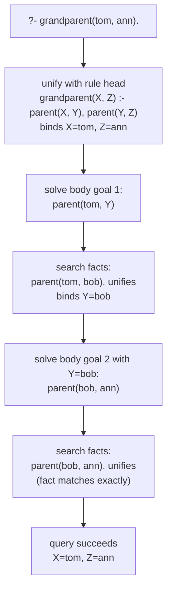

## Learning Objectives

- Describe a logic program as a database of facts and rules, and distinguish a fact from a rule syntactically and semantically.
- Trace how a query resolves against a fact base through unification, including how variables get bound step by step.
- Write a small Prolog-style rule that derives a new relationship (e.g., `grandparent`) from more basic stored facts (e.g., `parent`).
- Explain why logic programming is considered declarative — a query states what relationship is being asked about, not the search procedure used to find it.
- State honestly where logic programming sits in the modern CS curriculum relative to object-oriented and functional programming.

## Context & Motivation

You have already met the vocabulary of predicate logic — a predicate like `parent(x, y)` is a statement template that becomes true or false only once its variables are pinned down, and quantifiers such as ∀ and ∃ let you say "for every x" or "there exists a y" without listing cases one at a time. That machinery was, until now, something *you* used with pencil and paper to state and evaluate claims. Logic programming is the idea of handing that same machinery to a *machine* and asking it to do the searching for you: a program becomes a collection of predicate-logic facts and rules, and a question you ask the program — a query — is answered by an automatic search procedure called **unification**, which tries to match the query against what's stored, binding variables as it goes, until it either finds an answer or exhausts the possibilities.

This is a genuinely different way of telling a computer what to do. In every paradigm covered elsewhere in this discipline — imperative, object-oriented, functional — you are still, one way or another, describing a *procedure*: a sequence of steps, a set of method calls, a chain of function applications, that the machine executes to produce a result. In logic programming, you describe *relationships* — `parent(tom, bob)` is true, `grandparent(X, Z)` holds whenever some `Y` exists with `parent(X, Y)` and `parent(Y, Z)` — and you never write the search algorithm that finds a `Z` satisfying a query at all. The language's built-in inference engine does that uniformly, for every program, without you specifying how the search should proceed. This is the earliest large-scale realization of the "what, not how" idea that reappears later in this discipline under the name declarative programming — logic programming is really declarative programming's oldest and most literal ancestor, predating SQL by more than a decade.

It's worth being honest about where this sits today. Logic programming, and Prolog specifically, was a major research and applications thread in the 1970s and 80s — expert systems, natural-language parsing, and much of early symbolic AI were built on exactly this idea, and it remains genuinely important to the history of both programming languages and artificial intelligence. But it has not stayed equally central. The ACM/IEEE CS2013 curriculum guidelines list logic programming as an *elective* topic within the Programming Languages Knowledge Area — worth knowing, not required — in explicit contrast to object-oriented and functional programming, which are treated as core. A survey of contemporary "Programming Languages" course syllabi for this discipline turned up no consistent presence of logic programming at all; some cover it briefly as one paradigm among several, at least one showed no evidence of covering it. So the honest framing is: logic programming is real, historically important, and worth understanding as a genuinely distinct way of thinking about computation — but you should not expect it to carry the same load-bearing weight in a modern curriculum, or in most production codebases, that OOP and functional programming do.

## Core Theory

### Facts

A **fact** is an unconditional assertion that some relationship holds, written in Prolog as a predicate applied to specific values, terminated with a period:

```prolog
parent(tom, bob).
parent(tom, liz).
parent(bob, ann).
parent(bob, pat).
```

Read `parent(tom, bob).` as "tom is a parent of bob" — a stored, ground fact, true by assertion, with no variables and nothing left to compute. A collection of facts like this is often called a **fact base** (or knowledge base): a database of relationships the program simply asserts to be true, analogous to rows in a table.

### Rules

A **rule** derives a new relationship from existing ones, and has the general shape `Head :- Body.`, read "Head is true if Body is true." The body can be a conjunction of several conditions, separated by commas (meaning "and"):

```prolog
grandparent(X, Z) :- parent(X, Y), parent(Y, Z).
```

Read this as: "X is a grandparent of Z if there is some Y such that X is a parent of Y, and Y is a parent of Z." Note that `X`, `Y`, and `Z` are **variables** (capitalized by Prolog convention — lowercase identifiers like `tom` and `bob` are constants), and `Y` in particular never appears in the head at all: it exists only to link the two conditions in the body, playing exactly the role of an existentially quantified variable, `∃Y (parent(X,Y) ∧ parent(Y,Z))`. A rule is never asserted directly the way a fact is — it becomes usable only when a query causes the engine to try to satisfy its body.

### Queries and unification

A **query** asks the engine whether some relationship holds, or asks it to find values that make it hold, written with a `?-` prompt:

```prolog
?- grandparent(tom, ann).
```

To answer this, Prolog's inference engine performs **unification** — the process of matching two terms and binding any variables needed to make them identical. Unifying `grandparent(tom, ann)` against the rule's head `grandparent(X, Z)` binds `X = tom` and `Z = ann`; the engine then must satisfy the rule's body with those bindings carried forward: `parent(tom, Y)` and `parent(Y, ann)` for some `Y`. It searches the fact base for a fact unifying with `parent(tom, Y)` — `parent(tom, bob).` unifies, binding `Y = bob` — and then checks whether `parent(bob, ann)` also holds. It does (it's a stored fact), so both conditions are satisfied and the original query succeeds.

Unification is the single mechanism doing all the work here: matching a query or a rule's body, term by term, against stored facts and rule heads, binding variables as needed, and backtracking to try a different match if a particular binding leads to a dead end. Nowhere in this process did anyone write a loop, an index, or a search strategy — the engine's built-in resolution procedure handles all of it uniformly for any program.



### Declarative character: what, not how

Notice that the query `?- grandparent(tom, ann).` states a relationship to check, and a query with a free variable, `?- grandparent(tom, X).`, states a relationship to search for — but neither one describes *how* the search is to be carried out. There is no explicit loop over the fact base, no explicit order in which candidate `Y` values are tried (though Prolog does define one, top-to-bottom through the program text, for reproducibility). This is the same "what, not how" idea developed fully under the name declarative programming later in this discipline — logic programming is one of the two central examples of it, alongside SQL.

## Worked Examples

**A note on language:** every other concept in this discipline uses Python throughout, to keep a single consistent language across the track. Logic programming is a deliberate, explicit exception — Python has no built-in unification or backtracking search, so it cannot honestly demonstrate what a query actually does. The example below uses real Prolog syntax instead, clearly labeled as such, because this is the one place in the discipline where reaching outside Python is genuinely justified.

### Example 1 — a small family-tree fact base, queried for grandparents

**Problem (Prolog).** Given the fact base:

```prolog
parent(tom, bob).
parent(tom, liz).
parent(bob, ann).
parent(bob, pat).
parent(pat, jim).

grandparent(X, Z) :- parent(X, Y), parent(Y, Z).
```

Trace the query `?- grandparent(tom, X).` — asking for every `X` such that tom is a grandparent of `X`.

**Step 1 — unify the query against the rule head.** `grandparent(tom, X)` unifies with `grandparent(X', Z')` (renaming the rule's own variables to avoid clashing with the query's `X`), binding `X' = tom` and `Z' = X` (the query's `X`, still unbound). The rule's body becomes the new goal: `parent(tom, Y), parent(Y, X)`.

**Step 2 — solve `parent(tom, Y)`.** The engine scans the fact base top to bottom. `parent(tom, bob).` is the first match, binding `Y = bob`.

**Step 3 — solve `parent(bob, X)` with `Y = bob`.** Scanning again, `parent(bob, ann).` matches first, binding `X = ann`. Both body goals are now satisfied, so the query succeeds with **`X = ann`** — reported as the first solution.

**Step 4 — backtrack for more solutions.** Because the query asked to find `X`, not just to check one, Prolog can backtrack: undo the last binding and look for another fact that also satisfies `parent(bob, X)`. `parent(bob, pat).` also matches, giving a second solution, **`X = pat`**.

**Step 5 — backtrack further.** Undoing further back, the engine looks for another way to satisfy `parent(tom, Y)` beyond `Y = bob`. `parent(tom, liz).` matches next, binding `Y = liz`. Now it tries `parent(liz, X)` — and no fact in the base has `liz` as a first argument, so this branch fails, and there is no third solution. The complete answer to `?- grandparent(tom, X).` is **X = ann, X = pat** — the two grandchildren correctly derivable from the stored facts, found entirely by unification and backtracking, without a single explicit loop written by the programmer.

### Example 2 — a rule with two matching clauses (siblings)

**Problem (Prolog).** Add a rule for `sibling`: two people are siblings if they share a parent (and are not the same person).

```prolog
sibling(X, Y) :- parent(P, X), parent(P, Y), X \= Y.
```

Query `?- sibling(ann, pat).`

**Trace.** Unifying the query with the rule head binds `X = ann`, `Y = pat`. The body needs some `P` with `parent(P, ann)` and `parent(P, pat)`, plus the check `ann \= pat` (not equal). Scanning facts for `parent(P, ann)`: `parent(bob, ann).` matches, binding `P = bob`. Now check `parent(bob, pat)` — yes, it's a stored fact. Finally, `ann \= pat` holds (they are different constants). All three body goals succeed, so `?- sibling(ann, pat).` succeeds. Notice the query never mentioned `bob` at all — the shared parent `P` was found purely through unification against the fact base, exactly the kind of relationship-search that would require explicit nested loops and equality checks in an imperative language.

### Example 3 — a query that fails, and why failure is still informative

**Problem (Prolog).** Query `?- grandparent(bob, tom).` against the same fact base.

**Trace.** Unifying binds `X = bob`, `Z = tom`, and the body becomes `parent(bob, Y), parent(bob's Y, tom)`... more precisely `parent(bob, Y), parent(Y, tom)`. Scanning for `parent(bob, Y)`: matches give `Y = ann` then `Y = pat` on backtracking. Trying `parent(ann, tom)` — no such fact exists. Trying `parent(pat, tom)` — `parent(pat, jim).` exists, but not `parent(pat, tom)`, so this also fails. With no facts left to try, the entire query fails: `?- grandparent(bob, tom).` reports **false**. This is exactly correct — bob is a grandparent of ann and pat's children (jim, transitively, is bob's grandchild's child, not bob's grandchild), not of tom, who is bob's own sibling in this family tree, not descendant.

## Common Misconceptions & Pitfalls

- **"Prolog facts and rules run top to bottom like statements in an imperative program."** They don't execute at all in that sense — facts and rules are stored, and only a *query* triggers a search. The order facts appear in does affect the order solutions are found during backtracking (as in Example 1, `bob` before `liz`), but nothing "runs" until something is asked.
- **"Unification is just pattern matching, so it's basically the same as a `switch` statement."** Unification is bidirectional and can bind variables on both sides of a comparison at once — matching `grandparent(tom, X)` against `grandparent(X', Z')` binds variables in *both* terms simultaneously, and those bindings then propagate into a whole chain of further goals. A `switch`/`match` construct in an imperative or functional language picks one branch based on already-known values; it does not search a database and bind unknowns as unification does.
- **"A rule with a variable that doesn't appear in the head, like `Y` in `grandparent(X,Z) :- parent(X,Y), parent(Y,Z)`, is a mistake or leftover."** It is deliberate and essential — `Y` plays the role of an existentially quantified variable, exactly as in ∃Y(parent(X,Y) ∧ parent(Y,Z)) from predicate logic. It must not appear in the head precisely because the rule is only claiming *some* such Y exists, not naming which one.
- **"Logic programming is a niche curiosity with no real influence today."** It's fair to note (as this concept does) that logic programming is an elective topic in modern curricula and not as universally taught as OOP or functional programming — but it is not a dead end. Its core idea — describing a relationship to be searched for, not a procedure — is the direct conceptual ancestor of the SQL query engine underneath every relational database, and it remains foundational to certain constraint-solving and expert-system applications.
- **"Since Prolog answers were found automatically, there's no algorithm underneath — it's 'magic.'"** There is a fully deterministic algorithm underneath (unification plus depth-first search with backtracking, following the order facts and rules are written) — it's just an algorithm the *language* provides uniformly for every program, rather than one the programmer writes anew each time, which is the entire point of the paradigm.

## Summary

A logic program is a database of **facts** (unconditional assertions, like `parent(tom, bob).`) and **rules** (conditional derivations, like `grandparent(X,Z) :- parent(X,Y), parent(Y,Z).`), and a **query** asks the engine to find or confirm bindings that satisfy some relationship. The mechanism that does all the work is **unification** — matching a query or rule body against stored facts and rule heads, binding variables as needed, and backtracking to try alternatives when a particular path fails — traced concretely in this concept through a small family-tree fact base answering `grandparent`, `sibling`, and a deliberately failing query. This is a genuinely different way of programming: you describe relationships, not procedures, and the search strategy is never written by hand — making logic programming the clearest and earliest large-scale example of declarative programming, the idea developed fully in the next concept. It is real and historically significant, but per CS2013's own classification, it is an elective rather than core topic today, less universally taught than object-oriented or functional programming — worth knowing precisely, not treated as equally load-bearing.

## Documentation Links

- [ACM/IEEE CS2013 — Programming Languages Knowledge Area](https://csed.acm.org/knowledge-areas-programming-languages-pl-cs2013-version/) — doc
- [Stanford CS242 — Course Site](https://stanford-cs242.github.io/f19/) — doc
